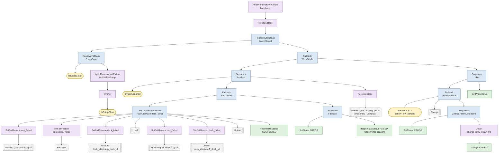

# Behavior Tree 작업 수행 (`task_executor_node`)

> 명세 4.8 "작업 수행 시스템 — Behavior Tree 설계", 9장 평가 질문("BT 모듈화, 새 노드 추가 ≤ 3개 파일",
> "에러 처리 및 복구 로직"). 패키지 `src/amr_behavior`, 설계 계약 `docs/architecture/components.md` §3.5·§5.5,
> 시퀀스 `docs/architecture/sequences.md` §1.

## 1. 요구사항 → 구현 대응

| 명세 요구 | 구현 | 확인 방법 |
| --- | --- | --- |
| BehaviorTree.CPP 로 작업 로직 | BehaviorTree.CPP **v3** (`behaviortree_cpp_v3` 3.8), `behavior_trees/*.xml` | `test_task_tree` |
| '대기-이동-인식-작업-복귀' | Idle → `MoveTo` → `Perceive` → `DockAt` → `Load`/`Unload` → `MoveTo(waiting_pose)` | 단계 순서 시험 (§9) |
| 노드 ≥ 15 (Action/Condition/Control/Decorator) | 트리에 쓰인 노드 타입 **34종**(Action 12 · Condition 7 · Control 6 · Decorator 9, SubTreePlus 제외), 그중 자체 구현 21종 | `TreeUsesAtLeastFifteenRegisteredNodeTypes`, `bt_tool nodes` |
| 재사용 서브트리, 작업 추가 용이 | 서브트리 10개 (`MoveTo` 는 픽업·하역·복귀·충전에서 재사용) | §3 |
| 복구 ≥ 3 | ① 주행 불가 ② 인식 실패 ③ 도킹 3회 실패 + E-stop 일시정지/재개, 교통 hold 양보, 위치 상실 대기, 배터리 충전 | §4, 시나리오 시험 |
| Groot 시각화·문서화 | `BT::PublisherZMQ`(:1666/:1667), `BT::FileLogger`(.fbl), `bt_tool flatten`(Groot 편집기용 단일 XML + 팔레트), 이 문서의 Mermaid | §3, §9 |
| 도킹 최대 3회 실패 → 에러 보고 + 대체 작업 | `DockAt` 의 `RetryUntilSuccessful(3)` → `FailTask`(ERROR, task_status FAILED) → 대기 구역 복귀 | `DockingFailsThreeTimesReportsErrorAndReturns` |
| 가상 적재/하역 (명세 7장) | `SimulateLoad`/`SimulateUnload`: 물품 표 load_time 대기 → `payload/attach`, `payload/mass` | `SimulateLoadWaitsLoadTimeThenPublishes` |
| 작업 상태 이벤트 (Pending/InProgress/Completed/Failed) | `task_status`(amr_msgs/Task) 전이마다 발행, `assign_task` 수락 시 IN_PROGRESS | `ExecutorNodeTest` |

## 2. 설계 결정

### 2.1 BT 와 FSM
FSM 은 상태 N 개에 전이가 O(N²) 로 늘어 복구 상태를 하나 넣을 때마다 모든 상태에 전이를 추가해야 한다.
BT 는 `Fallback` 한 층으로 복구가 붙고(`NavigateOrRecover`), 매 tick 재평가(`ReactiveSequence`/`ReactiveFallback`)로
E-stop·교통 hold·위치 상실 같은 반응형 조건을 트리 상단에 한 번만 쓴다. BT 의 약점인 "어디까지 했는지"(장기 기억)는
`ResumableSequence` 가 블랙보드 `task_step` 에 진행 단계를 저장해 해결한다(§4.4).

### 2.2 BehaviorTree.CPP v3 (v4 아님)
- 이미지에는 v3 3.8 과 v4 4.10 이 함께 있다. Humble `nav2_behavior_tree`/`bt_navigator` 는 v3 에 링크되고, 두 버전은 모두
  `namespace BT` 라 한 프로세스에 섞이면 심볼 충돌이 난다. `IsTTCBelowThreshold` 는 bt_navigator(v3) 에 로드되는 플러그인이므로
  패키지 전체를 v3 로 통일했다 (research brief 의 v4 권고는 §10 확장점으로 남긴다).
- **`nav2_behavior_tree::BtActionNode` 는 재사용하지 않았다 (components.md 와의 차이).** Humble 의 `BtActionNode` 는 생성자에서
  `wait_for_action_server` 가 실패하면 예외를 던져 트리 생성 자체가 실패하고(실행기가 Nav2 보다 먼저 뜨면 기동 실패),
  `halt()` 에서 `spin_until_future_complete` 로 최대 `server_timeout` 동안 블로킹한다. 대신 같은 역할의
  `RosActionNode<ActionT>` / `RosServiceNode<ServiceT>` (`include/amr_behavior/bt_nodes/ros_*_node.hpp`) 를 직접 구현했다:
  생성 시 서버를 기다리지 않고, tick 은 절대 블로킹하지 않으며(콜백은 노드 실행기가 처리), 늦게 도착한 goal 응답은
  세대 번호로 걸러 **즉시 취소**한다(고아 goal 방지, `SlowAcceptTimesOutAndLateGoalIsCanceled` 로 확인).
- 트리 tick 은 벽시계 타이머(`tick_rate_hz` 50 Hz)로, 서비스·구독·액션 콜백과 **같은 단일 스레드 실행기**에서 돈다 →
  블랙보드·컨텍스트 경합 없음. v3 `Timeout` 은 타이머 스레드에서 자식을 halt 하므로 `Timeout` 아래에는 **조건 노드만** 둔다.

### 2.3 서브트리 인자와 전역 설정 키
v3 의 `SubTreePlus` 블랙보드는 기본적으로 명시 매핑한 키만 부모와 공유한다. 재시도 횟수·타임아웃 같은 설정 키를 중첩
서브트리마다 XML 에 반복하지 않도록 모든 `SubTreePlus` 호출에 `__autoremap="true"` 를 둔다 → 서브트리 안의 나머지 `{키}` 는
부모(결국 루트)의 같은 이름 항목을 공유한다. 실행기는 트리를 만들기 **전에** 루트 블랙보드에 설정 키 27개(`globalKeys()`)를
타입을 맞춰 써 둔다(`writeConfig`, v3.8 은 항목 연결을 트리 생성 시점에 한다). 호출 인자(`goal`, `phase`, `dock_id` …)는
`{키}`/리터럴로 넘기며 명시 매핑이 우선한다. `__autoremap` 은 **마지막 속성**으로 둔다 — 앞에 두면 리터럴 인자
(`phase="MOVING"`)가 부모 항목으로 새어 다른 호출과 섞인다(`SubtreesAreDefinedAndFlattenedTreeLoads` 가 루트에 `phase` 가
없음을 확인). 처음에는 트리 생성 뒤 `addSubtreeRemapping` 으로 연결하려 했으나 v3.8 은 생성 시 이미 지역 항목을 만들어
`Missing parameter [num_attempts]` 로 실패해(시험으로 발견) 이 방식으로 바꿨다.

## 3. 트리 구조

파일: `behavior_trees/task_executor.xml`(메인) + `subtrees/{move_to, perceive, dock_at, payload, recovery, charge, yield}.xml`
(`<include>`). Groot 편집기는 include 를 따라가지 않으므로 `ros2 run amr_behavior bt_tool flatten > task_executor_groot.xml`
로 단일 파일 + `<TreeNodesModel>` 팔레트를 만든다.

### 3.1 메인 트리 `TaskExecutor`

### 3.2 서브트리

```mermaid
flowchart TD
  classDef ctl fill:#dbe9f6,stroke:#4a78a8
  classDef dec fill:#efe4f7,stroke:#8a5aa8
  classDef cond fill:#fff4cc,stroke:#b39200
  classDef act fill:#dff2df,stroke:#3f8f3f
  classDef sub fill:#f3f3f3,stroke:#666,stroke-dasharray: 4 3

  subgraph MoveTo["MoveTo (goal, phase) — 복구 ① 주행 불가"]
    MR["RetryUntilSuccessful<br/>nav_attempts=3"]:::dec --> MF["Fallback"]:::ctl
    MF --> GN["ReactiveSequence<br/>GuardedNavigation"]:::ctl
    GN --> SP["SetPhase {phase}"]:::act
    GN --> TG["ReactiveFallback<br/>TrafficGate"]:::ctl
    TG --> TI["Inverter"]:::dec --> TH(["IsTrafficHold"]):::cond
    TG --> YS[["Yield"]]:::sub
    GN --> LG["ReactiveFallback<br/>LocalizationGate"]:::ctl
    LG --> IL(["IsLocalized"]):::cond
    LG --> TO["Timeout relocalization_timeout_ms"]:::dec --> KR["KeepRunningUntilFailure"]:::dec --> LI["Inverter"]:::dec --> IL2(["IsLocalized"]):::cond
    GN --> NV["NavigateToPose {goal}"]:::act
    MF --> FF["ForceFailure"]:::dec --> RN[["RecoverNavigation"]]:::sub
  end

  subgraph Perceive["Perceive — 복구 ② 인식 실패"]
    PR["RetryUntilSuccessful<br/>perception_attempts=3"]:::dec --> PF["Fallback"]:::ctl
    PF --> PT["Timeout perception_timeout_ms"]:::dec --> KS["KeepRunningUntilSuccess"]:::dec --> OD(["IsObjectDetected box ≤ 2 m"]):::cond
    PF --> PFF["ForceFailure"]:::dec --> RP[["RecoverPerception"]]:::sub
  end

  subgraph DockAt["DockAt (dock_id, approach_pose) — 복구 ③ 도킹 실패, 최대 3회"]
    DR["RetryUntilSuccessful<br/>dock_attempts=3"]:::dec --> DF["Fallback"]:::ctl
    DF --> DS["Sequence"]:::ctl --> DP["SetPhase DOCKING"]:::act
    DS --> DK["Dock max_retries=1"]:::act
    DF --> DFF["ForceFailure"]:::dec --> RD[["RecoverDocking"]]:::sub
  end

  subgraph Recovery["복구 동작"]
    RN2["RecoverNavigation: SetPhase RECOVERING → Parallel(ClearCostmap 전역, ClearCostmap 지역) → Spin 1.57 → Wait 1 s"]:::act
    RP2["RecoverPerception: SetPhase RECOVERING → BackUp 0.3 m → Spin 0.52 rad"]:::act
    RD2["RecoverDocking: SetPhase RECOVERING → BackUp 0.3 m → Fallback(IsDockMarkerVisible, NavigateToPose staging)"]:::act
  end

  subgraph Others["기타"]
    LO["Load: SetPhase LOADING → SimulateLoad"]:::act
    UL["Unload: SetPhase UNLOADING → SimulateUnload"]:::act
    CG["Charge: MoveTo(charger) → DockAt(charger) → SetPhase CHARGING → SetCharging true → Timeout(KeepRunningUntilSuccess(IsBatteryOk ≥ 80)) → SetCharging false → BackUp"]:::act
    YD["Yield: NavigateToPose(yield_pose, 없으면 생략) → KeepRunningUntilFailure(IsTrafficHold)"]:::act
  end
```

### 3.3 `executor/phase` 전이

정상 작업: `IDLE → MOVING → DOCKING → LOADING → MOVING → DOCKING → UNLOADING → RETURNING → IDLE`.
복구 중에는 `RECOVERING`, 실패 보고 시 `ERROR`, 충전 중 `CHARGING`. 인식(Perceive)은 MOVING 단계 안에서 일어난다.
대문자로 발행하고 `fleet_adapter_node` 는 대소문자를 무시해 `RobotState.status` 로 매핑한다
(`amr_fleet/robot_status.py`, `RECOVERING` 은 현재 매핑표에 없어 IDLE 로 보인다 → §8 조율 항목).

## 4. 복구 로직 (명세: 3가지 이상)

| # | 상황 (감지) | 동작 | 소진 시 |
| --- | --- | --- | --- |
| ① | 주행 불가: `navigate_to_pose` ABORTED/거절/서버 없음 (Nav2 내부 RoundRobin 복구 이후) | `RecoverNavigation`: 전역·지역 costmap 비우기(`Parallel`) → 제자리 90° 회전 → 1 s 대기 → 재시도 | `nav_attempts`(3) 소진 → `nav_failed` |
| ② | 인식 실패: `perception_timeout_ms`(5 s) 안에 `box` 가 2 m 안에 없음 | `RecoverPerception`: 0.3 m 후진 → 30° 회전(시야 변경) → 재확인 | `perception_attempts`(3) 소진 → `perception_failed` |
| ③ | 도킹 실패: `dock` 결과 success=false (서버의 2 cm/1° 판정 실패·마커 상실) | `RecoverDocking`: 0.3 m 후진 → 마커가 안 보이면 staging 재접근 → 재도킹 | `dock_attempts`(3) 소진 → `dock_failed` |
| 공통 | ①②③ 소진 | `FailTask`: `executor/phase=ERROR`, `task_status=FAILED` → **대체 작업: 대기 구역(`waiting_pose`) 복귀** → IDLE (플릿이 재할당) | |
| ④ | E-stop (`safety/estop_active`, latched) | `EstopGate` RUNNING → 작업 서브트리 halt(액션 goal 취소). 해제되면 `task_step` 으로 **중단된 단계부터** 재개 | — |
| ⑤ | 교통 hold (`traffic/hold`, `traffic/yield_pose`) | `TrafficGate` → 주행 goal 취소, `Yield`: 양보 자세로 이동 후 해제까지 대기 → 원래 goal 재전송 | — |
| ⑥ | 위치 상실 (`localization/lost`, latched) | `LocalizationGate` → 주행 goal 취소 후 재위치추정 대기 | `relocalization_timeout_ms`(30 s) → 그 시도 실패 → ① |
| ⑦ | 배터리 < 20 % (작업 없을 때) | `Charge` 서브트리, 충전 중 `assign_task` 거절 | 실패 시 ERROR + 10 s 후 재시도 |

도킹 재시도 카운터는 **BT 의 `RetryUntilSuccessful` 하나뿐**이다 (`dock_max_retries` = goal 당 서버 접근 1회). 서버 내부
재시도(`max_retries`)도 구현돼 있어 CLI 로 직접 부를 때 쓰지만, BT 에서는 복구 동작(후진·재접근)을 Groot 에서 보이도록
BT 가 센다(research brief §2.3 "단일 재시도 카운터").

### 4.4 중단·재개 (E-stop)
`ResumableSequence`(자체 제어 노드)는 자식 인덱스를 블랙보드 `task_step` 에 저장하고, halt 되어도 지우지 않는다. v3 의
`SequenceStar` 는 halt 에서 인덱스를 0 으로 되돌리므로, E-stop 뒤 픽업 주행·도킹·적재를 반복하게 된다. 새 작업 수락 시
실행기가 `task_step=0`, `fail_reason="unknown"` 으로 초기화한다. 적재 도중 halt 되면 이벤트를 내지 않고 재개 시 적재 시간을 다시 잰다.

## 5. 노드 목록

자체 노드 21종 (파일 1개 = 클래스 1개, `include/amr_behavior/bt_nodes/`), 내장 노드 13종을 트리에서 사용.

| 분류 | ID | 파일 | 포트 / ROS 인터페이스 |
| --- | --- | --- | --- |
| Condition | `IsTaskAssigned` | is_task_assigned.hpp | out: task_id, item_type, item_mass, pickup/dropoff_goal, pickup/dropoff_dock_id. 작업 자세 → 도크 staging 대응 (`dock_match_radius`) |
| Condition | `IsBatteryOk` | is_battery_ok.hpp | in: min_percent. `battery_state` (percentage×100, 미수신 = 정상) |
| Condition | `IsEstopClear` | is_estop_clear.hpp | `safety/estop_active` (latched) |
| Condition | `IsTrafficHold` | is_traffic_hold.hpp | out: yield_pose. `traffic/hold`, `traffic/yield_pose` |
| Condition | `IsLocalized` | is_localized.hpp | `localization/lost` (latched) |
| Condition | `IsObjectDetected` | is_object_detected.hpp | in: class_name, max_distance, min_confidence, max_age. `perception/detected_objects` |
| Condition | `IsDockMarkerVisible` | is_dock_marker_visible.hpp | in: max_age. `perception/dock_marker_pose` |
| Action | `NavigateToPose` | navigate_to_pose.hpp | in: goal, behavior_tree, skip_if_empty / out: distance_remaining. ActC `navigate_to_pose` |
| Action | `Dock` | dock.hpp | in: dock_id, approach_pose, max_retries / out: attempts_used, final_*_error, dock_phase. ActC `dock` |
| Action | `Spin` | spin.hpp | in: spin_dist, time_allowance. ActC `spin` |
| Action | `BackUp` | back_up.hpp | in: backup_dist, backup_speed, time_allowance. ActC `backup` |
| Action | `Wait` | wait.hpp | in: wait_duration. ActC `wait` |
| Action | `ClearCostmap` | clear_costmap.hpp | in: service_name. SrvC `{global,local}_costmap/clear_entirely_*` |
| Action | `SimulateLoad` / `SimulateUnload` | simulate_payload.hpp | in: item_type, item_mass, load_time. Pub `payload/attach`, `payload/mass` |
| Action | `ReportTaskStatus` | report_task_status.hpp | in: status, reason. Pub `task_status` |
| Action | `SetPhase` | set_phase.hpp | in: phase. Pub `executor/phase` (latched, 바뀔 때만) |
| Action | `SetCharging` | set_charging.hpp | in: enable. Pub `charging/enable` |
| Control | `ResumableSequence` | resumable_sequence.hpp | in: progress_key |
| Decorator | `KeepRunningUntilSuccess` | keep_running_until_success.hpp | — (v3 에 없는 KeepRunningUntilFailure 의 대칭) |
| Decorator | `SetFailReason` | set_fail_reason.hpp | in: reason / out: fail_reason |

내장: `Sequence`, `Fallback`, `ReactiveSequence`, `ReactiveFallback`, `Parallel`, `RetryUntilSuccessful`, `Timeout`, `Inverter`,
`KeepRunningUntilFailure`, `ForceSuccess`, `ForceFailure`, `Delay`, `AlwaysSuccess` (+ `SubTreePlus`).
전체 목록은 `ros2 run amr_behavior bt_tool nodes` 로 분류와 함께 출력된다.

## 6. 새 BT 노드 추가 (명세 9장: 기존 코드 수정 ≤ 3개 파일)

1. `include/amr_behavior/bt_nodes/<node>.hpp` — 노드 클래스 (새 파일). ROS 액션이면 `RosActionNode<ActionT>` 를 상속해
   `setGoal()` 만 구현, 컨텍스트 상태를 쓰면 생성자 인자로 `ContextPtr` 을 받는다.
2. 등록 한 줄 — ROS 액션/서비스 노드는 `bt_registry.hpp` 의 `forEachRosNode()`, 그 외는 `src/bt_registry.cpp` 의
   `registerCoreNodes()`.
3. `behavior_trees/*.xml` — 트리에서 사용.

실행기(`task_executor_node.cpp`)·테스트·Groot 팔레트(`bt_tool models`)는 등록 표를 그대로 쓰므로 수정하지 않는다.
예: "도착 후 사진 촬영" 노드 `CapturePhoto`(서비스 호출)는 `capture_photo.hpp`(RosServiceNode 상속) + `forEachRosNode` 한 줄 +
`Load` 서브트리에 `<CapturePhoto/>` 한 줄 = 기존 파일 2개 수정 + 새 파일 1개. 스텁 등록(`test/bt_test_utils.hpp`)도
`forEachRosNode` 를 순회하므로 새 노드가 자동으로 시험 트리에 들어간다.

## 7. 파라미터 (`config/behavior.yaml`, `task_executor_node`)

| 파라미터 | 기본 | 의미 · 근거 |
| --- | --- | --- |
| `tick_rate_hz` | 50 | BT tick. 응답 예산(sequences.md): 주기 20 ms → 평균 대기 10 ms |
| `nav_attempts` / `perception_attempts` / `dock_attempts` | 3 / 3 / 3 | 첫 시도 포함. 도킹 3 = 명세 |
| `dock_max_retries` | 1 | goal 당 서버 접근 횟수 (단일 재시도 카운터) |
| `perception_timeout_ms` | 5000 | sequences.md "timeout 5 s" |
| `relocalization_timeout_ms` | 30000 | 위치 상실 대기 상한 |
| `perception_class` / `perception_max_distance` | box / 2.0 m | sequences.md "class=box, distance ≤ 2 m" |
| `battery_low_percent` / `battery_resume_percent` | 20 / 80 % | 충전 진입/종료 (히스테리시스) |
| `recovery_spin_angle` / `recovery_wait_s` | 1.57 rad / 1 s | Nav2 기본 spin_dist 와 같음 |
| `recovery_backup_dist` / `perception_spin_angle` | 0.3 m / 0.52 rad | sequences.md "backup 0.3 m, spin ±30°" |
| `dock_backup_dist` / `marker_max_age` | 0.3 m / 1 s | 도킹 재시도 전 후진, 재접근 생략 판정 |
| `waiting_pose` | [22, −16, 0] | 대기 구역 (warehouse.sdf waiting_zone_pad) |
| `charger_dock_id` | charger_c1 | "" 이면 자동 충전 끔 |
| `dock_match_radius` / `dock_match_yaw_tolerance` | 1.6 m / π | 작업 자세 → 도크 대응 (도크 간격 4 m) |
| `accept_battery_min_percent` / `accept_while_returning` | 20 % / false | assign_task 수락 정책 |
| `groot.enabled` / `groot.publisher_port` / `groot.server_port` | true / 1666 / 1667 | 5대 한 호스트면 로봇마다 다르게 (`behavior.launch.py groot_*_port`) |
| `publish_payload_mass` | true | payload_manager_node 배치 전까지 실행기가 `payload/mass` 발행 |
| `server_wait_timeout_ms` / `goal_response_timeout_ms` | 5000 / 2000 | 서버 발견·goal 수락 대기 상한 → 넘으면 그 노드 FAILURE (복구 경로로) |
| `charge_timeout_ms` / `charge_retry_delay_ms` / `undock_dist` | 1 h / 10 s / 0.5 m | 충전 상한, 충전 실패 후 재시도 간격, 충전 후 이탈 후진 |
| `bt_xml` / `bt_log_file` / `groot.max_msg_per_second` | "" / "" / 25 | 트리 파일 교체, `.fbl` 로그(Groot 재생), ZMQ 상태 메시지 상한 |
| `robot_id` / `map_frame` / `payload_types` | "" / map / [small, medium, large] | "" 면 네임스페이스에서 유도, 전역 프레임(접두어 없음), 물품 표 종류 (`payload.<type>.mass/load_time` 은 robot_params.yaml) |

모든 키의 단위·기본값·근거는 `config/behavior.yaml` 주석에도 있다 (재빌드 없이 튜닝).

## 8. 인터페이스와 계약 차이

| 방향 | 이름 | 타입 / QoS | 비고 |
| --- | --- | --- | --- |
| SrvS | `assign_task` | amr_msgs/AssignTask | 거절 사유: `busy:<task_id>` / `busy:<phase>` / `estop` / `lost` / `battery_low` / `invalid:*`. 응답 robot_id = 네임스페이스 |
| Pub | `task_status` | amr_msgs/Task, reliable 10 | 요청 Task 를 그대로(header.stamp 포함) + status. FAILED 사유는 로그 (Task.msg 에 필드 없음) |
| Pub | `executor/phase` | String, **latched** | 대문자 (계약 표기는 소문자, 플릿은 대소문자 무시) |
| Pub | `payload/attach` | String, latched | "small"/"medium"/"large" = 적재 요청, "" = 하역 (payload_manager_node 계약) |
| Pub | `payload/mass` | Float32, latched | [kg]. 계약은 payload_manager_node 발행 → `publish_payload_mass` 로 전환 |
| Pub | `charging/enable` | Bool, latched | |
| Sub | `safety/estop_active`, `localization/lost` | Bool, **transient_local** | 발행자가 latched 여야 수신 (계약대로) |
| Sub | `traffic/hold`, `traffic/yield_pose` | Bool / PoseStamped, volatile | 발행 QoS 미정 → 양쪽과 호환되는 volatile |
| Sub | `perception/detected_objects`, `perception/dock_marker_pose` | sensor QoS | |
| ActC/SrvC | `navigate_to_pose`, `dock`, `spin`, `backup`, `wait`, `{global,local}_costmap/clear_entirely_*` | | 서버 없으면 `server_wait_timeout_ms` 뒤 FAILURE → 복구 경로 |
| Groot | ZMQ :1666 (PUB), :1667 (REP) | | 포트 사용 중이면 경고 후 시각화 없이 계속 |

조율 필요: (a) `amr_fleet/robot_status.py` 에 `recovering`(→ MOVING 권장) 추가, (b) `Task.msg` 에 dock id·실패 사유 필드
(brief §2.4 제안), (c) payload_manager_node 배치 시 `payload/mass` 발행 주체 일원화.

## 9. 검증

(모든 수치는 `amr-fleet-system:wf-final` 일회용 컨테이너에서 측정했다. 32 스레드 호스트의 외부 Ansys(gsim) 작업은
끝난 뒤였지만 다른 컨테이너(다른 패키지 시험·Gazebo)가 함께 돌아 1분 load average 가 **14.8–28.5** 였다. 시간·CPU 수치는
그 부하 조건의 값이며, 부하가 없는 호스트에서는 같거나 더 좋아야 한다.)

### 9.1 단위·통합 시험 (`./scripts/test.sh --packages-select amr_behavior`)

| 시험 | 대상 | 확인 내용 |
| --- | --- | --- |
| `test_task_tree` (14) | 실제 `behavior_trees/*.xml` + 스텁 액션 노드 | 노드 타입 ≥ 15·분류별 ≥ 4·components.md 목록 전부 사용, 서브트리 정의·flatten 로드, 정상 단계 순서, 복구 ①②③ 각 성공/소진 경로, E-stop 재개(단계 반복 없음), 교통 hold 양보, 위치 상실 대기, 충전·충전 실패 쿨다운 |
| `test_bt_nodes` (7) | 조건·단계·보고·가상 적재, 자체 제어/데코레이터 | 구독 상태 → 조건 결과, `IsTaskAssigned` 전개·도크 대응, `ResumableSequence` halt 후 재개, load_time 대기 후 `payload/attach`·`payload/mass`, 자세 리터럴 변환 |
| `test_ros_bt_nodes` (8) | `RosActionNode`/`RosServiceNode` + 프로세스 안 모의 서버 | 성공·ABORTED·거절, halt → goal 취소, 서버 없음 → FAILURE, 늦은 수락 goal 즉시 취소, 클라이언트 공유 |
| `test_executor_context` (9) | ROS 비의존 실행기 상태 | 수락 정책(busy/estop/lost/battery_low/invalid), 상태 전이 보고, 인식 필터, 도크 대응 |
| `test_task_executor_node` (2) | 노드 전체 (실제 XML, 모의 Nav2/도킹) | assign_task → COMPLETED, 실행 중 재할당 거절, Groot 퍼블리셔 기동, E-stop·배터리 수락 거절 |
| `test_ttc_trigger` (4) | `TtcTrigger` + 플러그인 라이브러리 | 동적/신뢰도 필터, 임계·만료·cooldown, `registerFromPlugin` 으로 Nav2 방식 로드 후 SUCCESS/FAILURE |
| `test_config_launch.py` (6) | behavior.yaml · 런치 | 도크 표·포트·파라미터 키, 네임스페이스·프레임 접두어 주입 |

결과: ctest 16개(gtest 8 실행 파일·70 케이스 + pytest 1 + 린터 7) 전부 통과, 0 failures (Release 빌드와 커버리지 빌드에서
각각 1회, colcon test-result 268건 중 실패 0·건너뜀 54 = cppcheck 2.7 이 느린 버전이라 자동 생략한 파일별 항목. cppcheck 는
`AMENT_CPPCHECK_ALLOW_SLOW_VERSIONS=1` 로 따로 돌려 문제 없음). 라인 커버리지(lcov, 시험 코드·외부 헤더 제외) **94.0 %**
(1954 줄 중 1837), 함수 88.9 %. 주요 파일: `executor_context.cpp` 100 %, `task_tree.cpp` 100 %, `docking_controller.cpp` 99.6 %,
`docking_server_node.cpp` 94.1 %, `bt_registry.cpp` 87.6 %, `task_executor_node.cpp` 87.2 %, `ros_action_node.hpp` 96.3 %,
노드 헤더 대부분 100 % (`*_main.cpp`·`bt_tool.cpp` 는 진입점이라 0 %). Python(`behavior.launch.py`) 93 %(분기 포함).

### 9.2 기능 시험 (실제 `task_executor_node` + Python 모의 서버)

`behavior.launch.py namespace:=amr_01 start_docking:=false` 로 실행기만 띄우고, 모의 `navigate_to_pose`(0.5 s 뒤 성공/대본대로
실패)·`dock`(0.8 s)·`spin`/`backup`/`wait`·costmap 비우기 서버와 `perception/detected_objects`(box, 1.1 m, 10 Hz)·
`safety/estop_active`·`localization/lost` 발행자를 붙였다. 물품 적재 시간만 1 s 로 줄였다(`medium`, 질량은 명세값 10 kg).
시나리오 스크립트가 `assign_task` 를 부르고 `executor/phase`(깊이 50 큐)·`task_status` 를 기록한다.

| 시나리오 | 결과 (task_status) | `executor/phase` 순서 (IDLE 이후) | 서버 호출 | 소요 |
| --- | --- | --- | --- | --- |
| A 정상 | COMPLETED | MOVING → DOCKING → LOADING → MOVING → DOCKING → UNLOADING → RETURNING → IDLE | nav 3, dock 2 | 5.33 s |
| B 주행 실패 ×2 | COMPLETED | MOVING → **RECOVERING** → MOVING → **RECOVERING** → MOVING → DOCKING → … → IDLE | nav 5, 전역·지역 비우기 2·2, spin 2, wait 2 | 7.85 s |
| C 인식 실패 (물체 없음) | **FAILED** (`perception_failed`) | MOVING → RECOVERING → **ERROR** → RETURNING → IDLE | backup 3, spin 3, dock 0 | 18.1 s (5 s × 3 + 복구) |
| D 도킹 실패 ×2 후 성공 | COMPLETED | … DOCKING → RECOVERING → DOCKING → RECOVERING → DOCKING → LOADING → … → IDLE | dock 4 (3 + 하역 1), backup 2 | 8.75 s |
| E 도킹 실패 ×3 | **FAILED** (`dock_failed`) | … DOCKING → RECOVERING (×3) → **ERROR** → RETURNING → IDLE | dock 3, backup 3 | 6.06 s |
| F 적재 중 E-stop 2 s | COMPLETED | 정상과 같음 (E-stop 동안 LOADING 유지) | 정상과 같음 (nav 3, dock 2) | 7.29 s |

- F: E-stop 2 s 동안 새 서버 호출 0, 해제 뒤 **끝낸 단계(주행·도킹)를 반복하지 않고** 적재부터 재개(LOADING 3.02 s = 1 s + 2 s,
  중단된 적재는 처음부터 다시 잰다).
- 실행 중 두 번째 `assign_task` → `success=false`, `message="busy:busy-1"` (호출 5.6 ms). `assign_task` 호출 왕복 5.3–8.8 ms.
- **응답 시간 (명세 4.10: 평균 ≤ 200 ms, 50회 이상)**: 작업 50건 연속, `assign_task` 호출 → 모의 Nav2 가 첫 goal 을 받기까지
  평균 **12.3 ms**, p95 20.6 ms, 최대 27.0 ms. `amr_evaluation response_time_logger`(task_status stamp → 첫 `cmd_vel`
  > 0.05 m/s, 57 샘플) + `analyze`: 평균 **14.0 ms**, p95 24.5 ms, 최대 29.2 ms → **PASS**. 앞선 1회차(load average 19–24)는
  평균 20.4 ms, 최대 117 ms. 실제 시스템에서는 Nav2 계획·제어 주기(20 Hz)가 더해진다 (tick 20 ms 는 예산의 10 %).
- **CPU**: 시험 전 구간(193 s, 50 Hz tick, Groot 켬) `task_executor_node` 평균 **2.2 %**(1 코어 기준), p95 4 %, 최대 5 %.
- **Groot**: TCP 1666/1667 열림. pyzmq 가 없어 ZMTP 3.0 핸드셰이크를 직접 구현한 클라이언트로 확인 — REQ→REP 트리 구조
  flatbuffer **40 176 B**, SUB 상태 메시지 1 784 B 수신 (서버 ZMTP 3.1). `bt_tool flatten` 출력(서브트리 11개, 17.5 kB)은
  Groot 편집기에서 연다.
- `ERROR` 는 `ReportTaskStatus FAILED` 와 같은 tick 에 `RETURNING` 으로 바뀐다(2 ms). 깊이 1 구독자는 놓칠 수 있으므로
  실패는 `task_status=FAILED`(reliable, 깊이 10)로 판정한다. `fleet_adapter_node` 는 깊이 10 으로 구독한다.

## 10. 확장점 (research brief `task-execution-docking` 제안)

- **BT.CPP v4 전환**: `_skipIf` 전제조건·`Script` 로 `ResumableSequence`/`SetFailReason` 을 대체할 수 있다. Nav2 가 v4 로 가는
  배포판(Jazzy)에서 `bt_registry` 등록 표와 XML 만 바꾸면 된다 (노드 클래스는 포트 API 가 같다).
- **배터리 선점(R4)**: 지금은 작업이 없을 때만 충전한다. `WorkOrIdle` 를 `ReactiveFallback` 으로 바꾸고 `IsBatteryOk` 를
  작업 앞에 두면 작업 중 선점 + `task_step` 재개가 된다 (`ResumableSequence` 가 이미 재개를 보장).
- **마감 위험 감속(IsDeadlineAtRisk)·재할당 요청(RequestReassignment)**: 플릿 스케줄러(LST)와 함께 노드 추가 (§6 절차).
- **단계 재개 범위**: `Timeout` 은 재개 시 다시 시작하므로 예산은 "중단 없는 구간" 기준이다.

## 11. Nav2 BT 조건 플러그인 `amr_behavior::IsTTCBelowThreshold`

components.md §3.3 의 "TTC 조건 재계획". 작업 트리가 아니라 **Nav2 `bt_navigator`(BT.CPP v3) 프로세스**에 로드된다.

- 로직 (`ttc/ttc_trigger.{hpp,cpp}`, ROS 비의존): `perception/tracked_obstacles` 의 트랙 중 필터(`only_dynamic`,
  `min_confidence`)를 통과하고 TTC 가 유효(음수·NaN 제외)한 것의 최솟값 $T_{min}$ 이 `threshold` 미만이면 SUCCESS.
  마지막 메시지가 `max_age`(0.5 s = 추적기 10 Hz 의 5 주기)보다 오래되면 FAILURE(추적기 정지 시 재계획 폭주 방지),
  `cooldown` 동안은 다시 트리거하지 않는다(재계획 주기 제한). 출력 포트 `min_ttc`.
- ROS 래퍼 (`plugins/is_ttc_below_threshold_condition.cpp`): nav2 `IsBatteryLowCondition` 과 같은 구조 — 블랙보드 `node` 로
  전용 콜백 그룹 구독을 만들고 tick 마다 `spin_some`. 등록은 `BT_REGISTER_NODES`.
- 로드: Humble 의 Nav2 BT 노드는 pluginlib 이 아니라 `bt_navigator.plugin_lib_names` 에 적은 **공유 라이브러리 이름**을
  `BT::SharedLibrary` 로 연다. 라이브러리 `amr_is_ttc_below_threshold_condition_bt_node` 는 `lib/` 에 설치되므로
  (`LD_LIBRARY_PATH`) 별도 plugin description XML 이 필요 없다.
- 사용 (amr_navigation `navigate_to_pose.xml`): `ReactiveFallback(Sequence(IsTTCBelowThreshold threshold=2.0 cooldown=1.0,
  ComputePathToPose), RateController 1 Hz(ComputePathToPose))` — TTC 위험이면 1 Hz 주기를 기다리지 않고 즉시 재계획.
- 시험: `TtcTrigger.MinTtcAppliesFilters`, `TtcTrigger.ThresholdStaleAndCooldown`(임계 경계·만료·cooldown),
  `TtcPluginTest.LoadsAsNav2PluginLibrary`(빌드된 .so 를 bt_navigator 와 같이 `registerFromPlugin` 으로 로드 → 등록·SUCCESS),
  `TtcPluginTest.SuccessWhenTtcBelowThreshold`(실제 토픽 발행: 수신 전 FAILURE → TTC 1.2 s SUCCESS·`min_ttc` 출력 →
  정적 트랙·TTC ∞ FAILURE).
