# Behavior Tree 작업 수행 (`task_executor_node`)

> 명세 4.8 "작업 수행 시스템 — Behavior Tree 설계", 9장 평가 질문("BT 모듈화, 새 노드 추가 ≤ 3개 파일",
> "에러 처리 및 복구 로직"). 패키지 `src/amr_behavior`, 설계 계약 `docs/architecture/components.md` §3.5·§5.5,
> 시퀀스 `docs/architecture/sequences.md` §1. 도킹 제어기는 [docking.md](docking.md).

## 1. 요구사항 → 구현 대응

| 명세 요구 | 구현 | 확인 방법 | 판정 (이 브랜치에서 측정) |
| --- | --- | --- | --- |
| BehaviorTree.CPP 로 작업 로직 | BehaviorTree.CPP **v3** (`behaviortree_cpp_v3` 3.8), `behavior_trees/*.xml` | `test_task_tree` | 충족 |
| '대기-이동-인식-작업-복귀' | Idle → `MoveTo` → `Perceive`(물품 쪽 돌아보기) → `DockAt` → `Load` → `Undock` → `MoveTo` → `DockAt` → `Unload` → `Undock` → `MoveTo(waiting_pose)` | 단계 순서 시험 (§9.1), Gazebo 종단 1회 (§9.3) | §9.3 결과 참고 |
| 노드 ≥ 15 (Action/Condition/Control/Decorator) | 트리에 쓰인 노드 타입 **43종** (Action 15 · Condition 10 · Control 6 · Decorator 12, SubTreePlus 제외), 그중 자체 구현 29종 | `TreeUsesAtLeastFifteenRegisteredNodeTypes`, `bt_tool nodes` | 충족 |
| 재사용 서브트리, 작업 추가 용이 | 서브트리 13개 (`MoveTo` 는 픽업·하역·복귀·충전·물품 되돌려 놓기에서, `TrafficGate` 는 움직이는 모든 단계에서 재사용) | §3 | 충족 (새 작업 종류는 Task.msg 에 종류 필드가 없어 §8 조율 항목) |
| 복구 ≥ 3 | ① 주행 불가 ② 인식 실패 ③ 도킹 3회 실패 + E-stop 일시정지/재개, 교통 hold 양보, 위치 상실 대기, 배터리 충전, 하역 실패 물품 되돌려 놓기 | §4, 시나리오 시험 | 충족 |
| Groot 시각화·문서화 | `BT::PublisherZMQ`(로봇 i 에 :1666+2i/:1667+2i), `BT::FileLogger`(.fbl), `bt_tool flatten`(Groot 편집기용 단일 XML + 팔레트), 이 문서의 Mermaid | §9.2 (bringup 경로로 3대 동시 bind 확인) | 충족 |
| 도킹 최대 3회 실패 → 에러 보고 + 대체 작업 | `DockAt` 의 `RetryUntilSuccessful(3)` → `FailTask`(ERROR 유지 + task_status FAILED) → 대체 작업(물품이 실려 있으면 적재 도크로 되돌려 놓기, 그다음 대기 구역 복귀) | `DockingFailsThreeTimesReportsErrorAndReturns`, `DropoffDockingFailureReturnsThePayloadToThePickupDock` | 충족 (BT 수준) |
| 가상 적재/하역 (명세 7장) | `SimulateLoad`/`SimulateUnload`: 물품 표 load_time 대기 → `payload/attach`, `payload/mass` (계약 C5) | `SimulateLoadWaitsLoadTimeThenPublishes` | 이벤트는 충족. Gazebo 물리 질량 변화는 amr_simulation `payload_manager_node`(C5, 이 패키지 밖) 몫 — 이 브랜치에는 없다 |
| 작업 상태 이벤트 (Pending/InProgress/Completed/Failed) | `task_status`(amr_msgs/Task) 전이마다 발행, `assign_task` 수락 시 IN_PROGRESS | `ExecutorNodeTest` | 충족 |
| 응답 시간 ≤ 200 ms (4.10, 50회 이상) | tick 20 ms, assign_task 콜백에서 트리 진행 단계 초기화 | §9.3 에 종단 1회 표본 | **미검증** (시스템 수준 50회 측정 없음, §9.4) |

## 2. 설계 결정

### 2.1 BT 와 FSM
FSM 은 상태 N 개에 전이가 O(N²) 로 늘어 복구 상태를 하나 넣을 때마다 모든 상태에 전이를 추가해야 한다.
BT 는 `Fallback` 한 층으로 복구가 붙고(`NavigateOrRecover`), 매 tick 재평가(`ReactiveSequence`/`ReactiveFallback`)로
E-stop·교통 hold·위치 상실 같은 반응형 조건을 게이트 한 곳에 쓴다. BT 의 약점인 "어디까지 했는지"(장기 기억)는
`ResumableSequence` 가 블랙보드 `task_step`·`charge_step` 에 진행 단계를 저장하고, 작업이 끝난 뒤의 할 일(대기 구역
복귀, 실린 물품 되돌려 놓기)은 실행기 컨텍스트가 상태로 들고 있어 해결한다(§4.4).

### 2.2 BehaviorTree.CPP v3 (v4 아님)
- 이미지에는 v3 3.8 과 v4 4.10 이 함께 있다. Humble `nav2_behavior_tree`/`bt_navigator` 는 v3 에 링크되고, 두 버전은 모두
  `namespace BT` 라 한 프로세스에 섞이면 심볼 충돌이 난다. `IsTTCBelowThreshold` 는 bt_navigator(v3) 에 로드되는 플러그인이므로
  패키지 전체를 v3 로 통일했다 (research brief 의 v4 권고는 §10 확장점으로 남긴다).
- **`nav2_behavior_tree::BtActionNode` 는 재사용하지 않았다 (components.md 와의 차이).** Humble 의 `BtActionNode` 는 생성자에서
  `wait_for_action_server` 가 실패하면 예외를 던져 트리 생성 자체가 실패하고(실행기가 Nav2 보다 먼저 뜨면 기동 실패),
  `halt()` 에서 `spin_until_future_complete` 로 최대 `server_timeout` 동안 블로킹한다. 대신 같은 역할의
  `RosActionNode<ActionT>` / `RosServiceNode<ServiceT>` (`include/amr_behavior/bt_nodes/ros_*_node.hpp`) 를 직접 구현했다:
  생성 시 서버를 기다리지 않고, tick 은 절대 블로킹하지 않으며(콜백은 노드 실행기가 처리), 늦게 도착한 goal 응답은
  세대 번호로 걸러 **즉시 취소**한다(고아 goal 방지, `SlowAcceptTimesOutAndLateGoalIsCanceled` 로 확인).
- 트리 tick 은 벽시계 타이머(`tick_rate_hz` 50 Hz)로, 서비스·구독·액션 콜백과 **같은 단일 스레드 실행기**에서 돈다 →
  블랙보드·컨텍스트 경합 없음. v3 `Timeout` 은 타이머 스레드에서 자식을 halt 하므로 `Timeout` 아래에는 **조건 노드만** 둔다.
- v3 의 `PublisherZMQ` 는 프로세스당 1 개만 만들 수 있다(정적 `ref_count`). 로봇마다 실행기 프로세스가 따로 뜨므로 문제없고,
  같은 프로세스에 두 번째가 생기거나 포트가 사용 중이면 경고 후 Groot 없이 계속한다(`GrootFailureDoesNotStopTheExecutor`).

### 2.3 서브트리 인자와 전역 설정 키
v3 의 `SubTreePlus` 블랙보드는 기본적으로 명시 매핑한 키만 부모와 공유한다. 재시도 횟수·타임아웃 같은 설정 키를 중첩
서브트리마다 XML 에 반복하지 않도록 모든 `SubTreePlus` 호출에 `__autoremap="true"` 를 둔다 → 서브트리 안의 나머지 `{키}` 는
부모(결국 루트)의 같은 이름 항목을 공유한다. 실행기는 트리를 만들기 **전에** 루트 블랙보드에 전역 키 30개(`globalKeys()`:
설정 키 + `task_step`·`charge_step`·`fail_reason`·`charger_goal`·`charger_dock_id`·`pickup_perceive_turn`·`last_dock_*`)를
타입을 맞춰 써 둔다(`writeConfig`, v3.8 은 항목 연결을 트리 생성 시점에 한다). 호출 인자(`goal`, `phase`, `dock_id` …)는
`{키}`/리터럴로 넘기며 명시 매핑이 우선한다. `__autoremap` 은 **마지막 속성**으로 둔다 — 앞에 두면 리터럴 인자
(`phase="MOVING"`)가 부모 항목으로 새어 다른 호출과 섞인다(`SubtreesAreDefinedAndFlattenedTreeLoads` 가 루트에 `phase` 가
없음을 확인). autoremap 은 서브트리 안 노드 속성에 `{키}` 로 나타난 키만 잇는다 — `Charge` 의 `ResumableSequence
progress_key="charge_step"` 이 루트 키를 쓰는 것은 같은 서브트리의 `SelectCharger progress="{charge_step}"` 덕분이다.

## 3. 트리 구조

파일: `behavior_trees/task_executor.xml`(메인) + `subtrees/{move_to, perceive, dock_at, payload, recovery, charge, yield}.xml`
(`<include>`). Groot 편집기는 include 를 따라가지 않으므로 `ros2 run amr_behavior bt_tool flatten > task_executor_groot.xml`
로 단일 파일 + `<TreeNodesModel>` 팔레트를 만든다 (이 브랜치: BehaviorTree 14개, 23.7 kB).

### 3.1 메인 트리 `TaskExecutor`

```mermaid
flowchart TD
  classDef ctl fill:#dbe9f6,stroke:#4a78a8
  classDef dec fill:#efe4f7,stroke:#8a5aa8
  classDef cond fill:#fff4cc,stroke:#b39200
  classDef act fill:#dff2df,stroke:#3f8f3f
  classDef sub fill:#f3f3f3,stroke:#666,stroke-dasharray: 4 3

  ML["KeepRunningUntilFailure<br/>MainLoop"]:::dec --> FS["ForceSuccess"]:::dec --> SG["ReactiveSequence<br/>SafetyGuard"]:::ctl
  SG --> EG["ReactiveFallback<br/>EstopGate"]:::ctl
  EG --> EC1(["IsEstopClear"]):::cond
  EG --> HW["KeepRunningUntilFailure<br/>HoldWhileEstop"]:::dec --> INV["Inverter"]:::dec --> EC2(["IsEstopClear"]):::cond
  SG --> WOI["Fallback<br/>WorkOrIdle"]:::ctl
  WOI --> RT["Sequence<br/>RunTask"]:::ctl
  RT --> ITA(["IsTaskAssigned"]):::cond
  RT --> TOF["Fallback<br/>TaskOrFail"]:::ctl
  TOF --> PAP["ResumableSequence<br/>PickAndPlace (task_step)"]:::ctl
  PAP --> M1[["MoveTo pickup_goal"]]:::sub
  PAP --> P1[["Perceive perceive_turn"]]:::sub
  PAP --> D1[["DockAt pickup_dock_id"]]:::sub
  PAP --> L1[["Load"]]:::sub
  PAP --> U0[["Undock"]]:::sub
  PAP --> M2[["MoveTo dropoff_goal"]]:::sub
  PAP --> D2[["DockAt dropoff_dock_id"]]:::sub
  PAP --> U1[["Unload"]]:::sub
  PAP --> U2[["Undock"]]:::sub
  PAP --> RC["ReportTaskStatus COMPLETED"]:::act
  TOF --> FT["Sequence<br/>FailTask"]:::ctl
  FT --> SE["SetPhase ERROR"]:::act
  FT --> RF["ReportTaskStatus FAILED<br/>reason={fail_reason}"]:::act
  FT --> HD["Delay error_hold_ms"]:::dec --> AS0["AlwaysSuccess"]:::act
  WOI --> RSP["Sequence<br/>ReturnStrandedPayload"]:::ctl
  RSP --> IPS(["IsPayloadStranded"]):::cond
  RSP --> RPF["ForceSuccess"]:::dec --> RP[["ReturnPayload"]]:::sub
  RSP --> MRA["MarkPayloadReturnAttempted"]:::act
  WOI --> RTW["Sequence<br/>ReturnToWaiting"]:::ctl
  RTW --> IRP(["IsReturnPending"]):::cond
  RTW --> RWF["ForceSuccess"]:::dec --> M3[["MoveTo waiting_pose<br/>phase=RETURNING"]]:::sub
  RTW --> CRP["ClearReturnPending"]:::act
  WOI --> ID["Sequence<br/>Idle"]:::ctl
  ID --> BC["Fallback<br/>BatteryCheck"]:::ctl
  BC --> BCI["BlackboardCheckInt<br/>charge_step == 0"]:::dec --> BO(["IsBatteryOk ≥ battery_low_percent"]):::cond
  BC --> CH[["Charge"]]:::sub
  BC --> CD["Sequence<br/>ChargeFailedCooldown"]:::ctl --> RLC["ReleaseCharger"]:::act
  CD --> CE["SetPhase ERROR"]:::act
  CD --> DL["Delay charge_retry_delay_ms"]:::dec --> AS["AlwaysSuccess"]:::act
  ID --> IOB["Fallback<br/>IdleOrBlocked"]:::ctl
  IOB --> RFT["Sequence<br/>ReadyForTask"]:::ctl --> IPE(["IsPayloadEmpty"]):::cond
  RFT --> SI["SetPhase IDLE"]:::act
  IOB --> PB["SetPhase ERROR<br/>PayloadBlocked"]:::act
```

`PickAndPlace` 전체는 `TaskDeadline`(`task_timeout_ms`, 기본 15 분, 실행기 시계 = sim time)으로 감싼다: 상한을 넘으면
진행 중인 동작을 halt 하고 `task_timeout` 으로 실패 보고 후 복귀한다. 통합 시나리오 11 에서 위치 상실로 Nav2 가 취소된 뒤
실행기가 MOVING 에 1340 s 머물러 작업이 끝나지도 실패하지도 않았고, 플릿은 그 로봇을 계속 점유로 봤다.
`PickAndPlace` 의 각 단계는 `SetFailReason`(nav_failed / perception_failed / dock_failed / load_failed)으로 감싸 실패 사유를
`fail_reason` 에 남긴다 (그림에서는 생략).

### 3.2 서브트리

```mermaid
flowchart TD
  classDef ctl fill:#dbe9f6,stroke:#4a78a8
  classDef dec fill:#efe4f7,stroke:#8a5aa8
  classDef cond fill:#fff4cc,stroke:#b39200
  classDef act fill:#dff2df,stroke:#3f8f3f
  classDef sub fill:#f3f3f3,stroke:#666,stroke-dasharray: 4 3

  subgraph TrafficGate["TrafficGate — 움직이는 단계의 교통 hold 게이트"]
    TGF["ReactiveFallback"]:::ctl --> TGI["Inverter"]:::dec --> TGH(["IsTrafficHold"]):::cond
    TGF --> TGY[["Yield: NavigateToPose(yield_pose, 없으면 생략) → KeepRunningUntilFailure(IsTrafficHold)"]]:::sub
  end

  subgraph MoveTo["MoveTo (goal, phase) — 복구 ① 주행 불가"]
    MR["RetryUntilSuccessful<br/>nav_attempts=3"]:::dec --> MF["Fallback"]:::ctl
    MF --> GN["ReactiveSequence<br/>GuardedNavigation"]:::ctl
    GN --> SP["SetPhase {phase}"]:::act
    GN --> TG1[["TrafficGate"]]:::sub
    GN --> LG["ReactiveFallback<br/>LocalizationGate"]:::ctl
    LG --> IL(["IsLocalized"]):::cond
    LG --> TO["Timeout relocalization_timeout_ms"]:::dec --> KR["KeepRunningUntilFailure"]:::dec --> LI["Inverter"]:::dec --> IL2(["IsLocalized"]):::cond
    GN --> NV["NavigateToPose {goal}"]:::act
    MF --> FF["ForceFailure"]:::dec --> RN[["RecoverNavigation"]]:::sub
  end

  subgraph Perceive["Perceive (perceive_turn) — 복구 ② 인식 실패"]
    PS["Sequence"]:::ctl --> FI["ReactiveSequence FaceItems:<br/>TrafficGate → Spin perceive_turn"]:::ctl
    PS --> PR["RetryUntilSuccessful<br/>perception_attempts=3"]:::dec --> PF["Fallback"]:::ctl
    PF --> PT["Timeout perception_timeout_ms"]:::dec --> KS["KeepRunningUntilSuccess"]:::dec --> OD(["IsObjectDetected box ≤ 2 m"]):::cond
    PF --> PFF["ForceFailure"]:::dec --> RP[["RecoverPerception"]]:::sub
    PS --> FD["ReactiveSequence FaceDock:<br/>TrafficGate → Spin perceive_turn reverse"]:::ctl
  end

  subgraph DockAt["DockAt (dock_id, approach_pose) — 복구 ③ 도킹 실패, 최대 3회"]
    DR["RetryUntilSuccessful<br/>dock_attempts=3"]:::dec --> DF["Fallback"]:::ctl
    DF --> DS["ReactiveSequence GuardedDock"]:::ctl --> DP["SetPhase DOCKING"]:::act
    DS --> TG2[["TrafficGate"]]:::sub
    DS --> DK["Dock max_retries=1"]:::act
    DF --> DFF["ForceFailure"]:::dec --> RD[["RecoverDocking"]]:::sub
  end

  subgraph Others["기타"]
    UD["Undock: ReactiveSequence(SetPhase UNDOCKING, TrafficGate, ForceSuccess(BackUp undock_dist))"]:::act
    LO["Load: SetPhase LOADING → SimulateLoad(origin = pickup_goal/pickup_dock_id)"]:::act
    UL["Unload: SetPhase UNLOADING → SimulateUnload"]:::act
    RPL["ReturnPayload: MoveTo(origin) → DockAt(origin dock) → Unload → Undock"]:::act
    CG["Charge: ReactiveSequence(SelectCharger, ResumableSequence charge_step: MoveTo(charger) → DockAt → CHARGING·ChargingSession(Timeout(KeepRunningUntilSuccess(IsBatteryOk ≥ 80))) → Undock) → ReleaseCharger"]:::act
    RC["RecoverNavigation / RecoverPerception / RecoverDocking: ReactiveSequence(TrafficGate, 복구 동작)"]:::act
  end
```

### 3.3 `executor/phase` 전이

정상 작업: `IDLE → MOVING → PERCEIVING → DOCKING → LOADING → UNDOCKING → MOVING → DOCKING → UNLOADING → UNDOCKING → RETURNING → IDLE`
(`NominalScenarioPhaseSequence`). 인식(Perceive, 물품 쪽 돌아보기 포함)은 MOVING 단계 안에서 일어난다. 복구 중에는
`RECOVERING`, 실패 보고 시 `ERROR`(`error_hold_ms` 1.5 s 유지), 충전 중 `CHARGING`, 되돌려 놓지 못한 물품을 실은 채면
Idle 에서 `ERROR` 로 머문다. 대문자로 발행하고 `fleet_adapter_node` 는 대소문자를 무시해 `RobotState.status` 로 매핑한다
(`amr_fleet/robot_status.py PHASE_TO_STATUS`: `undocking` → DOCKING 은 이미 있다. `recovering` 은 없어 IDLE 로 보인다 → §8 조율).

## 4. 복구 로직 (명세: 3가지 이상)

| # | 상황 (감지) | 동작 | 소진 시 |
| --- | --- | --- | --- |
| ① | 주행 불가: `navigate_to_pose` ABORTED/거절/서버 없음 (Nav2 내부 복구 이후) | `RecoverNavigation`: 전역·지역 costmap 비우기(`Parallel`) → 제자리 90° 회전 → 1 s 대기 → 재시도 | `nav_attempts`(3) 소진 → `nav_failed` |
| ② | 인식 실패: 물품 쪽으로 돈 뒤 `perception_timeout_ms`(5 s) 안에 `box` 가 2 m 안에 없음 | `RecoverPerception`: 0.3 m 후진 → 30° 회전(시야 변경) → 재확인 | `perception_attempts`(3) 소진 → `perception_failed` |
| ③ | 도킹 실패: `dock` 결과 success=false (서버의 2 cm/1° 판정 실패·마커 상실) | `RecoverDocking`: 0.3 m 후진 → 마커가 안 보이면 staging 재접근 → 재도킹 | `dock_attempts`(3) 소진 → `dock_failed` |
| 공통 | ①②③ 소진 | `FailTask`: `executor/phase=ERROR`, `task_status=FAILED`, ERROR 를 `error_hold_ms` 유지 → **대체 작업**: 물품이 실려 있으면 ⑧, 그다음 대기 구역(`waiting_pose`) 복귀 → IDLE | |
| ④ | E-stop (`safety/estop_active`, latched — 계약 C1: 버튼 래치·센서 고장만) | `EstopGate` RUNNING → 작업 서브트리 halt(액션 goal 취소, 충전 신호 끔). 해제되면 `task_step`/`charge_step` 으로 **중단된 단계부터** 재개, 작업 종료 뒤 복귀 중이었으면 복귀를 이어 한다 | — |
| ⑤ | 교통 hold (`traffic/hold`, `traffic/yield_pose`) | `TrafficGate` 를 로봇을 움직이는 모든 단계(주행·도킹·물품 돌아보기·복구 회전/후진·이탈 후진) 앞에 둔다 → 그 동작 goal 취소, `Yield`: 양보 자세로 이동 후 해제까지 대기 → 동작 재전송 (도킹 시도로 세지 않는다). 정지 단계(인식 대기·적재·하역·충전)는 계속 | — |
| ⑥ | 위치 상실 (`localization/lost`, latched) | `LocalizationGate` → 주행 goal 취소 후 재위치추정 대기 | `relocalization_timeout_ms`(30 s) → 그 시도 실패 → ① |
| ⑦ | 배터리 < 20 % (작업 없을 때) | `Charge`: 빈 충전소 점유(로봇마다 다른 첫 선택, `/fleet/charger_claims`) → 이동·도킹 → 충전 → 이탈, 충전 중 `assign_task` 거절 | 빈 곳 없음·실패 시 점유 해제 + ERROR + 10 s 후 재시도 |
| ⑧ | 물품을 실은 채 작업 실패 (하역 도킹 3회 실패, 하역지로 주행 불가) | `ReturnStrandedPayload`: 적재 도크로 가서 도킹·하역·이탈 (한 번 시도) | 되돌려 놓지 못하면 물품을 실은 채 Idle 에서 ERROR 로 머물고 `assign_task` 를 `blocked:payload` 로 거절 — 작업자가 내린 뒤 `clear_payload` 서비스로 해제 |

도킹 재시도 카운터는 **BT 의 `RetryUntilSuccessful` 하나뿐**이다 (`dock_max_retries` = goal 당 서버 접근 1회). 서버 내부
재시도(`max_retries`)도 구현돼 있어 CLI 로 직접 부를 때 쓰지만, BT 에서는 복구 동작(후진·재접근)을 Groot 에서 보이도록
BT 가 센다(research brief §2.3 "단일 재시도 카운터").

### 4.1 인식 자세 (리뷰 지적: staging 에서 물품이 시야 밖)
도크 물품(`warehouse.sdf` 의 box_medium / box_large)은 접근선 양옆 ±1 m, 판 면에서 1.28 m 에 있다. staging(판 면 1.69 m,
판을 바라봄)에서 카메라(base_link 전방 0.29 m, 반화각 43.5°) 방위로 ±83° 라 시야 밖이다 — 이전 트리는 인식 첫 시도가
항상 시간 초과돼 복구(후진·회전)에 기대고 있었다. 도크 표에 `perceive_yaw`(물품이 시야 중앙에 드는 방위)를 두고
`IsTaskAssigned` 가 `pickup_perceive_turn = perceive_yaw − staging yaw`(dock_1/2: −67.7°, dock_a/b: +67.7°)를 내보낸다.
`Perceive` 는 그만큼 돌아 확인한 뒤 되돌아온다(Nav2 `spin`). 돌아본 자세에서 box_medium 은 카메라 0.79 m·base_link 1.08 m
(인식 거리 상한 2 m 안) 정면이다. 기하는 월드 생성기·`sensors.yaml` 에서 유도해 `test_config_launch.py::
test_perceive_yaw_points_the_camera_at_the_dock_items` 가 확인한다(staging 방위로는 두 박스 모두 시야 밖, perceive_yaw 로는
한 박스가 시야 중앙 ±15° 안). `perceive_yaw` 가 없는 도크(충전소)는 회전 0 → `Spin` 이 goal 없이 SUCCESS.

### 4.2 하역 실패와 실린 물품 (리뷰 지적: 물품이 실린 채 새 작업을 받아 위에 적재)
- 적재할 때 `SimulateLoad` 가 출처(적재 도크 staging·도크 id)를 컨텍스트에 기록한다. 이미 물품이 실려 있으면 적재하지 않는다(FAILURE).
- `evaluateTask` 는 물품이 실려 있으면 `blocked:payload` 로 거절한다 (작업·단계 검사 다음, 배터리 검사 앞).
- 실패 보고 뒤 `ReturnStrandedPayload` 가 적재 도크로 되돌려 놓는다(대체 작업). 이 분기는 작업이 아니라 컨텍스트 상태
  (`strandedPayload()`: 물품 있음·작업 없음·아직 시도 안 함)로 들어가므로 E-stop 으로 끊겨도 재개 후 다시 시도한다.
  시도를 마치면(`MarkPayloadReturnAttempted`) 성공이든 실패든 반복하지 않는다.
- 되돌려 놓지 못했으면 대기 구역으로 돌아가 `ERROR` 로 머문다 — 플릿은 ERROR 로봇에 배정하지 않는다. `clear_payload`
  (std_srvs/Trigger)로 해제(작업 중이면 `busy:task`).

### 4.3 실패 보고와 플릿 표시 (리뷰 지적: ERROR 가 2 ms 만에 RETURNING 으로 바뀜)
`FailTask` 는 ERROR → FAILED 보고 → `Delay(error_hold_ms)` 순서다. `fleet_adapter_node` 는 `executor/phase` 의 최신 값을
2 Hz 로 `RobotState.status` 에 싣고 송신 지연 U(0, 100 ms) 를 더하므로, 0.5 s + 0.1 s 보다 긴 1.5 s 를 유지하면 적어도 한 번
(보통 3번) ERROR 가 보인다. 보고를 먼저 하므로 hold 동안에는 작업이 이미 끝나 있다 — hold 중 E-stop 이 걸려도 작업을
다시 시작하지 않는다. `DockingFailsThreeTimesReportsErrorAndReturns` 가 ERROR → RETURNING 간격 ≥ `error_hold_ms` 를 확인한다.

### 4.4 중단·재개와 halt 정리 (리뷰 지적: 충전 켜짐 유지·복귀 소실·도킹 중 hold 무시)
- `ResumableSequence`(자체 제어 노드)는 자식 인덱스를 블랙보드에 저장하고, halt 되어도 지우지 않는다. v3 의 `SequenceStar` 는
  halt 에서 인덱스를 0 으로 되돌리므로, E-stop 뒤 픽업 주행·도킹·적재를 반복하게 된다. 새 작업 수락 시 실행기가
  `task_step=0`, `fail_reason="unknown"` 으로 초기화한다. 적재 도중 halt 되면 이벤트를 내지 않고 재개 시 적재 시간을 다시 잰다.
- **충전**: `ChargingSession` 데코레이터가 충전 창 동안만 `charging/enable=true` 이고 끝나거나 halt 되면 즉시 false 로
  돌린다. `Charge` 진행 단계는 `charge_step` 에 남고, Idle 의 `BlackboardCheckInt(charge_step == 0)` 이 잔량 검사를 막아
  충전을 이어 한다(잔량이 이미 재개 기준 이상이면 곧바로 끄고) → 반드시 `Undock` 후진 뒤 IDLE
  (`EstopWhileChargingTurnsChargingOffAndFinishesWithUndock`, `EstopWhileChargingAboveResumeStillUndocks`).
- **복귀**: 작업 종료 보고(COMPLETED/FAILED) 때 컨텍스트가 `return_pending` 을 세우고 `ReturnToWaiting` 이 복귀를 마친 뒤
  지운다 → E-stop 으로 끊긴 복귀를 재개한다(`EstopDuringReturnKeepsThePendingReturn`).
- **교통 hold**: 결정 — hold 는 "움직이지 마라"이므로 움직이는 모든 단계(도킹·물품 돌아보기·복구 동작·이탈)에서 지킨다.
  도킹 서버는 취소 중인 goal 을 새 goal 이 선점하게 해 hold 해제 직후 재전송이 거절되지 않는다
  (`TrafficHoldPausesDockingWithoutSpendingAnAttempt`, `TrafficHoldPausesRecoveryMotion`,
  `CanceledGoalIsPreemptedByTheNextGoal`). 정지 단계는 계속한다 (적재 타이머를 hold 로 다시 시작할 이유가 없다).
- **근접 정지 ≠ E-stop (계약 C1)**: 근접 정지는 `safety/zone`=STOP 이며 `EstopGate` 는 보지 않는다 — safety_node 가
  속도만 막고 BT 는 그대로다. 도킹 중에는 도킹 서버가 `safety/dock_exclusion` 을 보내 standoff 에서 근접 정지가 걸리지
  않는다 ([docking.md](docking.md) §2.4).

### 4.5 도크 없는 작업 (리뷰 지적: 조용한 도킹 생략)
작업 자세가 등록 도크의 staging 에서 `dock_match_radius`(1.8 m: staging–패드 중심 0.79 m, staging–판 면 1.69 m, 도크 간격
4 m 의 절반 미만) 안에 없으면 `assign_task` 가 `invalid:no_dock:pickup` / `invalid:no_dock:dropoff` 로 거절한다(명시적 오류).
도킹 없는 작업이 필요하면 `allow_undocked_tasks:=true` 로 **명시적으로** 켠다 — 그때는 Nav2 도착 자세에서 적재/하역하고
작업마다 경고 로그를 한 번 남긴다(`TaskPosesMustMatchARegisteredDock`, `IsTaskAssignedExpandsTask`,
`RejectsTaskPosesThatMatchNoDock`). `amr_fleet` 예시 작업(`config/examples/*.json`)의 좌표는 도크가 아니어서 거절된다 → §8.

### 4.6 충전 경로와 충전소 할당 (리뷰 지적: battery_state 발행자 없음, 모든 로봇이 charger_c1)
- **배터리 원천**: Gazebo 로봇에는 배터리가 없다. `battery_model_node`(`amr_behavior/battery_model.py`)가 소비 전력
  P = 30 W + (60 W + 1 W·kg⁻¹·m_payload)·|v| + 10 W·|ω| 를 480 Wh 팩에서 적분하고, `charging/enable` 이 켜져 있고 정지해
  있을 때만 480 W 로 충전해 `battery_state`(REP-147 percentage 0~1)를 1 Hz 로 낸다. 100 % 에서 대기만으로 16 h, 1 m/s 연속
  주행 5.3 h. `behavior.launch.py` 가 로봇마다 띄운다(`start_battery_model`, 시험용 `battery_initial_percent`).
- **할당**: `charger_dock_ids`(월드의 C1~C3) 를 로봇 번호(amr_0k → k−1)만큼 돌린 순서로 고른다 → amr_01/02/03 은 첫 선택이
  서로 다르다. 점유는 전역 토픽 `/fleet/charger_claims`(std_msgs/String JSON `{robot, charger, since}`, 1 Hz 심장박동, 3 s 무응답이면
  무효)로 알리고, 다른 로봇이 **먼저**(since 가 이르거나 같으면 id 가 작은) 점유한 곳은 건너뛴다. `SelectCharger` 는
  `ReactiveSequence` 첫 자식으로 매 tick 재평가해, 동시에 같은 충전소를 고른 경우 늦은 쪽이 도킹 전이면 다른 충전소로
  바꿔(한 tick RUNNING → 뒤 단계 halt → 새 목표로 재시작) 간다. 도킹한 뒤(`charge_step ≥ 2`)에는 점유를 유지한다.
- 시험: `ChargerAllocationRotatesAndHonoursOtherClaims`, `SelectAndReleaseCharger`, `ChargerClaimsAreSharedBetweenExecutors`,
  `test_charge_integration.py`(실제 실행기 3대 amr_01/02/04 + 배터리 모델 15 % + 모의 Nav2 → 셋 다 Charge 에 들어가 서로 다른
  충전소 staging 으로 주행 goal, 점유 토픽 값과 일치).

## 5. 노드 목록

자체 노드 28종 (`include/amr_behavior/bt_nodes/`), 내장 노드 14종을 트리에서 사용.

| 분류 | ID | 파일 | 포트 / ROS 인터페이스 |
| --- | --- | --- | --- |
| Condition | `IsTaskAssigned` | is_task_assigned.hpp | out: task_id, item_type, item_mass, pickup/dropoff_goal, pickup/dropoff_dock_id, pickup_perceive_turn. 작업 자세 → 도크 staging 대응 (`dock_match_radius`) |
| Condition | `IsBatteryOk` | is_battery_ok.hpp | in: min_percent. `battery_state` (percentage×100, 미수신 = 정상) |
| Condition | `IsEstopClear` | is_estop_clear.hpp | `safety/estop_active` (latched) |
| Condition | `IsTrafficHold` | is_traffic_hold.hpp | out: yield_pose. `traffic/hold`, `traffic/yield_pose` |
| Condition | `IsLocalized` | is_localized.hpp | `localization/lost` (latched) |
| Condition | `IsObjectDetected` | is_object_detected.hpp | in: class_name, max_distance, min_confidence, max_age. `perception/detected_objects` |
| Condition | `IsDockMarkerVisible` | is_dock_marker_visible.hpp | in: max_age. `perception/dock_marker_pose` |
| Condition | `IsPayloadEmpty` / `IsPayloadStranded` | payload_state.hpp | out(Stranded): origin_goal, origin_dock_id, item_type |
| Condition | `IsReturnPending` | return_pending.hpp | 작업 종료 뒤 복귀 대기 |
| Action | `NavigateToPose` | navigate_to_pose.hpp | in: goal, behavior_tree, skip_if_empty / out: distance_remaining. ActC `navigate_to_pose` |
| Action | `Dock` | dock.hpp | in: dock_id, approach_pose, max_retries / out: attempts_used, final_*_error, dock_phase. ActC `dock` |
| Action | `Spin` | spin.hpp | in: spin_dist, reverse, time_allowance (|spin_dist| < 1 mrad 이면 goal 없이 SUCCESS). ActC `spin` |
| Action | `BackUp` | back_up.hpp | in: backup_dist, backup_speed, time_allowance. ActC `backup` |
| Action | `Wait` | wait.hpp | in: wait_duration. ActC `wait` |
| Action | `ClearCostmap` | clear_costmap.hpp | in: service_name. SrvC `{global,local}_costmap/clear_entirely_*` |
| Action | `SimulateLoad` / `SimulateUnload` | simulate_payload.hpp | in: item_type, item_mass, load_time, origin_goal, origin_dock_id. Pub `payload/attach`, `payload/mass` |
| Action | `ReportTaskStatus` | report_task_status.hpp | in: status, reason. Pub `task_status` |
| Action | `SetPhase` | set_phase.hpp | in: phase. Pub `executor/phase` (latched, 바뀔 때만) |
| Action | `MarkPayloadReturnAttempted` | payload_state.hpp | 되돌려 놓기 시도 완료 |
| Action | `ClearReturnPending` | return_pending.hpp | 복귀 완료 |
| Action | `SelectCharger` / `ReleaseCharger` | charger_allocation.hpp | out: charger_goal, charger_dock_id / inout: progress / in: lock_step. Pub/Sub `/fleet/charger_claims` |
| Control | `ResumableSequence` | resumable_sequence.hpp | in: progress_key |
| Decorator | `KeepRunningUntilSuccess` | keep_running_until_success.hpp | — (v3 에 없는 KeepRunningUntilFailure 의 대칭) |
| Decorator | `SetFailReason` | set_fail_reason.hpp | in: reason / out: fail_reason |
| Decorator | `TaskDeadline` | task_deadline.hpp | in: msec (실행기 시계) / out: fail_reason = `task_timeout` |
| Decorator | `ChargingSession` | charging_session.hpp | Pub `charging/enable` (자식 실행 중에만 true, halt·종료 시 false) |

내장: `Sequence`, `Fallback`, `ReactiveSequence`, `ReactiveFallback`, `Parallel`, `RetryUntilSuccessful`, `Timeout`, `Inverter`,
`KeepRunningUntilFailure`, `ForceSuccess`, `ForceFailure`, `Delay`, `BlackboardCheckInt`, `AlwaysSuccess` (+ `SubTreePlus`).
전체 목록은 `ros2 run amr_behavior bt_tool nodes` 로 분류와 함께 출력된다. (리뷰 뒤 `SetCharging` 은 `ChargingSession` 으로
대체했다 — 켜기/끄기를 두 노드로 나누면 사이에서 halt 될 때 꺼짐이 빠진다.)

## 6. 새 BT 노드 추가 (명세 9장: 기존 코드 수정 ≤ 3개 파일)

1. `include/amr_behavior/bt_nodes/<node>.hpp` — 노드 클래스 (새 파일). ROS 액션이면 `RosActionNode<ActionT>` 를 상속해
   `setGoal()` 만 구현, 컨텍스트 상태를 쓰면 생성자 인자로 `ContextPtr` 을 받는다.
2. 등록 한 줄 — ROS 액션/서비스 노드는 `bt_registry.hpp` 의 `forEachRosNode()`, 그 외는 `src/bt_registry.cpp` 의
   `registerCoreNodes()`.
3. `behavior_trees/*.xml` — 트리에서 사용.

실행기(`task_executor_node.cpp`)·테스트·Groot 팔레트(`bt_tool models`)는 등록 표를 그대로 쓰므로 수정하지 않는다.
예: "도착 후 사진 촬영" 노드 `CapturePhoto`(서비스 호출)는 `capture_photo.hpp`(RosServiceNode 상속) + `forEachRosNode` 한 줄 +
`Load` 서브트리에 `<CapturePhoto/>` 한 줄 = 기존 파일 2개 수정 + 새 파일 1개. 스텁 등록(`test/bt_test_utils.hpp`)도
`forEachRosNode` 를 순회하므로 새 노드가 자동으로 시험 트리에 들어간다. 이번 수정의 `IsPayloadEmpty`·`IsReturnPending`
등은 헤더 + `registerCoreNodes` 한 줄 + XML 이었다(컨텍스트에 새 상태가 필요한 노드는 `executor_context.*` 도 바뀐다).

## 7. 파라미터 (`config/behavior.yaml`, `task_executor_node`)

| 파라미터 | 기본 | 의미 · 근거 |
| --- | --- | --- |
| `tick_rate_hz` | 50 | BT tick. 응답 예산(sequences.md): 주기 20 ms → 평균 대기 10 ms |
| `nav_attempts` / `perception_attempts` / `dock_attempts` | 3 / 3 / 3 | 첫 시도 포함. 도킹 3 = 명세 |
| `dock_max_retries` | 1 | goal 당 서버 접근 횟수 (단일 재시도 카운터) |
| `perception_timeout_ms` | 5000 | sequences.md "timeout 5 s" |
| `relocalization_timeout_ms` | 30000 | 위치 상실 대기 상한 |
| `error_hold_ms` | 1500 | 실패 보고 뒤 ERROR 유지 — fleet_adapter 2 Hz 샘플 + 지연 100 ms 보다 길게 (§4.3) |
| `perception_class` / `perception_max_distance` | box / 2.0 m | sequences.md "class=box, distance ≤ 2 m" |
| `battery_low_percent` / `battery_resume_percent` | 20 / 80 % | 충전 진입/종료 (히스테리시스) |
| `recovery_spin_angle` / `recovery_wait_s` | 1.57 rad / 1 s | Nav2 기본 spin_dist 와 같음 |
| `recovery_backup_dist` / `perception_spin_angle` | 0.3 m / 0.52 rad | sequences.md "backup 0.3 m, spin ±30°" |
| `dock_backup_dist` / `marker_max_age` | 0.3 m / 1 s | 도킹 재시도 전 후진, 재접근 생략 판정 |
| `undock_dist` | 0.5 m | 적재·하역·충전 뒤 후진 이탈 — 판 앞 0.35 m 에서 제자리 회전하지 않도록 (standoff 0.65 + 0.5 = 1.15 m 에서 도킹 예외 세션 종료) |
| `waiting_pose` | [22, −16, 0] | 대기 구역 (bringup 은 로봇마다 스폰 자세로 덮어쓴다) |
| `charger_dock_ids` / `charger_claims_topic` / `charger_claim_timeout` | [charger_c1..c3] / /fleet/charger_claims / 3 s | §4.6. [] 이면 자동 충전 끔 |
| `dock_match_radius` / `dock_match_yaw_tolerance` | 1.8 m / π | 작업 자세 → 도크 대응 (§4.5) |
| `allow_undocked_tasks` | false | 도크와 맞지 않는 작업 거절 (true = 명시적 도킹 없는 작업) |
| `docks.<id>.perceive_yaw` | dock_1/2 1.9599, dock_a/b 1.1817 | 물품이 카메라 시야 중앙에 드는 방위 (§4.1) |
| `accept_battery_min_percent` / `accept_while_returning` | 20 % / false | assign_task 수락 정책 |
| `groot.enabled` / `groot.publisher_port` / `groot.server_port` | true / 1666 / 1667 | bringup 이 로봇 i 에 1666 + 2i / 1667 + 2i (§9.2) |
| `publish_payload_mass` | true | 계약 C5: 실행기가 `payload/attach`·`payload/mass` 를 낸다 |
| `server_wait_timeout_ms` / `goal_response_timeout_ms` | 5000 / 2000 | 서버 발견·goal 수락 대기 상한 → 넘으면 그 노드 FAILURE (복구 경로로) |
| `charge_timeout_ms` / `charge_retry_delay_ms` | 1 h / 10 s | 충전 상한, 충전 실패 후 재시도 간격 |
| `bt_xml` / `bt_log_file` / `groot.max_msg_per_second` | "" / "" / 25 | 트리 파일 교체, `.fbl` 로그(Groot 재생), ZMQ 상태 메시지 상한 |
| `robot_id` / `map_frame` / `payload_types` | "" / map / [small, medium, large] | "" 면 네임스페이스에서 유도, 전역 프레임(= 월드, 계약 C4), 물품 표 종류 (`payload.<type>.mass/load_time` 은 robot_params.yaml) |

`battery_model_node` 파라미터(용량·전력 계수·충전 전력·`drain_scale`·`initial_percent`)와 모든 키의 단위·근거는
`config/behavior.yaml` 주석에 있다 (재빌드 없이 튜닝). 주의: `behavior.yaml` 의 노드별 키(`/**/task_executor_node`)는
명령행 `-p` 보다 우선한다 — 런치는 노드 전체 이름으로 쓴 파라미터 파일을 만들어 덮어쓰므로 문제없고, 직접 실행할 때는
덮어쓸 값도 파라미터 파일로 준다(`test_charge_integration.py` 참고).

## 8. 인터페이스와 계약 차이

| 방향 | 이름 | 타입 / QoS | 비고 |
| --- | --- | --- | --- |
| SrvS | `assign_task` | amr_msgs/AssignTask | 거절 사유: `busy:<task_id>` / `busy:<phase>` / `estop` / `lost` / `blocked:payload` / `battery_low` / `invalid:task_id·pose·item_type` / `invalid:no_dock:pickup·dropoff`. 응답 robot_id = 네임스페이스 |
| SrvS | `clear_payload` | std_srvs/Trigger | 되돌려 놓지 못한 물품을 작업자가 내렸음 → `cleared:<item>` (작업 중이면 `busy:task`) |
| Pub | `task_status` | amr_msgs/Task, reliable 10 | 요청 Task 를 그대로(header.stamp 포함) + status. FAILED 사유는 로그 (Task.msg 에 필드 없음) |
| Pub | `executor/phase` | String, **latched** | 대문자 (계약 표기는 소문자, 플릿은 대소문자 무시). IDLE/MOVING/PERCEIVING/DOCKING/LOADING/UNDOCKING/UNLOADING/RETURNING/CHARGING/RECOVERING/ERROR (플릿은 PERCEIVING·RECOVERING 을 MOVING 으로 본다) |
| Pub | `payload/attach` | String, latched | "small"/"medium"/"large" = 적재, "" = 하역 (계약 C5) |
| Pub | `payload/mass` | Float32, latched | [kg] (계약 C5: navigation 제어기가 이미 구독, payload_manager_node 가 받을 예정) |
| Pub | `charging/enable` | Bool, latched | `ChargingSession` 동안만 true. `battery_model_node` 가 받는다 |
| Pub/Sub | `/fleet/charger_claims` | String JSON, reliable 10 (전역) | 충전소 점유 심장박동 1 Hz (§4.6) |
| Sub | `safety/estop_active`, `localization/lost` | Bool, **transient_local** | 계약 C1: estop_active = 버튼 래치·센서 고장. 근접 정지(`safety/zone` STOP)는 보지 않는다 |
| Sub | `traffic/hold`, `traffic/yield_pose` | Bool / PoseStamped, volatile | 발행 QoS 미정 → 양쪽과 호환되는 volatile |
| Sub | `perception/detected_objects`, `perception/dock_marker_pose` | sensor QoS | |
| Sub | `battery_state` | sensor_msgs/BatteryState | `battery_model_node`(같은 패키지)가 낸다 |
| ActC/SrvC | `navigate_to_pose`, `dock`, `spin`, `backup`, `wait`, `{global,local}_costmap/clear_entirely_*` | | 서버 없으면 `server_wait_timeout_ms` 뒤 FAILURE → 복구 경로 |
| Groot | ZMQ :1666+2i (PUB), :1667+2i (REP) | | 포트 사용 중이면 경고 후 시각화 없이 계속 |

조율 필요 (이 패키지 밖): (a) `amr_fleet/robot_status.py` 에 `recovering`(→ MOVING 권장) 추가 — 지금은 IDLE 로 보여 복구 중인
로봇에 배정을 시도하고 `busy:recovering` 거절·backoff 가 생긴다, (b) 플릿 작업 검증에서 도크와 맞지 않는 자세를 먼저
거르거나 `invalid:*` 거절을 종결 실패로 처리 (지금은 다른 로봇에 재배정을 반복), (c) `Task.msg` 에 도크 id·작업 종류·실패 사유
필드 (brief §2.4 제안), (d) `payload_manager_node`(amr_simulation) 가 `payload/attach`·`payload/mass` 를 받아 Gazebo 질량 반영 (C5).

## 9. 검증

(모든 수치는 이 브랜치 — `feature/system-integration` a7d43f7 + glue0 + 이 수정 — 에서 `amr-fleet-system:wf-final` 일회용
컨테이너로 측정했다. 32 스레드 호스트를 다른 6개 에이전트의 빌드·Gazebo 와 나눠 써서 1분 load average 가 측정마다
다르며 각 절에 적었다.)

### 9.1 단위·통합 시험 (`./scripts/test.sh --packages-select amr_behavior`)

| 시험 | 대상 | 확인 내용 |
| --- | --- | --- |
| `test_task_tree` (23) | 실제 `behavior_trees/*.xml` + 스텁 액션 노드 | 노드 타입 ≥ 15·분류별 ≥ 4·components.md 목록 전부 사용, 서브트리 정의·flatten 로드, 정상 단계 순서, 물품 쪽 돌아보기, 복구 ①②③ 각 성공/소진 경로, 실패 시 ERROR 유지, 하역 실패 → 물품 되돌려 놓기 / 되돌려 놓지 못하면 차단, E-stop 재개(단계 반복 없음)·충전 중 E-stop(충전 끔·이어 하기·이탈)·복귀 중 E-stop(복귀 유지), 교통 hold(주행·도킹·복구 동작), 위치 상실 대기, 충전·충전 실패 쿨다운·충전소 모두 점유 |
| `test_bt_nodes` (10) | 조건·단계·보고·가상 적재, 자체 제어/데코레이터 | 구독 상태 → 조건 결과, `IsTaskAssigned` 전개·도크 대응·돌아보기 각·도크 없는 작업 경고, `ChargingSession` halt 시 끔, 물품·복귀 상태 노드, `SelectCharger` 양보·잠금, `ResumableSequence` halt 후 재개, load_time 대기 후 `payload/attach`·`payload/mass`, 이중 적재 거부 |
| `test_ros_bt_nodes` (8) | `RosActionNode`/`RosServiceNode` + 프로세스 안 모의 서버 | 성공·ABORTED·거절, halt → goal 취소, 서버 없음 → FAILURE, 늦은 수락 goal 즉시 취소, 클라이언트 공유 |
| `test_executor_context` (12) | ROS 비의존 실행기 상태 | 수락 정책(busy/estop/lost/blocked:payload/battery_low/invalid/no_dock), 상태 전이 보고·복귀 대기, 실린 물품 출처, 충전소 선호 순서·점유 규칙·만료, 인식 필터, 도크 대응 |
| `test_task_executor_node` (7) | 노드 전체 (실제 XML, 모의 Nav2/도킹) | assign_task → COMPLETED (이탈 후진 2회 포함), 실행 중 재할당 거절, 도크 없는 작업 거절, `clear_payload`, Groot 실패해도 계속, 점유 메시지 부호화, 실행기 둘이 점유 공유, E-stop·배터리 수락 거절 |
| `test_docking_server` (9), `test_docking_controller` (22) | 도킹 | [docking.md](docking.md) §7.1 |
| `test_ttc_trigger` (4) | `TtcTrigger` + 플러그인 라이브러리 | 동적/신뢰도 필터, 임계·만료·cooldown, `registerFromPlugin` 으로 Nav2 방식 로드 |
| pytest (19) | `test_config_launch.py`, `test_battery_model.py`, `test_dock_marker_contract.py`, `test_groot_ports.py`, `test_charge_integration.py` | behavior.yaml·런치 인자, 도크 표 ↔ 월드·카메라 기하, 배터리 모델, 검출기 규약 교차 시험, 실행 파일 3개 Groot 포트, 실행기 3대 충전 경로 |

결과: ctest 16개(gtest 8 실행 파일 + pytest 1 + 린터 7) 전부 통과, `colcon test-result` 321건 중 실패 0 · 건너뜀 57
(cppcheck 2.7 이 느린 버전이라 자동 생략한 파일별 항목). Release(`WERROR=1 ./scripts/build.sh`) 경고 0. 라인 커버리지
(`--coverage -O0` 별도 빌드, lcov, 시험 코드·외부 헤더 제외, 실행하지 않은 `bt_tool.cpp` 포함): **95.7 %** (2375 줄 중 2273),
함수 90.8 %. 주요 파일: `executor_context.cpp` 99.5 %, `docking_controller.cpp` 99.6 %, `docking_server_node.cpp` 94.9 %,
`task_executor_node.cpp` 92.5 %, `bt_registry.cpp` 88.2 %, `ros_action_node.hpp` 96.3 %, 노드 헤더 대부분 100 %,
`bt_tool.cpp` 0 %. Python(pytest-cov): 88 % (`battery_model.py` 100 %, `battery_model_node.py` 76 %, `behavior.launch.py` 95 %).

### 9.2 Groot — bringup 경로로 로봇별 포트 (리뷰 지적: 2번째 로봇부터 bind 실패)
`amr_bringup.launch_utils.stack_actions`(with_behavior 만 켜고 다중 로봇 접두어)로 `behavior.launch.py` 를 3대분 include 해
띄웠다. 실행기 로그와 `netstat -ltnp`:
amr_01 `:1666/:1667`, amr_02 `:1668/:1669`, amr_03 `:1670/:1671` 모두 LISTEN (서로 다른 프로세스). 단일 로봇 기본값은
1666/1667 그대로다. 같은 호스트에서 같은 포트를 두 번 쓰면 뒤의 실행기만 경고 후 Groot 없이 계속한다
(`test_groot_ports.py`: 실행 파일 3개가 17766+2i 로 bind, 네 번째가 17766 을 다시 쓰면 "열 수 없다" 경고 후 IDLE).

### 9.3 Gazebo 종단 작업 (실제 스택)
실제 스택 1대 (`amr_bringup system.launch.py`: Gazebo + localization(스캔-지도 정합 포함) + navigation + perception(YOLO 포함) +
behavior, 플릿 대신 시험 스크립트가 `assign_task` 를 부른다 — `src/amr_behavior/test/scripts/e2e_task.py`, `sys_up.sh`).
작업: 대기 줄 (18, −16) 에서 입고 도크 dock_1 픽업(중형 10 kg) → 출고 도크 dock_a 하역 → 대기 자세 복귀.
2026-09-22 22:43–22:49 KST, load average 3.4–6.3 / 32, RTF ≈ 1.0 (sim 332 s / 벽 5.7 분), 컨테이너 `--shm-size=8g`.

| sim [s] | 단계 | 비고 |
| --- | --- | --- |
| 51.6 | IDLE → **MOVING** | `assign_task` 응답 10.2 ms, 명령 → 첫 `cmd_vel`(safety_node 뒤, 0 아님) 143.6 ms (벽시계, 표본 1 — 명세 판정은 통합 시나리오 13 의 50 회) |
| 182.3 | **PERCEIVING** | staging 에서 물품 쪽으로 회전, `perception/detected_objects` 의 box 확인 (3.5 s) |
| 185.8 | DOCKING | dock_1 |
| 208.8 | LOADING | 도킹 GT 오차 **5.6 mm / 0.14°**. 적재 10 s 뒤 `payload/attach = medium`, `payload/mass = 10` → Gazebo 화물 모델 부착 (payload_manager_node), velocity_profiler 가속·저크 ×0.826 |
| 218.8 | UNDOCKING → MOVING | |
| 293.9 | DOCKING | dock_a |
| 316.0 | UNLOADING | 도킹 GT 오차 **6.5 mm / 0.23°**. 하역 10 s 뒤 화물 분리·제거, 질량 0 |
| 341.9 | 작업 COMPLETED → **RETURNING** | 작업 시간 290 s (sim) |
| 384.0 | **IDLE** | 대기 자세 복귀 (GT 오차 3.6 cm — Nav2 목표 허용 오차 안) |

- 단계 순서가 §3 정상 작업과 정확히 같고 RECOVERING 없이 끝났다. YOLO 30.0 FPS (추론 5.2 ms), SHM 오류 0.
- 이전 실행과의 비교: 같은 작업을 수정 전 안전 게이트(근접 정지 = E-stop)로 돌렸을 때 403 s, RECOVERING 3 회
  (주행 중 근접 정지 → Nav2 중단 → 복구). docker 기본 /dev/shm(64 MB) 에서는 16 MB SHM 세그먼트가 공간을 다 써 시스템이
  멎었다 — bringup 이 이제 /dev/shm 를 보고 SHM 확대 없는 프로파일로 내려간다 (multi_robot.md, amr_bringup config 머리말).
- 한계: 1 회 실행이다. 반복·다중 로봇·장애물 조건은 통합 시나리오(12, 14)와 성능 보고서에서 잰다. payload_manager_node 는
  로봇이 멈춘 뒤 화물을 만들므로 적재 직후 바로 후진하면 부착이 이탈 정지 뒤로 늦어질 수 있다 (여기서는 0.44 s 뒤 부착).

### 9.4 응답 시간 (명세 4.10)
이전 판의 "평균 14 ms [yes]" 는 goal 을 받자마자 cmd_vel 을 내는 모의 Nav2 에 대한 값이라 계획·제어 주기·velocity_profiler·
safety_node·플릿 디스패치 지연이 빠져 있었다 — 명세 판정 근거가 아니므로 지웠다. 실제 스택의 측정은 §9.3 의 표본 1개뿐이고
명세는 50회 이상의 평균을 요구하므로 **미검증**이다. 시스템 수준 측정은 amr_evaluation `response_time_logger` 로 Gazebo 에서
50회 이상 돌려야 한다.

## 10. 확장점 (research brief `task-execution-docking` 제안)

- **BT.CPP v4 전환**: `_skipIf` 전제조건·`Script` 로 `ResumableSequence`/`SetFailReason`/`BlackboardCheckInt` 를 대체할 수 있다.
  Nav2 가 v4 로 가는 배포판(Jazzy)에서 `bt_registry` 등록 표와 XML 만 바꾸면 된다 (노드 클래스는 포트 API 가 같다).
- **배터리 선점(R4)**: 지금은 작업이 없을 때만 충전한다. `WorkOrIdle` 를 `ReactiveFallback` 으로 바꾸고 `IsBatteryOk` 를
  작업 앞에 두면 작업 중 선점 + `task_step` 재개가 된다 (`ResumableSequence` 가 이미 재개를 보장).
- **충전소 예약의 플릿 이관**: 지금은 실행기끼리 점유를 알린다. 플릿이 배정과 함께 충전소를 예약하면 배정 알고리즘이
  충전 대기를 비용에 넣을 수 있다.
- **마감 위험 감속(IsDeadlineAtRisk)·재할당 요청(RequestReassignment)**: 플릿 스케줄러(LST)와 함께 노드 추가 (§6 절차).
- **단계 재개 범위**: `Timeout` 은 재개 시 다시 시작하므로 예산은 "중단 없는 구간" 기준이다.

## 11. Nav2 BT 조건 플러그인 `amr_behavior::IsTTCBelowThreshold`

components.md §3.3 의 "TTC 조건 재계획". 작업 트리가 아니라 **Nav2 `bt_navigator`(BT.CPP v3) 프로세스**에 로드된다.

- 로직 (`ttc/ttc_trigger.{hpp,cpp}`, ROS 비의존): `perception/tracked_obstacles` 의 트랙 중 필터(`only_dynamic`,
  `min_confidence`)를 통과하고 TTC 가 유효(음수·NaN 제외)한 것의 최솟값 $T_{min}$ 이 `threshold` 미만이면 SUCCESS.
  마지막 메시지가 `max_age`(0.5 s = 추적기 10 Hz 의 5 주기)보다 오래되면 FAILURE(추적기 정지 시 재계획 폭주 방지),
  `cooldown` 동안은 다시 트리거하지 않는다(재계획 주기 제한). 출력 포트 `min_ttc`.
- ROS 래퍼 (`plugins/is_ttc_below_threshold_condition.cpp`): nav2 `IsBatteryLowCondition` 과 같은 구조 — 블랙보드 `node` 로
  전용 콜백 그룹 구독을 만들고 tick 마다 `spin_some`. 등록은 `BT_REGISTER_NODES`.
- 로드: Humble 의 Nav2 BT 노드는 pluginlib 이 아니라 `bt_navigator.plugin_lib_names` 에 적은 **공유 라이브러리 이름**을
  `BT::SharedLibrary` 로 연다. 라이브러리 `amr_is_ttc_below_threshold_condition_bt_node` 는 `lib/` 에 설치되므로
  (`LD_LIBRARY_PATH`) 별도 plugin description XML 이 필요 없다.
- 사용 (amr_navigation `navigate_to_pose.xml`): `ReactiveFallback(Sequence(IsTTCBelowThreshold threshold=2.0 cooldown=1.0,
  ComputePathToPose), RateController 1 Hz(ComputePathToPose))` — TTC 위험이면 1 Hz 주기를 기다리지 않고 즉시 재계획.
- 시험: `TtcTrigger.MinTtcAppliesFilters`, `TtcTrigger.ThresholdStaleAndCooldown`(임계 경계·만료·cooldown),
  `TtcPluginTest.LoadsAsNav2PluginLibrary`(빌드된 .so 를 bt_navigator 와 같이 `registerFromPlugin` 으로 로드 → 등록·SUCCESS),
  `TtcPluginTest.SuccessWhenTtcBelowThreshold`(실제 토픽 발행: 수신 전 FAILURE → TTC 1.2 s SUCCESS·`min_ttc` 출력 →
  정적 트랙·TTC ∞ FAILURE).
