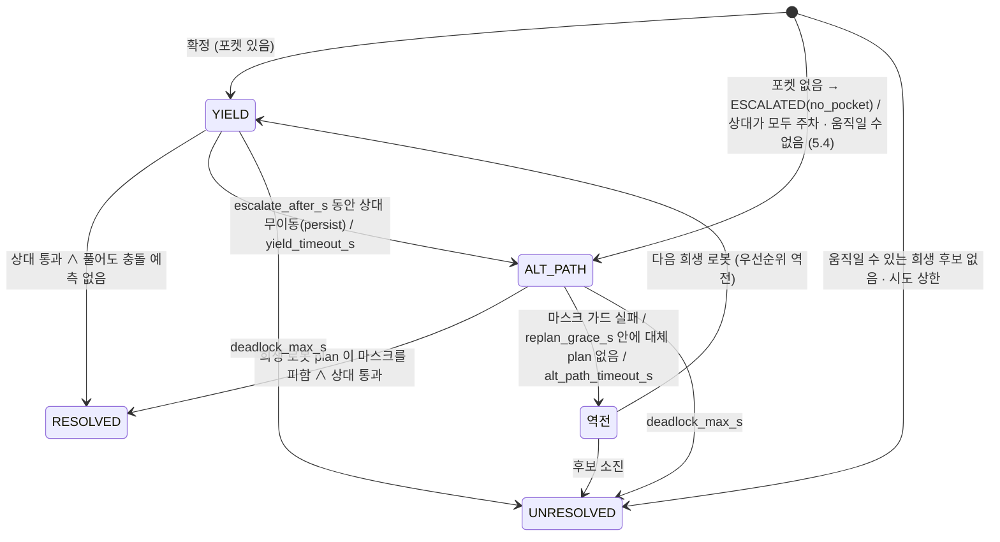

# 교통 관리 · 교착(Deadlock) 탐지와 해소

> 명세 4.9 Traffic Management — 경로 충돌 예측 및 해소, 교차로/병목 우선순위, 교착 탐지, 해소 전략 2가지 이상.
> 구현: `src/amr_fleet/amr_fleet/` 의 순수 모듈 6개 + 얇은 노드 1개. 설계 근거는 `docs/architecture/components.md`
> §3.6/§5.6, `sequences.md` §3, 연구 브리프 `fleet-traffic-deadlock` (CTR 제안, 아래 10장에 구현 범위).

## 1. 구성

| 모듈 | 역할 | 시험 |
| --- | --- | --- |
| `traffic_geometry.py` | 경로 호 길이 · 투영 · 재표본, 다각형, 점유 격자 기하 | `test_traffic_geometry.py` |
| `traffic_prediction.py` | plan → 시공간 표본, 쌍별 가장 이른 충돌, HEAD_ON / CROSSING / FOLLOWING 분류 | `test_traffic_prediction.py` |
| `traffic_zones.py` | 교차로 · 1차선 통로 구역(yaml 또는 `/map` 유도), 경로 위 구역 방문, **진입 토큰**(우선순위 · 기아 방지) | `test_traffic_zones.py` |
| `deadlock.py` | wait-for 그래프, Tarjan SCC(반복형), 사이클 확정, 정체(라이브락) 탐지, 유형 분류 | `test_deadlock.py` |
| `traffic_resolution.py` | 대기 포켓 탐색, keepout 마스크, 길 존재 확인, 사건 상태 기계(전략 1 → 2 → 역전 → 실패) | `test_traffic_resolution.py` |
| `traffic_manager.py` | 한 주기 `update(now, 관측)` → 명령 · 이벤트 (위 모듈 조립, `mode=active/observe`) | `test_traffic_manager.py` (MiniSim 포함) |
| `traffic_manager_node.py` | ROS 입출력만 (2 Hz 타이머, latched 발행, 알림) | `test_traffic_node.py` |

설정: `config/traffic.yaml` (파라미터 전부, 기본값 = 코드 기본값 — 시험이 확인), `config/traffic_zones.yaml`
(창고 구역 13개 · 포켓 37개). 런치: `fleet_manager.launch.py traffic_manager:=true`(기본) · `traffic_mode:=observe`.

### 1.1 노드 인터페이스 (`/fleet/traffic_manager_node`)

| 방향 | 토픽 | 타입 | 비고 |
| --- | --- | --- | --- |
| Sub | `/map` | `nav_msgs/OccupancyGrid` | latched. 포켓 탐색 격자 · keepout 격자 (`zones.source: map` 이면 구역 자동 유도) |
| Sub | `/amr_XX/plan` · `/amr_XX/odometry/filtered_map` · `/amr_XX/robot_state` | `Path` · `Odometry` · `RobotState` | 관측 시각 = 수신 시각(노드 시계). `obs_timeout_s`(3 s) 넘으면 **stale** — 빼지 않고 마지막 자세에 멈춘 장애물 · wait-for 노드로 두고 토큰을 그대로 쥔다(fail closed). `lost_timeout_s`(5 s = fleet.yaml `robot_state_timeout_s`) 넘으면 **lost** — 마지막 몸체가 걸친 구역 토큰만 남기고 나머지 반납 (3.2 · 4.3) |
| Sub | `/fleet/task_events` | `amr_msgs/Task` | `current_task_id` → 우선순위 · 마감 |
| Pub | `/amr_XX/traffic/hold` | `std_msgs/Bool` | latched (시작 시 false 발행) |
| Pub | `/amr_XX/traffic/yield_pose` | `PoseStamped` | latched. 전략 1 포켓. 새 포켓은 hold=true 보다 **한 주기 먼저** 낸다(두 토픽 사이 전달 순서는 DDS 가 보장하지 않으므로 0.5 s 간격으로 순서를 만든다). 양보가 끝나면 hold 뒤에 `frame_id` 가 빈 PoseStamped(= 포켓 없음). 시작 시 빈 포켓 발행. 실행기 규칙: hold=true 이고 `frame_id` 있는 포켓이면 포켓으로, 없으면 제자리 정지 |
| Pub | `/amr_XX/keepout_mask` | `OccupancyGrid` | latched. 지도 전체 크기 0.05 m, lethal 100 / 0 (해소 후 0 으로 다시 발행) |
| Pub | `/amr_XX/costmap_filter_info` | `nav2_msgs/CostmapFilterInfo` | latched. `type=0`, `filter_mask_topic=/amr_XX/keepout_mask` (**절대 이름** — 상대 이름은 costmap 노드 네임스페이스에서 `/amr_XX/global_costmap/keepout_mask` 로 풀린다), base 0, multiplier 1 |
| Pub | `/fleet/traffic_events` | `DiagnosticArray` | `traffic/DEADLOCK`(ERROR) · `RESOLVED`(OK) · `ESCALATED`(WARN) · `UNRESOLVED`(ERROR) · `STALL`(WARN) · `STALE`(stale WARN · lost ERROR · recovered OK). values: `robots, type, victim, strategy, pocket, attempts, zones, edges(사이클 간선 · 이유), immobile(움직일 수 없는 사건 로봇), resolve_time_s, reason, blockers · states(막는 로봇과 그 상태 — ESTOP · LOADING · stale 등), waiting_s, state, released`. `fleet_manager_node` 는 `traffic/DEADLOCK` 만 `deadlock_count` 에 센다 |
| Pub | `/fleet/alerts` | `DiagnosticArray` | `fleet/DEADLOCK`: 탐지 ERROR · 해소 OK · 해소 실패(사건 · 토큰 대기 · 1대 정체) ERROR (`hardware_id` = 희생 · 대기 로봇, `task_id` = 그 작업). `fleet/TRAFFIC_STALE`: 토큰을 쥔 로봇의 관측 끊김 stale WARN · lost ERROR · 재수신 OK (odometry 만 끊기고 robot_state 는 오는 경우 fleet_manager 는 알리지 않는다) |

## 2. 교착 유형

Coffman 4조건(상호 배제 · 점유 대기 · 비선점 · 순환 대기) 중 창고 AMR 에서 깨기 쉬운 것은 **순환 대기**다.
구역 토큰이 예방하고(3장), 남는 것을 탐지해 푼다(4 · 5장).

| 유형 | 모습 | 탐지 | 예방 |
| --- | --- | --- | --- |
| `HEAD_ON` (T1) | 1차선 통로 정면 대치 (2대, 진행 방향 차 ≥ 135°) | wait-for 2-사이클 | 통로 토큰 (반대 방향 진입 금지) |
| `CIRCULAR` (T2) | 교차로 등 3대 이상 순환 대기 | wait-for k-사이클 | 교차로 토큰 · 묶음 원자 부여 |
| `MUTUAL` | 그 밖의 2대 상호 대기 (교차 양보가 서로 막음, 토큰 ↔ 몸체) | wait-for 2-사이클 | 교차 양보 래치 |
| `BLOCKED` (T3) | 유휴(주차) 로봇 또는 스스로 움직일 수 없는 로봇(E-stop · 오류 · 관측 끊김)이 경로 · 구역을 막음 — 사이클 없음 | block · token 간선의 끝이 그런 로봇 + `idle_block_s` | 포켓 규칙 |
| `LIVELOCK` (T5) | 움직이지만 진전 없음 (서로 비키다 제자리, 목적지 경합) | 정체 탐지 묶음 | — |

## 3. 충돌 예측 · 교차로/병목 우선순위 (예방)

### 3.1 시공간 충돌 예측

로봇 i 의 남은 plan 을 현재 자세에 투영하고 공칭 속도 v(1 m/s)로 따라간다고 보아 표본
$(t_k, p_i(t_k), \psi_i(t_k))$, $t_k = k\,\Delta t$, $k\Delta t \le H$ 를 만든다 ($\Delta t$ 0.25 s, $H$ 10 s).
두 로봇의 표본 쌍 중

$$|t_a - t_b| \le \tau_w \quad\wedge\quad \|p_a(t_a) - p_b(t_b)\| < d_s = 2r + m$$

인 쌍이 있으면 충돌로 예측하고 $\max(t_a, t_b)$ 가 가장 작은 쌍을 대표로 쓴다 ($\tau_w$ 2 s 는 같은 자리를
번갈아 지나가는 경우까지 잡는다, $r$ 0.36 m 외접 반경, $m$ 0.3 m → $d_s$ 1.02 m). 유형은 대표 쌍의 진행 방향 차
$|\Delta\psi|$ 로 가른다: ≥ 135° HEAD_ON, ≤ 45° FOLLOWING, 그 사이 CROSSING. 쌍당 $O(K^2)$ ($K$ = 41), 5대 10쌍.
토큰 · 교차 hold 로 서 있는 로봇도 "풀어 주면 갈 경로" 로 예측한다 (풀자마자 다시 거는 진동 방지). 반대로
traffic 명령 없이 앞 로봇 몸체에 막혀 `stationary_time_s` 넘게 서 있는 **줄(queue)** 은 제자리로 예측한다 — 줄 뒤
로봇을 "곧 움직일 로봇" 으로 보면 엉뚱한 교차 양보가 생긴다 (리뷰 finding 4).

- **CROSSING (구역 밖)**: 우선순위가 낮은 쪽이 충돌 지점에 `crossing_act_s`(4 s) 안에 닿을 것으로 예측되면
  hold. 너무 가까우면(`crossing_min_s` 0.8 s) 세울 수 없으니 상대가 양보. 양보자가 이미 상대 앞길(3 m)에
  있으면 세우지 않는다(세우면 막힌다). 한 번 건 hold 는 예측 충돌이 사라질 때까지 유지(래치), 상한 15 s.
- **세우지 않는 로봇**: 몸체가 구역(교차로 · 1차선 통로) 안이거나 들어간 구역 토큰을 쥔 로봇은 교차 양보자가
  되지 않는다 — 통로 한가운데서 토큰을 쥔 채 서면 그 토큰을 기다리는 줄과 순환 대기가 된다(리뷰 finding 4:
  H→C crossing, C→B, B→A block, A→H token). 그때는 상대가 양보하고, 상대도 못 세우면 둘 다 진행한다.
- **양보 순환 금지**: 새 교차 양보 y→o 가 이번 주기 양보 사슬(o → … → y)을 닫으면 걸지 않는다 (역전 · 고정
  로봇 때문에 우선순위 순서가 뒤집히면 세 대가 서로에게 양보하며 모두 설 수 있다).
- **HEAD_ON / FOLLOWING**: 넓은 통로에서는 지역 계획기 · `safety_node` 몫이라 직접 세우지 않는다. 1차선
  통로의 정면은 토큰이 막고, 남는 것은 교착 탐지가 잡는다.

### 3.2 구역 진입 토큰

구역 = `traffic_zones.yaml` 의 다각형(창고: 좁은 통로 1 + 교차로 12) 또는 `/map` 유도(1차선 통로 = 벽까지
거리 능선 × 2 < 1.5 m, 교차로 = 네 축 중 3개 이상이 4 m 이상 뚫린 셀). 용량은 1대, 단 통로는
`same_direction` 이면 같은 방향 추종 진입을 허용한다(`d_i · d_j ≥ 0.5`).

- 로봇 경로가 구역 입구 요청 거리 안에 오면 요청: 교차로 `approach_distance_m`(1.5 m), 1차선 통로
  `corridor_approach_m`(2.5 m — 입구에서 더 멀리 기다려 통로에서 나오는 로봇이 비켜 갈 자리를 남긴다).
  1 m/s 에서 주기 0.5 s + 지연 0.1 s + 제동 0.5 m = 1.1 m < 1.5 m 라 구역 앞에서 설 수 있다.
  출구 → 다음 입구가 `chain_gap_m`(1.5 m) 안인 구역들(교차로 → 틈 → 교차로)은 **묶어서 원자적으로** 받는다.
- 못 받으면 `traffic/hold` (사유 `zone:<구역>`). 들어갔다 몸체가 다 나오거나 경로가 더는 지나지 않으면 반납.
- **구역 안에서 기다리지 않기** (리뷰 finding 1): 묶이지 않은 두 구역 사이 간격 g 가 요청 거리 + 로봇 반경보다
  좁으면, 다음 구역을 요청하는 순간 몸체가 아직 앞 구역에 걸쳐 있어 거절되면 앞 구역 토큰을 쥔 채 그 안에서
  선다. 반대 방향 두 로봇이 이웃 교차로에서 서로의 토큰을 기다리는 토큰 ↔ 토큰 교착이 된다. 막는 장치 둘:
  1. 시작 시 배치 검사 `spacing_conflicts`: `chain_gap_m < g < max(두 구역 요청 거리) + robot_radius` 인
     다각형 쌍이 있으면 `zones.spacing_check: reject`(기본) 는 노드 시작을 거부, `warn` 은 경고만.
     `/map` 유도 구역은 거친 격자로 재어 경고만 한다(고칠 yaml 이 없다).
  2. 실행 중 가드 (`request_chain(…, occupied)`): 몸체가 구역 k 에 걸친 로봇은 k 와 묶이지 않은 다음 구역을
     k 를 빠져나온 뒤에 요청한다 (검사를 통과한 배치에서는 요청 거리 규칙과 같다 — 경고만 낸 배치 · 경로가 크게
     바뀐 경우의 방어).
- **배포 배치** (`config/traffic_zones.yaml`): 교차로 = 통로와 열 틈이 만나는 곳의 **가운데 2 × 5 m**. 통로를 따라
  이웃 교차로 간격 4 m ≥ 1.5 + 0.36 → 기다리는 자리(입구 0.9–1.5 m 앞, 랙 끝 근처)가 두 구역 밖이고 랙 가운데
  스테이션을 막지 않는다. 통로 AB → 틈 → BC 두 교차로(간격 1 m)는 묶음. 원래 배치(틈 폭 4 m 전체, 간격 2 m,
  approach 2.5 m)는 검사가 거부한다 — 선택 근거는 8.2 의 배치 비교.
- **부여 순서**: (기아 로봇 먼저, 그 안에서 먼저 기다린 순) → 작업 우선순위 ↓ → 마감 ↑ → 대기 시작 ↑ → id.
  우선순위는 같은 주기에 요청 거리 안에 든 로봇끼리만 비교된다 (요청 거리가 짧을수록 선착순에 가깝다).
- **기아 방지**: 먼저 기다리던 로봇을 **엄격히 나중** 요청이 같은 구역에서 받아 가면 추월 +1. `max_bypass`(2)
  에 이르면 기아 로봇이 되어 그 구역이 예약된다(다른 로봇에 부여 금지). 같은 주기에 함께 요청한 로봇끼리의
  우선순위 순서는 추월이 아니다. 따라서 로봇 i 보다 먼저 받는 로봇 수 ≤ `max_bypass + (n − 1)`,
  대기 상한 ≤ (`max_bypass + n − 1`) × (구역 최대 점유 시간). `test_token_starvation_bound` 가 고우선 로봇이
  끝없이 들어오는 경우에 저우선 로봇이 정확히 3번째 뒤(h0 · h1 · h2 다음)에 받는 것을 확인한다.
  **전제: 모든 점유가 유한하다** — 보유자가 결국 구역을 빠져나와야 한다. E-stop · 오류 · 관측 끊김(stale) 로봇이나
  오래 적재 · 도킹 · 충전하는 로봇이 구역 안에 있으면 점유 시간이 무한(또는 매우 길어)이라 상한이 없다
  (리뷰 finding 3). 그 경우는 탐지 쪽이 맡는다: 토큰 대기 감시(4.3)와 BLOCKED(움직일 수 없는 보유자, 4.3 · 5.4).
- **관측이 끊긴 보유자** (리뷰 finding 2): stale 로봇의 토큰은 반납하지 않는다(들어가지 않은 구역 포함 — 어디에
  있는지 모른다). lost 가 되면(fleet_manager 가 오프라인으로 보고 작업을 실패 처리하는 시점과 같은 5 s) 마지막
  몸체가 걸친 구역만 남기고 반납한다. 몸체는 마지막 자세의 정지 장애물 · wait-for 노드로 남는다.
- **포켓으로 가는 희생 로봇** (리뷰 finding 5): 포켓 탐색 Dijkstra 는 다른 로봇이 보유 · 점유한 구역 셀을 지나지
  않는다(자기 몸이 걸친 구역은 예외 — 빠져나와야 한다). 고른 포켓 경로가 지나는 빈 구역 토큰은 희생 로봇에
  미리 원자 부여(`ZoneTokenManager.reserve`)해서 이동 중 다른 로봇이 같은 구역을 받지 못한다. 실제 plan 이 그
  경로와 다르면 점유 등록(몸체가 들어간 빈 구역)이 뒤를 잇는다.

## 4. 교착 탐지

### 4.1 wait-for 그래프

노드 = 로봇, 간선 $i \to j$ = "i 가 j 때문에 서 있다". 2 Hz 마다 새로 만든다.

| 간선 | 조건 |
| --- | --- |
| `token` | i 의 토큰 요청이 거절됐고 j 가 그 구역 보유자(또는 기아 예약자) |
| `crossing` | i 가 교차 양보 hold 중이고 상대가 j |
| `block` | i 가 주행해야 하는데 `stationary_time_s`(2 s) 넘게 정지, 정지한($\|v_j\| \le$ 0.05 m/s) j 의 중심이 i 의 남은 경로 앞 `block_lookahead_m`(2 m) 구간에서 횡거리 $< 2r + 0.3$ m, 종거리 $> r/2$ (경로가 곧바로 꺾여 옆에 선 로봇 쪽으로 가는 경우까지) |

hold 된 로봇(양보 중 · 토큰 대기 · 교차 양보)은 block 간선을 내지 않는다 (서 있는 이유가 이미 간선이다).
관측이 끊긴 로봇도 노드로 남는다 — 그 로봇을 향한 token · block 간선이 대기 이유를 설명한다.

### 4.2 사이클 → 교착 확정

Tarjan SCC(명시적 스택 반복형 — 재귀 깊이 제한 없음, $O(V+E)$)로 크기 ≥ 2 인 성분을 찾는다. 같은 로봇 집합의
성분이 `confirm_s`(1 s) 이상 이어지면 교착으로 **한 번** 확정한다 (통신 지연 · 재계획 순간의 일시적 사이클 제거).
대표 사이클은 SCC 안에서 방문 표시를 되돌리지 않는 DFS 로 $O(V+E)$ 에 뽑는다(SCC 에서는 start 로 들어오는 간선을
가진 노드를 방문할 때 그 노드가 스택 위에 있으므로 그때의 스택이 단순 사이클). 이미 사건에 묶인 로봇이 들어간
성분 · `cooldown_s` 중인 집합은 다시 열지 않는다. 유형: 3대 이상 CIRCULAR, 2대는 진행 방향 차 ≥ 135° 면
HEAD_ON, 아니면 MUTUAL.

**탐지 지연** (+ 관측 지연 ≤ 0.1 s). 확정은 **같은 로봇 집합**의 SCC 가 `confirm_s` 동안 이어져야 한다 — 그 사이
로봇이 끼거나 빠지면 새 집합으로 다시 잰다. 그 조건에서:

| 경우 | 지연 |
| --- | --- |
| block 간선이 낀 사이클 | `stationary_time_s` + `confirm_s` + 주기 = 2 + 1 + 0.5 = **3.5 s** (`sequences.md` §3 `t_stall` 5 s 보다 짧다) |
| token · crossing 간선만의 사이클 | `confirm_s` + 주기 = 1.5 s |
| BLOCKED (유휴 · 움직일 수 없는 로봇) | `idle_block_s` + 주기 = 5.5 s |
| LIVELOCK (사이클 없는 정체 묶음) | `stall_time_s` + 주기 = 15.5 s |
| 긴 토큰 대기 (사이클 없음) | `token_wait_stall_s` 30 s → STALL, `wait_max_s` 120 s → UNRESOLVED |

명세의 통신 지연 100 ms · 재계획 0.5 s 보다 충분히 크다.

### 4.3 사이클 없는 막힘 · 라이브락 · 긴 대기

- **BLOCKED**: 주행 로봇의 block · token 간선 끝이 유휴 로봇(작업 · 경로 없음, IDLE) 또는 **스스로 움직일 수 없는
  로봇**(E-stop · 오류 · 관측 끊김)이고 `idle_block_s`(5 s) 넘게 서 있으면 {대기 로봇, 그 로봇들} 로 사건을 연다.
  교차로 안 E-stop 보유자를 기다리는 로봇이 여기에 걸린다 (리뷰 finding 3). 해소는 5.4.
- **정체(StallDetector)**: 로봇마다 목표 경로 남은 길이 $L_i(t)$ 를 본다. 마지막 진전 기준 $L^*$ 보다
  `stall_progress_m`(0.5 m) 넘게 줄면 진전(기준 갱신). `stall_time_s`(15 s) 동안 진전이 없으면 정체.
  남은 길이가 최솟값보다 2 m 넘게 늘면(큰 우회 재계획) · 목표가 바뀌면 기준을 새로 잡는다. hold 중인 로봇과
  **block 간선으로 hold 중인 로봇 뒤에 줄 선 로봇**은 감시하지 않는다 (그 기다림은 토큰 대기 감시 · 교차 양보
  상한 · 사건이 맡는다 — 통로 입구 줄을 LIVELOCK 으로 잘못 세지 않는다). 서로 `livelock_radius_m`(3 m) 안에
  모인 정체 로봇 ≥ 2 → **LIVELOCK** 사건, 혼자면 `traffic/STALL` 경고(진전할 때까지 한 번, 막는 로봇과 상태를
  적는다). 혼자 정체가 `wait_max_s`(120 s) 이어지면 `traffic/UNRESOLVED`(reason `wait_max`) — 운영자 몫.
- **토큰 대기 감시**: 토큰 대기 로봇은 정체 감시에서 빠지므로 따로 본다. 대기가 `token_wait_stall_s`(30 s)
  이어지면 `traffic/STALL`(type `TOKEN_WAIT`, blockers · states), `wait_max_s`(120 s) 면 `traffic/UNRESOLVED`
  (reason `token_wait_max`, fleet/DEADLOCK ERROR) — 대기마다 한 번씩. 적재 · 도킹 · 충전 중인 보유자(끝나는 작업이라
  BLOCKED 는 아니다)가 여기에 걸린다. 사건에 묶였거나 움직일 수 없는 로봇 때문에 이미 실패 알림을 낸 로봇은 뺀다.
- **관측 끊김**: fresh → stale(`obs_timeout_s`) 에 `traffic/STALE` WARN, lost(`lost_timeout_s`) 에 ERROR,
  다시 오면 recovered OK. 토큰을 쥐고 있었으면 `fleet/TRAFFIC_STALE` 알림도 낸다.
- **observe 모드 보고 이력**: 교통 관리 없는 기준선 측정에서는 해소가 없어 같은 대치가 사이클 ↔ 정체로 모습을
  바꾸며 깜박인다. 사이클은 같은(부분/상위) 로봇 집합이 `clear_s`(3 s) 동안 안 보이고 **모두 진전**해야 풀림으로
  보고, 막힘은 로봇마다 에피소드(마지막 진전 시각이 바뀔 때까지)에 한 번만 센다. 이 이력이 없던 초기 판(시뮬레이터
  도착 판정 수정 전)에서는 기준선 시드 1 의 한 대치가 45번의 탐지/해소로 깜박였다 → 지금은 대치마다 1번이고,
  대치가 모양을 바꿔도(사이클 → 정체) 새 로봇이 끼지 않으면 다시 세지 않는다.

## 5. 해소 전략

사건(Incident) = 확정된 교착 1건. 희생 로봇 순서 = 중요도의 역순: 작업 우선순위 낮은 순 → 마감 늦은 순(없음 = 가장
늦음) → id (결정적). 작업 없는 로봇(우선순위 −1)이 가장 먼저 비킨다. **스스로 움직일 수 없는 로봇(E-stop · 오류 ·
관측 끊김)은 희생 로봇이 되지 않는다** (values `immobile` 에 적는다) — 모두 그렇다면 열자마자 UNRESOLVED
(`no_mobile_victim`).

### 5.1 전략 1 — 우선순위 기반 양보 (YIELD)

희생 로봇 y 에 `traffic/yield_pose`(포켓) + `traffic/hold=true`. BT 의 `IsTrafficHold` → Yield 서브트리가
포켓으로 가서 기다린다(sequences.md §3). 나머지는 그대로 진행한다.

- **포켓 선택**: `traffic_zones.yaml` 의 포켓 중 y 에서 **다른 로봇 몸체(반경 2r)와 다른 로봇이 보유 · 점유한 구역을
  지나지 않고** 갈 수 있는 가장 가까운 곳 (0.25 m 격자 8-연결 Dijkstra, 경로 비용 ≤ `pocket_search_radius_m`).
  그 경로 위 빈 구역 토큰은 희생 로봇에 미리 부여한다 (3.2). 포켓은 제자리 회전
  가능(벽까지 ≥ r), 다른 주행 로봇의 남은 경로(12 m)에서 `pocket_clearance_m`(1 m) 이상, 다른 로봇 · 다른 사건이
  예약한 포켓에서 2r + 0.2 m 이상. 지정 포켓이 모두 안 되면(`auto_pockets`) 구역 밖에서 같은 조건의 가장 가까운
  셀을 쓴다. 통과 격자는 "셀 안 한 점이라도 벽까지 ≥ 0.22 m" 로 만들어 폭 0.6 m 좁은 통로를 지나는 길을 보존한다.
- **해소 판정**: (1) 희생 로봇이 아닌 주행 로봇이 모두 분쟁 영역(탐지 때 위치 반경 1.2 m + 걸쳐 있던 구역)을
  벗어났고 남은 경로 6 m 안에 다시 들어오지 않으며, (2) 희생 로봇을 지금 원래 경로로 풀어도 10 s 안에 그들과
  정면 · 교차 충돌이 예측되지 않을 때 → hold · yield_pose 를 거두고 `traffic/RESOLVED`(strategy, resolve_time_s,
  pocket). (2) 가 없으면 1차선 통로에서 아직 물러나는 중인 희생 로봇을 풀어 다시 마주친다.

### 5.2 전략 2 — 대체 경로 (ALT_PATH, Nav2 KeepoutFilter)

희생 로봇 전용 `keepout_mask` 에 lethal(100)을 칠하고 `costmap_filter_info`(type 0)와 함께 latched 로 낸다.
Nav2 `KeepoutFilter` 가 그 로봇의 costmap 에만 반영하므로 플래너 코드는 손대지 않는다.

- 칠하는 곳: 목표 경로(양보 중이면 포켓 경로가 아닌 원래 경로)의 자기 몸 앞 $r + m$ 부터 분쟁 구간 끝까지
  반폭 0.6 m 띠 + 상대 몸체 원(r + 0.2 m). 분쟁 구간 끝 = max(경로 근처 상대의 투영점, 분쟁 구역 첫 방문 출구)
  + `keepout_extend_m`(1.5 m), 단 목표 앞 (반폭 + r + 0.2 m) 에서 자른다.
- **마스크 가드**: 자기 몸 주변은 비운다(시작 셀 lethal → 플래너 실패). 상대가 목표 자리에 있거나(목표 경합)
  목표가 분쟁 구간 안이면 마스크를 만들지 않는다. 마스크를 칠한 정적 지도에서 목표로 이어지는 통과 영역이
  없으면(0.25 m 격자 8-연결 성분) 플래너 실패를 기다리지 않고 곧바로 희생 로봇을 바꾼다.
- 희생 로봇의 새 plan(마스크 해상도로 다시 뽑아 검사)이 마스크를 피하면 대체 경로를 찾은 것. 해소 판정은
  5.1 과 같다(상대가 모두 주차면 희생 로봇이 분쟁 영역을 벗어나면). 해소 시 빈 마스크를 다시 발행한다.

### 5.3 에스컬레이션과 우선순위 역전

전략 1 → 2: 포켓 없음(곧바로), `escalate_after_s`(10 s) 동안 상대가 0.5 m 도 못 움직임(희생 로봇이 비키지
못함 — 사이클 지속), `yield_timeout_s`(30 s, sequences.md `t_yield`). 전략 2 실패(가드 · 5 s 안에 대체 plan
없음 · 45 s) → 다음 희생 로봇으로 **우선순위 역전** 후 전략 1 부터. 후보 소진 · `deadlock_max_s`(120 s) ·
무진전 시도 초과 → `traffic/UNRESOLVED` + `fleet/DEADLOCK`(ERROR) — 운영자/작업 재할당 몫, 같은 로봇 집합은
`cooldown_s`(30 s) 뒤 새로 시도. 움직일 수 없는 로봇이 낀 집합은 그 로봇이 다시 움직일 수 있거나 관측에서 빠질
때까지 다시 열지 않는다 (E-stop 로봇 하나로 35 s 마다 교착 · 실패를 되풀이하지 않게).

### 5.4 움직일 수 없는 로봇이 막을 때 (BLOCKED)

상대가 모두 움직일 수 없으면 비킬 로봇이 대기 로봇뿐이다 → 곧바로 전략 2: 대기 로봇 전용 keepout 에 분쟁 구간 띠와
함께 **움직일 수 없는 로봇이 걸친 구역 전체**를 칠한다 (그 구역 토큰은 풀리지 않으니 구역을 돌아가는 경로만
의미가 있다). 목표가 그 구역 안이거나 지도에 우회로가 없으면 역전할 후보가 없어 UNRESOLVED (robots · immobile 에
막는 로봇). `test_warehouse_estop_holder_in_intersection_blocked_then_detour` 가 교차로 `x_ab_4` 안 E-stop ·
오류 보유자에 대해 BLOCKED → 우회 → RESOLVED 를 확인한다.

**움직일 수 없는 로봇은 "지나가기" 를 기다리지 않는다.** 해소 판정에서 상대가 분쟁 영역을 벗어났는지 볼 때
`mobile = false` 인 로봇은 빼고, 희생 로봇이 그를 피해 돌아가면 해소로 본다. 대신 희생 로봇을 원래 경로로
되돌려도 되는지 보는 검사에서는 그 로봇을 **정지 장애물로 예측**하고, 뒤따르기 충돌까지 되돌림을 막는다
(움직이는 상대는 비켜 주며 가지만 서 있는 로봇은 비키지 않는다). 이전 판은 E-stop 된 상대가 지나가기를
기다리다 시간이 초과돼 `UNRESOLVED exhausted(no_alt_path)` 로 끝났다 — 통합 시나리오 12 의 강제 교착에서
실제로 그렇게 끝났고, 같은 배치의 합성 회귀 시험만 통과했다 (E-stop 로봇이 작업 없이 유휴일 때만 우회로 갔다).

## 6. Liveness 논증

주장하는 것과 하지 않는 것을 나누고, 조건이 있는 주장은 조건을 적는다.

1. **사건은 유한 시간에 끝난다** (조건 없음). 매 주기 `now − detected_at > deadlock_max_s` 이면 UNRESOLVED 로
   닫는다. 희생 로봇 교체는 사건 안에서 단조 증가(`victim_index`)이고 후보는 |C| 명뿐이다.
2. **무진전 반복은 횟수가 유한하고, 그다음은 빈도가 제한된다** (조건 없음). 로봇마다 "진전 없이 사건에 걸린 횟수"
   $m_i$ 를 센다(사건을 열 때 +1, 목표 경로가 `progress_reset_m`(2 m) 넘게 줄거나 목표가 바뀌면 0). $m_i$ >
   `max_attempts_per_robot`(3) 인 로봇이 들어간 사건은 열자마자 UNRESOLVED(알림). 진전 없이 이어지는 사건마다
   $\sum_i m_i$ 가 |C| ≥ 2 이상 늘고 모든 $m_i \le 3$ 인 상태는 $\sum_i m_i \le 3n$ 이므로, 어느 로봇도 진전하지
   않으면 사건 $\lfloor 3n/2 \rfloor + 1$ 개 안에 UNRESOLVED 가 난다 (브리프 §5.4 의 $m_i$ 논증과 같은 구조).
   UNRESOLVED 뒤 그 집합은 `cooldown_s`(30 s) 동안 다시 열지 않는다 — 영구 봉쇄에서도 무한히 빠른 진동은 없고,
   알림을 낸 뒤 30 s 간격으로 다시 시도한다(움직일 수 없는 로봇이 낀 집합은 그 로봇이 복구될 때까지 다시 열지
   않는다). 브리프의 R3 작업 재큐잉은 미구현(10장).
3. **해소 직후 같은 대치로 되돌아가지 않는다** — 조건: 예측이 맞고(plan 을 공칭 속도로 따라감) 희생 로봇이 명령을
   수행한다. 해소는 "상대 통과 ∧ 풀어도 10 s 안에 정면·교차 충돌 예측 없음" 일 때만이다. 희생 로봇 선택은
   결정적(우선순위 → 마감 → id)이라 두 로봇이 번갈아 양보하는 진동이 없다.
4. **구역 대기는 기아가 없다** (3.2): 대기 로봇 앞에 서는 로봇 수 ≤ `max_bypass + n − 1`, 대기 상한 = 그 수 ×
   구역 최대 점유 시간. 조건: (a) 모든 점유가 유한하다 — E-stop · 오류 · 관측 끊김 보유자, 끝나지 않는 적재 · 도킹 ·
   충전 보유자가 없다; (b) 보유자가 관측되고 있다 (stale 보유자는 fail closed 로 토큰을 놓지 않는다); (c) 대기 중
   경로가 요청 구역과 겹치지 않을 만큼 바뀌지 않는다 (대기 시각은 겹치는 구역이 남을 때만 이어진다). 조건이 깨지면
   상한은 없다 — 대신 토큰 대기 감시가 30 s STALL · 120 s UNRESOLVED 로 막는 로봇과 그 상태를 알리고, 움직일 수
   없는 보유자는 BLOCKED 사건이 대기 로봇을 구역 밖으로 돌려 보낸다(5.4).
5. **구역 안에서 토큰을 쥔 채 기다리지 않는다** — 조건: 배치가 간격 검사(3.2)를 통과하고 요청 뒤 경로가 크게 바뀌지
   않는다. 그러면 토큰을 기다리는 로봇은 몸체가 구역 밖이고 지금 요청한 묶음의 토큰을 하나도 쥐지 않으므로 **token
   간선만으로 된 사이클은 생기지 않는다** (묶음 원자 부여 + 구역 밖 대기). 남는 경우: 경로가 바뀌어 묶음의 뒤 구역을
   나중에 요청할 때, 기다리는 로봇 몸체가 보유자의 출구 · 목표를 막을 때(token + block 사이클 — 해소 계층이 푼다).
   측정(8.2): 배포 설정 90시드에서 token 간선이 낀 교착 0건.
6. **보장하지 않는 것**: 전략이 모두 실패하는 기하(포켓도 우회로도 없는 막다른 통로에 3대 이상), 희생 로봇이
   명령을 수행하지 못하는 경우(고장 · E-stop — 희생 로봇에서 빼지만 다른 후보가 없으면 UNRESOLVED), 관측이 끊긴
   로봇이 실제로는 계속 움직이는 경우(마지막 자세를 정지 장애물로 본다 — 토큰만 fail closed)는 UNRESOLVED ·
   STALE 로 알리고 끝낸다 — 자동 해소를 주장하지 않는다. 토큰 · 예측은 "대부분 예방" 이지 CTR 의 정리 1–2 같은
   무교착 보장이 아니다(10장).

## 7. 파라미터 (`config/traffic.yaml`)

| 파라미터 | 값 | 근거 |
| --- | --- | --- |
| `update_rate_hz` | 2.0 | components.md §3.6 (robot_state 2 Hz 와 같다) |
| `robot_radius` / `passage_radius` | 0.36 / 0.22 m | 풋프린트 0.6 × 0.4 m 외접 반경 / 반폭 0.2 + 0.02 (0.6 m 좁은 통로 보존) |
| `prediction.safety_margin_m` · `time_window_s` · `horizon_s` | 0.3 m · 2 s · 10 s | $d_s$ 1.02 m (safety_node 0.30 m 와 같은 여유), 1 m/s × 10 s = 10 m 앞 |
| `prediction.crossing_act_s` / `crossing_min_s` | 4 / 0.8 s | 1 m/s 에서 4 m 앞에서 세움 · 0.8 m 안이면 못 세움 (감속 1 m/s² 여유) |
| `zones.approach_distance_m` / `corridor_approach_m` / `chain_gap_m` | 1.5 / 2.5 / 1.5 m | 1 m/s 에서 주기 0.5 s + 지연 0.1 s + 제동 0.5 m = 1.1 m < 1.5 m. 통로는 입구에서 더 멀리(나오는 로봇 자리). 창고 열 틈 1 m 는 묶음. 교차로 가운데 2 m 배치에서 이웃 간격 4 m ≥ 1.5 + 0.36 (8.2 배치 비교) |
| `zones.spacing_check` | reject | 간격이 `chain_gap_m` 초과 · 요청 거리 + 반경 미만인 구역 쌍이 있으면 시작 거부 (`warn` = 경고만) |
| `obs_timeout_s` / `lost_timeout_s` | 3 / 5 s | stale: 마지막 자세 · 토큰 유지 / lost: 몸체 구역 토큰만 — fleet.yaml `robot_state_timeout_s`(5 s)와 같다 (시험이 확인) |
| `deadlock.token_wait_stall_s` / `wait_max_s` | 30 / 120 s | 정상 대기 상한((`max_bypass` + n − 1) = 6 × 구역 점유 수 초)보다 길게 / sequences.md `t_deadlock_max` 와 같게 |
| `zones.max_bypass` | 2 | 기아 대기 상한 = (2 + n − 1) × 점유 시간 |
| `deadlock.stationary_time_s` / `confirm_s` | 2 / 1 s | 통신 지연 0.1 s · 재계획 0.5 s ≪ 2 s. block 간선 사이클 탐지 지연 3.5 s (4.2 표) |
| `deadlock.stall_time_s` / `idle_block_s` | 15 / 5 s | 정체는 느린 신호(재계획 여러 번 기다림), 주차 로봇 막힘은 빨리 |
| `resolution.escalate_after_s` / `yield_timeout_s` | 10 / 30 s | 포켓까지 ~10 m 주행 여유 / sequences.md `t_yield` |
| `resolution.replan_grace_s` / `alt_path_timeout_s` | 5 / 45 s | Nav2 재계획 + 전달 여유 / 우회 주행 상한 |
| `resolution.deadlock_max_s` | 120 s | sequences.md `t_deadlock_max` |
| `resolution.max_attempts_per_robot` / `cooldown_s` | 3 / 30 s | 6장 2 |
| `resolution.keepout_*` | 반폭 0.6, 연장 1.5, 여유 0.2, 해상도 0.05 m | 1차선 통로 폭 전체를 덮고 costmap 해상도와 맞춘다 |

## 8. 측정 결과

측정일 2026-09-22, 이미지 `amr-fleet-system:wf-final` (Python 3.10, numpy 1.26), 일회용 컨테이너. 시각 수치
옆의 부하는 호스트 `uptime` load average(1분, 32코어 호스트, 다른 사용자 작업과 함께)다.
**주 결과는 실제 창고 배치(8.2 · 8.3)** 이고, 30 × 20 m 합성 지도 결과(8.4)는 보조 결과다 — 이 문서 첫 판(df85142)은
합성 지도만 쟀고, 배포 배치에서 교착 35건 · makespan +10 % 가 나는 것을 놓쳤다 (리뷰 finding 1 · 6).

### 8.1 단위 · 노드 시험

`WERROR=1 ./scripts/build.sh` (build/install 지운 뒤 전체 10 패키지) 25.2 s, 컴파일러 경고 0 (load 52).
`./scripts/test.sh --packages-select amr_fleet`: pytest **359 통과 / 0 실패** (교통 시험 140 + 기존 219),
flake8 · pep257 · xmllint · lint_cmake 포함 CTest 5/5, 54.6 s (load 55–61).

| 모듈 | 문장 | 커버리지 (문장+분기) |
| --- | --- | --- |
| `deadlock.py` | 191 | 100 % |
| `traffic_geometry.py` | 145 | 100 % |
| `traffic_prediction.py` | 84 | 100 % |
| `traffic_zones.py` | 422 | 99 % |
| `traffic_resolution.py` | 605 | 98 % |
| `traffic_manager.py` | 762 | 97 % |
| `traffic_manager_node.py` (ROS) | 303 | 91 % |
| `alerts.py` | 28 | 100 % |

시험 내용: SCC 를 무작위 그래프 40개에서 도달성 정의와 대조 · 5001 노드 사슬(재귀 없음), 토큰 우선순위 · 마감 ·
묶음 원자 부여 · 같은 방향 추종 · 기아 상한(`h0 → h1 → h2 → a`), frozen(stale) 보유 유지 · lost 반납 · 원자 예약,
구역 안에서 기다리지 않는 요청 규칙과 간격 검사(원래 배치 거부, 배포 배치 통과), 창고 배치 파일을
gen_warehouse_world.py 상수로 그린 지도와 대조(구역 겹침 0, 포켓 37개 모두 구역 밖 · 장애물에서 ≥ 0.36 m, 좁은
통로 중앙선 통과 가능, `/map` 유도도 같은 통로를 찾음), 사건 상태 기계 전 경로(양보 → 해소, 풀면 다시 마주치는
경우 보류, 포켓 없음 → 전략 2, 사이클 지속 → 전략 2 → 역전 → 소진, 지도에 우회로 없음 → 즉시 역전, 시간 상한,
시도 상한 · 진전 초기화, 주차 로봇, 움직일 수 없는 로봇은 희생 제외 · 구역 전체 keepout · 복구 전 재시도 없음,
보유 구역을 피하는 포켓 경로), MiniSim 끝까지(통로 정면 → 양보 해소, 포켓 없음 → keepout 우회, 통로 토큰 예방,
교차 양보, observe 깜박임 1회 · 진전 뒤 1회 해소, 주차 막힘, 라이브락 · 단일 정체), **실제 창고 배치 재현 시나리오**
(8.3), 노드 배선(latched hold · yield_pose · 마스크 · filter info 를 늦은 구독자가 받음, yield_pose 가 hold=true 보다
한 주기 먼저 · 양보 뒤 빈 포켓, task_events 우선순위로 희생 로봇 선택, fleet_manager deadlock_count 1, 전략 2 마스크
발행 · 해제, 잘못된 지도 → INTERNAL_ERROR 후 계속).

### 8.2 실제 창고 배치 — 무작위 작업 (스크래치 `trafrev/fix/wh.py`, 패키지에 넣지 않음)

운동학 시뮬레이터 ksim(합성 지도판과 같은 것: 원형 로봇 반경 0.3 m, 1 m/s, 0.25 m 격자 A*, 1 s 이상 막히면 주변
로봇을 장애물로 넣어 재계획 — 우회가 6 m 넘게 길면 기다림, 다른 로봇 중심과 0.7 m 안으로 다가가는 걸음은 딛지
않음, 교통 명령 지연 U(0, 100) ms)를 **gen_warehouse_world.py 의 실제 배치**(60 × 40 m, 랙 21개, 좁은 통로, 기둥,
충전기)와 **배포 `traffic_zones.yaml` · `traffic.yaml` 기본값**으로 돌린다 (리뷰 재현 스크립트 `whsim.py` 와 같은
지도 · 작업 · 시드, 설정 4개로 늘림). 로봇 5대가 남쪽 홀의 자리(x = 18..26, y = −16)에서 출발해 스테이션 13곳(랙
앞면 · 메인 통로 · 남쪽 홀) 중 무작위 4곳을 들르고(각 2 s LOADING) 돌아온다. 우선순위 U{0..255}, 상한 900 s.
설정: **전체**(토큰 + 교차 양보 + 해소), **토큰만**(교차 양보 끔, 탐지 · 해소는 켬), **해소만**(토큰 · 교차 양보 끔),
**없음**(교통 관리 없음, observe 로 교착만 셈). makespan 짝 비교 = 네 설정 모두 완료한 시드.

**배포 설정, 시드 1–30** (120회 벽시계 약 19 s, 14 병렬, load 7–17; 회당 최대 10 s):

| 설정 | 완료 | makespan 평균 / 중앙 [s] | 짝 비교 (28시드) | 교착 탐지 | 해소 | 미해소 | 에스컬레이션 | 해소 시간 최대 [s] | 탐지 유형 (간선) |
| --- | --- | --- | --- | --- | --- | --- | --- | --- | --- |
| 전체 | **30/30** | 187.8 / 184.2 | 187.8 (**+1.6 %**) | **0** | 0 | 0 | 0 | — | — |
| 토큰만 | 30/30 | 187.5 / 182.5 | 187.3 (+1.3 %) | 1 | 1 | 0 | 0 | 0.5 | HEAD_ON(block) |
| 해소만 | 30/30 | 185.3 / 182.2 | 184.9 (기준) | 2 | 2 | 0 | 0 | 1.0 | HEAD_ON(block) · LIVELOCK |
| 없음 | 28/30 | 184.9 / 182.2 | 184.9 (+0.0 %) | 2 | — | 2회 900 s 까지 영구 | — | — | HEAD_ON(block) · LIVELOCK |

전체 설정에서 구역 hold 137회 · 교차 양보 hold 180회, 최소 중심 거리 0.70 m(시뮬레이터 안전 정지 거리)로 모든
설정 충돌 없음. 리뷰의 `whsim.py` 원본으로 다시 돌려도 같은 값(전체 교착 0, 30/30, 짝 187.8 vs 해소만 184.9).

**배포 설정, 시드 1–90** (시드 31–90 은 240회 벽시계 약 53 s, load 17; 회당 최대 26 s):

| 설정 | 완료 | makespan 평균 / 중앙 [s] | 짝 비교 (84시드) | 교착 탐지 | 미해소 | 해소 시간 최대 [s] | 탐지 유형 |
| --- | --- | --- | --- | --- | --- | --- | --- |
| 전체 | 89/90 | 189.6 / 189.3 | +2.0 % | **3** | 1¹ | 0.5 | MUTUAL(block) 3 |
| 토큰만 | 89/90 | 188.6 / 189.3 | +1.5 % | 4 | 2¹ | 16.0 | HEAD_ON(block) 1 · LIVELOCK 1 · MUTUAL(block) 2 |
| 해소만 | 90/90 | 186.0 / 186.1 | 기준 | 5 | 0 | 3.5 | HEAD_ON(block) 1 · LIVELOCK 3 · MUTUAL(block) 1 |
| 없음 | 86/90 | 185.3 / 185.3 | −0.0 % | 7 | 4회 영구 | — | HEAD_ON(block) 1 · LIVELOCK 4 · MUTUAL(block) 2 |

¹ ksim 인공물: 남쪽 홀 자리 줄(2 m 간격)로 돌아오는 로봇이 주차한 로봇 **옆**(경로 투영 < r/2 — block 간선 없음)
0.7 m 에 붙어 시뮬레이터 걸음 규칙으로 영구히 못 움직인다(시드 77 전체, 65 토큰만). 관리자는 STALL → 120 s 뒤
UNRESOLVED(`wait_max` · 시드 65 는 그 로봇을 기다리던 토큰 대기 `token_wait_max`, 막는 로봇 · 상태 명시)로 알린다.
토큰 간선이 낀 교착은 전체 · 토큰만 설정 모두 0건 (6장 5).

**배치 · 파라미터 비교 — 리뷰 finding 1 의 선택지** (시드 1–30, 전체 설정, 이 판 코드):

| 배치 · 파라미터 | 간격 검사 | 교착 탐지 | 그중 token 간선 | 짝 makespan vs 해소만 | 완료 |
| --- | --- | --- | --- | --- | --- |
| 수정 전 코드(df85142) + 원래 배치 (교차로 = 틈 폭 4 m, approach 2.5) | — | 35 | 31 (token↔token 19) | +10.4 % | 29/30 |
| 원래 배치 + 구역 안 대기 가드만 (`spacing_check: warn`) | 거부 | 17 | 13 | +7.6 % | 30/30 |
| 원래 배치 + approach 1.2 m (리뷰 (b) 파라미터만) | 통과 | 12 | 9 | +6.2 % | 29/30 |
| 원래 배치 + chain_gap 2.6 m (리뷰 (a): 통로의 교차로 전부 묶음) | 통과 | 23 | 22 | +22.6 % | 30/30 |
| 교차로 가운데 2 m + approach 2.5 m | 통과 | 2 | 0 | +3.9 % | 30/30 |
| **교차로 가운데 2 m + approach 1.5 m (배포, 리뷰 (b) 배치 축소)** | 통과 | **0** | 0 | **+1.6 %** | **30/30** |
| 교차로 없음 (좁은 통로만) | 통과 | 0 | 0 | +1.0 % | 30/30 |
| 교통 관리 없음 (observe) | — | 2 | — | −0.0 % | 28/30 |

원래 배치의 교착은 거의 모두 교차로 토큰 때문이었다: 통로를 따라 이웃 교차로 간격(2 m)이 approach(2.5 m)보다
짧아 앞 교차로 안에서 다음 토큰을 기다렸고(token ↔ token), 기다리는 자리가 랙 가운데 스테이션 앞이라 보유자의 목표를
막았다(token + block). 파라미터만 줄이면(1.2 m) token ↔ token 은 사라지지만 기다리는 자리가 여전히 스테이션 앞이다.
교차로를 틈 가운데 2 m 로 줄이면 간격이 4 m 가 되어 approach 를 1.5 m 로 두어도 대기 자리가 구역 밖 · 랙 끝이다.
교차로 토큰을 아예 빼면(좁은 통로만) 이 시뮬레이터에서는 교차 양보만으로 조금 더 짧다(+1.0 % vs +1.6 %) — 교차로
토큰이 막는 가려진 모퉁이 교차 · 3–4대 수렴은 ksim 이 모델링하지 않는다(완전한 지역 회피, 가림 없음). 두 설정 모두
목표(교착 ≤ 교통 관리 없음, makespan ≤ 해소만 +5 %)를 만족하고, 배포는 교차로 우선순위를 남기는 쪽을 골랐다.
교차로가 필요 없는 현장은 `traffic_zones.yaml` 에서 `x_*` 를 빼면 된다(간격 검사는 그대로 통과).

### 8.3 리뷰 재현 시나리오 → 회귀 시험 (실제 배치 · 배포 설정)

| 리뷰 | 스크립트 → 시험 | 수정 전 | 지금 |
| --- | --- | --- | --- |
| finding 1 통로 AB 반대 방향 | `t1_aisle.py` → `test_warehouse_opposite_directions_and_crossing_on_aisle_ab` (+ 열 틈 4 를 가로지르는 C) | t=16 s DEADLOCK HEAD_ON token↔token, A 43.5 s · B 37.1 s | 교착 0, 구역 안 대기 0, token↔token 0, 토큰 끔과 완료 시각 차 ≤ 8 s (t1 스크립트: A 40.0 · B 30.0 s = 토큰 끔과 같다) |
| finding 2 좁은 통로 안 보유자 관측 끊김 | `t3_stale.py` → `test_warehouse_stale_holder_in_narrow_aisle_fails_closed`, `test_stale_holder_keeps_all_tokens_until_lost` | t=8 s 토큰이 N 으로 넘어가 통로 안 0.7 m 까지 진입, STALL 1건(막는 로봇 없음) | 토큰 끝까지 S, N 통로 밖 hold, STALE WARN → lost ERROR(+ fleet/TRAFFIC_STALE), BLOCKED(immobile S) → 우회 keepout, 한 번만; 재수신 recovered |
| finding 3 교차로 안 E-stop · 오류 · 적재 보유자 | `t4_estop.py` → `test_warehouse_estop_holder_in_intersection_blocked_then_detour`, `test_warehouse_loading_holder_token_wait_watchdog` | 300 s 동안 이벤트 0 | E-stop · 오류: 대기 로봇이 5 s 서면 BLOCKED(immobile E, 희생 W) → 구역 전체 keepout 우회 → RESOLVED. 적재: STALL(TOKEN_WAIT, E · LOADING) → UNRESOLVED(`token_wait_max`) (t4 스크립트는 W 가 재계획하지 않아 10 s BLOCKED → 15 s UNRESOLVED, 되풀이 없음) |
| finding 4 좁은 통로 줄과 교차 양보 | `t9_queue.py`, `t9b.py` → `test_warehouse_narrow_aisle_queue_no_crossing_hold_inside_zone` | t=6 s 통로 안 H 에 crossing hold, t=8 s CIRCULAR 4대 | H 에 hold 없음, 줄 선 C 는 제자리 예측, 줄은 정체로 세지 않음, 이벤트 0, H 가 나온 뒤 A 가 받음 |
| finding 5 희생 로봇이 남의 구역 통과 | `t8_yield_zone.py` → `test_yield_victim_reserves_free_zones_on_its_pocket_route`, `test_pocket_route_avoids_blocked_zone_cells` | 희생 P 가 M 이 쥔 x_bc_2 를 토큰 없이 지남 | 포켓 경로는 보유 구역을 피하고, 지나는 빈 구역 토큰을 P 가 미리 받는다(다른 로봇은 그 구역에서 hold) |
| finding 7 (nit) yield_pose | → `test_yield_pose_before_hold_and_cleared_after`, `test_latched_initial_state` | volatile, 순서 보장 없음 | latched, 포켓 → 다음 주기 hold=true, 해제 시 hold → 빈 포켓 |

### 8.4 보조: 합성 30 × 20 m 지도 (스크래치 `fleetrev/traffic/sim/scenarios.py`, 이 판 코드로 다시 돎)

지도: 서 · 동 방을 1차선 통로 N(폭 1.0 m), 2차선 도로 H · S(3 m), 세로 도로 V 가 잇고 구역 3개(통로 `n_aisle`,
4지 교차로 `x_h`, T자 `x_s`), 포켓 7개. 배포 창고 배치와 무관한 기능 시험용이다.

| 시나리오 | 결과 (이 판) |
| --- | --- |
| (a) 통로 정면, 토큰 끔 | t=14.0 s `DEADLOCK HEAD_ON`(block+block), 희생 amr_02 → 전략 1, `RESOLVED` 8.5 s, makespan 43.4 s |
| (a) 기준선 (관리 없음) | amr_01 · 02 300 s 까지 영구 대치 (3/5 도착) |
| (a) 전체 | 교착 0 (통로 토큰, 통로 요청 거리 2.5 m), makespan 38.4 s |
| (b) 포켓 없음 / 사이클 지속 | `ESCALATED(no_pocket)` → 전략 2 `RESOLVED` 8.0 s / `ESCALATED(persist)` → 전략 2 `RESOLVED` 14.0 s |
| (c) 4지 교차로 4대 | 교착 0, makespan 21.7 s (관리 없음 16.1 s). 부여 순서 amr_03 → 01 → 02 → 04: 입구 1.8 m 에서 출발한 amr_03 이 먼저 요청 거리(1.5 m)에 들어 선착, 나머지 셋(2.5 m 에서 동시 출발)은 우선순위 순 — 첫 판(approach 2.5 m)에서는 넷 모두 첫 주기에 요청해 우선순위 순이었다 |
| (d) 무작위 30세트 | 전체 29/30 · 교착 2(해소 2) · makespan 124.3 s, 해소만 30/30 · 3 · 121.8 s, 없음 27/30 · 4 · 123.2 s. 짝 비교 전체 +2.6 % vs 해소만 (첫 판: 전체 30/30 · 6 · 127.5 s). 전체의 미완료 1회(시드 28)는 `x_h` 동쪽 입구 0.84 m 앞에서 기다리던 로봇 옆 0.7 m 로 보유자가 나오다 시뮬레이터 걸음 규칙에 막힌 경우 — 관리자는 STALL(TOKEN_WAIT) → UNRESOLVED(`token_wait_max`, 보유자 명시)로 알린다. 요청 거리를 줄인 대가(대기 자리가 구역 출구에 가깝다)이고, 1차선 통로는 그래서 2.5 m 로 따로 둔다 |

### 8.5 노드 실배선 — 가짜 로봇 5대 (스크래치 `trafrev/fix/live/`)

`ros2 launch amr_fleet fleet_manager.launch.py use_sim_time:=false launch_adapters:=false` (traffic_manager 기본
true → `fleet_manager_node` + `traffic_manager_node`, `config/traffic.yaml` · 창고 `traffic_zones.yaml`).
가짜 로봇 노드가 창고 지도(0.05 m 1200 × 800)를 `/map` latched 로 내고, 로봇마다 `odometry/filtered_map` 10 Hz ·
`plan` · `robot_state` 2 Hz, `/fleet/task_events` 로 우선순위를 준다. 명령을 받아 1 m/s 로 움직인다(yield_pose 는
latched 로 받고 hold=true 일 때만 포켓으로, 빈 포켓이면 제자리). 경로 끝에서 거꾸로 되풀이(75 s). amr_01(200) ·
amr_02(100) 은 좁은 통로 **안에서** 마주 보고 시작, amr_03 · 04 는 교차로 `x_ab_4`(가운데 2 m)에 동시 접근,
amr_05 는 교차로 `x_bc_5` 안에 주차 — t = 20–35 s 동안 amr_05 의 odometry · robot_state 를 끊는다.
결과 (최종 빌드, load 38–60 — 32코어 호스트가 바쁜 상태):

| 항목 | 결과 |
| --- | --- |
| `/map` 반영 | 1200 × 800 → 포켓 격자 · 마스크 격자 · 구역 라벨 49 ms, 구역 13 · 포켓 37, 간격 경고 없음 |
| 정면 대치 | 5.28 s `traffic/DEADLOCK HEAD_ON` (block+block), 희생 amr_02 → **5.28 s `yield_pose` p_narrow_n_w, 5.78 s hold=true** (한 주기 뒤), 8.78 s `RESOLVED YIELD` (3.5 s) → hold=false → 빈 포켓 |
| 교차로 토큰 | amr_03 · amr_04 가 `x_ab_4` 에서 번갈아 hold (hold=true amr_03 5회 · amr_04 3회), 교착 없음 |
| 관측 끊김 | amr_05(`x_bc_5` 보유): 23.28 s `traffic/STALE` stale WARN + `fleet/TRAFFIC_STALE`, 25.28 s lost ERROR (몸체 구역이라 반납 없음) — fleet_manager `fleet/ROBOT_LOST` 25.29 s (같은 5 s 기준), 35.06 s `ROBOT_RECOVERED` · 35.28 s recovered OK. 끝(75 s 뒤)에 가짜 로봇 노드가 발행을 멈추자 나머지도 stale 로 보고(토큰 보유 로봇만 알림) |
| 카운트 · 거리 | `/fleet/status.deadlock_count` = **1**, 최소 중심 거리 0.70 m |
| latched | 끝에 새로 만든 transient_local 구독자가 5대 모두의 `traffic/hold` · `keepout_mask`(1200 × 800, 빈 마스크) · `costmap_filter_info`(type 0, `/amr_0X/keepout_mask`) **15/15** 수신 |
| CPU | `traffic_manager_node` 평균 **4.3 %**, p95 **4 %** (코어 1개 기준, `/proc` 1 s 표본 78개). 최대 81 % 는 한 표본(호스트 load 60 순간) — 같은 시나리오 앞 판 실행(load 38)은 평균 3.3 %, p95 4 %, 최대 7 % |

## 9. 알려진 한계

1. **대기 자리**: hold(구역 대기 · 교차 양보)는 명령을 받은 그 자리에서 선다. 배치 규칙(3.2)으로 구역 대기 자리는
   구역 밖이지만, 그 자리가 보유자의 출구 · 목표 위면 여전히 token + block 사이클이 된다(해소 계층이 푼다). 요청
   거리를 줄일수록 대기 자리가 구역 출구에 가까워진다 — 합성 지도 (d) 시드 28(8.4)이 그 예다. 근본적으로는 CTR 의
   hold 정점 배치(구역 경계 앞, 서로 비켜 설 수 있는 자리)가 필요하다.
2. **교차로 토큰은 보수적**: 용량 1 이라 한 교차로에 한 대만 들어간다. 배포 배치는 가운데 2 m 만 구역으로 잡아
   비용을 줄였고(짝 makespan +1.6 % vs 해소만), 교차로를 아예 빼면 이 시뮬레이터에서는 +1.0 % 다(8.2). 가림이 없는
   시뮬레이터라 교차로 토큰의 이득(가려진 모퉁이 교차 · 여러 대 수렴 방지)은 측정되지 않았다.
3. **유휴 로봇의 양보**: BLOCKED 에서 희생 1순위는 작업 없는 로봇이다. `task_executor_node` 가 작업이 없을 때도
   `traffic/hold` + `yield_pose` 를 처리해야 한다(amr_behavior 쪽 확인 필요). 처리하지 않으면 `escalate_after_s`
   뒤 대기 로봇의 전략 2(우회)로 넘어간다 (`test_parked_blocker_yields_first_then_mover_detours`).
4. **중앙 판정의 입력 지연**: `robot_state` 는 fleet_adapter 송신 큐로 0–100 ms 늦고, `plan` 은 재계획 순간 옛
   경로일 수 있다. `stationary_time_s` 2 s · `confirm_s` 1 s 가 이를 흡수하지만 탐지 지연이 그만큼 늘어난다.
5. **Nav2 실연동 미검증**: 소비자는 다른 브랜치에 있다 — `feature/behavior` 의 `IsTrafficHold` · Yield 서브트리
   (`traffic/hold` · `traffic/yield_pose` 를 volatile 로 구독, `frame_id` 가 빈 포켓은 무시, 포켓이 hold 보다 2 s 넘게
   먼저 오면 버림 → 이 노드의 "포켓 → 0.5 s 뒤 hold" 순서와 맞다), `feature/navigation` 의 `KeepoutFilter`
   (`filter_info_topic: <robot_ns>/costmap_filter_info`). 이 작업에서는 둘을 이 브랜치와 함께 돌리지 않았다 —
   "실제 동작" 은 운동학 시뮬레이터와 가짜 로봇으로만 보였다. volatile 구독자는 늦게 떠도 래치된 값을 받지 못한다.
6. **구역 토큰은 요청 시점 plan 기준**: 요청 뒤 plan 이 다른 구역으로 크게 바뀌면 다음 주기에 새 요청이 된다
   (대기 시각은 겹치는 구역이 남을 때만 이어 간다). 묶음의 뒤 구역을 나중에 요청하게 되면 구역 안에서 기다릴 수 있다
   (6장 5의 예외).
7. **관측 끊김은 토큰만 fail closed**: stale 로봇은 마지막 자세의 정지 장애물로 본다. EKF 출력만 끊기고 로봇은
   계속 달리는 경우 예측 · block 판정은 틀린다 — 토큰(구역)만 확실히 막는다. 알림(`fleet/TRAFFIC_STALE`)이 운영자 몫을
   연다.
8. **시뮬레이터 인공물**: ksim 은 다른 로봇과 0.7 m 안으로 다가가는 걸음을 딛지 않고 격자 A* 로만 재계획해서, 목표 ·
   자리 옆에 붙은 로봇이 영구히 멈출 수 있다(8.2 ¹, 8.4 시드 28). 관리자는 STALL → 120 s UNRESOLVED 로 알리지만,
   막는 로봇이 경로 **옆**(투영 < r/2)이면 block 간선이 없어 막는 로봇을 적지 못한다.
9. **지도 유도 구역**: 간격 검사는 경고만 한다(고칠 yaml 이 없다). 경고가 나면 yaml 배치를 쓰는 것을 권한다.

## 10. 연구 브리프 CTR 제안 대비 구현 범위

브리프(`fleet-traffic-deadlock` 3판)의 기준 알고리즘 + CTR(Corridor-Token Reservation) 제안 중 이번 구현이 한 것과
하지 않은 것. CTR 전체는 Nav2 쪽 BT 노드 · 메시지 추가가 필요해 이 패키지 범위를 넘는다.

| 브리프 항목 | 상태 | 이번 구현 |
| --- | --- | --- |
| 충돌 예측 (§3.3 예약 기하 + 연속시간 예약표 + SIPP) | 일부 | plan 을 공칭 속도로 따라가는 시공간 표본 + 시간창 · 안전거리 술어(3.1). 예약표 · SIPP 재계획은 없음 |
| 교차로 · 병목 자원 (cap = 1, 교차로 + 출구 원자 부여) | 구현 | 구역 토큰, `chain_gap_m` 안 구역 묶음 원자 부여, 통로 같은 방향 추종 |
| 우선순위 $\Pi$ (마감 긴급도 + 작업 우선순위 + aging) | 변형 | 사전식 (작업 우선순위 → 마감 → 대기 시작) + 추월 카운터 기아 방지(대기 상한 증명 3.2). 가중합 $\Pi$ · 적재 항은 없음 |
| 코리도 그래프 $G_c$ · 3 m 블록 · hold 정점 배치 | 일부 | 구역 다각형만. 대기 위치는 "거절된 순간의 자리" 지만 배치 간격 검사 + 구역 안 요청 가드로 구역 밖이다 (3.2, 9장 한계 1). 전용 hold 정점은 없음 |
| 이벤트 DAG $P$ · 정리 1–3 (무교착 보장) · 순서 스위치 | 미구현 | 예방은 휴리스틱(토큰 · 교차 양보), 남는 교착은 탐지 · 해소 — 보장이 아니라 안전망이 주 경로 |
| `traffic/grant` · `PassageEvent`(ENTER/CLEAR) · seq/FIFO 지연-안전 프로토콜 | 미구현 | 인터페이스는 components.md 의 `traffic/hold` · `yield_pose` · `keepout_mask` 만 (추가 메시지 없음). 진입 · 반납은 중앙에서 자세로 판정 |
| `FollowGrantedPrefix` BT 노드 · `speed_limit` 접근 감속 | 미구현 | amr_behavior 몫 |
| 트래픽 틱 10 Hz | 미채택 | components.md 대로 2 Hz (block 간선 사이클 탐지 지연 3.5 s — 4.2 표, CPU 측정 8.5) |
| 실행 수준 wait-for (토큰 · 기하 간선) + SCC | 구현 | token · crossing · block 간선, Tarjan SCC, confirm, 유형 분류 (4장) |
| 해소 R1 우선순위 양보 · R2 대체 경로(keepout) | 구현 | 5.1 · 5.2, 포켓 탐색 · 마스크 가드 · 해소 판정 |
| 다중 양보 (convoy 쪽 전체 후진, T4) | 미구현 | 희생 로봇 1대씩 — convoy 는 사건이 이어서 열려 한 대씩 빠진다 |
| R3 작업 재큐잉 (Pending 으로 되돌림) | 미구현 | UNRESOLVED 알림까지. fleet 에 작업 취소 API 가 없다 (components.md §5.6) |
| 로봇별 무진전 카운터 $m_i$ · 시도 상한 · cooldown (라이브락 논증) | 구현 | 6장 2 |
| 정체(livelock) 탐지 | 구현 | StallDetector (4.3) |
| 하트비트 COMM_LOSS 알림 | 구현 | `obs_timeout_s` stale · `lost_timeout_s`(= `robot_state_timeout_s`) lost — 빼지 않고 마지막 자세 장애물 · 토큰 유지(fail closed), `traffic/STALE` + `fleet/TRAFFIC_STALE` (4.3) |
| networkx `simple_cycles` (components.md §3.6) | 대체 | 의존성 없이 Tarjan SCC + 대표 사이클 DFS, $O(V+E)$ |
