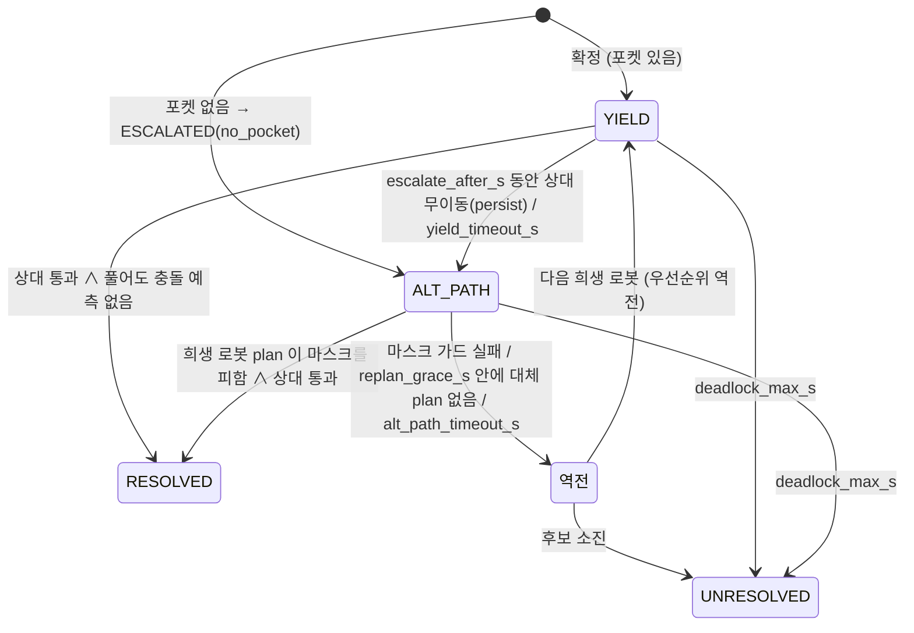

# 교통 관리 · 교착(Deadlock) 탐지와 해소

> 명세 4.9 Traffic Management — 경로 충돌 예측 및 해소, 교차로/병목 우선순위, 교착 탐지, 해소 전략 2가지 이상.
> 구현: `src/amr_fleet/amr_fleet/` 의 순수 모듈 6개 + 얇은 노드 1개. 설계 근거는 `docs/architecture/components.md`
> §3.6/§5.6, `sequences.md` §3, 연구 브리프 `fleet-traffic-deadlock` (CTR 제안, 아래 10장에 구현 범위).

## 1. 구성

| 모듈 | 역할 | 시험 |
| --- | --- | --- |
| `traffic_geometry.py` | 경로 호 길이 · 투영 · 재표본, 다각형, 점유 격자 기하 | `test_traffic_geometry.py` |
| `traffic_prediction.py` | plan → 시공간 표본, 쌍별 가장 이른 충돌, HEAD_ON / CROSSING / FOLLOWING 분류 | `test_traffic_prediction.py` |
| `traffic_zones.py` | 교차로 · 1차선 통로 구역(yaml 또는 `/map` 유도), 경로 위 구역 방문, **진입 토큰**(우선순위 · 기아 방지) | `test_traffic_zones.py` |
| `deadlock.py` | wait-for 그래프, Tarjan SCC(반복형), 사이클 확정, 정체(라이브락) 탐지, 유형 분류 | `test_deadlock.py` |
| `traffic_resolution.py` | 대기 포켓 탐색, keepout 마스크, 길 존재 확인, 사건 상태 기계(전략 1 → 2 → 역전 → 실패) | `test_traffic_resolution.py` |
| `traffic_manager.py` | 한 주기 `update(now, 관측)` → 명령 · 이벤트 (위 모듈 조립, `mode=active/observe`) | `test_traffic_manager.py` (MiniSim 포함) |
| `traffic_manager_node.py` | ROS 입출력만 (2 Hz 타이머, latched 발행, 알림) | `test_traffic_node.py` |

설정: `config/traffic.yaml` (파라미터 전부, 기본값 = 코드 기본값 — 시험이 확인), `config/traffic_zones.yaml`
(창고 구역 13개 · 포켓 37개). 런치: `fleet_manager.launch.py traffic_manager:=true`(기본) · `traffic_mode:=observe`.

### 1.1 노드 인터페이스 (`/fleet/traffic_manager_node`)

| 방향 | 토픽 | 타입 | 비고 |
| --- | --- | --- | --- |
| Sub | `/map` | `nav_msgs/OccupancyGrid` | latched. 포켓 탐색 격자 · keepout 격자 (`zones.source: map` 이면 구역 자동 유도) |
| Sub | `/amr_XX/plan` · `/amr_XX/odometry/filtered_map` · `/amr_XX/robot_state` | `Path` · `Odometry` · `RobotState` | 관측 시각 = 수신 시각(노드 시계), `obs_timeout_s` 넘으면 제외 |
| Sub | `/fleet/task_events` | `amr_msgs/Task` | `current_task_id` → 우선순위 · 마감 |
| Pub | `/amr_XX/traffic/hold` | `std_msgs/Bool` | latched (시작 시 false 발행) |
| Pub | `/amr_XX/traffic/yield_pose` | `PoseStamped` | 전략 1 포켓 (hold=true 보다 먼저 발행) |
| Pub | `/amr_XX/keepout_mask` | `OccupancyGrid` | latched. 지도 전체 크기 0.05 m, lethal 100 / 0 (해소 후 0 으로 다시 발행) |
| Pub | `/amr_XX/costmap_filter_info` | `nav2_msgs/CostmapFilterInfo` | latched. `type=0`, `filter_mask_topic=/amr_XX/keepout_mask` (**절대 이름** — 상대 이름은 costmap 노드 네임스페이스에서 `/amr_XX/global_costmap/keepout_mask` 로 풀린다), base 0, multiplier 1 |
| Pub | `/fleet/traffic_events` | `DiagnosticArray` | `traffic/DEADLOCK`(ERROR) · `RESOLVED`(OK) · `ESCALATED`(WARN) · `UNRESOLVED`(ERROR) · `STALL`(WARN). values: `robots, type, victim, strategy, pocket, attempts, zones, edges(사이클 간선 · 이유), resolve_time_s, reason`. `fleet_manager_node` 는 `traffic/DEADLOCK` 만 `deadlock_count` 에 센다 |
| Pub | `/fleet/alerts` | `DiagnosticArray` | `fleet/DEADLOCK`: 탐지 ERROR · 해소 OK · 해소 실패 ERROR (`hardware_id` = 희생 로봇, `task_id` = 그 작업) |

## 2. 교착 유형

Coffman 4조건(상호 배제 · 점유 대기 · 비선점 · 순환 대기) 중 창고 AMR 에서 깨기 쉬운 것은 **순환 대기**다.
구역 토큰이 예방하고(3장), 남는 것을 탐지해 푼다(4 · 5장).

| 유형 | 모습 | 탐지 | 예방 |
| --- | --- | --- | --- |
| `HEAD_ON` (T1) | 1차선 통로 정면 대치 (2대, 진행 방향 차 ≥ 135°) | wait-for 2-사이클 | 통로 토큰 (반대 방향 진입 금지) |
| `CIRCULAR` (T2) | 교차로 등 3대 이상 순환 대기 | wait-for k-사이클 | 교차로 토큰 · 묶음 원자 부여 |
| `MUTUAL` | 그 밖의 2대 상호 대기 (교차 양보가 서로 막음, 토큰 ↔ 몸체) | wait-for 2-사이클 | 교차 양보 래치 |
| `BLOCKED` (T3) | 유휴(주차) 로봇이 경로를 막음 — 사이클 없음 | block 간선의 끝이 유휴 로봇 + `idle_block_s` | 포켓 규칙 |
| `LIVELOCK` (T5) | 움직이지만 진전 없음 (서로 비키다 제자리, 목적지 경합) | 정체 탐지 묶음 | — |

## 3. 충돌 예측 · 교차로/병목 우선순위 (예방)

### 3.1 시공간 충돌 예측

로봇 i 의 남은 plan 을 현재 자세에 투영하고 공칭 속도 v(1 m/s)로 따라간다고 보아 표본
$(t_k, p_i(t_k), \psi_i(t_k))$, $t_k = k\,\Delta t$, $k\Delta t \le H$ 를 만든다 ($\Delta t$ 0.25 s, $H$ 10 s).
두 로봇의 표본 쌍 중

$$|t_a - t_b| \le \tau_w \quad\wedge\quad \|p_a(t_a) - p_b(t_b)\| < d_s = 2r + m$$

인 쌍이 있으면 충돌로 예측하고 $\max(t_a, t_b)$ 가 가장 작은 쌍을 대표로 쓴다 ($\tau_w$ 2 s 는 같은 자리를
번갈아 지나가는 경우까지 잡는다, $r$ 0.36 m 외접 반경, $m$ 0.3 m → $d_s$ 1.02 m). 유형은 대표 쌍의 진행 방향 차
$|\Delta\psi|$ 로 가른다: ≥ 135° HEAD_ON, ≤ 45° FOLLOWING, 그 사이 CROSSING. 쌍당 $O(K^2)$ ($K$ = 41), 5대 10쌍.
hold 로 서 있는 로봇도 "풀어 주면 갈 경로" 로 예측한다 (풀자마자 다시 거는 진동 방지).

- **CROSSING (구역 밖)**: 우선순위가 낮은 쪽이 충돌 지점에 `crossing_act_s`(4 s) 안에 닿을 것으로 예측되면
  hold. 너무 가까우면(`crossing_min_s` 0.8 s) 세울 수 없으니 상대가 양보. 양보자가 이미 상대 앞길(3 m)에
  있으면 세우지 않는다(세우면 막힌다). 한 번 건 hold 는 예측 충돌이 사라질 때까지 유지(래치), 상한 15 s.
- **HEAD_ON / FOLLOWING**: 넓은 통로에서는 지역 계획기 · `safety_node` 몫이라 직접 세우지 않는다. 1차선
  통로의 정면은 토큰이 막고, 남는 것은 교착 탐지가 잡는다.

### 3.2 구역 진입 토큰

구역 = `traffic_zones.yaml` 의 다각형(창고: 좁은 통로 1 + 교차로 12) 또는 `/map` 유도(1차선 통로 = 벽까지
거리 능선 × 2 < 1.5 m, 교차로 = 네 축 중 3개 이상이 4 m 이상 뚫린 셀). 용량은 1대, 단 통로는
`same_direction` 이면 같은 방향 추종 진입을 허용한다(`d_i · d_j ≥ 0.5`).

- 로봇 경로가 구역 입구 `approach_distance_m`(2.5 m) 안에 오면 요청. 출구 → 다음 입구가 `chain_gap_m`(1.5 m)
  안인 구역들(교차로 → 틈 → 교차로)은 **묶어서 원자적으로** 받는다 — 교차로 안에서 서지 않기.
- 못 받으면 `traffic/hold` (사유 `zone:<구역>`). 들어갔다 몸체가 다 나오거나 경로가 더는 지나지 않으면 반납.
- **부여 순서**: (기아 로봇 먼저, 그 안에서 먼저 기다린 순) → 작업 우선순위 ↓ → 마감 ↑ → 대기 시작 ↑ → id.
- **기아 방지**: 먼저 기다리던 로봇을 **엄격히 나중** 요청이 같은 구역에서 받아 가면 추월 +1. `max_bypass`(2)
  에 이르면 기아 로봇이 되어 그 구역이 예약된다(다른 로봇에 부여 금지). 같은 주기에 함께 요청한 로봇끼리의
  우선순위 순서는 추월이 아니다. 따라서 로봇 i 보다 먼저 받는 로봇 수 ≤ `max_bypass + (n − 1)`,
  대기 상한 ≤ (`max_bypass + n − 1`) × (구역 최대 점유 시간). `test_token_starvation_bound` 가 고우선 로봇이
  끝없이 들어오는 경우에 저우선 로봇이 정확히 3번째 뒤(h0 · h1 · h2 다음)에 받는 것을 확인한다.

## 4. 교착 탐지

### 4.1 wait-for 그래프

노드 = 로봇, 간선 $i \to j$ = "i 가 j 때문에 서 있다". 2 Hz 마다 새로 만든다.

| 간선 | 조건 |
| --- | --- |
| `token` | i 의 토큰 요청이 거절됐고 j 가 그 구역 보유자(또는 기아 예약자) |
| `crossing` | i 가 교차 양보 hold 중이고 상대가 j |
| `block` | i 가 주행해야 하는데 `stationary_time_s`(2 s) 넘게 정지, 정지한($\|v_j\| \le$ 0.05 m/s) j 의 중심이 i 의 남은 경로 앞 `block_lookahead_m`(2 m) 구간에서 횡거리 $< 2r + 0.3$ m, 종거리 $\ge r$ |

hold 된 로봇(양보 중 · 토큰 대기 · 교차 양보)은 block 간선을 내지 않는다 (서 있는 이유가 이미 간선이다).

### 4.2 사이클 → 교착 확정

Tarjan SCC(명시적 스택 반복형 — 재귀 깊이 제한 없음, $O(V+E)$)로 크기 ≥ 2 인 성분을 찾는다. 같은 로봇 집합의
성분이 `confirm_s`(1 s) 이상 이어지면 교착으로 **한 번** 확정한다 (통신 지연 · 재계획 순간의 일시적 사이클 제거).
대표 사이클은 SCC 안에서 방문 표시를 되돌리지 않는 DFS 로 $O(V+E)$ 에 뽑는다(SCC 에서는 start 로 들어오는 간선을
가진 노드를 방문할 때 그 노드가 스택 위에 있으므로 그때의 스택이 단순 사이클). 이미 사건에 묶인 로봇이 들어간
성분 · `cooldown_s` 중인 집합은 다시 열지 않는다. 유형: 3대 이상 CIRCULAR, 2대는 진행 방향 차 ≥ 135° 면
HEAD_ON, 아니면 MUTUAL.

**탐지 지연 상한** ≈ `stationary_time_s` + `confirm_s` + 주기 = 2 + 1 + 0.5 = 3.5 s (+ 관측 지연 ≤ 0.1 s).
`sequences.md` §3 의 `t_stall` 5 s 보다 짧다. 명세의 통신 지연 100 ms · 재계획 0.5 s 보다 충분히 크다.

### 4.3 사이클 없는 막힘 · 라이브락

- **BLOCKED**: 주행 로봇의 block 간선 끝이 유휴 로봇(작업 · 경로 없음, IDLE)이고 `idle_block_s`(5 s) 넘게 서 있으면
  {대기 로봇, 유휴 로봇들} 로 사건을 연다.
- **정체(StallDetector)**: 로봇마다 목표 경로 남은 길이 $L_i(t)$ 를 본다. 마지막 진전 기준 $L^*$ 보다
  `stall_progress_m`(0.5 m) 넘게 줄면 진전(기준 갱신). `stall_time_s`(15 s) 동안 진전이 없으면 정체.
  남은 길이가 최솟값보다 2 m 넘게 늘면(큰 우회 재계획) · 목표가 바뀌면 기준을 새로 잡는다. hold 중인 로봇은
  감시하지 않는다. 서로 `livelock_radius_m`(3 m) 안에 모인 정체 로봇 ≥ 2 → **LIVELOCK** 사건, 혼자면
  `traffic/STALL` 경고(진전할 때까지 한 번).
- **observe 모드 보고 이력**: 교통 관리 없는 기준선 측정에서는 해소가 없어 같은 대치가 사이클 ↔ 정체로 모습을
  바꾸며 깜박인다. 사이클은 같은(부분/상위) 로봇 집합이 `clear_s`(3 s) 동안 안 보이고 **모두 진전**해야 풀림으로
  보고, 막힘은 로봇마다 에피소드(마지막 진전 시각이 바뀔 때까지)에 한 번만 센다. 이 이력이 없던 초기 판(시뮬레이터
  도착 판정 수정 전)에서는 기준선 시드 1 의 한 대치가 45번의 탐지/해소로 깜박였다 → 지금은 대치마다 1번이고,
  대치가 모양을 바꿔도(사이클 → 정체) 새 로봇이 끼지 않으면 다시 세지 않는다.

## 5. 해소 전략

사건(Incident) = 확정된 교착 1건. 희생 로봇 순서 = 중요도의 역순: 작업 우선순위 낮은 순 → 마감 늦은 순(없음 = 가장
늦음) → id (결정적). 작업 없는 로봇(우선순위 −1)이 가장 먼저 비킨다.

### 5.1 전략 1 — 우선순위 기반 양보 (YIELD)

희생 로봇 y 에 `traffic/yield_pose`(포켓) + `traffic/hold=true`. BT 의 `IsTrafficHold` → Yield 서브트리가
포켓으로 가서 기다린다(sequences.md §3). 나머지는 그대로 진행한다.

- **포켓 선택**: `traffic_zones.yaml` 의 포켓 중 y 에서 **다른 로봇 몸체(반경 2r)를 지나지 않고** 갈 수 있는
  가장 가까운 곳 (0.25 m 격자 8-연결 Dijkstra, 경로 비용 ≤ `pocket_search_radius_m`). 포켓은 제자리 회전
  가능(벽까지 ≥ r), 다른 주행 로봇의 남은 경로(12 m)에서 `pocket_clearance_m`(1 m) 이상, 다른 로봇 · 다른 사건이
  예약한 포켓에서 2r + 0.2 m 이상. 지정 포켓이 모두 안 되면(`auto_pockets`) 구역 밖에서 같은 조건의 가장 가까운
  셀을 쓴다. 통과 격자는 "셀 안 한 점이라도 벽까지 ≥ 0.22 m" 로 만들어 폭 0.6 m 좁은 통로를 지나는 길을 보존한다.
- **해소 판정**: (1) 희생 로봇이 아닌 주행 로봇이 모두 분쟁 영역(탐지 때 위치 반경 1.2 m + 걸쳐 있던 구역)을
  벗어났고 남은 경로 6 m 안에 다시 들어오지 않으며, (2) 희생 로봇을 지금 원래 경로로 풀어도 10 s 안에 그들과
  정면 · 교차 충돌이 예측되지 않을 때 → hold · yield_pose 를 거두고 `traffic/RESOLVED`(strategy, resolve_time_s,
  pocket). (2) 가 없으면 1차선 통로에서 아직 물러나는 중인 희생 로봇을 풀어 다시 마주친다.

### 5.2 전략 2 — 대체 경로 (ALT_PATH, Nav2 KeepoutFilter)

희생 로봇 전용 `keepout_mask` 에 lethal(100)을 칠하고 `costmap_filter_info`(type 0)와 함께 latched 로 낸다.
Nav2 `KeepoutFilter` 가 그 로봇의 costmap 에만 반영하므로 플래너 코드는 손대지 않는다.

- 칠하는 곳: 목표 경로(양보 중이면 포켓 경로가 아닌 원래 경로)의 자기 몸 앞 $r + m$ 부터 분쟁 구간 끝까지
  반폭 0.6 m 띠 + 상대 몸체 원(r + 0.2 m). 분쟁 구간 끝 = max(경로 근처 상대의 투영점, 분쟁 구역 첫 방문 출구)
  + `keepout_extend_m`(1.5 m), 단 목표 앞 (반폭 + r + 0.2 m) 에서 자른다.
- **마스크 가드**: 자기 몸 주변은 비운다(시작 셀 lethal → 플래너 실패). 상대가 목표 자리에 있거나(목표 경합)
  목표가 분쟁 구간 안이면 마스크를 만들지 않는다. 마스크를 칠한 정적 지도에서 목표로 이어지는 통과 영역이
  없으면(0.25 m 격자 8-연결 성분) 플래너 실패를 기다리지 않고 곧바로 희생 로봇을 바꾼다.
- 희생 로봇의 새 plan(마스크 해상도로 다시 뽑아 검사)이 마스크를 피하면 대체 경로를 찾은 것. 해소 판정은
  5.1 과 같다(상대가 모두 주차면 희생 로봇이 분쟁 영역을 벗어나면). 해소 시 빈 마스크를 다시 발행한다.

### 5.3 에스컬레이션과 우선순위 역전

전략 1 → 2: 포켓 없음(곧바로), `escalate_after_s`(10 s) 동안 상대가 0.5 m 도 못 움직임(희생 로봇이 비키지
못함 — 사이클 지속), `yield_timeout_s`(30 s, sequences.md `t_yield`). 전략 2 실패(가드 · 5 s 안에 대체 plan
없음 · 45 s) → 다음 희생 로봇으로 **우선순위 역전** 후 전략 1 부터. 후보 소진 · `deadlock_max_s`(120 s) ·
무진전 시도 초과 → `traffic/UNRESOLVED` + `fleet/DEADLOCK`(ERROR) — 운영자/작업 재할당 몫, 같은 로봇 집합은
`cooldown_s`(30 s) 뒤 새로 시도.

## 6. Liveness 논증

주장하는 것과 하지 않는 것을 나눈다.

1. **사건은 유한 시간에 끝난다.** 매 주기 `now − detected_at > deadlock_max_s` 이면 UNRESOLVED 로 닫는다.
   희생 로봇 교체는 사건 안에서 단조 증가(`victim_index`)이고 후보는 |C| 명뿐이다.
2. **무진전 반복은 횟수가 유한하고, 그다음은 빈도가 제한된다.** 로봇마다 "진전 없이 사건에 걸린 횟수" $m_i$ 를
   센다(사건을 열 때 +1, 목표 경로가 `progress_reset_m`(2 m) 넘게 줄거나 목표가 바뀌면 0). $m_i$ >
   `max_attempts_per_robot`(3) 인 로봇이 들어간 사건은 열자마자 UNRESOLVED(알림). 진전 없이 이어지는 사건마다
   $\sum_i m_i$ 가 |C| ≥ 2 이상 늘고 모든 $m_i \le 3$ 인 상태는 $\sum_i m_i \le 3n$ 이므로, 어느 로봇도 진전하지
   않으면 사건 $\lfloor 3n/2 \rfloor + 1$ 개 안에 UNRESOLVED 가 난다 (브리프 §5.4 의 $m_i$ 논증과 같은 구조).
   UNRESOLVED 뒤 그 집합은 `cooldown_s`(30 s) 동안 다시 열지 않는다 — 영구 봉쇄에서도 무한히 빠른 진동은 없고,
   알림을 낸 뒤 30 s 간격으로 다시 시도한다 (브리프의 R3 작업 재큐잉은 미구현, 10장).
3. **해소 직후 같은 대치로 되돌아가지 않는다.** 해소는 "상대 통과 ∧ 풀어도 10 s 안에 정면·교차 충돌 예측 없음" 일
   때만이다. 희생 로봇 선택은 결정적(우선순위 → 마감 → id)이라 두 로봇이 번갈아 양보하는 진동이 없다.
4. **구역 대기는 기아가 없다** (3.2): 대기 로봇 앞에 서는 로봇 수 ≤ `max_bypass + n − 1`.
5. **보장하지 않는 것**: 전략이 모두 실패하는 기하(포켓도 우회로도 없는 막다른 통로에 3대 이상), 희생 로봇이
   명령을 수행하지 못하는 경우(고장 · E-stop)는 UNRESOLVED 로 알리고 끝낸다 — 자동 해소를 주장하지 않는다.
   토큰 · 예측은 "대부분 예방" 이지 CTR 의 정리 1–2 같은 무교착 보장이 아니다(10장).

## 7. 파라미터 (`config/traffic.yaml`)

| 파라미터 | 값 | 근거 |
| --- | --- | --- |
| `update_rate_hz` | 2.0 | components.md §3.6 (robot_state 2 Hz 와 같다) |
| `robot_radius` / `passage_radius` | 0.36 / 0.22 m | 풋프린트 0.6 × 0.4 m 외접 반경 / 반폭 0.2 + 0.02 (0.6 m 좁은 통로 보존) |
| `prediction.safety_margin_m` · `time_window_s` · `horizon_s` | 0.3 m · 2 s · 10 s | $d_s$ 1.02 m (safety_node 0.30 m 와 같은 여유), 1 m/s × 10 s = 10 m 앞 |
| `prediction.crossing_act_s` / `crossing_min_s` | 4 / 0.8 s | 1 m/s 에서 4 m 앞에서 세움 · 0.8 m 안이면 못 세움 (감속 1 m/s² 여유) |
| `zones.approach_distance_m` / `chain_gap_m` | 2.5 / 1.5 m | 요청 → hold 가 닿기까지 주기 0.5 s + 제동 거리 < 2.5 m. 창고 열 틈 1 m 는 묶음 |
| `zones.max_bypass` | 2 | 기아 대기 상한 = (2 + n − 1) × 점유 시간 |
| `deadlock.stationary_time_s` / `confirm_s` | 2 / 1 s | 통신 지연 0.1 s · 재계획 0.5 s ≪ 2 s. 탐지 지연 ≤ 3.5 s |
| `deadlock.stall_time_s` / `idle_block_s` | 15 / 5 s | 정체는 느린 신호(재계획 여러 번 기다림), 주차 로봇 막힘은 빨리 |
| `resolution.escalate_after_s` / `yield_timeout_s` | 10 / 30 s | 포켓까지 ~10 m 주행 여유 / sequences.md `t_yield` |
| `resolution.replan_grace_s` / `alt_path_timeout_s` | 5 / 45 s | Nav2 재계획 + 전달 여유 / 우회 주행 상한 |
| `resolution.deadlock_max_s` | 120 s | sequences.md `t_deadlock_max` |
| `resolution.max_attempts_per_robot` / `cooldown_s` | 3 / 30 s | 6장 2 |
| `resolution.keepout_*` | 반폭 0.6, 연장 1.5, 여유 0.2, 해상도 0.05 m | 1차선 통로 폭 전체를 덮고 costmap 해상도와 맞춘다 |

## 8. 측정 결과

측정일 2026-09-22, 이미지 `amr-fleet-system:wf-final` (Python 3.10, numpy 1.26), 일회용 컨테이너. 시각 수치
옆의 부하는 호스트 `uptime` load average(1분, 32코어 호스트)다 — 다른 사용자 작업이 끝난 뒤라 낮다.

### 8.1 단위 · 노드 시험

`WERROR=1 ./scripts/build.sh` (build/install 지운 뒤 전체 10 패키지) 5.7 s, 컴파일러 경고 0.
`./scripts/test.sh --packages-select amr_fleet`: pytest **339 통과 / 0 실패** (새 교통 시험 120 + 기존 219),
flake8 · pep257 · xmllint · lint_cmake 포함 CTest 386 건 0 실패, 44.7 s (load 6–8).

| 모듈 | 문장 | 커버리지 (문장+분기) |
| --- | --- | --- |
| `deadlock.py` | 177 | 100 % |
| `traffic_geometry.py` | 128 | 100 % |
| `traffic_prediction.py` | 84 | 100 % |
| `traffic_zones.py` | 366 | 99 % |
| `traffic_resolution.py` | 549 | 97 % |
| `traffic_manager.py` | 589 | 96 % |
| `traffic_manager_node.py` (ROS) | 286 | 91 % |

시험 내용: SCC 를 무작위 그래프 40개에서 도달성 정의와 대조 · 5001 노드 사슬(재귀 없음), 토큰 우선순위 · 마감 ·
묶음 원자 부여 · 같은 방향 추종 · 기아 상한(`h0 → h1 → h2 → a`), 창고 배치 파일을 gen_warehouse_world.py 상수로
그린 지도와 대조(구역 겹침 0, 포켓 37개 모두 구역 밖 · 장애물에서 ≥ 0.36 m, 좁은 통로 중앙선 통과 가능, `/map`
유도도 같은 통로를 찾음), 사건 상태 기계 전 경로(양보 → 해소, 풀면 다시 마주치는 경우 보류, 포켓 없음 → 전략 2,
사이클 지속 → 전략 2 → 역전 → 소진, 지도에 우회로 없음 → 즉시 역전, 시간 상한, 시도 상한 · 진전 초기화, 주차 로봇),
MiniSim 끝까지(통로 정면 → 양보 해소, 포켓 없음 → keepout 우회, 통로 토큰 예방, 교차 양보, observe 깜박임 1회 ·
진전 뒤 1회 해소, 주차 막힘, 라이브락 · 단일 정체), 노드 배선(latched hold · 마스크 · filter info 를 늦은 구독자가
받음, task_events 우선순위로 희생 로봇 선택, fleet_manager deadlock_count 1, 전략 2 마스크 발행 · 해제, 잘못된 지도 →
INTERNAL_ERROR 후 계속).

참고: 과제 문서의 "기존 252 시험" 은 이 기준(11969f7)의 수집 결과와 다르다 — 교통 시험 없이 수집하면 219 건이다
(`test_alerts.py` 는 교통 이벤트 이름 검사를 늘렸고 건수는 같다).

### 8.2 운동학 시뮬레이터 (스크래치 `fleetrev/traffic/sim/ksim.py`, 패키지에 넣지 않음)

순수 Python 다중 로봇 시뮬레이터: 원형 로봇 반경 0.3 m, 1 m/s, 0.25 m 격자 A*(8-연결) 전역 경로, 1 s 이상
막히면 주변 로봇을 장애물로 넣어 재계획(우회가 정적 최단보다 6 m 넘게 길면 기다림 — Nav2 obstacle layer 대용),
다른 로봇 중심과 0.7 m 안으로 다가가는 걸음은 딛지 않음(safety_node 대용). 교통 명령은 U(0, 100) ms 지연 뒤
적용: hold → 정지, yield_pose → 포켓으로 이동 · 대기, 해제 → 원래 목표 재계획, keepout → 자기 A* 에만 lethal
(KeepoutFilter 대용). `TrafficManager.update()` 를 0.5 s(2 Hz)마다 부른다. 지도 30 × 20 m: 서 · 동 방을 1차선
통로 N(폭 1.0 m, 반경 0.3 m 로봇 둘이 비껴가지 못함), 2차선 도로 H · S(3 m), 세로 도로 V 가 잇고 구역 3개
(통로 `n_aisle`, 4지 교차로 `x_h`, T자 `x_s`), 포켓 7개.

| 시나리오 | 설정 | 결과 |
| --- | --- | --- |
| (a) 통로 정면 대치 — amr_01(우선 200) 서→동, amr_02(100) 동→서 + 다른 일 3대 | 토큰 끔 (탐지 · 해소 시험) | t=14.0 s `DEADLOCK HEAD_ON` (간선 block+block), 희생 amr_02 → **전략 1** 포켓 양보, t=22.5 s `RESOLVED` (**8.5 s**), 5대 모두 도착, makespan 43.4 s, 최소 중심 거리 0.77 m |
| (a) 기준선 | 교통 관리 없음 (observe 로 탐지만) | 같은 시각 `DEADLOCK HEAD_ON` 1회 보고, amr_01 · 02 는 300 s 까지 영구 대치 (3/5 도착) |
| (a) 전체 기능 | 토큰 켬 | 교착 0 — amr_02 가 통로 입구 앞에서 `zone:n_aisle` hold(1.1 → 17.6 s), makespan **38.4 s** |
| (b) 포켓 없음 | 지정 포켓 0, 자동 포켓 끔 | t=14.0 s `DEADLOCK` + `ESCALATED(no_pocket)` → **전략 2** keepout, `RESOLVED ALT_PATH` **8.0 s**, makespan 42.3 s |
| (b) 사이클 지속 | 희생 로봇이 포켓 명령을 받고도 못 움직임(고장 주입), `escalate_after_s` 6 s | YIELD → t=20.0 s `ESCALATED(persist)` → keepout 우회, `RESOLVED ALT_PATH` **14.0 s**, 5대 도착 |
| (c) 4지 교차로 `x_h` 에 4대 동시 접근 (우선 200/150/100/50) | 토큰 켬 | 교착 0, `x_h` 부여 순서 amr_01 → 02 → 03 → 04 = **우선순위 순** (hold 해제 6.1 · 13.6 · 18.6 s), 최소 거리 0.70 m, makespan 26.6 s (교통 관리 없음 16.1 s — 3 m 도로라 이 시뮬레이터에서는 지역 우회로 비껴감) |

시뮬레이터 벽시계: (a) 2.6 s, (b) 0.3 s, (c) 0.2 s (load 2–5).

### 8.3 (d) 무작위 작업 30세트

로봇 5대가 각자 대기 자리에서 출발해 무작위 스테이션 4곳(9곳 중)을 차례로 들르고(각 2 s 정지) 자기 자리로
돌아온다. 우선순위 U{0..255}. 시드 1–30, 상한 900 s. 세 설정을 짝지어 비교: **전체**(토큰 + 교차 양보 + 해소),
**해소만**(토큰 · 교차 양보 끔, 탐지 · 해소만), **없음**(교통 관리 없음, observe 로 교착만 셈).
90회 벽시계 9 s (8 병렬, load 1.5–2.0; 회당 최대 0.6 s, 없음은 900 s 상한까지 도는 회차 4.5 s).

| 설정 | 완료 | makespan 평균 / 중앙 [s] | 교착 탐지 | 해소 | 미해소 | 해소 시간 평균 / 최대 [s] | 탐지 유형 (사이클 간선) |
| --- | --- | --- | --- | --- | --- | --- | --- |
| 전체 | **30/30** | 127.5 / 127.8 | 6 | 6 (전략 1) | **0** | 1.42 / **4.5** | MUTUAL 4 · HEAD_ON 1 · LIVELOCK 1 (block+block 3, block+crossing 2) |
| 해소만 | **30/30** | 121.8 / 123.8 | 3 | 3 (전략 1) | **0** | 1.33 / 2.5 | MUTUAL 2 · LIVELOCK 1 |
| 없음 | 27/30 | 123.2 / 125.7 (완료 27회) | 4 | — | 3회 영구 교착 | — | MUTUAL 2 · LIVELOCK 2 |

- 교착은 탐지되면 모두 해소됐다 (전체 · 해소만 합계 9/9, 에스컬레이션 0). 교통 관리 없음은 30회 중 3회(시드 6,
  17, 24)가 900 s 까지 풀리지 않았고, 같은 시드는 두 설정 모두 완료.
- makespan: 없음이 완료한 27쌍에서 전체 129.6 s vs 없음 123.2 s (전체가 **+5.2 %**), 30쌍에서 해소만 121.8 s vs
  전체 127.5 s (해소만이 **−4.5 %**). 이 지도에서는 예방층(토큰 · 교차 양보)이 교착 수를 줄이지 못하고(6 vs 3)
  기다림만 늘렸다 — 9장 한계 1 · 2.
- 최소 중심 거리는 모든 설정에서 0.70 m (시뮬레이터 안전 정지 거리) — 충돌 없음.

### 8.4 (e) 노드 실배선 — 가짜 로봇 5대 (스크래치 `fleetrev/traffic/live/`)

`ros2 launch amr_fleet fleet_manager.launch.py use_sim_time:=false launch_adapters:=false` (traffic_manager 기본
true → `fleet_manager_node` + `traffic_manager_node`, `config/traffic.yaml` · 창고 `traffic_zones.yaml`).
가짜 로봇 노드가 창고 지도(gen_warehouse_world.py 상수로 그린 0.05 m 1200 × 800)를 `/map` latched 로 내고,
로봇마다 `odometry/filtered_map` 10 Hz · `plan` · `robot_state` 2 Hz, `/fleet/task_events` 로 우선순위를 준다.
명령(hold · yield_pose · keepout)을 받아 1 m/s 로 움직인다. amr_01(200) · amr_02(100) 은 좁은 통로 **안에서**
마주 보고 시작(토큰으로 막을 수 없는 대치), amr_03 · 04 는 교차로 `x_ab_4` 에 동시 접근, amr_05 주차.

| 항목 | 결과 |
| --- | --- |
| `/map` 반영 | 1200 × 800 → 포켓 격자 · 마스크 격자 33 ms, 구역 13 · 포켓 37 로드 |
| 정면 대치 | 시작 4.9–5.3 s 뒤 (3회 실행) `traffic/DEADLOCK HEAD_ON` (edges `amr_01→amr_02:block, amr_02→amr_01:block`), 희생 amr_02 → `yield_pose` p_narrow_n_w (−2.3, −7.4) + hold=true, 3.0 s 뒤 `traffic/RESOLVED YIELD` + hold=false |
| 교차로 토큰 | amr_04 hold=true `zone:x_ab_4+x_bc_4` (묶음 부여) → amr_03 통과 후 해제 |
| 전략 2 배선 | `test_traffic_node.py` (한 프로세스, 가짜 로봇 2대, 포켓 없는 배치): `ESCALATED(no_pocket)` → 희생 로봇 전용 `keepout_mask`(0.05 m 400 × 200, 상대 몸 lethal · 자기 자리 0) latched, hold 는 걸지 않음 → 우회 후 `RESOLVED ALT_PATH` → 빈 마스크 재발행 |
| 카운트 | `/fleet/status.deadlock_count` = **1** (RESOLVED 는 세지 않음), `/fleet/alerts` `fleet/DEADLOCK` ERROR → OK, `task_id` = 희생 로봇 작업 |
| latched | 끝에 새로 만든 transient_local 구독자가 5대 모두의 `traffic/hold` · `keepout_mask`(1200 × 800, 빈 마스크) · `costmap_filter_info`(type 0, `/amr_0X/keepout_mask`) **15/15** 수신 |
| 정상 상태 124 s (경로를 거꾸로 되풀이, 4대 주행: 8–12 왕복) | 교착 1(처음 대치)뿐, 구역 hold 27회 + 양보 hold 1회, 최소 거리 0.70 m. **traffic_manager_node CPU 평균 2.1 %, p95 3 %, 최대 5 % (코어 1개 기준)**, `/proc` 1 s 표본 123개, load 1.9–5.3 |

## 9. 알려진 한계

1. **예방층이 만드는 교착 · 대기 위치**: hold(구역 대기 · 교차 양보)는 명령을 받은 그 자리에서 선다. 그 자리가
   상대의 경로 위면 서로 막는다 — 무작위 시험(8.3) 전체 설정의 교착 6건은 사이클 간선이 block+block 3 · block+crossing
   2(교차 양보로 세운 로봇의 몸이 상대를 막음) · 정체 1 이었다. 모두 전략 1 로 0.5–4.5 s 안에 풀렸지만, 근본적으로는
   CTR 의 hold 정점 배치(구역 경계 앞 0.7 m, 서로 비켜 설 수 있는 자리)가 필요하다.
2. **교차로 토큰은 보수적**: 용량 1 이라 넓은 교차로에서 나란히 지날 수 있는 로봇도 줄 세운다. 시뮬레이터에서
   토큰 ON 은 토큰 OFF(해소만)보다 makespan 이 길었다(8.3). 창고 `x_*` 교차로 12개는 운영 데이터로 줄이거나
   `zones.tokens: false` 로 끄고 예측 · 해소만 쓸 수 있다 (좁은 통로 `narrow_aisle` 은 남기는 것을 권한다).
3. **유휴 로봇의 양보**: BLOCKED 에서 희생 1순위는 작업 없는 로봇이다. `task_executor_node` 가 작업이 없을 때도
   `traffic/hold` + `yield_pose` 를 처리해야 한다(amr_behavior 쪽 확인 필요). 처리하지 않으면 `escalate_after_s`
   뒤 대기 로봇의 전략 2(우회)로 넘어간다 (`test_parked_blocker_yields_first_then_mover_detours`).
4. **중앙 판정의 입력 지연**: `robot_state` 는 fleet_adapter 송신 큐로 0–100 ms 늦고, `plan` 은 재계획 순간 옛
   경로일 수 있다. `stationary_time_s` 2 s · `confirm_s` 1 s 가 이를 흡수하지만 탐지 지연이 그만큼 늘어난다.
5. **Nav2 실연동 미검증**: keepout 마스크 · `costmap_filter_info` 발행 형식은 확인했지만, 실제 `planner_server`
   (KeepoutFilter 플러그인 설정)과 BT 의 Yield 서브트리 연동은 이 작업에서 돌리지 않았다 — 시험은 운동학
   시뮬레이터와 가짜 로봇이다.
6. **구역 토큰은 요청 시점 plan 기준**: 요청 뒤 plan 이 다른 구역으로 크게 바뀌면 다음 주기에 새 요청이 된다
   (대기 시각은 겹치는 구역이 남을 때만 이어 간다).

## 10. 연구 브리프 CTR 제안 대비 구현 범위

브리프(`fleet-traffic-deadlock` 3판)의 기준 알고리즘 + CTR(Corridor-Token Reservation) 제안 중 이번 구현이 한 것과
하지 않은 것. CTR 전체는 Nav2 쪽 BT 노드 · 메시지 추가가 필요해 이 패키지 범위를 넘는다.

| 브리프 항목 | 상태 | 이번 구현 |
| --- | --- | --- |
| 충돌 예측 (§3.3 예약 기하 + 연속시간 예약표 + SIPP) | 일부 | plan 을 공칭 속도로 따라가는 시공간 표본 + 시간창 · 안전거리 술어(3.1). 예약표 · SIPP 재계획은 없음 |
| 교차로 · 병목 자원 (cap = 1, 교차로 + 출구 원자 부여) | 구현 | 구역 토큰, `chain_gap_m` 안 구역 묶음 원자 부여, 통로 같은 방향 추종 |
| 우선순위 $\Pi$ (마감 긴급도 + 작업 우선순위 + aging) | 변형 | 사전식 (작업 우선순위 → 마감 → 대기 시작) + 추월 카운터 기아 방지(대기 상한 증명 3.2). 가중합 $\Pi$ · 적재 항은 없음 |
| 코리도 그래프 $G_c$ · 3 m 블록 · hold 정점 배치 | 미구현 | 구역 다각형만. 대기 위치는 "거절된 순간의 자리" (9장 한계 1) |
| 이벤트 DAG $P$ · 정리 1–3 (무교착 보장) · 순서 스위치 | 미구현 | 예방은 휴리스틱(토큰 · 교차 양보), 남는 교착은 탐지 · 해소 — 보장이 아니라 안전망이 주 경로 |
| `traffic/grant` · `PassageEvent`(ENTER/CLEAR) · seq/FIFO 지연-안전 프로토콜 | 미구현 | 인터페이스는 components.md 의 `traffic/hold` · `yield_pose` · `keepout_mask` 만 (추가 메시지 없음). 진입 · 반납은 중앙에서 자세로 판정 |
| `FollowGrantedPrefix` BT 노드 · `speed_limit` 접근 감속 | 미구현 | amr_behavior 몫 |
| 트래픽 틱 10 Hz | 미채택 | components.md 대로 2 Hz (탐지 지연 ≤ 3.5 s, CPU 측정 8장) |
| 실행 수준 wait-for (토큰 · 기하 간선) + SCC | 구현 | token · crossing · block 간선, Tarjan SCC, confirm, 유형 분류 (4장) |
| 해소 R1 우선순위 양보 · R2 대체 경로(keepout) | 구현 | 5.1 · 5.2, 포켓 탐색 · 마스크 가드 · 해소 판정 |
| 다중 양보 (convoy 쪽 전체 후진, T4) | 미구현 | 희생 로봇 1대씩 — convoy 는 사건이 이어서 열려 한 대씩 빠진다 |
| R3 작업 재큐잉 (Pending 으로 되돌림) | 미구현 | UNRESOLVED 알림까지. fleet 에 작업 취소 API 가 없다 (components.md §5.6) |
| 로봇별 무진전 카운터 $m_i$ · 시도 상한 · cooldown (라이브락 논증) | 구현 | 6장 2 |
| 정체(livelock) 탐지 | 구현 | StallDetector (4.3) |
| 하트비트 COMM_LOSS 알림 | 일부 | `obs_timeout_s` 넘은 로봇은 판단에서 뺀다 (알림은 fleet_manager 의 ROBOT_LOST) |
| networkx `simple_cycles` (components.md §3.6) | 대체 | 의존성 없이 Tarjan SCC + 대표 사이클 DFS, $O(V+E)$ |
