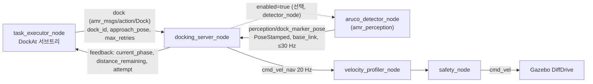

# 마커 기반 정밀 도킹 (`docking_server_node`)

> 명세 4.8 "도킹 시스템": 마커(ArUco 또는 가상 마커) 인식 기반 정밀 접근, **위치 오차 2 cm · 각도 오차 1° 이내**,
> 실패 시 재시도, **최대 3회 실패 시 에러 보고 및 대체 작업**. 9장 평가 질문 "도킹 정밀도가 요구사항을 만족하는가?".
> 코드: `include/amr_behavior/docking/docking_controller.hpp`, `src/docking/*.cpp` (제어기는 ROS 비의존).

## 1. 구성

2단계 도킹: ① BT 의 `MoveTo` 가 Nav2 로 **staging 자세**(마커 면 법선 위 1.5 m, 마커를 바라봄)까지 이동 →
② `docking_server_node` 가 마커 관측만으로 시각 서보(20 Hz)를 돌려 **docked 자세**(마커 면 앞 `standoff`)에 맞춘다.

## 2. 기하

### 2.1 도크 프레임과 오차 정의
마커 관측 = base_link 에서 마커 중심 $\mathbf m=(m_x,m_y)$ 와 마커 면 바깥 법선(로봇 쪽)의 방위 $\theta_n$.
목표 base_link 자세(로봇 현재 프레임):

$$\mathbf t=\mathbf m+s\,(\cos\theta_n,\ \sin\theta_n),\qquad \psi^\*=\theta_n+\pi$$

($s$ = standoff). 도크 프레임 $D$ 는 원점 = 목표 자세, $x_D$ = 로봇이 마커를 향해 진행하는 방향. 로봇(원점, 방위 0)을 $D$ 로 옮기면

$$\begin{bmatrix}x_r\\y_r\end{bmatrix}=R(-\psi^\*)\,(\mathbf 0-\mathbf t),\qquad \psi=-\psi^\*$$

오차: 종방향 $e_x=-x_r$ (남은 거리, +면 덜 감), 횡방향 $e_y=y_r$, 방위 $\psi$. 판정 위치 오차 $\sqrt{e_x^2+e_y^2}$.
(`computeErrors()`, 시험 `ErrorsMatchRobotPoseInDockFrame`: 임의 자세에서 1e-9 일치.)

### 2.2 마커 자세 규약 (`perception/dock_marker_pose`)
frame = `<robot>/base_link` (다르면 tf2 로 변환). 위치 = 마커 중심, 자세의 **z 축 = 마커 면 바깥 법선** (OpenCV ArUco
`solvePnP` 규약). 다른 규약이면 `marker_normal_axis` (`z`, `-z`, `x`, `-x`) 로 바꾼다. 법선의 수평 성분이 0.2 미만이면(마커가
눕거나 잘못된 자세) 관측을 버린다.

### 2.3 standoff 와 staging 설계
| 값 | 근거 |
| --- | --- |
| standoff **0.65 m** | 풋프린트 전면(base_link +0.30 m)–마커 판 0.35 m > `safety_node` 긴급정지 0.30 m. brief 의 0.50 m(판까지 0.20 m)는 safety 예외 영역(dock exclusion)이 필요해 채택하지 않음. 카메라(base_link +0.18 m)–마커 0.47 m 에서 0.18 m 마커 ≈ 129 px (f ≈ 337 px) |
| staging **1.5 m** | 카메라–마커 1.32 m 에서 마커 ≈ 46 px (검출 한계 ≈ 24 px 의 2배). Nav2 도착 오차 ±0.25 m·±15° 에서도 마커 방위 ≤ 26° < 반화각 43.5° |
| final 속도 0.05 m/s | Critical 존(0.5 m, 0.2 m/s 상한) 안. 20 Hz 에서 주기당 2.5 mm → 2 cm 판정 해상도 충분 |

도크 좌표 (`behavior.yaml docks`): 입고 도크 마커 x = −29.79 (법선 +x), 출고 x = +29.79 (법선 −x), 충전소 y = −18.14 (법선 +y).

## 3. 추정: `MarkerTracker`

검출 30 Hz, 제어 20 Hz, 가끔 누락. 관측 사이에는 **직전 속도 지령으로 마커 자세를 예측**한다(로봇 운동의 역변환):

$$\Delta\theta=\omega\Delta t,\quad \Delta\mathbf p=v\Delta t\,(\cos\tfrac{\Delta\theta}2,\sin\tfrac{\Delta\theta}2),\quad
\mathbf m'=R(-\Delta\theta)(\mathbf m-\Delta\mathbf p),\quad \theta_n'=\theta_n-\Delta\theta$$

관측이 오면 저역통과 $\hat{\mathbf z}\leftarrow\hat{\mathbf z}+\alpha(\mathbf z-\hat{\mathbf z})$ (`filter_coef` = α, 각도는 짧은 쪽으로).
α = 1 이면 관측으로 바로 교체. `marker_timeout`(2 s) 동안 관측이 없으면 그 시도는 실패. 이 predict/correct 인터페이스가
brief §3.4 상대자세 EKF(카메라 PnP 공분산 + LiDAR 직선 요각 융합)의 **교체 지점**이다.

## 4. 제어 법칙 (`control_law`)

### 4.1 비례 시각 서보 (`proportional`)
전방 주시점 $L=\max(e_x,\ L_{min})$ 를 향한 방위 $\psi_d=\operatorname{atan2}(-e_y, L)$:

$$\omega=\operatorname{sat}_{\omega_{max}}\!\big(k_h\,(\psi_d-\psi)\big),\qquad v=\operatorname{sat}_{v_{cap}}(k_d\,e_x)\cdot\max(0,\cos(\psi_d-\psi))$$

선형화( $\dot y=v\psi,\ \dot e_x=-v,\ \psi\to\psi_d\approx -y/L$ )하면 $dy/de_x=y/L$.
$L=e_x$ (목표점을 직접 겨눔)이면 $y\propto e_x$ — 횡오차가 **남은 거리에 비례해 줄어 목표점에서 정확히 0** 이 된다.
대신 도착 방위가 처음 방위각만큼 남으므로, 목표점에 도달하면(§5 final) 제자리 회전으로 방위만 맞춘다
— 차동구동 회전 중심이 base_link 바로 아래이므로 제자리 회전은 위치 오차를 바꾸지 않는다. $L_{min}$(0.05 m)은
$e_x\to0$ 특이점 회피용이다. 처음 구현은 $L_{min}=0.3$ m(접근선 추종형)였는데, 마지막 0.3 m 에서 횡오차가
$e^{-1}$ 로만 줄어 staging 오프셋 ±0.15 m 에서 최종 횡오차 2.1–2.6 cm 가 남았다(단위 시험 실패) → 0.05 m 로 바꿨다.

### 4.2 Park–Kuipers 부드러운 제어 (`graceful`, 기본)
brief §3.5 (Nav2 graceful controller 와 같은 식). 목표를 로봇 중심 극좌표 $(r,\phi,\delta)$ 로 두고
( $r=\sqrt{e_x^2+e_y^2}$, $\phi=-\mathrm{los}$, $\delta=\psi-\mathrm{los}$, $\mathrm{los}=\operatorname{atan2}(-e_y,e_x)$ ):

$$\kappa=-\frac1r\Big[k_\delta\big(\delta-\arctan(-k_\phi\phi)\big)+\Big(1+\frac{k_\phi}{1+(k_\phi\phi)^2}\Big)\sin\delta\Big]$$
$$v=\operatorname{clamp}\Big(\min\big(\tfrac{v_{cap}}{1+\beta|\kappa|^\lambda},\ v_{cap}\tfrac{r}{r_{slow}}\big),\ v_{min},\ v_{cap}\Big),\quad
\omega=\operatorname{sat}_{\omega_{max}}(\kappa v),\quad v\leftarrow\omega/\kappa$$

곡률로 속도를 줄이고 $\omega$ 포화 시에도 곡률을 지키므로(마지막 식) 횡오차와 방위를 **동시에** 0 으로 모은다.
$k_\phi=2,\ k_\delta=1,\ \beta=0.4,\ \lambda=2,\ r_{slow}=0.25$ m.

### 4.3 두 법칙 비교
운동학 폐루프 시험(§7.2, 조건마다 15회, 같은 시드·시작 자세, 튜닝 후 코드)의 진값 오차:

| 법칙 | `filter_coef` | 성공 (명세 안) | 위치 평균 / 최대 | 각도 평균 / 최대 | 시도 | 평균 소요 |
| --- | --- | --- | --- | --- | --- | --- |
| graceful | 1.0 | 15/15 (15) | 10.1 / 12.1 mm | 0.28 / 0.47° | 전부 1회 | 19.8 s |
| graceful | 0.3 | 15/15 (15) | 10.2 / 12.9 mm | 0.40 / 0.86° | 전부 1회 | 19.6 s |
| proportional | 1.0 | 15/15 (15) | 9.5 / 11.6 mm | 0.35 / 0.70° | 전부 1회 | 20.5 s |
| proportional | 0.3 | 15/15 (15) | 10.0 / 11.9 mm | 0.40 / 0.69° | 전부 1회 | 19.9 s |

두 법칙 모두 명세를 여유 있게 만족하고 정밀도 차이는 시행 간 산포 수준이다(위치 최대 0.5 mm 차). 기본값은 **graceful** 로
두었다: 곡률로 속도를 줄여 횡·방위 오차를 **이동 중에 함께** 줄이고(비례 법칙은 도달 후 제자리 회전으로 방위를 따로
맞춘다), 각도 최대 오차가 가장 작다(0.47°). 소요 시간(검색 포함 약 20 s)은 법칙보다 final 속도 상한(0.05 m/s)이 정한다.

## 5. 단계와 판정

| 단계 (`current_phase`) | 조건 | 지령 |
| --- | --- | --- |
| `search` | 시도 시작, 관측 없음 | 제자리 ±`search_sweep`(0.5 rad) 삼각파 회전 (0.25 rad/s), `search_timeout` 8 s |
| `align` | $e_x>$ `final_distance` 이고 진행 방향 오차 > `align_threshold`(20°) | 제자리 정렬, 10° 미만에서 해제 (히스테리시스) |
| `approach` | $e_x>$ 0.15 m | 제어 법칙, $v\le$ 0.15 m/s |
| `final` | $e_x\le$ 0.15 m | 제어 법칙, $v\le$ 0.05 m/s. **도달** $|e_x|\le$ `stop_distance`(8 mm, 해제 8 + 2·4 = 16 mm 히스테리시스) 뒤에는 전진을 멈추고 제자리 방위 정렬만 ($e_x<0$ 이면 저속 후진) |
| 판정 | **도달한 뒤** 위치 ≤ 0.02 m **그리고** 방위 ≤ 1° 가 **신선한 관측으로 10 주기(0.5 s) 연속** | 정지 → success |
| `backup` | 시도 실패, 남은 시도 있음 | $-$0.1 m/s 로 0.3 m 후진 → 다음 시도 `search` |

시도 실패 사유: `marker_lost`(2 s 무관측), `search_timeout`, `attempt_timeout`(45 s), `overshoot`($e_x<-5$ cm),
`lateral`(종방향 도달 후 횡오차가 20 주기 남음 — 그 자리에선 고칠 수 없으므로 후진 후 재접근).
결과: `success`, `final_position_error`, `final_angle_error`(추정 기준, 추정 없으면 −1), `attempts_used`. 취소 시 즉시 정지.

**재시도 계수 (명세 "최대 3회")**: BT `DockAt` 이 goal 당 `max_retries=1` 로 보내고 `RetryUntilSuccessful(3)` 이 센다
(그 사이 `RecoverDocking`: 후진 0.3 m → 마커 안 보이면 staging 재접근). 서버를 직접 부를 때는 `max_retries`(0 → `max_attempts`=3)
만큼 서버가 스스로 후진·재시도한다. 어느 경로든 물리적 접근은 최대 3회이며, 3회 실패 시 BT 가 `task_status=FAILED`
(`dock_failed`) 보고 후 대기 구역으로 복귀한다(대체 작업).

## 6. 파라미터 (`config/behavior.yaml`, `docking_server_node`)

| 파라미터 | 기본 | 의미 · 튜닝 근거 |
| --- | --- | --- |
| `control_law` | graceful | §4.3 비교 결과 |
| `standoff` / `docks.<id>.standoff` | 0.65 m | §2.3 |
| `position_tolerance` / `angle_tolerance` | 0.02 m / 0.01745 rad | 명세값 그대로 |
| `settle_frames` | 10 | 0.5 s 유지 (components.md) |
| `final_distance` | 0.15 m | final 저속 구간 |
| `stop_distance` | 0.008 m | 종방향 도달 판정 — 허용오차 경계(2 cm)가 아니라 목표점 근처까지 들어가 추정 오차 여유를 둔다 (§7.3 튜닝) |
| `max_linear_speed` / `final_linear_speed` | 0.15 / 0.05 m/s | Critical 존 상한 0.2 이하 |
| `max_angular_speed` | 0.4 rad/s | |
| `k_distance` / `k_heading` / `lookahead` | 0.8 / 1.5 / 0.05 m | 비례 법칙 (§4.1) |
| `k_phi` / `k_delta` / `beta` / `lambda` / `slowdown_radius` | 2 / 1 / 0.4 / 2 / 0.25 m | graceful (§4.2) |
| `linear_deadband` / `angular_deadband` | 4 mm / 0.004 rad | 떨림 방지 |
| `marker_timeout` / `search_timeout` / `attempt_timeout` | 2 / 8 / 45 s | components.md marker_timeout 2 s |
| `backup_distance` / `backup_speed` | 0.3 m / 0.1 m/s | 명세 재시도 |
| `filter_coef` | 1.0 (끔) | §7.4: 관측 노이즈 σ 2 mm/0.5° 에서는 저역통과(0.3)가 지연만 더해 각도 최대 오차를 키웠다 |
| `max_attempts` | 3 | goal.max_retries = 0 일 때 |
| `marker_normal_axis` / `base_frame` / `detector_node` | z / base_link / "" | §2.2, 다중 로봇은 런치가 `<ns>/base_link` 주입 |

## 7. 검증과 튜닝

(`amr-fleet-system:wf-final` 일회용 컨테이너. 외부 gsim 작업이 끝난 뒤였으나 다른 컨테이너와 호스트를 나눠 써서 32 스레드
호스트의 1분 load average 가 1.7–27 이었다. 정밀도는 부하와 무관하고, 소요 시간·RTF 는 이 조건의 값이다.)

### 7.1 단위 시험

- `test_docking_controller` (gtest 22건, 매개변수화 포함): 도크 프레임 오차가 임의 자세에서 진값과 1e-9 일치, 추적기 예측이
  운동과 일치·저역통과의 각도 wrap, 비례 법칙 속도 포화·정지 대역, graceful 조향 방향·상한, **수렴 격자**(staging 오프셋
  횡 ±0.15 m × 방위 ±10° × 종 0.85 m, 두 법칙) 전부 2 cm/1° 안·속도 상한 준수, 측정 노이즈(σ 2 mm/0.3°)에서 수렴, **도달 대역**
  (진값 ≤ 1 cm 에서 정지, 허용오차 안이라도 도달 전에는 계속 전진, 12 mm 흔들림은 히스테리시스로 유지·20 mm 로 밀리면 재전진),
  큰 방위 오차 → align 먼저, 3 s 마커 끊김 → `marker_lost` → 후진 → 2회차 성공, 마커 없음 → 탐색은 제자리 회전만·시도 사이
  후진 2번·3회 후 실패, 시도 시간 초과·과진입, 횡 잔차 → `lateral`, 판정 연속 프레임 요구, 취소.
- `test_docking_server` (4건): 마커 자세 → 관측 축 규약(z, −z, x, −x), **ROS 경유 폐루프**(액션 + 토픽 + 프로세스 안 운동학
  모사)로 명세 안 도킹, 마커 없음 → `attempts_used = 3`·`success = false`, 실행 중 취소·동시 goal 거절.

### 7.2 폐루프 시험 설정

- **운동학**: 설치된 `docking_server_node`(behavior.yaml) ↔ 시험 스크립트(`dock_trials.py --mode kinematic`). `cmd_vel_nav` 를
  100 Hz 로 적분(차동 구동), 가상 마커를 30 Hz 로 발행 — base_link 기준 위치 노이즈 σ 2 mm, 법선 방위 σ 0.5°, 누락 5 %,
  카메라 반화각 43.5° 밖 미검출. 시작 = staging(마커 면 1.5 m) + 횡 U(±0.2 m) + 방위 U(±15°). 진값 = 적분 자세 vs 목표 자세.
  조건마다 15회(같은 시드).
- **Gazebo** (`--gpus all`, 헤드리스): `warehouse.sdf` + `amr_description` 로봇(DiffDrive), 입고 도크 `dock_1` 앞. 시도마다
  `set_pose` 로 staging + 횡 U(±0.15 m) + 방위 U(±10°). 마커 관측은 `ground_truth/odom` 에서 만든 가상 마커(노이즈·누락 위와 같음),
  `cmd_vel_nav` 는 `cmd_vel` 로 직결(velocity_profiler·safety 생략), 진값 = `ground_truth/odom`. RTF 0.96–0.99.

### 7.3 튜닝: 정지 규칙 (허용오차 경계 → 도달 대역 `stop_distance`)

처음 구현은 "추정 오차가 2 cm·1° 안에 들어오면 곧바로 정지하고 판정"(final 에서 $|e_x|\le$ 정지대역 + tol/2 = 14 mm 면 제자리
정렬)이었다. 모든 시험이 명세를 만족했지만 진값 위치 오차가 12–13 mm 에 몰렸고 최대 17 mm 로 여유가 3 mm 뿐이었다 — 방위가
먼저 맞으면 2 cm 경계를 넘자마자 멈추기 때문이다. 판정을 "종방향 도달($|e_x|\le$ 8 mm, 해제 16 mm) **뒤에만**" 하도록 바꿨다.

| 조건 (15회, Gazebo 10회) | 변경 전: 위치 평균 / 최대 | 변경 후: 위치 평균 / 최대 | 각도 최대 (전 → 후) |
| --- | --- | --- | --- |
| 운동학 graceful, fc 1.0 | 12.2 / 15.3 mm | 10.1 / 12.1 mm | 0.57° → 0.47° |
| 운동학 graceful, fc 0.3 | 12.7 / 17.3 mm | 10.2 / 12.9 mm | 0.66° → 0.86° |
| 운동학 proportional, fc 1.0 | 12.9 / 16.4 mm | 9.5 / 11.6 mm | 0.56° → 0.70° |
| **Gazebo** graceful, fc 1.0 | 12.6 / 15.3 mm | **10.2 / 11.9 mm** | 0.55° → 0.62° |

최대 위치 오차가 15–17 mm → 12–13 mm 로 줄어 명세 대비 여유가 3 mm → 7–8 mm 가 됐다. 소요 시간 변화는 없다(19–21 s).
남은 약 10 mm 는 도달 대역(8 mm)과 도달 시점의 횡 잔차다. 대역을 더 줄이면 추정 노이즈(σ 2 mm)에 도달·해제가 흔들린다.

### 7.4 관측 필터 (`filter_coef`)와 노이즈 내성

| 관측 노이즈 (위치 σ / 방위 σ) | `filter_coef` | 성공 (명세 안) | 위치 평균 / 최대 | 각도 평균 / 최대 | 시도 1 / 2 / 3회 | 평균 소요 |
| --- | --- | --- | --- | --- | --- | --- |
| 2 mm / 0.5° (기본) | 1.0 | 15/15 (15) | 10.1 / 12.1 mm | 0.28 / 0.47° | 15 / 0 / 0 | 19.8 s |
| 2 mm / 0.5° | 0.3 | 15/15 (15) | 10.2 / 12.9 mm | 0.40 / 0.86° | 15 / 0 / 0 | 19.6 s |
| **5 mm / 1°** (2.5배) | 1.0 | 15/15 (15) | 5.8 / 7.8 mm | 0.15 / 0.39° | 11 / 4 / 0 | 46.9 s |
| 5 mm / 1° | 0.3 | 15/15 (15) | 6.3 / 9.2 mm | 0.18 / 0.55° | 10 / 4 / 1 | 50.8 s |

- 1차 저역통과(`filter_coef` 0.3, opennav_docking 방식)는 두 노이즈 수준 모두에서 이득이 없었다 — 관측 사이는 이미 속도 지령
  예측으로 메우고, 필터 지연이 방위 수렴을 늦춰 각도 최대 오차와 소요 시간이 늘었다. 기본값은 1.0(끔).
- 노이즈를 2.5배로 키워도 **정밀도는 유지**됐다(진값 최대 7.8 mm·0.39°, 판정이 통과할 때까지 기다리므로 오히려 작다). 대신
  "추정 방위 ≤ 1° 가 10 프레임 연속" 판정이 방위 σ 1° 에서는 드물게 성립해 시도 시간이 늘고(평균 47 s) 27–33 % 가 시도 상한
  45 s 에 걸려 2–3회차에 성공했다. 이는 매 프레임 추정을 그대로 판정하는 구조의 한계이며, brief §3.6 CGD(추정 공분산으로
  "지금 판정하면 2 cm/1° 를 만족할 확률"을 계산)의 교체 지점이 `MarkerTracker`/`inTolerance` 다 (§8).

### 7.5 재시도 (Gazebo, 마커 가림)

시도 시작 5–8 s 동안 마커를 가린 3회: 매번 `marker_lost`(2 s) → 0.3 m 후진 → 재탐색 → **2회차에 성공**, 진값 위치 최대
11.2 mm·각도 최대 0.54°, 평균 27.3 s(가림 없는 시도 + 약 7 s). 3회 모두 실패하는 경로는 단위 시험(서버·제어기)과 BT 기능 시험
(behavior_tree.md §9.2 E: `dock_failed` → ERROR → 대기 구역 복귀)으로 확인했다.

### 7.6 한계

- 마커 관측은 가상(진값 + 노이즈)이다. 카메라 → ArUco 검출(`amr_perception` 의 검출 노드) → `perception/dock_marker_pose` 경로의
  실제 노이즈·지연은 이 시험에 없다. 노이즈 수준은 brief §3.2 의 pre-dock 추정(σ 수 mm·1° 미만)을 가정했고, §7.4 의 2.5배
  노이즈 조건으로 여유를 확인했다.
- Gazebo 시험은 `cmd_vel_nav` → `cmd_vel` 직결이다. 전체 체인에서는 `safety_node` 의 Critical 존 상한(0.2 m/s)이 도킹 속도
  상한(0.15/0.05 m/s)보다 커서 지령이 바뀌지 않아야 하지만, 정지 거리(0.30 m)와 standoff 0.65 m(범퍼–마커 판 0.35 m) 관계는
  통합 시험에서 확인해야 한다.

## 8. 확장점 (brief §3.4–3.8)

- **CGD (Covariance-Gated Docking)**: `MarkerTracker` 를 상대자세 EKF 로 바꾸고 PnP 공분산(코너 노이즈 → 변환 사슬)과
  LiDAR 직선 적합 요각을 융합, final 진입 전 결합 확률 게이트로 "지금 들어가면 2 cm/1° 를 만족할 확률"을 검사해 사유별
  재시도(정지 관측 / 제자리 회전 / 재접근)를 고른다. 관측 메시지에 공분산이 필요하다(`amr_msgs/MarkerObservation` 제안).
  교체 지점: `MarkerTracker::predict/correct`(추정), `DockingController::inTolerance`(판정) — §7.4 의 고노이즈 판정 지연을
  "프레임별 임계"에서 "추정 공분산 기반 확률"로 바꿔 줄이는 것이 목표다.
- **실패 사유 코드 전달**: 서버는 시도별 사유(`marker_lost`/`search_timeout`/`attempt_timeout`/`overshoot`/`lateral`)를 로그로
  남긴다. `Dock.action` 결과에 사유 필드가 생기면 BT 의 `RecoverDocking` 이 사유별 복구(재접근 vs 제자리 재관측)를 고를 수 있다.
- **적재 질량 반영**: `payload/mass` 로 감속 상한을 $a\,m_0/(m_0+m_{load})$ 로 줄인다 (현재는 velocity_profiler_node 가 담당).
- **dock exclusion zone**: standoff 를 0.5 m 이하로 줄이려면 `safety_node` 가 도크 판 폴리곤 안에서만 정지거리를 줄이는
  예외가 필요하다 (brief §3.8).
