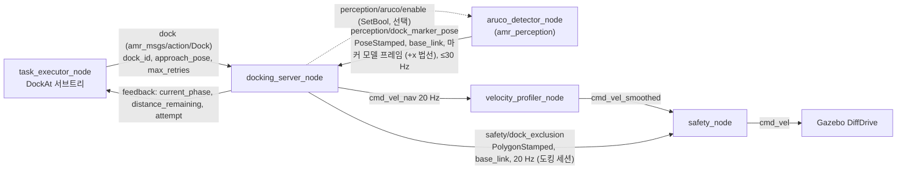

# 마커 기반 정밀 도킹 (`docking_server_node`)

> 명세 4.8 "도킹 시스템": 마커(ArUco 또는 가상 마커) 인식 기반 정밀 접근, **위치 오차 2 cm · 각도 오차 1° 이내**,
> 실패 시 재시도, **최대 3회 실패 시 에러 보고 및 대체 작업**. 9장 평가 질문 "도킹 정밀도가 요구사항을 만족하는가?".
> 코드: `include/amr_behavior/docking/*.hpp`, `src/docking/*.cpp` (제어기는 ROS 비의존). BT 쪽은 [behavior_tree.md](behavior_tree.md).

## 1. 구성

2단계 도킹: ① BT 의 `MoveTo` 가 Nav2 로 **staging 자세**(판 면 법선 위, 판을 바라봄 — 도크 1.69 m, 충전소 1.49 m)까지
이동 → ② `docking_server_node` 가 마커 관측만으로 시각 서보(20 Hz)를 돌려 **docked 자세**(판 면 앞 `standoff`)에 맞춘다.
적재·하역·충전 뒤에는 BT 가 `Undock`(1.0 m 후진)으로 staging 부근까지 물러난 뒤 다음 주행을 시작한다.

## 2. 기하

### 2.1 도크 프레임과 오차 정의
마커 관측 = base_link 에서 마커 중심 $\mathbf m=(m_x,m_y)$ 와 마커 면 바깥 법선(로봇 쪽)의 방위 $\theta_n$.
목표 base_link 자세(로봇 현재 프레임):

$$\mathbf t=\mathbf m+s\,(\cos\theta_n,\ \sin\theta_n),\qquad \psi^\*=\theta_n+\pi$$

($s$ = standoff). 도크 프레임 $D$ 는 원점 = 목표 자세, $x_D$ = 로봇이 마커를 향해 진행하는 방향. 로봇(원점, 방위 0)을 $D$ 로 옮기면

$$\begin{bmatrix}x_r\\y_r\end{bmatrix}=R(-\psi^\*)\,(\mathbf 0-\mathbf t),\qquad \psi=-\psi^\*$$

오차: 종방향 $e_x=-x_r$ (남은 거리, +면 덜 감), 횡방향 $e_y=y_r$, 방위 $\psi$. 판정 위치 오차 $\sqrt{e_x^2+e_y^2}$.
(`computeErrors()`, 시험 `ErrorsMatchRobotPoseInDockFrame`: 임의 자세에서 1e-9 일치.)

### 2.2 마커 자세 규약 (`perception/dock_marker_pose`, 계약 C3)
frame = `<robot>/base_link` (다르면 tf2 로 변환). 위치 = 마커 중심, 자세 = **마커 모델 프레임: +x = 판 바깥 법선(로봇 쪽),
+z = 위** — amr_perception `aruco_detector_node` 의 출력 규약(`aruco.py`: R_cv→model 의 열 = [z_cv, x_cv, y_cv], Gazebo
`dock_marker` 모델과 같음). 판을 정면으로 마주 보면 base_link 기준 yaw = π, 쿼터니언 (0, 0, 1, 0). `marker_normal_axis`
기본값은 `x` 이다(`z`/`-z`/`-x` 도 받는다 — OpenCV `solvePnP` 원시 자세를 내는 다른 검출기용). 고른 축의 수평 성분이
0.2 미만이면(판이 눕거나 축 규약이 틀림) 관측을 버리고 5 s 에 한 번 경고한다.

리뷰 지적: 이전 기본값 `z` 는 이 규약의 z 축(연직)을 법선으로 읽어 **모든 실관측을 버렸다** (search 에 머묾 → 3회 실패).
회귀 시험:
- `MarkerToObservation.DetectorModelFrameConventionIsTheDefault` (gtest): 노드 기본 축이 `x`, 검출기 쿼터니언을 `x` 로 읽으면
  법선 π, `z` 로 읽으면 버린다.
- `test_dock_marker_contract.py` (pytest, 교차 패키지): `amr_perception.aruco.render_marker_image` 로 알려진 자세의 마커를
  렌더링 → `ArucoPoseEstimator.detect` → `aruco_detector_node.to_base`(`sensors.yaml` 카메라 장착) 로 검출기와 같은 경로로
  자세를 만들고(진값과 2 cm·1.5° 안임을 먼저 확인), **빌드된 `docking_server_node` 실행 파일**에 30 Hz 로 넣는다 →
  approach/align 단계로 들어가고 보고 남은 거리가 진값 기하와 3 cm 안, 음성 대조로 `marker_normal_axis:=z` 는 search 에 머문다.

### 2.3 staging·standoff (월드·센서에서 유도)
기하 출처: `warehouse.sdf`(`gen_warehouse_world.py`: `HALF_X` 30, `MARKER_Z` 0.25, `CHARGER_Y` −18.4, `STATION_FRONT` 0.25, 판
두께 0.02) + `config/sensors.yaml`(camera_link base_link 전방 0.29 m·위 0.07 m, hfov 87°, 640 px → f ≈ 337 px) +
`robot_params.yaml`(풋프린트 0.60 × 0.40, base_link 높이 0.18). `test_config_launch.py::
test_dock_table_matches_world_and_camera_geometry` 가 도크 표를 이 값들과 대조한다(레이아웃이 바뀌면 먼저 깨진다).

| 값 | 기하 |
| --- | --- |
| 마커 판 면 | 입고 도크 x = −29.98 (판 중심 −29.99), 출고 x = +29.98, 충전소 y = −18.13 (스테이션 전면 −18.15 + 판). 판 중심 높이 0.25 m = 카메라 광학 중심 높이 |
| staging | 판 법선 위, 판을 바라봄. 도크 base_link–판 **1.69 m** (카메라–판 1.40 m, 0.18 m 마커 ≈ 43 px), 충전소 **1.49 m** (1.20 m, ≈ 51 px). 검출 하한 `min_side_px` 12 px 의 3.6·4.2 배 |
| standoff **0.65 m** | 범퍼(base_link +0.30)–판 0.35 m, 카메라–판 0.36 m (마커 ≈ 169 px, 판 0.30 m ≈ 281 px < 480 px 높이) |
| 도크 박스 | 접근선 양옆 ±1 m, 판에서 1.28 m (x = ∓28.7) — staging 카메라 방위 ±83° 로 시야 밖 → 인식은 `perceive_yaw` 로 돌아본다 ([behavior_tree.md](behavior_tree.md) §4.1) |

standoff 0.65 m 에서 범퍼–판 0.35 m 는 safety 정지 거리 0.30 m 보다 크지만, LiDAR 노이즈 σ 3 cm 에서 한 스캔의 빔 최솟값은
0.30 m 아래로 흔들린다 — 이전 판의 "0.35 > 0.30 이라 안전" 은 노이즈를 빠뜨린 논리였다(리뷰 지적). 그래서 §2.4 의
예외 사각형을 둔다. docked 상태의 실측 LiDAR 최소 풋프린트 거리는 §7.5 표에 있다.

### 2.4 도킹 예외 사각형 `safety/dock_exclusion` (계약 C2)
- **모양**: 마커 프레임(x = 바깥 법선, y = 판 가로)의 사각형 x ∈ [−0.30, +0.12] m, y ∈ [−0.5, +0.5] m. 판 뒤 0.30 m(벽 0.02 m 뒤
  포함), 판 앞 0.12 m(LiDAR σ 3 cm 의 4배 — 판 앞 0.12 m 보다 먼 사람·물체는 0.30 m 규칙 그대로), 가로 ±0.5 m(범퍼 모서리
  ±0.2 m 에서 벽까지 대각 거리가 0.46 m 가 되는 폭 — 그 밖의 벽 점은 원래 규칙으로도 멈추지 않는다). safety_node 는 이 안의
  점에 `exclusion_stop_distance`(0.10 m) 를 쓰고 Critical 속도 상한을 건다.
- **프레임**: 매 주기 마커 추정(goal 중에는 추적기, 끝난 뒤에는 신선한 관측)으로 **base_frame** 에서 계산해 보낸다. C2 는
  TF 로 풀리는 아무 프레임을 허용하지만, 이 브랜치의 safety_node 는 폴리곤 프레임 → base 변환을 프레임별로 한 번만
  조회해 캐시한다(센서 장착용 가정) — map 프레임 폴리곤이면 첫 변환이 굳어 로봇이 움직일수록 틀어진다. base_frame 이면
  항등 변환이라 안전하다 (→ 교차 패키지 요청).
- **세션**: goal 수락 때 시작해 goal 이 끝난 뒤에도 로봇이 판에서 standoff + `exclusion.release_distance`(0.5 m) = 1.15 m 밖으로
  물러나거나 마커가 `exclusion.marker_timeout`(0.5 s) 동안 안 보이면 끝난다 → 적재·하역·충전 중(정지)과 이탈 후진 동안에도
  docked standoff 가 근접 정지를 걸지 않는다. 계약 C2 의 "goal 동안 ≥ 10 Hz" 보다 넓은 구간이다(§8).
- **주기**: 제어 타이머(20 Hz, 노드 시계 = sim time). safety_node 는 0.3 s 지난 폴리곤을 버린다.
- 시험: `DockExclusion.PolygonCoversPlateAndWallButNotTheRobot`, `PublishesDockExclusionDuringTheSession`(≥ 10 Hz, 최대 간격
  < 0.3 s, 판 중심 포함·범퍼 제외, 1.15 m 밖으로 물러나면 중단), `ExclusionSessionEndsWhenMarkerIsLostAfterTheGoal`,
  `test_dock_marker_contract.py`(실행 파일, 검출기 자세 입력으로 ≥ 10 Hz).
- 근접 정지와 E-stop (계약 C1): safety_node 의 근접 정지는 `safety/zone`=STOP 이며 E-stop 이 아니다. 실행기의 `EstopGate` 는
  `safety/estop_active`(버튼·센서 고장)만 본다. 이 브랜치의 safety_node 는 아직 근접 정지 때도 `estop_active` 를 올리는
  이전 동작이라, §7.5 측정에서 예외 사각형 밖 근접 정지가 걸리면 그대로 기록했다.

## 3. 추정: `MarkerTracker`

검출 30 Hz, 제어 20 Hz, 가끔 누락. 관측 사이에는 **직전 속도 지령으로 마커 자세를 예측**한다(로봇 운동의 역변환):

$$\Delta\theta=\omega\Delta t,\quad \Delta\mathbf p=v\Delta t\,(\cos\tfrac{\Delta\theta}2,\sin\tfrac{\Delta\theta}2),\quad
\mathbf m'=R(-\Delta\theta)(\mathbf m-\Delta\mathbf p),\quad \theta_n'=\theta_n-\Delta\theta$$

관측이 오면 저역통과 $\hat{\mathbf z}\leftarrow\hat{\mathbf z}+\alpha(\mathbf z-\hat{\mathbf z})$ (`filter_coef` = α, 각도는 짧은 쪽으로).
α = 1 이면 관측으로 바로 교체. `marker_timeout`(2 s) 동안 관측이 없으면 그 시도는 실패. 이 predict/correct 인터페이스가
brief §3.4 상대자세 EKF(카메라 PnP 공분산 + LiDAR 직선 요각 융합)의 **교체 지점**이다.

## 4. 제어 법칙 (`control_law`)

### 4.1 비례 시각 서보 (`proportional`)
전방 주시점 $L=\max(e_x,\ L_{min})$ 를 향한 방위 $\psi_d=\operatorname{atan2}(-e_y, L)$:

$$\omega=\operatorname{sat}_{\omega_{max}}\!\big(k_h\,(\psi_d-\psi)\big),\qquad v=\operatorname{sat}_{v_{cap}}(k_d\,e_x)\cdot\max(0,\cos(\psi_d-\psi))$$

선형화( $\dot y=v\psi,\ \dot e_x=-v,\ \psi\to\psi_d\approx -y/L$ )하면 $dy/de_x=y/L$.
$L=e_x$ (목표점을 직접 겨눔)이면 $y\propto e_x$ — 횡오차가 **남은 거리에 비례해 줄어 목표점에서 정확히 0** 이 된다.
대신 도착 방위가 처음 방위각만큼 남으므로, 목표점에 도달하면(§5 final) 제자리 회전으로 방위만 맞춘다
— 차동구동 회전 중심이 base_link 바로 아래이므로 제자리 회전은 위치 오차를 바꾸지 않는다. $L_{min}$(0.05 m)은
$e_x\to0$ 특이점 회피용이다 ($L_{min}=0.3$ m 접근선 추종형은 마지막 0.3 m 에서 횡오차가 $e^{-1}$ 로만 줄어 단위 시험의
수렴 격자에서 2 cm 를 넘었다).

### 4.2 Park–Kuipers 부드러운 제어 (`graceful`, 기본)
brief §3.5 (Nav2 graceful controller 와 같은 식). 목표를 로봇 중심 극좌표 $(r,\phi,\delta)$ 로 두고
( $r=\sqrt{e_x^2+e_y^2}$, $\phi=-\mathrm{los}$, $\delta=\psi-\mathrm{los}$, $\mathrm{los}=\operatorname{atan2}(-e_y,e_x)$ ):

$$\kappa=-\frac1r\Big[k_\delta\big(\delta-\arctan(-k_\phi\phi)\big)+\Big(1+\frac{k_\phi}{1+(k_\phi\phi)^2}\Big)\sin\delta\Big]$$
$$v=\operatorname{clamp}\Big(\min\big(\tfrac{v_{cap}}{1+\beta|\kappa|^\lambda},\ v_{cap}\tfrac{r}{r_{slow}}\big),\ v_{min},\ v_{cap}\Big),\quad
\omega=\operatorname{sat}_{\omega_{max}}(\kappa v),\quad v\leftarrow\omega/\kappa$$

곡률로 속도를 줄이고 $\omega$ 포화 시에도 곡률을 지키므로(마지막 식) 횡오차와 방위를 **동시에** 0 으로 모은다.
$k_\phi=2,\ k_\delta=1,\ \beta=0.4,\ \lambda=2,\ r_{slow}=0.25$ m.

### 4.3 두 법칙 비교 (운동학 폐루프, 이 브랜치)
`src/amr_behavior/test/scripts/kin_run.sh` (`dock_trials_kin.py`) 가 설치된 `docking_server_node` 에 운동학 적분 로봇과 합성 마커 관측
(위치 σ, 요각 σ, 5 % 누락)을 붙여 폐루프로 돌렸다. dock_1 기하(standoff 0.65 m, staging 1.69 m), 시작 횡오프셋 ±0.2 m·방위 ±15°
무작위(시드 1), 조건마다 15 회. 판정은 운동학 참값. load average 115–185 / 32 (운동학 시험은 시간 스텝 고정이라 결과는 부하와 무관,
소요 시간만 영향).

| 제어 법칙 | `filter_coef` | `heading_stop_tolerance` | 관측 잡음 (위치 / 요각) | 성공 (규격 내) | 위치 오차 평균 / 최대 | 각 오차 평균 / 최대 | 시도 분포 (1/2/3) | 평균 소요 |
| --- | --- | --- | --- | --- | --- | --- | --- | --- |
| **graceful (기본)** | 1.0 (끔) | 0.5° | 2 mm / 0.5° | 15/15 (15) | 9.8 / 12.0 mm | 0.26 / 0.58° | 15/0/0 | 22.7 s |
| graceful | 0.3 | 0.5° | 2 mm / 0.5° | 15/15 (15) | 8.2 / 9.8 mm | 0.43 / 0.69° | 15/0/0 | 21.2 s |
| graceful | 1.0 | **1.0°** | 2 mm / 0.5° | 15/15 (15) | 9.8 / 10.9 mm | 0.32 / 0.53° | 15/0/0 | 22.7 s |
| graceful | 1.0 | 0.5° | **5 mm / 1.0°** | 15/15 (15) | 6.9 / 9.4 mm | 0.22 / 0.42° | 10/4/1 | 51.8 s |
| proportional | 1.0 | 0.5° | 2 mm / 0.5° | 15/15 (15) | 9.3 / 10.9 mm | 0.28 / 0.83° | 15/0/0 | 13.3 s |
| proportional | 0.3 | 0.5° | 2 mm / 0.5° | 15/15 (15) | 8.3 / 9.7 mm | 0.48 / 0.73° | 15/0/0 | 12.4 s |

- 두 법칙 모두 운동학적으로는 2 cm / 1° 를 넉넉히 만족한다. proportional 이 빠르지만(정렬 → 직진) 최대 각 오차가 0.83° 로
  1° 에 가깝다. graceful 은 횡오차·방위를 같이 모으므로 각 오차 최대가 0.58° 이고, 잡음을 2.5 배로 키우면 판정 게이트가
  재시도로 막아(10/4/1) 규격 밖 도킹이 0 이다 → 기본 graceful.
- 저역 필터(`filter_coef` 0.3)는 위치 오차는 줄이나 각 오차 최대를 키워(지연) 기본은 끔.
- 정지 허용치 0.5° 는 판정 1° 에 여유를 남긴다(리뷰 지적 "1° 에서 바로 멈춰 여유 없음" 반영). 1.0° 로 넓혀도 이 조건에서는
  규격 안이지만 실제 관측(§7) 잡음에서는 여유가 없다.

## 5. 단계와 판정

| 단계 (`current_phase`) | 조건 | 지령 |
| --- | --- | --- |
| `search` | 시도 시작, 관측 없음 | 제자리 ±`search_sweep`(0.5 rad) 삼각파 회전 (0.25 rad/s), `search_timeout` 8 s |
| `align` | $e_x>$ `final_distance` 이고 진행 방향 오차 > `align_threshold`(20°) | 제자리 정렬, 10° 미만에서 해제 (히스테리시스) |
| `approach` | $e_x>$ 0.15 m | 제어 법칙, $v\le$ 0.15 m/s |
| `final` | $e_x\le$ 0.15 m | 제어 법칙, $v\le$ 0.05 m/s. **종방향 도달** $|e_x|\le$ `stop_distance`(8 mm, 해제 16 mm) 뒤에는 전진을 멈추고 제자리 방위 정렬만 ($e_x<0$ 이면 저속 후진). **방위 도달**: 종방향 도달 뒤 $|\hat\psi|\le$ `heading_stop_tolerance`(0.5°) 까지 정렬 (해제 1°) |
| 판정 | **종방향·방위 도달 뒤** 위치 ≤ 0.02 m **그리고** 방위 ≤ 1° 가 **신선한 관측으로 10 주기(0.5 s) 연속** | 정지 → success |
| `backup` | 시도 실패, 남은 시도 있음 | $-$0.1 m/s 로 0.3 m 후진 → 다음 시도 `search` |

방위 도달(리뷰 nit): 위치는 2 cm 경계가 아니라 8 mm 까지 들어간 뒤 판정하는데, 방위는 $|\hat\psi|\le 1°$ 가 되자마자 판정을
시작해 1° 경계에서 멈췄다 — 검출기에 방위 편향이 있으면 진값이 1° 에 가까워진다. `heading_stop_tolerance` 가 그 방위판이다.
시도 실패 사유: `marker_lost`(2 s 무관측), `search_timeout`, `attempt_timeout`(45 s), `overshoot`($e_x<-5$ cm),
`lateral`(종방향 도달 후 횡오차가 20 주기 남음 — 그 자리에선 고칠 수 없으므로 후진 후 재접근).
결과: `success`, `final_position_error`, `final_angle_error`(추정 기준, 추정 없으면 −1), `attempts_used`. 취소 시 즉시 정지.
취소 요청을 받은 goal 이 아직 끝나지 않았을 때 새 goal 이 오면 새 goal 이 선점한다(BT 가 교통 hold 로 halt 한 직후 재전송).

**재시도 계수 (명세 "최대 3회")**: BT `DockAt` 이 goal 당 `max_retries=1` 로 보내고 `RetryUntilSuccessful(3)` 이 센다
(그 사이 `RecoverDocking`: 후진 0.3 m → 마커 안 보이면 staging 재접근). 서버를 직접 부를 때는 `max_retries`(0 → `max_attempts`=3)
만큼 서버가 스스로 후진·재시도한다. 어느 경로든 물리적 접근은 최대 3회이며, 3회 실패 시 BT 가 `task_status=FAILED`
(`dock_failed`) 보고 후 대체 작업(물품이 실려 있으면 적재 도크로 되돌려 놓기, 대기 구역 복귀)을 한다.

## 6. 파라미터 (`config/behavior.yaml`, `docking_server_node`)

| 파라미터 | 기본 | 의미 · 튜닝 근거 |
| --- | --- | --- |
| `control_law` | graceful | §4.3 |
| `standoff` / `docks.<id>.standoff` | 0.65 m | §2.3 |
| `position_tolerance` / `angle_tolerance` | 0.02 m / 0.01745 rad | 명세값 그대로 |
| `heading_stop_tolerance` | 0.00873 rad (0.5°) | 판정 전 방위 정렬 목표 (§5, §7.3) |
| `settle_frames` | 10 | 0.5 s 유지 (components.md) |
| `final_distance` | 0.15 m | final 저속 구간 |
| `stop_distance` | 0.008 m | 종방향 도달 판정 — 허용오차 경계(2 cm)가 아니라 목표점 근처까지 들어가 추정 오차 여유를 둔다 |
| `max_linear_speed` / `final_linear_speed` | 0.15 / 0.05 m/s | Critical 존 상한 0.2 이하 |
| `max_angular_speed` | 0.4 rad/s | |
| `k_distance` / `k_heading` / `lookahead` | 0.8 / 1.5 / 0.05 m | 비례 법칙 (§4.1) |
| `k_phi` / `k_delta` / `beta` / `lambda` / `slowdown_radius` | 2 / 1 / 0.4 / 2 / 0.25 m | graceful (§4.2) |
| `linear_deadband` / `angular_deadband` | 4 mm / 0.004 rad | 떨림 방지 |
| `marker_timeout` / `search_timeout` / `attempt_timeout` | 2 / 8 / 45 s | components.md marker_timeout 2 s |
| `backup_distance` / `backup_speed` | 0.3 m / 0.1 m/s | 명세 재시도 |
| `filter_coef` | 1.0 (끔) | §7.4 |
| `max_attempts` | 3 | goal.max_retries = 0 일 때 |
| `marker_normal_axis` | x | §2.2 (계약 C3) |
| `base_frame` | base_link | 다중 로봇은 런치가 `<ns>/base_link` 주입 (예외 사각형 프레임도 이것) |
| `detector_enable_service` | "" | `perception/aruco/enable`(SetBool) 을 주면 도킹 세션 동안만 검출기를 켠다 (검출기는 `enabled` 파라미터를 기동 때만 읽으므로 서비스로 바꿨다) |
| `exclusion.enabled` / `half_width` / `depth` / `front_margin` / `release_distance` / `marker_timeout` | true / 0.5 / 0.3 / 0.12 / 0.5 m / 0.5 s | §2.4 (계약 C2) |

## 7. 검증과 튜닝

### 7.1 Gazebo 실제 체인 (명세 2 cm / 1°)

체인: 렌더링 카메라 → `aruco_detector_node`(설치본) → `perception/dock_marker_pose` → `docking_server_node` → `cmd_vel_nav`
→ `velocity_profiler_node` → `cmd_vel_smoothed` → **`safety_node`**(접근 기반 정지 + 도킹 예외 다각형, 계약 C1·C2) → `cmd_vel`
→ DiffDrive. staging 까지는 Nav2 (EKF + AMCL, map = 월드 지도). 판정은 **GT** (`ground_truth/odom`, 도킹 성공 1 s 뒤 자세와 도크
목표 자세의 차) — 서버 자가 보고가 아니다. 도구 `src/amr_behavior/test/scripts/dock_trials_gz.py` (`dock_up.sh` 로 시스템 기동).
2026-09-22 22:27–22:36 KST, load average 5–12 / 32, RTF 0.976–0.988.

| 항목 | 결과 (입고 도크 1·2 번갈아 10 회) |
| --- | --- |
| 성공 / GT 규격 안 | **10 / 10** / **10 / 10**, 모두 1 회째 시도 |
| 위치 오차 (GT) 평균 / 최대 | **5.2 / 6.1 mm** — 종방향 −4.2 ~ −6.1 mm (모두 약간 덜 들어감), 횡방향 −0.2 ~ +1.2 mm |
| 각도 오차 (GT) 평균 / 최대 | **0.20 / 0.34°** |
| 도킹 소요 (sim) | 평균 23.2 s (22.2–24.1) |
| 안전 상태 | 도킹 중 zone 최대 1 (WARNING), STOP 0 회, `estop_active` 0 회. 도킹 완료 자세에서 스캔 최소 거리 평균 0.28 m (< 0.3 m) 인데 zone 0 — 예외 다각형(20 Hz, 최대 간격 0.051 s)이 판 쪽 점의 정지 거리를 0.10 m 로 바꾼다 |

- 종방향 −5 mm 의 일정한 편향은 마커 깊이 추정(PnP) 쪽으로 보인다 (횡·각은 편향 없음). 규격 여유(20 mm)의 1/4 이라 보정하지
  않았다 — 필요하면 도크 표 standoff 를 5 mm 줄인다.
- 리뷰 지적 재현과의 비교: 수정 전(마커 축 z, 예외 다각형 없음) 통합 트리에서는 0/10 (모든 관측 버림), 축만 고치면 도킹은
  되지만 `safety_node` 가 근접 정지를 E-stop 으로 래치해 0/4 였다. 같은 날 축·예외 다각형만 고치고 **이전** `safety_node`
  (근접 정지 = estop_active) 로 돈 10 회는 7/10 (실패 3 회: staging 주행이 근접 정지·E-stop 으로 중단 2 회, 도킹 중 근접 정지
  래치로 3 회 시도 소진 1 회) — 현재 결과와의 차이는 안전
  게이트 재설계(계약 C1)의 효과다.
- 한계: 출고 도크(dock_a/b)와 충전소 도킹의 반복 측정은 하지 않았다 (종단 작업 §9.3 에서 출고 도크 1 회). 지도는 전체 스택 시운전의
  재매핑 판(`maps/` 이전 판, map = 월드)으로 돌렸다 — 도킹은 마커로 정하므로 staging 주행에만 영향.

### 7.2 운동학 폐루프 (제어 법칙 비교)

§4.3 표.

## 8. 확장점 (brief §3.4–3.8)

- **CGD (Covariance-Gated Docking)**: `MarkerTracker` 를 상대자세 EKF 로 바꾸고 PnP 공분산(검출기가 이미
  `perception/dock_marker_pose_cov` 로 낸다)과 LiDAR 직선 적합 요각을 융합, final 진입 전 결합 확률 게이트로 "지금 들어가면
  2 cm/1° 를 만족할 확률"을 검사해 사유별 재시도(정지 관측 / 제자리 회전 / 재접근)를 고른다. 교체 지점:
  `MarkerTracker::predict/correct`(추정), `DockingController::inTolerance`(판정).
- **마커 id 확인**: 검출기는 가장 가까운 마커를 내고 id 는 `perception/dock_marker_id` 로 따로 낸다. 도크 간격(4 m)과 staging
  에서의 시야로는 이웃 도크 마커가 보이지 않지만, 복구 중 엉뚱한 자세에서는 이웃 마커로 붙을 수 있다 — 도크 표에
  `marker_id` 를 두고 id 를 확인하는 것이 다음 개선이다 (PoseStamped 에 id 가 없어 두 토픽을 짝지어야 한다).
- **실패 사유 코드 전달**: 서버는 시도별 사유(`marker_lost`/`search_timeout`/`attempt_timeout`/`overshoot`/`lateral`)를 로그로
  남긴다. `Dock.action` 결과에 사유 필드가 생기면 BT 의 `RecoverDocking` 이 사유별 복구(재접근 vs 제자리 재관측)를 고를 수 있다.
- **standoff 단축**: 예외 사각형이 생겨 standoff 를 0.5 m 이하로 줄일 수 있다 (brief §3.8). 지금은 0.65 m 로 측정했다.
- **세션 범위의 계약화**: 예외 사각형은 goal 이 끝난 뒤 docked·이탈 구간에도 나간다(§2.4). C2 문구("goal 동안")를
  "도킹 세션 동안"으로 넓히자고 제안한다.
