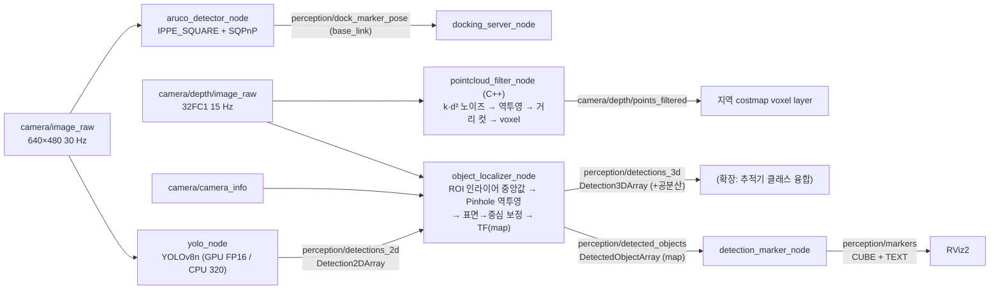

# AI 인지: YOLOv8 검출 · Pinhole 2D→3D · 마커 · ArUco · 깊이 점군 (명세 4.6)

> 패키지 `src/amr_perception` · 노드 `yolo_node`, `object_localizer_node`, `detection_marker_node`,
> `aruco_detector_node`, `pointcloud_filter_node` (components.md §3.4 / §5.4).
> 알고리즘은 ROS 비의존 모듈(`amr_perception/*.py`, `include/amr_perception/depth_cloud.hpp`)에 있고
> 노드는 메시지 변환·TF·동기화만 하는 얇은 래퍼다. 설계 근거: 연구 브리프 perception-tracking §3.1–3.2.
> 동적 장애물 추적·TTC·안전 게이트는 [tracking.md](tracking.md).

## 0. 파이프라인과 코드 위치

| 기능 | 순수 모듈 (테스트 대상) | 노드 래퍼 | 테스트 |
| --- | --- | --- | --- |
| 클래스 매핑 | `class_mapping.py`, `config/classes.yaml` | `yolo_node.py` | `test_class_mapping.py` |
| YOLO 추론 | `yolo_backend.py` | `yolo_node.py` | `test_yolo_backend.py`, `test_nodes.py` |
| Pinhole 역투영·공분산 | `pinhole.py`, `transforms.py` | `object_localizer_node.py` | `test_pinhole.py`, `test_nodes.py` |
| 마커 | `markers.py` | `detection_marker_node.py` | `test_class_mapping.py`, `test_nodes.py` |
| ArUco 자세 | `aruco.py` | `aruco_detector_node.py` | `test_aruco.py`, `test_nodes.py` |
| 데이터셋·미세조정 | `synthetic.py`, `world_objects.py` | `scripts/generate_dataset.py`, `scripts/train.py` | `test_synthetic.py`, `test_train_script.py` |
| 깊이 점군 | `depth_cloud.{hpp,cpp}` | `pointcloud_filter_node.cpp` | `test_depth_cloud.cpp` |

## 1. YOLOv8 검출과 클래스

- **모델**: ultralytics 8.4.155 `YOLOv8n` (Dockerfile 고정). 기본 가중치 `yolov8n_warehouse.pt` (§5 미세조정본), 없으면
  COCO `yolov8n.pt` 로 대체. `device: auto` 는 CUDA 가 있으면 `cuda:0` + FP16,
  없으면 CPU + `cpu_imgsz: 320`(연산량 1/4, 명세 대안 "CPU 10 FPS") 으로 자동 전환한다.
- **클래스 (명세 "화물, 사람, 표지판 등 3종 이상")**: 출력 `box`(0) / `person`(1) / `sign`(2).
  `config/classes.yaml` 의 `model_class_map` 이 모델 클래스 **이름**을 출력 클래스로 옮긴다:
  COCO 가중치에서는 `person`(COCO 0)→person, `stop sign`(11)→sign, `suitcase`(28)→box(임시 대용),
  미세조정 가중치(`box/person/sign`)에서는 그대로 통과. 매핑에 없는 클래스는 추론 단계
  `classes=` 필터로 NMS 전에 버린다. COCO 에 "화물 상자" 가 없으므로 box 의 본 경로는 미세조정이다(§5).
- **출력**: `vision_msgs/Detection2DArray` — `bbox.center` = 픽셀 중심, `results[0].hypothesis.class_id` =
  출력 클래스 이름, `id` = 출력 class_id, 스탬프 = 입력 이미지 스탬프(지연 측정·3D 동기의 기준).
- **처리율 설계**: 구독 QoS depth 1 (best effort) — 추론이 입력보다 느리면 오래된 프레임을 버리고 최신
  프레임만 처리해 지연이 쌓이지 않는다. 명세 8장 형식 로그 `Detected: Person (id=1), Confidence: 0.88`.
- **영상 전송 (Fast DDS)**: 640×480 bgr8 한 장(921 KB)은 Fast DDS 기본 공유 메모리 세그먼트(0.5 MB)에 들어가지 않아
  UDP 조각 전송으로 떨어지고, best effort 에서는 조각 하나만 잃어도 표본 전체가 버려진다 → 추론이 2 ms 인데도 종단
  24.8 FPS 에 머물렀다(§8.2). `config/fastdds_large_messages.xml` (SHM 세그먼트 16 MB) 을 **발행 쪽(브리지)과 구독 쪽
  모두** `FASTRTPS_DEFAULT_PROFILES_FILE` 로 주면 30 Hz 입력 900 장을 모두 처리한다(30.0 FPS).

## 2. Pinhole 역투영 (명세 3장 "Pinhole Camera Model 기반 좌표 변환 원리")

### 2.1 모델

카메라 광학 프레임(REP-103 optical: x 우, y 하, z 전방)의 점 $(X, Y, Z)$ 는 이상적 핀홀로

$$u = f_x\frac{X}{Z} + c_x,\qquad v = f_y\frac{Y}{Z} + c_y$$

에 투영된다 ($f_x, f_y$: 픽셀 단위 초점거리, $(c_x, c_y)$: 주점 = `camera_info.k`). 깊이 카메라는 광축 방향
거리 $Z$ (Z-depth) 를 주므로 이 식을 $X, Y$ 에 대해 풀면 역투영이 된다:

$$X = \frac{(u - c_x)\,Z}{f_x},\qquad Y = \frac{(v - c_y)\,Z}{f_y}.$$

Gazebo 카메라(HFOV 87°, 640×480, 왜곡 0)는 $f_x = \frac{W/2}{\tan(\mathrm{HFOV}/2)} = 337.2$ px,
$c_x = 319.5$, $c_y = 239.5$ 이다. 구현: `pinhole.project` / `pinhole.back_project`,
`depth_cloud.cpp backProject`(C++). 테스트는 여러 점의 투영↔역투영 왕복 오차 < 1e-12 와 광축 위 점 = 주점을 확인한다.

### 2.2 대표 깊이 (bbox → Z)

bbox 전체의 깊이는 배경(벽, 바닥)을 포함하므로 중앙 `roi_frac`(0.5) × 0.5 영역만 쓴다.

1. 유한하고 `[range_min, range_max]` = [0.20, 10.0] m (sensors.yaml) 인 픽셀만 남긴다. 유효 비율 < 0.3 이면 폐기.
2. **노이즈 모델 적용**: sensors.yaml 결정대로 시뮬레이터는 $\sigma_\text{base} = 0.005$ m 만 넣으므로 픽셀마다
   $\mathcal N(0, (k Z^2)^2)$, $k = 0.002\ \text{m}^{-1}$ 를 더한다 → 합성 $\sigma(Z) = \sqrt{\sigma_\text{base}^2 + (kZ^2)^2}$
   (1 m 0.0054, 3 m 0.019, 10 m 0.20 m). 명세 7장 "센서 노이즈 모델 반드시 적용".
3. 중앙값 $m_0$, MAD $= \operatorname{med}|Z - m_0|$ → 게이트 $g = \max(3 \cdot 1.4826\,\mathrm{MAD},\ 0.05)$ →
   $|Z - m_0| \le g$ 인 **인라이어의 중앙값** $\tilde Z$. 1.4826·MAD 는 정규분포 σ 의 로버스트 추정량이라
   게이트는 "3σ" 에 해당하고, 배경이 ROI 의 50 % 미만이면 중앙값이 전경에 있으므로 배경 픽셀이 모두 게이트 밖으로 빠진다
   (테스트: 35 % 가 8 m 벽인 ROI → 3.0 m 정확히).

독립 픽셀 $m$ 개 중앙값의 분산은 $\operatorname{Var}(\tilde Z) \approx \frac{\pi}{2}\frac{\sigma(\tilde Z)^2}{m}$ (정규 표본 중앙값의 점근 분산).
테스트 `test_robust_depth_noise_and_median_variance_mc` 가 2000회 몬테카를로로 이 식을 15 % 이내로 확인한다.
실제 스테레오/ToF 처럼 공간 상관이 있으면 `iid_pixels: false` 로 $m_\text{eff} = 1$ (보수적) 을 쓴다.

### 2.3 표면 → 중심 보정

$\tilde Z$ 는 **보이는 표면**의 깊이이고 지도 마커·과업 목표는 물체 **중심**이다. bbox 중심 광선을 따라 중심까지의
거리 $\delta$ 는 물체 형상·자세에 따른 확률변수이다. 바닥 위 직사각형(반치수 $a, b$)이 요각 $\phi$ 로 놓이면
$\delta(\phi) = \min(a/|\cos\phi|,\ b/|\sin\phi|)$ 이고, $\phi$ 균일 가정의 평균·표준편차가 클래스별 $(\mu_\delta, \sigma_\delta)$ 이다
(브리프 §3.1 표: 중형 박스 0.250/0.034, 대형 0.306/0.039, 소형 0.136/0.026, 사람 0.12/0.04, 표지판 0.02/0.02 m).
박스 크기는 YOLO 클래스로 구분되지 않으므로 bbox 폭에서 가로폭 $\hat L = \tilde Z w / f_x$ 를 추정해 가장 가까운
소(0.30)/중(0.50)/대(0.60 m) 를 고른다. 보정된 점:

$$\mathbf P_s = \big(X(\tilde Z), Y(\tilde Z), \tilde Z\big),\qquad \mathbf P_c = \mathbf P_s + \mu_\delta\,\frac{\mathbf P_s}{\|\mathbf P_s\|}.$$

보정이 없으면 중형 박스 25 cm, 사람 12 cm 의 **체계 오차**가 남는다.

### 2.4 공분산 전파

$\boldsymbol\xi = (u, v, Z)$, $\Sigma_\xi = \operatorname{diag}(\sigma_u^2, \sigma_v^2, \sigma_Z^2)$,
$\sigma_Z^2 = \frac{\pi}{2}\frac{\sigma(\tilde Z)^2}{m_\text{eff}} + \sigma_\delta^2$,
$\sigma_u = \sqrt{(\kappa w)^2 + \sigma_\text{skew}^2}$ ($\kappa = 0.05$: bbox 중심 지터 = 폭의 5 %). 역투영의 자코비안

$$J = \frac{\partial(X, Y, Z)}{\partial(u, v, Z)} = \begin{bmatrix} Z/f_x & 0 & (u - c_x)/f_x \\ 0 & Z/f_y & (v - c_y)/f_y \\ 0 & 0 & 1\end{bmatrix},\qquad \Sigma_\text{opt} = J\,\Sigma_\xi\,J^\top.$$

가로 오차 $\sigma_X = (Z/f_x)\kappa w = \kappa L$ 은 거리와 무관하다 ($w = f_x L / Z$). 테스트: 자코비안 = 수치미분(1e-7),
$\Sigma_\text{opt}$ = 2만 회 몬테카를로 (10 %), $\sigma_X = \kappa L$ (Z = 1/4/8 m).

**map 으로**: TF 로 $\Sigma_\text{map} = R\,\Sigma_\text{opt}R^\top$ 에 로봇 자세 오차 $(x_b, y_b, \theta)$ 의 영향을
base 원점 피벗으로 더한다: $\delta\mathbf p = [I_2\ \mathbf g]\,\delta(x_b, y_b, \theta)$,
$\mathbf g = [-(p_y - y_b),\ p_x - x_b]^\top$ (`odometry/filtered_map` 공분산의 (x, y, yaw) 3×3, 교차항 포함).
테스트: 4만 회 몬테카를로와 8 % 이내 일치. 공분산은 계약 메시지 `DetectedObject` 에 필드가 없어 같은 결과를
`vision_msgs/Detection3DArray` (`perception/detections_3d`, `results[0].pose.covariance`) 로 함께 발행한다.

### 2.5 좌표 변환 체인

`optical (depth header.frame_id) → base_link → map` 을 tf2 로 이미지 스탬프에서 조회한다
(`map → odom` = `ekf_filter_node_map`, `odom → base_footprint` = `ekf_filter_node_odom`, 나머지는 URDF 고정,
optical 회전 rpy = (−π/2, 0, −π/2) — sensors.yaml `camera_link.optical_rpy`). `distance` = base_link 원점까지의 3D 거리.
map TF 가 아직 없으면(SLAM/AMCL 수렴 전) `fallback_frames: [odom, base_link]` 순서로 내려가고 사용한 프레임을
`header.frame_id` 에 적는다. RGB 와 깊이 bbox 좌표는 두 광학 프레임이 같은 원점·축이라는 가정(모듈 베이스라인 0)으로
$u_d = (u - c_x)\,f_{x,d}/f_x + c_{x,d}$ 로 옮긴다. 테스트 `test_object_localizer_matches_pinhole_and_tf` 가
노드의 map 출력을 "Pinhole + 고정 외부 파라미터 + map←base" 해석해와 1e-6 m 로 비교한다.

**동기**: `message_filters.ApproximateTimeSynchronizer([detections_2d, depth], slop 0.017 s)` — 깊이 15 Hz 가
트리거라 3D 출력은 ≤ 15 Hz, 2D 는 30 Hz.

**TF 수신 스레드 (Gazebo 시험에서 찾은 결함 수정)**: Humble `TransformListener(buffer, node)` 기본값은 노드 실행기를
공유(`spin_thread=False`)하므로 동기 콜백이 도는 동안 `/tf` 가 처리되지 않는다. 영상 스탬프가 최신 TF 보다 수 ms 만
앞서도 `tf_timeout` 대기 중에 TF 가 갱신되지 않아 조회가 실패하고, 실측에서 **모든** 출력이 `base_link` 로 떨어졌다
(진단: 깊이 스탬프 − 최신 odom TF 중앙값 1.1 s, map 조회 28/28 실패). `transforms.threaded_tf_listener` 로 전용 스레드 +
내부 노드에서 TF 를 받게 바꿔 `object_localizer_node`, `aruco_detector_node` 에 적용했다 (§8.4 결과).

## 3. RViz 마커 (명세 8장 예시)

`detection_marker_node`: 메시지마다 `DELETEALL` 로 시작해 객체당 `CUBE`(클래스 색·크기: box 빨강 0.5×0.4×0.3,
person 초록 0.5×0.5×1.7, sign 파랑) + `TEXT_VIEW_FACING` "Class: Box, Conf: 0.92, Dist: 1.5m" (명세 예시와 같은 형식,
`capitalize_class`). 육면체는 바닥에 앉히되 추정 중심이 더 높으면(선반 위 박스) 그 높이를 따른다. `lifetime` 1 s.

## 4. ArUco 도킹 마커 자세

- **검출**: `cv2.aruco.ArucoDetector(DICT_4X4_50)`, 서브픽셀 코너 정제. 월드 `dock_marker` 텍스처와 같은 사전·
  크기(흑백 영역 0.18 m = 6 셀 × 0.03 m).
- **자세**: 4 코너 ↔ 마커 평면 점. `solvePnPGeneric(SOLVEPNP_IPPE_SQUARE)` 의 두 해 + `SOLVEPNP_SQPNP` 해를 후보로,
  재투영 오차가 최소값 + 1 px 이내인 후보 중 "마커는 수직 판" 사전정보(광학 프레임에서 본 base_link z 축 = `up_hint`)에
  가장 맞는 해를 고르고 `solvePnPRefineLM` 으로 정제한다.
  - SQPnP 를 더한 이유: 광축 위 **완전 정면** 마커에서 OpenCV IPPE 가 수치적으로 퇴화했다 (잡음 없는 렌더에서 두 해 모두
    재투영 2.7 px, 13° 오차; 경우에 따라 뒤집힌 해) — 전역 최적 SQPnP 가 이 경우를 보완한다.
  - **평면 자세 모호성**: 원거리·작은 마커에서 두 해의 재투영 오차가 거의 같다(법선이 시선에 대해 뒤집힌 해).
    마커가 카메라 광축 높이(월드: 0.43 m = 카메라 높이)에 있으면 두 해가 모두 수직이라 사전정보로도 못 가른다.
    이때 두 해 사이 각을 `ambiguity_angle` 로 보고하고 회전 분산에 $(\text{angle}/2)^2$ 를 더한다.
- **출력 규약**: `perception/dock_marker_pose` (PoseStamped, base_link) — 위치 = 마커 중심, 자세 = 마커 **모델 프레임**
  (x = 면 바깥 법선(로봇 쪽), z = 위; Gazebo `dock_marker` 모델과 같은 REP-103 규약). 정면으로 마주 보면 yaw = π.
  `perception/dock_marker_id` (Int32), `perception/dock_marker_pose_cov` (PoseWithCovarianceStamped, 재투영 자코비안
  $\Sigma = \sigma_\text{px}^2 (J^\top J)^{-1}$, 도킹 EKF 입력용). `perception/aruco/enable` (SetBool) 로 도킹 중에만 켤 수 있다.
- **도킹 "각도 오차"**: 로봇은 바닥에서 yaw 만 바꾸므로 마커 법선의 수평 성분 각 차(`aruco.heading_error`)로 잰다.

## 5. 미세조정 파이프라인 (box 클래스)

COCO 에는 창고 상자 클래스가 없으므로 합성/시뮬레이션 데이터로 YOLOv8n 을 미세조정한다.

1. `scripts/generate_dataset.py synthetic` — Gazebo 없이 cv2 도형 장면(골판지 상자 + 상면, 사람 실루엣(형광 조끼 포함),
   정지/경고/안내 표지판, 랙 줄무늬 배경, 밝기·블러·잡음 증강)을 그린다. 화가 알고리즘 + id 마스크로 가시 비율 < 40 % 인
   물체는 라벨에서 뺀다. YOLO txt(`cls cx cy w h`, 0–1) + `data.yaml`.
2. `scripts/generate_dataset.py gazebo` — 실행 중인 시뮬레이션에서 카메라 영상에 **지면 진실 라벨**을 단다: 월드 SDF 의
   박스 모델 include(크기는 모델 SDF 의 `<box><size>`, 중심 높이는 링크 pose) + 작업자 actor 궤적(sim 시각 선형 보간) →
   3D 박스 8 꼭짓점을 `ground_truth/odom ∘ TF(base_footprint→optical)` 로 투영 → 2D bbox(잘림 비율 ≤ 0.5, 최소 10 px) →
   깊이 이미지 가림 비율 > 0.6 이면 제외.
3. `scripts/train.py` — `YOLO(yolov8n.pt).train(...)` → val 분할 mAP50 / mAP50-95 / 클래스별 AP50 → `metrics.json`,
   `--out models/yolov8n_warehouse.pt`. `yolo_node` 의 기본 `weights` 가 이 파일이고(`classes.yaml` 이 이름을 그대로 통과),
   없으면 `fallback_weights: yolov8n.pt`(COCO) 로 경고와 함께 내려간다. 가중치(*.pt)는 저장소에 넣지 않는다(.gitignore).

## 6. 깊이 점군 (`pointcloud_filter_node`, C++)

Fortress 6.18 의 `camera/depth/points` 는 `header.frame_id` 가 optical 인데 좌표는 본체 규약으로 나온다(sensors.yaml 실측
주석) → 쓰지 않고 **깊이 이미지 + camera_info 로 직접 역투영**한다 (결정). 픽셀마다 $Z \leftarrow Z + \mathcal N(0, (kZ^2)^2)$
→ `[range_min 0.2, max_range 5.0]` 컷 → $\mathbf P = ((u - c_x)Z/f_x, (v - c_y)Z/f_y, Z)$ → voxel 무게중심 다운샘플
(`leaf_size` 0.05 m = costmap 해상도, 칸당 최소 2 점으로 고립 잡음 제거, `pixel_step` 2). 출력 frame = 깊이 optical.
테스트: 역투영 왕복, 32FC1/16UC1(행 패딩), 무효 픽셀·거리 컷, 3 m 평면에서 가산 잡음 σ = 0.018 m (2만 점, ±0.0008),
voxel 무게중심·결정적 순서·최소 점 수.

## 7. 파라미터 (요약 — 전체와 근거는 `src/amr_perception/config/perception.yaml` 주석)

| 파라미터 | 값 | 단위 | 근거 |
| --- | --- | --- | --- |
| `yolo_node.weights` / `fallback_weights` | yolov8n_warehouse.pt / yolov8n.pt | – | 창고 월드에서 COCO 검출 0 건 → 미세조정본 기본 (§8.3) |
| `yolo_node.conf_thresh` / `iou` | 0.35 / 0.5 | – | 기본 0.25 보다 높여 선반 무늬 오검출 억제 |
| `yolo_node.half` | true | – | GPU FP16, 지연 약 40 % 감소 |
| `yolo_node.cpu_imgsz` | 320 | px | CPU 대안 경로(10 FPS) — 연산량 1/4. 과부하 호스트는 256 (§8.2) |
| `object_localizer_node.roi_frac` | 0.5 | – | bbox 가장자리 배경 픽셀 회피 |
| `min_valid_fraction` | 0.3 | – | 유효 깊이가 이보다 적으면 3D 추정 신뢰 불가 |
| `depth_camera.noise_base` / `noise_quadratic_coeff` | 0.005 / 0.002 | m / m⁻¹ | sensors.yaml (명세 노이즈 모델) |
| `kappa` | 0.05 | – | bbox 중심 지터 = 폭 5 % (합성 val 로 재추정 대상) |
| `mad_k` | 3.0 | – | 3σ 인라이어 게이트 |
| `camera_offset.*` | 표 §2.3 | m | 직사각형 요각 균일 모델 |
| `sync_slop` | 0.017 | s | RGB 반주기 |
| `aruco.marker_size` | 0.18 | m | dock_marker 모델 |
| `aruco.ambiguity_px` | 1.0 | px | IPPE 두 해 모호 판정 |
| `pointcloud.max_range` / `leaf_size` | 5.0 / 0.05 | m | voxel layer 범위 / costmap 해상도 |

## 8. 검증 결과

측정 환경: `amr-fleet-system:wf-final` 일회용 컨테이너(`--gpus all`), 호스트 32 스레드 + RTX 5090, 2026-09-22 11:00–11:30 (KST).
외부 `gsim` 작업 종료 후 load average **2–14 / 32** 에서 측정했다 — 아래 시간·FPS 는 잠정치가 아니다(각 행에 load 병기).
외부 부하(load 85–115) 에서의 이전 측정은 따로 "잠정" 으로 표시한다.

### 8.1 단위 테스트 (pytest, `./scripts/test.sh --packages-select amr_perception`)

- **59 개 통과** (`test_pinhole.py` 15: 해석적 픽셀↔점 왕복·광축·깊이 σ 모델·ROI·인라이어 중앙값(배경 35 %)·중앙값 분산
  몬테카를로·표면→중심·자코비안 수치미분·공분산 몬테카를로·자세 공분산; `test_aruco.py` 9: projectPoints 렌더 → 복원
  0.32/0.5 m 에서 < 1 cm / 0.5°, 0.75/1.0 m 에서 < 1 cm / 2°, 모호성 보고·규약; `test_nodes.py` 8: rclpy 노드
  (localizer 가 Pinhole+TF 해석해와 1e-6 m 일치, 대체 프레임, 마커 CUBE+TEXT, yolo_node 발행·비동기, ArUco base_link 자세);
  `test_class_mapping.py` 6, `test_synthetic.py` 8, `test_yolo_backend.py` 8 (실제 YOLOv8n CPU/GPU, 직접 경로 = predict()
  결과 ±4 px, 미세조정 가중치 부재 시 COCO 대체), `test_train_script.py` 2, `test_scenario_tools.py` 3). 같은 실행에서 gtest 65 + rclcpp gtest 3 과 린트
  (flake8, pep257, cpplint, uncrustify, lint_cmake, xmllint) 전부 통과 — `Summary: 270 tests, 0 errors, 0 failures, 34 skipped`
  (skipped 34 = ament_cppcheck 가 cppcheck 2.7 성능 문제로 건너뛴 파일; `AMENT_CPPCHECK_ALLOW_SLOW_VERSIONS=1 ament_cppcheck`
  별도 실행 결과 "No problems found").
- **커버리지 (pytest-cov, 분기 포함, 테스트 코드 제외) 전체 95 %** (1697 문장): `pinhole.py`·`class_mapping.py`·`markers.py`
  100, `synthetic.py` 99, `aruco.py` 98, `transforms.py` 97, `aruco_detector_node.py`·`object_localizer_node.py`·
  `world_objects.py` 94, `yolo_backend.py`·`yolo_node.py` 93, `detection_marker_node.py` 88, `scripts/generate_dataset.py` 95,
  `scripts/train.py` 89 %. 빠진 줄은 `main()`/Gazebo 전용 경로(`# pragma: no cover` 로 표시한 ROS 통합 시험 본문 제외).
  C++ 커버리지(lcov)는 tracking.md §9.1 (라인 95.8 %).

### 8.2 YOLO 처리율 (명세 4.6: CPU ≥ 10 FPS 또는 GPU ≥ 30 FPS)

`scripts/yolo_fps_probe.py`: 640×480 bgr8 합성 장면 20 종을 **30 Hz 로 30 s(900 장)** 발행하고 `perception/detections_2d`
수신 수 / 시간을 잰다(입력보다 빠를 수 없으므로 30.0 이 상한). 지연 = 수신 시각 − 이미지 스탬프.

| 구성 (yolo_node) | 전송 | 종단 FPS (처리 장수) | 지연 p50 / p95 | load |
| --- | --- | --- | --- | --- |
| GPU 640 FP16 (기본) | SHM 프로파일 | **30.0** (900/900) | 2.5 / 4.1 ms | 2.3 → 1.8 |
| GPU 640 FP16 | 기본 UDP | 24.8 (743/900) | 4.3 / 6.3 ms | 11.2 → 8.7 |
| GPU 640 FP16, `async_inference` | 기본 UDP | 28.6 (858/900) | 4.2 / 6.2 ms | 8.6 → 7.6 |
| CPU 320 (`device: cpu` 기본) | SHM 프로파일 | **30.0** (900/900) | 12.0 / 15.3 ms | 2.9 → 2.3 |
| CPU 320 | 기본 UDP | 29.7 (892/900) | 12.2 / 17.4 ms | 4.5 → 3.1 |
| CPU 256 | 기본 UDP | 25.7 (771/900) | 12.3 / 15.1 ms | 13.9 → 11.6 |
| (잠정, load 85–115) GPU async / CPU 320 / CPU 256 | 기본 UDP | 22.7 / 8.0 / 12.1 | 58 / 148 / 106 ms (p50) | 84–115 |

- **전송이 병목이었다**: 추론 없이 영상만 받는 구독자의 수신율이 기본 27.85 Hz, SHM 프로파일 29.95 Hz. GPU 추론은 2 ms 인데도
  기본 전송에서 17 % 프레임이 사라진 이유다(§1 "영상 전송"). 배포 시 브리지·인지 컨테이너 모두
  `FASTRTPS_DEFAULT_PROFILES_FILE=<share>/amr_perception/config/fastdds_large_messages.xml` 을 준다.
- 추론만의 마이크로 벤치 (ROS 없음, 합성 10 장 순환 150 회 중앙값 / p95, load 4.5):
  GPU 직접 경로 1.90 / 2.27 ms, predict() 2.12 / 2.42 ms; CPU 320 직접 경로 9.14 / 15.2 ms (NCHW 연속화 전 12.5 ms),
  CPU 256 6.77 / 11.1 ms, CPU 320 predict() 6.25 / 6.73 ms. CPU 는 모든 조합이 10 FPS 목표(100 ms)의 1/10 이하다.
- Gazebo 카메라(§8.4)에서 미세조정 가중치: `detections_2d` 29.76 Hz (카메라 29.97 Hz), 추론 평균 5.7 ms.

### 8.3 미세조정 파이프라인 (box 클래스)

| 데이터셋 | 구성 | 학습 | val 결과 |
| --- | --- | --- | --- |
| 합성 (`generate_dataset.py synthetic --train 60 --val 20`) | 상자 86 / 사람 68 / 표지판 45 (train) | 3 epoch, GPU 22.6 s | mAP50 0.355, mAP50-95 0.283 (AP50 person 0.93, box 0.12, sign 0.02) — 3 epoch·60 장은 파이프라인 증명용 |
| Gazebo 지면 진실 (`generate_dataset.py gazebo --frames 500 --every 4`) | 로봇 (0, −4.3) 제자리 회전 0.25 rad/s; train 400 / val 100 장, 상자 1371 · 사람 181 라벨 (월드에 표지판 모델 없음) | 30 epoch, GPU 36 s | **mAP50 0.994, mAP50-95 0.932** (AP50 box 0.994, person 0.994), P 0.975 / R 0.981 |

- 한계: Gazebo 셋은 한 위치의 연속 프레임을 무작위로 나눴으므로 val 이 낙관적이다. 실제 일반화 수치는 여러 위치·다른 시각의
  별도 val 로 다시 잰다 (`--frames` 를 늘려 주행 중 수집).
- **COCO 가중치는 이 월드에서 쓸 수 없다**: 같은 카메라 5007 프레임에서 검출 0 건(블록형 작업자 메시·단색 상자는 COCO 분포 밖).
  미세조정 가중치는 5110 프레임 중 사람 2186 프레임, 상자 19943 건을 검출했다 → 배포 가중치는 `yolov8n_warehouse.pt`.

### 8.4 Gazebo 종단 시험 (기능 d)

구성: `warehouse.sdf` + amr_01 을 (0, −4.3) 에 −y 방향으로 스폰, `worker_crossing` 이 y = −7 (전방 2.7 m) 을 x −6 → 6 으로
1.0 m/s 왕복(25 s 주기). `perception.launch.py` 7 노드 전부 + 미세조정 가중치 + SHM 프로파일. 위치 추정 스택 대신 시험 하네스가
`ground_truth/odom` → TF `odom→base_footprint`, `map = odom` 항등, `scan → scan_filtered` 를 중계했다. wall 180 s (sim 7.9–178 s,
RTF ≈ 1.0), load 7.7–9.0. 지면 진실: actor 궤적(시뮬레이션 시각 보간), 상자 모델 중심.

| 항목 | 결과 |
| --- | --- |
| `detections_2d` / `detected_objects` 발행률 | 29.76 Hz / 14.87 Hz (깊이 15 Hz 트리거), 출력 프레임 `map` |
| 사람 3D 위치 오차 (xy, 가장 가까운 actor) | n = 1109, 중앙값 **0.095 m**, p90 0.20 m (거리 1.7–4.2 m); 2.5–3.5 m: 0.094 / 0.098 m, 3.5–4.5 m: 0.19 / 0.32 m; 1 m 넘는 오검출 0 |
| 상자 3D 위치 오차 (xy, 가장 가까운 상자 모델 중심) | n = 9966, 중앙값 **0.082 m**, p90 0.31 m, z 중앙값 −0.06 m (거리 3.0–4.3 m) |
| `perception/markers` | map 프레임 CUBE + TEXT `Class: Box, Conf: 0.95, Dist: 4.3m` (명세 8장 형식) |
| `camera/depth/points_filtered` | 5033 점 (0.2–5 m, voxel 0.05 m) |
| `safety/zone`, `cmd_vel` | 2 = CRITICAL (로봇 뒤 rack_C4 까지 풋프린트 뒤 모서리 ≈ 0.45 m, `zone_region: omni`), 50.0 Hz |

사람 오차가 2.7 m 에서 일정하게 약 9 cm 인 것은 actor 메시 시각 중심과 궤적 원점의 차이 + 표면→중심 사전값(0.12 m)의
편향으로 보인다(분산은 p90 − 중앙값 4 mm). 추적기 결과는 tracking.md §9.4.

**이 시험이 찾은 결함과 수정**: 첫 실행(COCO 가중치, 수정 전)에서 (1) 3D 출력이 모두 `base_link` 로 떨어졌다 — §2.5 의 TF
수신 스레드 문제, `threaded_tf_listener` 로 수정 후 전부 `map`; (2) COCO 검출 0 건 — §8.3 미세조정으로 해결.

### 8.5 ArUco 도킹 마커 자세 (합성 렌더, `aruco.render_marker_image` → `ArucoPoseEstimator`)

0.18 m 마커, 640×480 (HFOV 87°), 픽셀 잡음 σ = 2, 3× 초표본화, yaw −25…25° × 가로 −0.1…0.1 m 21 자세/거리. 카메라 높이 마커(h 0)와
0.10 m 아래(h −0.10):

| 거리 | 위치 오차 최대 (h 0 / h −0.10) | 도킹 방향(수평 법선) 오차 최대 | 모호 해 보고 |
| --- | --- | --- | --- |
| 0.32 m | 0.05 / 0.05 cm | 0.13° / 0.07° | 0 / 0 |
| 0.50 m | 0.07 / 0.12 cm | 0.36° / 0.24° | 7 / 1 |
| 0.75 m | 0.26 / 0.28 cm | 0.67° / 0.55° | 9 / 5 |
| 1.00 m | 0.65 / 0.57 cm | 1.69° / 1.20° | 13 / 11 |
| 1.50 m | 1.93 / 1.53 cm | 16.8° / 2.0° (중앙값 1.0° / 0.66°) | 21 / 21 |
| 2.00 m | 4.81 / 5.97 cm | 50.5° / 25.2° (중앙값 2.0° / 2.6°) | 21 / 21 |

최종 접근 구간(≤ 0.75 m)은 도킹 목표 2 cm / 1° 를 한 자릿수 이상 여유로 만족한다(pytest `test_final_approach_accuracy`:
0.32·0.5 m 에서 < 1 cm / 0.5°). 1.5 m 이상에서는 평면 자세 모호성(두 해의 재투영 오차가 같다)으로 방향이 뒤집힌 해가 나올 수
있으므로 `ambiguity_angle` 과 공분산을 함께 내보내고, 도킹 제어기는 원거리에서 위치만 쓰고 방향은 ≤ 1 m 에서 쓴다.
