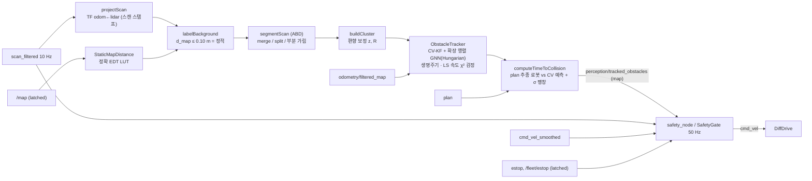

# 동적 장애물 추적 · TTC · 안전 게이트 (명세 4.7)

> 패키지 `src/amr_perception` · 노드 `obstacle_tracker_node`(C++), `safety_node`(C++) (components.md §3.4 / §5.4,
> sequences.md §2). 알고리즘은 ROS 비의존 C++17 라이브러리 `amr_perception_core`
> (`include/amr_perception/*.hpp`, `src/*.cpp`, Eigen) 에 있고 gtest 로 검증한다. 노드는 메시지·TF·타이밍만 담당.
> 설계 근거: 연구 브리프 perception-tracking §3.0, §3.3–3.7 (베이스라인 B1). 카메라 인지는 [perception.md](perception.md).

## 0. 파이프라인과 코드 위치

| 단계 | 헤더 / 구현 | 테스트 (gtest) |
| --- | --- | --- |
| 2D 기하, 풋프린트 거리 | `geometry2d.hpp` | `test_geometry.cpp` |
| 배경 LUT, ABD 분할, 클러스터 측정 | `scan_clustering.hpp` | `test_scan_clustering.cpp` |
| CV 칼만 필터 | `kalman_filter.hpp` | `test_kalman_filter.cpp` |
| Hungarian 할당 (직접 구현) | `hungarian.hpp` | `test_hungarian.cpp` |
| 추적기 (연관·생명주기·동적 판정·신뢰도) | `obstacle_tracker.hpp` | `test_obstacle_tracker.cpp` |
| TTC | `ttc.hpp` | `test_ttc.cpp` |
| 안전 게이트 | `safety_gate.hpp` | `test_safety_gate.cpp` |
| 노드 | `obstacle_tracker_node.cpp`, `safety_node.cpp` | `scripts/tracker_scenario.py`, `scripts/safety_scenario.py` (기능 시험) |

**추적 프레임 = `odom`.** `map` 에서 추적하면 AMCL 보정 점프(3–8 cm, 납치 복구 시 m 단위)가 모든 트랙에 동시에
가짜 속도로 들어간다. `odom→base_footprint`(EKF)는 연속이므로 측정·예측·연관·속도 검정은 odom 에서 하고, 정적 지도
중첩 판정과 출력(`perception/tracked_obstacles`, frame `map`)·TTC(`plan` 은 map)만 스캔 스탬프의 `map←odom` 으로 변환한다.

## 1. 전처리 · 정적 배경 분리 · 분할

1. **투영**: 유효 빔(유한, `[range_min, min(range_max, 12 m)]`)을 스캔 스탬프 TF 로 odom 점으로.
2. **정적 배경 LUT**: `/map` 점유 셀(≥ 65)까지의 유클리드 거리를 Felzenszwalb–Huttenlocher 분리형 정확 거리 변환으로
   한 번 만든다 ($O(WH)$, 지도 갱신 시만). 점마다 $d_\text{map} \le r_\text{bg} = 0.10$ m (2 셀: 위치 오차 흡수) 이면 배경.
3. **적응형 브레이크포인트(ABD)**: 이웃 빔 $i-1, i$ 에서
   $\|\mathbf p_i - \mathbf p_{i-1}\| > D_\text{th} = r_{i-1}\frac{\sin\Delta\phi}{\sin(\lambda - \Delta\phi)} + 3\sigma_r$
   ($\Delta\phi = 0.5°$, $\lambda = 10°$, $\sigma_r = 0.03$ m) 이거나 배경 라벨이 바뀌면 끊는다. $D_\text{th}$ = 0.25 (3 m),
   0.35 (5 m), 0.51 m (8 m). 360° 스캔은 이음매(−180°/+180°)를 이어 본다.
4. **병합/재분할**: 같은 라벨이고 최소 점간 간격 < 0.10 m 면 병합(union-find), PCA 장축 > 1.5 m 면 가장 큰 내부 간격에서
   재귀 분할. 배경 다수결 세그먼트는 버린다. 최소 점 수 3 (≤ 6 m) / 2 (> 6 m).
5. **부분 가림 표시(구현 추가)**: 세그먼트의 각도 경계 바로 바깥 빔이 평균 거리보다 0.30 m 이상 가까우면(앞 물체가 가림)
   보이는 조각의 중심이 가로로 치우친다 → 가로(시선 수직) 분산에 $\sigma_\text{occ}^2 = 0.20^2$ 를 더하고 `occluded` 로
   표시한다. 가려진 측정은 LS 속도 창에서 뺀다. 기둥 뒤를 지나는 작업자에서 게이트 탈락 → ID 교체를 막기 위한 것
   (`TrackSurvivesShortOcclusion`: 가림 0.7 s 동안 ID 유지).

## 2. 클러스터 측정 모델과 칼만 필터

### 2.1 측정 $\mathbf z$ 와 $R$ (sensors.yaml LiDAR σ 에서 유도)

점 중심 $\bar{\mathbf p}$ 는 보이는 표면이라 물체 중심보다 센서 쪽에 있다 → 시선 단위벡터 $\mathbf u$ 로
$\mathbf z = \bar{\mathbf p} + \mu_\delta \mathbf u$ ($\mu_\delta = 0.15$ m, 미지 클래스). 시선 좌표계에서

$$R = R_\psi \begin{bmatrix}\sigma_\parallel^2 & 0\\ 0 & \sigma_\perp^2\end{bmatrix} R_\psi^\top,\qquad
\sigma_\parallel^2 = \frac{\sigma_r^2}{n} + \sigma_\delta^2,\qquad \sigma_\perp^2 = \frac{(r\Delta\phi)^2}{24} + \sigma_\text{lat}^2,$$

$\sigma_r$ = sensors.yaml `lidar.noise_stddev` 0.03 m (n 점 평균이라 /n), $\sigma_\delta$ = 0.10 m (편향 잔차, 물체별로 지속),
가로 성분 $s^2/24$ ($s = r\Delta\phi$): 빔 격자 오프셋 $u \sim U[0, s)$ 에서 점 중심의 가로 오차 분산을 평판 폭의 소수부
$f \sim U[0, s)$ 로 평균한 값 ($\frac{1}{12s}[f^3 + (s-f)^3]$ 의 평균 = $s^2/24$), $\sigma_\text{lat}$ = 0.03 m (형상), 성분 하한 0.02 m.
속도 검정용 프레임 간 지터는 지속 편향을 빼고 $R_\text{jit} = \operatorname{diag}(\sigma_r^2/n + \sigma_\text{seg}^2,\ s^2/24 + \sigma_\text{seg}^2)$.

### 2.2 CV 칼만 필터 (CWNA)

상태 $\mathbf x = [p_x, p_y, v_x, v_y]^\top$ (odom), 관측 $H = [I_2\ 0]$, $\Delta t$ = 스캔 스탬프 차:

$$F = \begin{bmatrix} I_2 & \Delta t I_2 \\ 0 & I_2 \end{bmatrix},\qquad
Q = q\begin{bmatrix} \tfrac{\Delta t^3}{3} I_2 & \tfrac{\Delta t^2}{2} I_2 \\ \tfrac{\Delta t^2}{2} I_2 & \Delta t I_2 \end{bmatrix}.$$

예측 $\mathbf x^- = F\mathbf x$, $P^- = FPF^\top + Q$. 혁신 $\boldsymbol\nu = \mathbf z - H\mathbf x^-$, $S = HP^-H^\top + R$,
$K = P^-H^\top S^{-1}$, 갱신은 Joseph 형식 $P = (I - KH)P^-(I - KH)^\top + KRK^\top$ (수치 대칭·양정치 유지).
$Q$ 는 연속 백색 가속도(스펙트럼 밀도 $q$ [m²/s³])를 $\Delta t$ 동안 적분한 것: $q = 0.25$ → 1 s 동안 속도 변화
σ = $\sqrt{q}$ = 0.5 m/s (작업자 보행 가감속 수준). 탄생 속도 σ 1.5 m/s (명세 장애물 최고속).
테스트: $F, Q$ 원소, 예측/갱신 대칭·양정치, CWNA 참값에서 **평균 NEES ≈ 4** (일관성), 등속 참값 200 회
몬테카를로에서 편향 < 0.02 m/s·속력 RMS < 0.15 m/s (점 측정 σ 0.03 기준, 정상상태 이론값 0.11), 예측 위치 공분산 폐형식
$P_{pp}(\tau) = P_{pp} + \tau(P_{pv} + P_{vp}) + \tau^2 P_{vv} + q\tau^3/3\,I$.

## 3. 데이터 연관 — 확장 행렬 GNN + Hungarian (직접 구현)

**게이트**: $d^2_{ij} = \boldsymbol\nu^\top S^{-1}\boldsymbol\nu \le \chi^2_{2,0.99} = 9.21$ 이고 물리 상한
$\|\mathbf z - \mathbf z_\text{last}\| \le v_\text{phys}\Delta t + 3\sqrt{\lambda_\max(S)}$ ($v_\text{phys}$ = 3 m/s).

**비용** (음의 로그우도비, $n$ 트랙 × $k$ 클러스터 → $(n+k)\times(k+n)$):

$$C = \begin{bmatrix} C^\text{as}_{n\times k} & \operatorname{diag}(c^\text{miss}_i) \\ \operatorname{diag}(c^\text{birth}_j) & 0_{k\times n}\end{bmatrix},\quad
C^\text{as}_{ij} = d^2_{ij} + \ln\det(2\pi S_{ij}) - 2\ln P_{D,i},\quad c^\text{miss}_i = -2\ln(1 - P_{D,i}),\quad c^\text{birth} = -2\ln\lambda_B,$$

금지 쌍·비대각은 유한한 큰 값 $10^6$. "할당 vs (미탐 + 탄생)" 이 한 번의 최소 비용 할당으로 베이즈 비교된다.
$\ln\det S$ 항 덕분에 공분산이 부푼 coasting 트랙이 확정 트랙의 측정을 빼앗지 않는다. $P_D$ = 0.9 (가시),
0.5 (예측 위치가 더 가까운 클러스터의 각도 범위 뒤 = 가림, 또는 8 m 밖), $\lambda_B$ = 0.01 m⁻².

**Hungarian (Kuhn–Munkres, `hungarian.cpp`)**: 쌍대 변수(포텐셜) 기반 $O(n^2 m)$ 구현. 테스트는 무작위 문제에서
전수탐색과 총비용 일치, 직사각 행렬, 금지 쌍 처리를 확인한다.

**왜 게이트된 최근접 이웃이 아니라 GNN(Hungarian) 인가**: 교차·스침 상황에서 탐욕적 최근접은 먼저 처리한 트랙이 가까운
측정을 가져가 ID 가 바뀐다. 전역 최소 비용 할당은 두 트랙의 결합 우도를 최대화한다. 테스트
`CrossingTracksKeepIdentity`: X 자로 0.9 m 간격을 두고 교차하는 두 원(1.0 m/s) → 각 트랙 ID 1 개 유지, 방향 오차 < 15°.

## 4. 생명주기 · 동적 판정 · 출력

- **생명주기**: tentative → confirmed = 최근 5 스캔 중 3 히트 + 첫 검출 후 0.2 s. tentative 는 창 안 미탐 3 회면 삭제.
  confirmed 는 연속 미탐 > 5 (0.5 s) 면 삭제, 단 **예측 위치가 가려져 있으면 > 15 (1.5 s)** 까지 예측만으로 유지
  (구현 추가: `max_misses_occluded`). 스캔 간격 > 2 s 또는 시간 역행(시뮬레이션 리셋)은 전체 리셋.
- **동적 판정 (LS 기울기 χ² 검정)**: 최근 $W$ = 10 스캔(1 s) 측정의 최소제곱 기울기
  $\hat{\mathbf v} = \sum(t_k - \bar t)(\mathbf z_k - \bar{\mathbf z}) / S_{tt}$, $\operatorname{Cov}(\hat{\mathbf v}) = R_\text{jit}/S_{tt}$,
  $T = \hat{\mathbf v}^\top\operatorname{Cov}^{-1}\hat{\mathbf v} \sim \chi^2_2$ (정지 가설). $T > \chi^2_{2,0.999} = 13.82$ 이고
  $\|\hat{\mathbf v}\| > v_\min + 2\sigma_\delta|\omega_\text{LOS}|$ ($v_\min$ = 0.15 m/s, 자차 운동에 의한 시선 회전율 보정)가
  2 스캔 연속이면 `is_dynamic`, 5 스캔 연속 미발화면 해제. KF 속도의 χ² 대신 창 기울기를 쓰는 이유: 지속 편향 $\sigma_\delta$ 는
  기울기에 영향이 없고(상수의 기울기 0) 0.3 m/s 저속체도 1 s 안에 판정된다 (브리프 §3.6).
  sequences.md 의 "|v| > 0.2 m/s" 는 이 검정(유의 + 0.15 m/s 하한)으로 구체화했다.
- **출력**: 속도 = KF $\hat{\mathbf v}$, `heading` = atan2($\hat v_y, \hat v_x$) (0.1 m/s 미만이면 직전 방향 유지),
  방향 σ = $\sqrt{\mathbf n^\top P_{vv}\mathbf n}/v$. **신뢰도** = 로지스틱
  $\sigma(\beta_0 + \beta_1\,\text{hit ratio} + \beta_2\ln(\operatorname{tr}P_{pp}/\sigma_\text{ref}^2) + \beta_3 p_\text{class})$,
  $\beta = (-2, 4, -0.5, 1)$, $\sigma_\text{ref}$ = 0.3 m — 히트율이 높고 공분산이 작을수록 1 에 가깝다 (확률 보정은 로그 기반
  IRLS 로 재적합하는 확장점).

## 5. TTC (Time-To-Collision)

**모델.** 장애물: CV 예측 $\mathbf p_o(\tau) = \mathbf p + \tau\mathbf v$, 위치 공분산 $\Sigma_o(\tau) = P_{pp}(\tau)$ (§2.2).
로봇: `plan` 에 사영한 점에서 속도 $\max(|v_r|, 0.2)$ 로 경로를 따라가는 $\mathbf p_r(\tau)$ (경로가 없거나 1 m 이상 벗어났으면
현재 방향 직선, 실제 속도). 충돌 여유

$$g(\tau) = \|\mathbf p_r(\tau) - \mathbf p_o(\tau)\| - \big(r_\text{robot} + r_o + \min(k\,\sigma_o(\tau),\ \sigma_\text{cap})\big),$$

$r_\text{robot} = \sqrt{0.3^2 + 0.2^2} = 0.361$ m (풋프린트 외접원), $r_o$ = 트랙 외접원 반경, $\sigma_o(\tau)$ = 연결 방향 $\mathbf d$ 로 본
$\sqrt{\mathbf d^\top\Sigma_o(\tau)\mathbf d}$, $k = 1$, $\sigma_\text{cap}$ = 0.5 m. **TTC = $g$ 가 처음 0 이하가 되는 $\tau$**
($\tau \in [0, 5]$ s), 없으면 `inf` (메시지 규약).

**직선·등속의 폐형식 (검증 기준).** 로봇도 등속 직선이면 상대 위치 $\mathbf d(\tau) = \mathbf d_0 + \tau\Delta\mathbf v$ 이고
$\|\mathbf d(\tau)\|^2 = R^2$ ($R = r_\text{robot} + r_o$) 의 작은 근이 TTC:

$$\tau_c = \frac{-\mathbf d_0\!\cdot\!\Delta\mathbf v - \sqrt{(\mathbf d_0\!\cdot\!\Delta\mathbf v)^2 - \|\Delta\mathbf v\|^2(\|\mathbf d_0\|^2 - R^2)}}{\|\Delta\mathbf v\|^2},$$

판별식 < 0 이면 충돌 없음(최근접 시각 $\tau^* = -\mathbf d_0\cdot\Delta\mathbf v/\|\Delta\mathbf v\|^2$, 최근접 거리 $\|\mathbf d(\tau^*)\| > R$),
$\tau_c < 0$ 이면 멀어짐. 정면: $\mathbf d_0 = (5, 0)$, 접근 속도 2 → $\tau_c = (5 - R)/2$; 횡단: 로봇 $(\tau, 0)$, 장애물
$(3, -3 + \tau)$ → $\|\mathbf d\| = \sqrt2|3 - \tau|$ → $\tau_c = 3 - R/\sqrt2$.

**구현.** 경로 추종(구간 선형)과 시간에 따라 커지는 팽창이 들어가면 폐형식이 없으므로 0.1 s 격자에서 $g$ 의 첫 부호 변화를
찾고 이분법 12 회(분해능 25 µs)로 정밀화한다. 테스트(`test_ttc.cpp`): 정면·횡단·정지 로봇이 폐형식과 1e-3 s 이내,
이탈·스침·지평 밖 = inf, L 자 경로 모퉁이 뒤 정지 장애물(직선 가정이면 inf, 경로 추종이면 호 길이 − R), 불확실성 팽창은
TTC 를 줄이되 상한($\sigma_\text{cap}$/접근속도) 이하, 공분산 성장 폐형식.

## 6. 안전 게이트 (`SafetyGate`, `safety_node` 50 Hz)

**거리 기준**: robot_params.yaml `distance_reference: footprint_edge` — 스캔 점을 base_link 로 옮긴 뒤 풋프린트
사각형(0.60 × 0.40) **모서리까지의 최단 거리** $D$ (LiDAR range 를 그대로 쓰지 않는다). 풋프린트보다 0.02 m 안쪽 점은 자기
차체 반사로 무시.

**존과 속도 상한** (robot_params.yaml `safety.*`):

| 존 (`safety/zone` UInt8 / `safety/zone_name` String) | 조건 | 선속도 상한 |
| --- | --- | --- |
| CLEAR / 0 | $D > 1.0$ | 여유 거리 연속 제한 $v_\max(D)$ |
| WARNING / 1 | $0.5 < D \le 1.0$ | min(0.5, $v_\max(D)$) |
| CRITICAL / 2 | $0.3 < D \le 0.5$ | min(0.2, $v_\max(D)$) |
| STOP / 3 | $D \le 0.3$ | **0 (즉시, 래치)** — $D > 0.5$ 에서 자동 해제 |

**여유 거리 연속 제한 유도.** 반응 지연 $t$ = 0.15 s 동안 등속 후 최대 감속 $a$ = 1.0 m/s² 로 멈출 때 정지 거리
$d(v) = vt + \frac{v^2}{2a}$ 가 남은 여유 $D - 0.30$ 을 넘지 않아야 하므로 $v^2 + 2atv - 2a(D - 0.3) \le 0$ 의 양의 근:

$$v_\max(D) = -at + \sqrt{(at)^2 + 2a(D - 0.30)}$$

($D$ = 2.6 → 2.0, 1.0 → 1.04, 0.5 → 0.50 m/s; 테스트가 이 세 값을 확인). 존 상한과 연속 제한 중 작은 값.

**TTC 연속 감속**: 최소 TTC ≤ τ_crit = 2.15 s (= $t + v_\max/a$, sequences.md §2) 이면 $v \le a(\text{TTC} - t)$
(TTC 1.0 → 0.85, 0.5 → 0.35 m/s). 거리 존 상한이 더 낮으면 그쪽이 이긴다. 0.5 s 넘은 TTC 는 무시.
**각속도**: 꼭짓점 속도 $|\omega| r_\text{circ}$ 도 거리 상한 이하 — $v, \omega$ 를 같은 비율로 줄여 **곡률을 유지**한다.
**탈출**: STOP 래치 중에도 0.5 s 예측 시 풋프린트-장애물 거리가 늘어나는 명령(후진 등)은 CRITICAL 상한으로 통과(갇힘 방지).
**도킹 예외 다각형**: `safety/dock_exclusion` 안의 점은 0.10 m 정지 거리 + 0.2 m/s 상한만 적용(도킹 판 접근).

**E-stop 래치**: `estop`, `/fleet/estop` (std_msgs/Bool, **transient_local** — 대시보드가 latched 로 발행하므로 늦게 떠도
마지막 값을 받는다). true 수신 즉시 래치. 해제 조건 = 모든 입력이 **명시적 false** + `safety/reset_estop` (std_srvs/Trigger)
호출. reset 이 false 보다 먼저 도착하는 경우(대시보드는 false 발행 직후 reset 을 부른다)를 위해 1 s 동안 false 를 기다린다.
대기 중 새 true 는 대기를 무효화한다.

**센서 고장** (robot_params.yaml `safety.sensor_timeouts`): 토픽별 마지막 수신 후 경과 > 타임아웃이면 고장.
LiDAR(`scan_filtered` 0.3 s)·휠 엔코더(`wheel_odom` 0.06 s) → **정지** + `estop_active`; IMU(`imu/data` 0.05 s)·RGB
(`camera/camera_info` 0.1 s)·깊이(`camera/depth/camera_info` 0.2 s) → `degraded_mode_max_speed` **0.2 m/s 저속**.
기동 직후에는 기동 시각을 마지막 수신으로 두어 타임아웃만큼 유예한다. 입력 명령이 0.5 s 넘게 끊겨도 0.

**발행**: `cmd_vel` 50 Hz (유일한 발행자; 명령 입력 시 즉시 + 타이머 보충), 스캔으로 존/정지 상태가 바뀌면 다음 주기를
기다리지 않고 즉시 발행(0.3 m 정지 지연 = 스캔 처리 시간). `safety/estop_active` (Bool, latched), `safety/zone`
(UInt8 0–3, latched — components.md §5.4 계약, fleet_adapter_node 구독), `safety/zone_name` (String, 사람이 읽는 표기),
`diagnostics` 1 Hz + 변화 시.

## 7. 파라미터 (요약 — 전체와 근거는 `config/perception.yaml`, 안전 값은 `config/robot_params.yaml`)

| 파라미터 | 값 | 단위 | 근거 |
| --- | --- | --- | --- |
| `kf.q` | 0.25 | m²/s³ | 1 s 속도 변화 σ 0.5 m/s (보행 가감속), NEES 일관 |
| `kf.init_velocity_std` | 1.5 | m/s | 명세 장애물 최고속 |
| `segmentation.sigma_r` (= `lidar.noise_stddev`) | 0.03 | m | sensors.yaml, R 시선 성분 |
| `cluster_model.sigma_delta` / `bias_mu` | 0.10 / 0.15 | m | 미지 클래스 표면→중심 편향 |
| `cluster_model.sigma_occluded` | 0.20 | m | 부분 가림 중심 치우침 ≈ 물체 반폭 |
| `association.gate_chi2` | 9.21 | – | χ²₂(0.99) |
| `association.pd_visible` / `pd_occluded` | 0.9 / 0.5 | – | 검출 확률 |
| `association.lambda_birth` | 0.01 | m⁻² | 탄생 비용 9.2 |
| `lifecycle.confirm_hits/window` | 3 / 5 | 스캔 | 0.3 s 이내 확정, 잡음 1–2 프레임 무시 |
| `lifecycle.max_misses` / `_occluded` | 5 / 15 | 스캔 | 0.5 s / 가림 1.5 s 유지 |
| `dynamic.window` / `chi2` / `v_min` | 10 / 13.82 / 0.15 | 스캔 / – / m/s | 1 s 창, χ²₂(0.999), 명세 최저 0.3 m/s 의 절반 |
| `ttc.horizon` / `k_sigma` / `sigma_cap` | 5.0 / 1.0 / 0.5 | s / – / m | > τ_warn 3.0 s, 1σ 팽창, 상한 |
| `safety_node.ttc.critical` | 2.15 | s | $t + v_\max/a$ |
| `safety_node.stop_release_distance` | 0.50 | m | 0.3 m 정지 히스테리시스 |
| `safety_node.zone_hysteresis` | 0.05 | m | 스캔 σ 의 약 1.7 배 |
| `safety_node.command_timeout` | 0.5 | s | 상위 노드 정지 대비 |

## 8. 확장점 (연구 브리프 제안과의 정합)

- **P1 JTC-IMM** (클래스 조건부 IMM: CV/CT/정지): `TrackFilter` 인터페이스 + `ObstacleTracker::FilterFactory` 로 필터를
  주입한다 (`CustomFilterFactoryIsUsed` 테스트). 예측 공분산도 `predictPositionCovariance` 가상 함수라 TTC 가 그대로 쓴다.
- **카메라 클래스 융합**: `TrackOutput.class_confidence` (신뢰도 로지스틱의 $\beta_3$ 항) 와 `perception/detections_3d`
  (클래스 + map 위치 + 공분산) 가 입력. 브리프의 클래스별 $\mu_\delta$, $q$, 반경 사전은 `ClusterModelParams`/`TtcParams` 에 클래스 축을 더하면 된다.
- **P3 DATMO 자유공간 점수**: `ScanPoint.map_distance` 와 `Cluster.map_overlap` 이 이미 계산되며, 동적 판정
  `updateDynamicState` 에 로그오즈 항을 더하는 형태로 붙는다.
- **피어 AMR 주입** (LiDAR 평면 0.38 m 보다 낮은 AMR 차체): 추적기 입력에 가상 클러스터로 `/amr_XX/odometry/filtered_map` 을 넣는다.
- 메시지 확장 제안(`TrackedObstacle` 에 공분산·반경·방향 σ): 현재 계약에 필드가 없어 `TrackOutput` 에만 있다.

## 9. 검증 결과

측정 환경: `amr-fleet-system:wf-final` 일회용 컨테이너, 호스트 32 스레드 + RTX 5090, 2026-09-22 11:00–11:30 (KST).
외부 `gsim` 작업이 끝난 뒤라 load average **8–14 / 32** — 아래 시간 수치는 잠정치가 아니다(각 행에 load 병기).
재현: `ros2 run amr_perception tracker_scenario.py`, `ros2 run amr_perception safety_scenario.py` (노드는 `config/*.yaml` 로 기동).

### 9.1 단위·통합 테스트 (gtest)

| 대상 | 테스트 | 결과 |
| --- | --- | --- |
| `amr_perception_gtest` (ROS 비의존 라이브러리) | 65 개 / 8 스위트: 기하, Hungarian, KF, 분할, 추적기(교차 트랙 ID 유지·가림·생명주기·동적 판정·종단 TTC), TTC(정면·횡단·이탈·경로 모퉁이·팽창), 안전 게이트(존·연속 제한·TTC·E-stop 래치·센서 타임아웃·탈출·도킹 예외), 깊이 점군 | 65/65 통과 |
| `amr_perception_ros_gtest` (rclcpp 노드) | safety_node: 게이트·transient_local E-stop 래치·`safety/reset_estop`; obstacle_tracker_node: 이동 장애물 추적 + `/map` 벽 제거; pointcloud_filter_node: 역투영 | 3/3 통과 |
| 커버리지 (lcov, `--coverage` Debug, 테스트 코드 제외) | 라인 **95.8 %** (1808/1887), 함수 90.2 % | `safety_gate.cpp` 98.0, `obstacle_tracker.cpp` 98.3, `scan_clustering.cpp` 97.1, `ttc.cpp` 97.2, `kalman_filter.cpp`·`hungarian.cpp`·`geometry2d.cpp` 100, `obstacle_tracker_node.cpp` 96.3, `safety_node.cpp` 90.9, `pointcloud_filter_node.cpp` 91.7 % (`main_*.cpp` 3 × 5 줄만 0 %) |

### 9.2 기능 (a) — 합성 LaserScan 횡단 장애물 → `obstacle_tracker_node`

시나리오(`tracker_scenario.py`): 로봇 원점에서 +x 로 1.0 m/s (`odometry/filtered_map`, 직선 `plan`), 반경 0.2 m 원통이
(4, −4) 에서 +y 로 **1.0 m/s** 로 로봇 경로를 가로지른다. 720 빔 360° 스캔, 거리 잡음 σ = 0.03 m, 10 Hz, 6 s.
기준 TTC 는 §5 폐형식($R = 0.361 + 0.2$, 상대 속도 $\sqrt2$ m/s → $\tau_c = 4 - R/\sqrt2 - t$).

| 지표 (정착 1.5 s 이후) | 목표 | 기본 설정 (`ttc.k_sigma` 1.0) | 명목 기하 (`k_sigma` 0) |
| --- | --- | --- | --- |
| 속도 오차 RMS / p95 / 최대 | ≤ 0.1 m/s | 0.023 / 0.037 / 0.099 m/s | 0.024 / 0.037 / 0.112 m/s (1 표본) |
| 방향 오차 RMS / 최대 | ≤ 10° | 1.36° / 4.8° | 1.39° / 5.1° |
| 위치 오차 평균 | – | 0.019 m | 0.020 m |
| 트랙 확정 / 동적 판정 시각 | – | 0.5 s / 0.7 s | 0.3 s / 0.4 s |
| TTC − 기준 (29 표본) 평균 / 최대 \|·\| | ≤ 0.3 s | −0.195 / 0.413 s (**항상 이르게**) | −0.026 / **0.066 s** |
| 스캔 → 발행 지연 p50 / p95 | ≤ 30 ms | 0.33 / 0.47 ms | 0.31 / 0.49 ms |
| 트랙 ID | 1 개 유지 | [1] | [1] |

해석: 추정기 자체(명목 기하)의 TTC 는 폐형식과 0.066 s 이내다. 기본 설정은 연구 브리프 §3.7 대로 예측 공분산의
연결 방향 1σ(상한 0.5 m)를 충돌 반경에 더하므로 TTC 가 0.1–0.4 s **일찍** 나온다 — 안전 쪽으로만 치우친 의도된
보수성이며(늦게 나온 표본 0), `safety_node` 의 τ_crit 2.15 s 감속이 이 값을 쓴다. 명세 "1.0 m/s 동적 장애물 인식"은
0.4–0.7 s(4–7 스캔) 안에 `is_dynamic` 이 켜지는 것으로 확인된다. (외부 부하 load ≈ 100 에서 같은 시험: 속도 최대 오차
0.079 m/s, 명목 TTC 최대 0.063 s, 지연 p95 76 ms — 잠정치.)

### 9.3 기능 (c) — 합성 입력 → `safety_node` (`safety_scenario.py`, robot_params.yaml 그대로)

최종 코드(`safety/zone` UInt8 계약 반영 후)로 재실행, load 6.4–7.9.

| 시나리오 | 목표 | 측정 |
| --- | --- | --- |
| 1.0 m/s 명령, 전방 벽이 풋프린트 모서리 기준 2.0 m → 0.1 m 로 접근 (스캔 10 Hz) | 존별 상한 | CLEAR 1.0 / WARNING **0.50** / CRITICAL **0.20** / STOP **0.0** m/s (존별 표본 106/51/21/40) |
| D ≤ 0.3 m 스캔 도착 → `cmd_vel` 0 | 한 주기(20 ms) 안 | **0.12 ms** (이벤트 즉시 발행), 정지 스캔 이후 0 아닌 명령 0 개, `estop_active` true, zone STOP |
| IMU(`imu/data`, 0.05 s) 끊김 → 저속 | degraded 0.2 m/s | 발행 중단 후 52.8 ms 에 0.20 m/s (= 타임아웃 + ≤ 1 주기), 복구 후 1.0 m/s |
| LiDAR(`scan_filtered`, 0.3 s) 끊김 → 정지 | 정지 + E-stop 표시 | 하트비트 중단 후 244 ms (마지막 스캔은 그보다 최대 100 ms 앞) 에 0, `estop_active` true |
| `estop` true → 정지, false 만으로는 해제 안 됨, `safety/reset_estop` 후 해제 | 래치 | 0.13 ms 에 0 / false 후 최대 0.0 / reset `success` → 1.0 m/s, `estop_active` false |
| `cmd_vel` 발행률 | 50 Hz | 51.1 Hz |

(외부 부하 load ≈ 100 에서의 같은 시험: 정지 지연 1.9 ms, IMU → 저속 153 ms, LiDAR → 정지 280 ms, E-stop 18.9 ms,
47.4 Hz — 잠정치. 판정 로직은 부하와 무관하게 같았다.)

### 9.4 기능 (d) — Gazebo 창고 월드, 실제 LiDAR + 1.0 m/s 작업자 actor

구성은 perception.md §8.4 와 같은 실행: amr_01 을 (0, −4.3) 에 −y 방향으로 세우고 `worker_crossing` 이 전방 2.7 m (y = −7) 를
x −6 → 6 → −6 으로 1.0 m/s 왕복(25 s 주기, 끝에서 0.5 s 회전). 하네스가 `scan → scan_filtered`, 지면 진실 `odom→base_footprint`,
`map = odom` 을 중계했다(위치 추정 스택 대역, `/map` 없음 → 정적 배경 분리 없이 전부 후보). sim 7.9–178 s, RTF ≈ 1.0, load 7.7–9.0.
지면 진실은 월드 SDF 궤적의 시뮬레이션 시각 보간이다.

| 지표 | 목표 | 결과 |
| --- | --- | --- |
| `perception/tracked_obstacles` 발행률 | 10 Hz | 9.79 Hz |
| 속도 오차 평균 / RMS / p95 (정상 구간 n = 1428: 방향 전환 뒤 1.5 s 제외) | ≤ 0.1 m/s | 0.017 / **0.050** / 0.088 m/s |
| 방향 오차 RMS / p95 (정상 구간) | ≤ 10° | **3.0° / 5.4°** |
| 위치 오차 평균 / p95 | – | 0.054 / 0.110 m |
| `is_dynamic` 비율 (정상 구간) | – | 98.9 % |
| 전체 구간(방향 전환 포함 n = 1630) 속도 RMS / 방향 RMS | – | 0.12 m/s / 9.3° (전환 직후 CV 모델 지연) |
| 트랙 ID | – | 7 회 통과에 ID 3 개 (ID 교체 2 회, 둘 다 x ≈ 2.6 m 부근) |
| TTC | 충돌 없음 → inf | 전 표본 inf (로봇 정지, 작업자는 2.7 m 앞을 지나감) |
| `safety/zone` | – | 2 = CRITICAL — 로봇 뒤 rack_C4 가 풋프린트 뒤 모서리에서 ≈ 0.45 m (`zone_region: omni`) |

첫 Gazebo 실행에서는 `scan_filtered` 발행자(amr_localization `scan_filter_node`)가 없어 추적기 입력이 비었다 — 통합 런치에서
`scan_filter_node` 가 반드시 함께 떠야 하며, 단독 시험은 `scan → scan_filtered` 중계로 대신한다.
