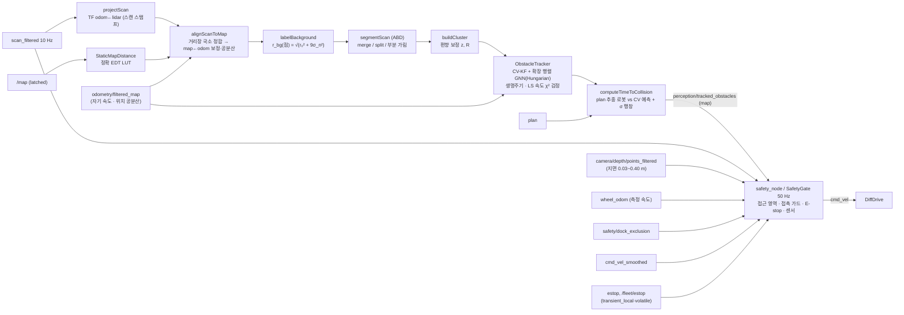

# 동적 장애물 추적 · TTC · 안전 게이트 (명세 4.7)

> 패키지 `src/amr_perception` · 노드 `obstacle_tracker_node`(C++), `safety_node`(C++) (components.md §3.4 / §5.4,
> sequences.md §2). 알고리즘은 ROS 비의존 C++17 라이브러리 `amr_perception_core`
> (`include/amr_perception/*.hpp`, `src/*.cpp`, Eigen) 에 있고 gtest 로 검증한다. 노드는 메시지·TF·타이밍만 담당.
> 설계 근거: 연구 브리프 perception-tracking §3.0, §3.3–3.7 (베이스라인 B1). 카메라 인지는 [perception.md](perception.md).

## 0. 파이프라인과 코드 위치

| 단계 | 헤더 / 구현 | 테스트 (gtest) |
| --- | --- | --- |
| 2D 기하, 풋프린트 거리 | `geometry2d.hpp` | `test_geometry.cpp` |
| 배경 LUT·국소 정합, ABD 분할, 클러스터 측정 | `scan_clustering.hpp` | `test_scan_clustering.cpp` |
| CV 칼만 필터 | `kalman_filter.hpp` | `test_kalman_filter.cpp` |
| Hungarian 할당 (직접 구현) | `hungarian.hpp` | `test_hungarian.cpp` |
| 추적기 (연관·생명주기·동적 판정·신뢰도) | `obstacle_tracker.hpp` | `test_obstacle_tracker.cpp` |
| TTC | `ttc.hpp` | `test_ttc.cpp` |
| 안전 게이트 (스윕 풋프린트, 강건 통계, 게이트) | `safety_gate.hpp` | `test_safety_gate.cpp` |
| 노드 | `obstacle_tracker_node.cpp`, `safety_node.cpp` | `test_ros_nodes.cpp` (rclcpp), `scripts/tracker_scenario.py`, `scripts/safety_scenario.py` (합성 기능 시험) |
| Gazebo 시험 하네스 | `test/scripts/`: `safety_gz.launch.py`·`safety_gz_trials.py`·`safety_test_world.py`·`gt_tf_relay.py` (안전 게이트), `tracker_gz.launch.py`·`tracker_gz_route.py` (실제 AMCL 추적기) | §9.4, §9.5 |

**추적 프레임 = `odom`.** `map` 에서 추적하면 AMCL 보정 점프(3–8 cm, 납치 복구 시 m 단위)가 모든 트랙에 동시에
가짜 속도로 들어간다. `odom→base_footprint`(EKF)는 연속이므로 측정·예측·연관·속도 검정은 odom 에서 하고, 정적 지도
중첩 판정과 출력(`perception/tracked_obstacles`, frame `map`)·TTC(`plan` 은 map)만 스캔 스탬프의 `map←odom` 으로 변환한다.

## 1. 전처리 · 정적 배경 분리 · 분할

1. **투영**: 유효 빔(유한, `[range_min, min(range_max, 12 m)]`)을 스캔 스탬프 TF 로 odom 점으로.
2. **정적 배경 LUT**: `/map` 점유 셀(≥ 65)까지의 유클리드 거리를 Felzenszwalb–Huttenlocher 분리형 정확 거리 변환으로
   한 번 만든다 ($O(WH)$, 지도 갱신 시만). 셀 중심 격자의 쌍선형 보간이 거리 $d(\mathbf p)$ 와 기울기(표면 법선) $\nabla d$ 를
   준다. **배경 = $d_\text{map} \le r_\text{bg}(\mathbf p)$**, 반경은 위치 추정 불확실성을 반영한다 (§1.1).
3. **적응형 브레이크포인트(ABD)**: 이웃 빔 $i-1, i$ 에서
   $\|\mathbf p_i - \mathbf p_{i-1}\| > D_\text{th} = r_{i-1}\frac{\sin\Delta\phi}{\sin(\lambda - \Delta\phi)} + 3\sigma_r$
   ($\Delta\phi = 0.5°$, $\lambda = 10°$, $\sigma_r = 0.03$ m) 이거나 배경 라벨이 바뀌면 끊는다. $D_\text{th}$ = 0.25 (3 m),
   0.35 (5 m), 0.51 m (8 m). 360° 스캔은 이음매(−180°/+180°)를 이어 본다.
4. **병합/재분할**: 같은 라벨이고 최소 점간 간격 < 0.10 m 면 병합(union-find), PCA 장축 > 1.5 m 면 가장 큰 내부 간격에서
   재귀 분할. 배경 다수결 세그먼트는 버린다. 최소 점 수 3 (≤ 6 m) / 2 (> 6 m).
5. **부분 가림 표시(구현 추가)**: 세그먼트의 각도 경계 바로 바깥 빔이 평균 거리보다 0.30 m 이상 가까우면(앞 물체가 가림)
   보이는 조각의 중심이 가로로 치우친다 → 가로(시선 수직) 분산에 $\sigma_\text{occ}^2 = 0.20^2$ 를 더하고 `occluded` 로
   표시한다. 가려진 측정은 LS 속도 창에서 뺀다. 기둥 뒤를 지나는 작업자에서 게이트 탈락 → ID 교체를 막기 위한 것
   (`TrackSurvivesShortOcclusion`: 가림 0.7 s 동안 ID 유지).

### 1.1 위치 오차에 강건한 배경 판정 (국소 정합 + 불확실성 반경)

예전 고정 $r_\text{bg}$ = 0.10 m 는 LiDAR 잡음 3σ(0.09 m)만으로 거의 다 쓰였다. AMCL 오차 4–5 cm·0.5° 에서 랙 면이 전경
조각으로 깨지고, 보이는 조각이 로봇과 함께 미끄러지며 가짜 동적 트랙이 됐다 (리뷰 실측: 거짓 `is_dynamic` 527/1988).

**국소 정합** (`alignScanToMap`): 스캔 점을 스캔 스탬프의 `map←odom` 으로 옮기고, 초기 $d \le 0.30$ m 인 점(구조물에 맞은
빔)으로 센서 중심 보정 $\boldsymbol\delta = (t_x, t_y, \theta)$, $\mathbf p' = R(\theta)(\mathbf p - \mathbf c) + \mathbf c + \mathbf t$ 를 푼다:

$$\min_{\boldsymbol\delta}\ \sum_i \frac{\rho_\text{Huber}\big(d(\mathbf p_i') - \tfrac{h}{2}\big)}{\sigma_m^2} + \boldsymbol\delta^\top\Lambda\,\boldsymbol\delta,\qquad
J_i = \big[\nabla d^\top,\ \nabla d^\top J\,R(\theta)(\mathbf p_i - \mathbf c)\big],$$

$h$ = 셀 크기(점유 셀 중심 ↔ 표면 반 셀), $\sigma_m^2 = \sigma_r^2 + h^2/12$ (LiDAR 잡음 + 격자 양자화), Huber 0.05 m. 가우스-뉴턴
걸음은 한 번에 0.10 m·1.1° 로 자르고 실제 강건 비용이 줄 때까지 반씩 줄인다 (거리장 기울기가 셀 단위로 끊겨 큰 걸음은
넘어간다), 최대 8 회. 사전분포 $\Lambda = \operatorname{diag}(\sigma_{xy}^{-2}, \sigma_{xy}^{-2}, \sigma_\psi^{-2})$ 는 `odometry/filtered_map` 공분산을
0.03–0.20 m, 0.3–2.9° 로 자른 값 — 복도처럼 한 방향이 관측되지 않으면 그 방향은 사전분포에 머문다. 대응점 < 40 이거나
보정이 0.30 m·3.4° 를 넘으면 실패로 보고 보정 없이 사전분포 공분산만 쓴다. 보정 공분산 $\Sigma = (H/\hat\sigma^2 + \Lambda)^{-1}$,
$\hat\sigma$ = 정합 잔차의 1.4826·MAD.

**불확실성 반경**: 점 변위 $\delta\mathbf p = [I_2,\ J(\mathbf p - \mathbf c)]\,\boldsymbol\delta$ 의 **거리장 법선 성분** 분산
$\sigma_n^2 = \mathbf a^\top\Sigma\,\mathbf a$, $\mathbf a = (\mathbf n,\ \mathbf n^\top J(\mathbf p - \mathbf c))$, $\mathbf n = \nabla d/|\nabla d|$ 로

$$r_\text{bg}(\mathbf p) = \min\Big(0.35,\ \sqrt{r_0^2 + 9\,\sigma_n^2}\Big),\qquad r_0 = \max(0.10,\ 3\hat\sigma).$$

벽을 따라 미끄러지는 오차는 $d$ 를 바꾸지 않으므로 법선 성분만 쓴다(먼 점일수록 회전 항이 커진다). 상한 0.35 m 는 벽
0.35 m 앞 사람을 항상 전경으로 남긴다. 출력 좌표(`perception/tracked_obstacles`, map)는 보정하지 않는다 — 코스트맵·플래너와
같은 AMCL 프레임을 유지하기 위해서다. 테스트: `ScanToMapAlignmentRecoversPoseOffset` (5 cm·−4 cm·1° 오차 → 1 cm·0.2° 이내),
`PoseErrorDoesNotFragmentWallsIntoForeground` (5 cm·5 cm·1° 오차 20 스캔: 고정 반경은 벽 조각 > 20 개, 정합은 벽 앞 사람
하나만), `InterpolatedDistanceGradient`. 실제 SLAM 지도(`maps/warehouse.pgm`, 격자 레이캐스트 스캔 σ 0.03, 6 자세 × 5 오차)
진단 결과는 §9.5.

## 2. 클러스터 측정 모델과 칼만 필터

### 2.1 측정 $\mathbf z$ 와 $R$ (sensors.yaml LiDAR σ 에서 유도)

점 중심 $\bar{\mathbf p}$ 는 보이는 표면이라 물체 중심보다 센서 쪽에 있다 → 시선 단위벡터 $\mathbf u$ 로
$\mathbf z = \bar{\mathbf p} + \mu_\delta \mathbf u$ ($\mu_\delta = 0.15$ m, 미지 클래스). 시선 좌표계에서

$$R = R_\psi \begin{bmatrix}\sigma_\parallel^2 & 0\\ 0 & \sigma_\perp^2\end{bmatrix} R_\psi^\top,\qquad
\sigma_\parallel^2 = \frac{\sigma_r^2}{n} + \sigma_\delta^2,\qquad \sigma_\perp^2 = \frac{(r\Delta\phi)^2}{24} + \sigma_\text{lat}^2,$$

$\sigma_r$ = sensors.yaml `lidar.noise_stddev` 0.03 m (n 점 평균이라 /n), $\sigma_\delta$ = 0.10 m (편향 잔차, 물체별로 지속),
가로 성분 $s^2/24$ ($s = r\Delta\phi$): 빔 격자 오프셋 $u \sim U[0, s)$ 에서 점 중심의 가로 오차 분산을 평판 폭의 소수부
$f \sim U[0, s)$ 로 평균한 값 ($\frac{1}{12s}[f^3 + (s-f)^3]$ 의 평균 = $s^2/24$), $\sigma_\text{lat}$ = 0.03 m (형상), 성분 하한 0.02 m.
속도 검정용 프레임 간 지터는 지속 편향을 빼고 $R_\text{jit} = \operatorname{diag}(\sigma_r^2/n + \sigma_\text{seg}^2,\ s^2/24 + \sigma_\text{seg}^2)$.

### 2.2 CV 칼만 필터 (CWNA)

상태 $\mathbf x = [p_x, p_y, v_x, v_y]^\top$ (odom), 관측 $H = [I_2\ 0]$, $\Delta t$ = 스캔 스탬프 차:

$$F = \begin{bmatrix} I_2 & \Delta t I_2 \\ 0 & I_2 \end{bmatrix},\qquad
Q = q\begin{bmatrix} \tfrac{\Delta t^3}{3} I_2 & \tfrac{\Delta t^2}{2} I_2 \\ \tfrac{\Delta t^2}{2} I_2 & \Delta t I_2 \end{bmatrix}.$$

예측 $\mathbf x^- = F\mathbf x$, $P^- = FPF^\top + Q$. 혁신 $\boldsymbol\nu = \mathbf z - H\mathbf x^-$, $S = HP^-H^\top + R$,
$K = P^-H^\top S^{-1}$, 갱신은 Joseph 형식 $P = (I - KH)P^-(I - KH)^\top + KRK^\top$ (수치 대칭·양정치 유지).
$Q$ 는 연속 백색 가속도(스펙트럼 밀도 $q$ [m²/s³])를 $\Delta t$ 동안 적분한 것: $q = 0.25$ → 1 s 동안 속도 변화
σ = $\sqrt{q}$ = 0.5 m/s (작업자 보행 가감속 수준). 탄생 속도 σ 1.5 m/s (명세 장애물 최고속).
테스트: $F, Q$ 원소, 예측/갱신 대칭·양정치, CWNA 참값에서 **평균 NEES ≈ 4** (일관성), 등속 참값 200 회
몬테카를로에서 편향 < 0.02 m/s·속력 RMS < 0.15 m/s (점 측정 σ 0.03 기준, 정상상태 이론값 0.11), 예측 위치 공분산 폐형식
$P_{pp}(\tau) = P_{pp} + \tau(P_{pv} + P_{vp}) + \tau^2 P_{vv} + q\tau^3/3\,I$.

## 3. 데이터 연관 — 확장 행렬 GNN + Hungarian (직접 구현)

**게이트**: $d^2_{ij} = \boldsymbol\nu^\top S^{-1}\boldsymbol\nu \le \chi^2_{2,0.99} = 9.21$ 이고 물리 상한
$\|\mathbf z - \mathbf z_\text{last}\| \le v_\text{phys}\Delta t + 3\sqrt{\lambda_\max(S)}$ ($v_\text{phys}$ = 3 m/s).

**비용** (음의 로그우도비, $n$ 트랙 × $k$ 클러스터 → $(n+k)\times(k+n)$):

$$C = \begin{bmatrix} C^\text{as}_{n\times k} & \operatorname{diag}(c^\text{miss}_i) \\ \operatorname{diag}(c^\text{birth}_j) & 0_{k\times n}\end{bmatrix},\quad
C^\text{as}_{ij} = d^2_{ij} + \ln\det(2\pi S_{ij}) - 2\ln P_{D,i},\quad c^\text{miss}_i = -2\ln(1 - P_{D,i}),\quad c^\text{birth} = -2\ln\lambda_B,$$

금지 쌍·비대각은 유한한 큰 값 $10^6$. "할당 vs (미탐 + 탄생)" 이 한 번의 최소 비용 할당으로 베이즈 비교된다.
$\ln\det S$ 항 덕분에 공분산이 부푼 coasting 트랙이 확정 트랙의 측정을 빼앗지 않는다. $P_D$ = 0.9 (가시),
0.5 (예측 위치가 더 가까운 클러스터의 각도 범위 뒤 = 가림, 또는 8 m 밖), $\lambda_B$ = 0.01 m⁻².

**Hungarian (Kuhn–Munkres, `hungarian.cpp`)**: 쌍대 변수(포텐셜) 기반 $O(n^2 m)$ 구현. 테스트는 무작위 문제에서
전수탐색과 총비용 일치, 직사각 행렬, 금지 쌍 처리를 확인한다.

**왜 게이트된 최근접 이웃이 아니라 GNN(Hungarian) 인가**: 교차·스침 상황에서 탐욕적 최근접은 먼저 처리한 트랙이 가까운
측정을 가져가 ID 가 바뀐다. 전역 최소 비용 할당은 두 트랙의 결합 우도를 최대화한다. 테스트
`CrossingTracksKeepIdentity`: X 자로 0.9 m 간격을 두고 교차하는 두 원(1.0 m/s) → 각 트랙 ID 1 개 유지, 방향 오차 < 15°.

## 4. 생명주기 · 동적 판정 · 출력

- **생명주기**: tentative → confirmed = 최근 5 스캔 중 3 히트 + 첫 검출 후 0.2 s. tentative 는 창 안 미탐 3 회면 삭제.
  confirmed 는 연속 미탐 > 5 (0.5 s) 면 삭제, 단 **예측 위치가 가려져 있으면 > 15 (1.5 s)** 까지 예측만으로 유지
  (구현 추가: `max_misses_occluded`). 스캔 간격 > 2 s 또는 시간 역행(시뮬레이션 리셋)은 전체 리셋.
- **동적 판정 (LS 기울기 χ² 검정)**: 최근 $W$ = 10 스캔(1 s) 측정의 최소제곱 기울기
  $\hat{\mathbf v} = \sum(t_k - \bar t)(\mathbf z_k - \bar{\mathbf z}) / S_{tt}$, $\operatorname{Cov}(\hat{\mathbf v}) = R_\text{jit}/S_{tt}$,
  $T = \hat{\mathbf v}^\top\operatorname{Cov}^{-1}\hat{\mathbf v} \sim \chi^2_2$ (정지 가설). $T > \chi^2_{2,0.999} = 13.82$ 이고
  $\|\hat{\mathbf v}\| > v_\min + 2\sigma_\delta|\omega_\text{LOS}|$ ($v_\min$ = 0.15 m/s, 자차 운동에 의한 시선 회전율 보정)가
  2 스캔 연속이면 `is_dynamic`, 5 스캔 연속 미발화면 해제. KF 속도의 χ² 대신 창 기울기를 쓰는 이유: 지속 편향 $\sigma_\delta$ 는
  기울기에 영향이 없고(상수의 기울기 0) 0.3 m/s 저속체도 1 s 안에 판정된다 (브리프 §3.6).
  sequences.md 의 "|v| > 0.2 m/s" 는 이 검정(유의 + 0.15 m/s 하한)으로 구체화했다.
- **출력**: 속도 = KF $\hat{\mathbf v}$, `heading` = atan2($\hat v_y, \hat v_x$) (0.1 m/s 미만이면 직전 방향 유지),
  방향 σ = $\sqrt{\mathbf n^\top P_{vv}\mathbf n}/v$. **신뢰도** = 로지스틱
  $\sigma(\beta_0 + \beta_1\,\text{hit ratio} + \beta_2\ln(\operatorname{tr}P_{pp}/\sigma_\text{ref}^2) + \beta_3 p_\text{class})$,
  $\beta = (-2, 4, -0.5, 1)$, $\sigma_\text{ref}$ = 0.3 m — 히트율이 높고 공분산이 작을수록 1 에 가깝다 (확률 보정은 로그 기반
  IRLS 로 재적합하는 확장점).

## 5. TTC (Time-To-Collision)

**모델.** 장애물: CV 예측 $\mathbf p_o(\tau) = \mathbf p + \tau\mathbf v$, 위치 공분산 $\Sigma_o(\tau) = P_{pp}(\tau)$ (§2.2).
로봇: `plan` 에 사영한 점에서 속도 $\max(|v_r|, 0.2)$ 로 경로를 따라가는 $\mathbf p_r(\tau)$ (경로가 없거나 1 m 이상 벗어났으면
현재 방향 직선, 실제 속도). 충돌 여유

$$g(\tau) = \|\mathbf p_r(\tau) - \mathbf p_o(\tau)\| - \big(r_\text{robot} + r_o + \min(k\,\sigma_o(\tau),\ \sigma_\text{cap})\big),$$

$r_\text{robot} = \sqrt{0.3^2 + 0.2^2} = 0.361$ m (풋프린트 외접원), $r_o$ = 트랙 외접원 반경, $\sigma_o(\tau)$ = 연결 방향 $\mathbf d$ 로 본
$\sqrt{\mathbf d^\top\Sigma_o(\tau)\mathbf d}$, $\sigma_\text{cap}$ = 0.5 m. **TTC = $g$ 가 처음 0 이하가 되는 $\tau$**
($\tau \in [0, 5]$ s), 없으면 `inf` (메시지 규약).

**팽창 배수 $k$ (`ttc.k_sigma`) 는 측정 정확도로 정한다** (§9.2): $k$ 는 예측 불확실성만큼 TTC 를 **일찍**(안전 쪽으로)
당긴다. 명세 목표 "TTC ±0.3 s" 안에서 가장 보수적인 값을 쓴다 — 10 시드 합성 교차에서 최대 오차가 0.3 s 를 넘지 않는
가장 큰 $k$ (§9.2 표). 늦게 나온 표본(과소 추정 쪽)은 어느 $k$ 에서도 0 이다.

**직선·등속의 폐형식 (검증 기준).** 로봇도 등속 직선이면 상대 위치 $\mathbf d(\tau) = \mathbf d_0 + \tau\Delta\mathbf v$ 이고
$\|\mathbf d(\tau)\|^2 = R^2$ ($R = r_\text{robot} + r_o$) 의 작은 근이 TTC:

$$\tau_c = \frac{-\mathbf d_0\!\cdot\!\Delta\mathbf v - \sqrt{(\mathbf d_0\!\cdot\!\Delta\mathbf v)^2 - \|\Delta\mathbf v\|^2(\|\mathbf d_0\|^2 - R^2)}}{\|\Delta\mathbf v\|^2},$$

판별식 < 0 이면 충돌 없음(최근접 시각 $\tau^* = -\mathbf d_0\cdot\Delta\mathbf v/\|\Delta\mathbf v\|^2$, 최근접 거리 $\|\mathbf d(\tau^*)\| > R$),
$\tau_c < 0$ 이면 멀어짐. 정면: $\mathbf d_0 = (5, 0)$, 접근 속도 2 → $\tau_c = (5 - R)/2$; 횡단: 로봇 $(\tau, 0)$, 장애물
$(3, -3 + \tau)$ → $\|\mathbf d\| = \sqrt2|3 - \tau|$ → $\tau_c = 3 - R/\sqrt2$.

**구현.** 경로 추종(구간 선형)과 시간에 따라 커지는 팽창이 들어가면 폐형식이 없으므로 0.1 s 격자에서 $g$ 의 첫 부호 변화를
찾고 이분법 12 회(분해능 25 µs)로 정밀화한다. 테스트(`test_ttc.cpp`): 정면·횡단·정지 로봇이 폐형식과 1e-3 s 이내,
이탈·스침·지평 밖 = inf, L 자 경로 모퉁이 뒤 정지 장애물(직선 가정이면 inf, 경로 추종이면 호 길이 − R), 불확실성 팽창은
TTC 를 줄이되 상한($\sigma_\text{cap}$/접근속도) 이하, 공분산 성장 폐형식.

## 6. 안전 게이트 (`SafetyGate`, `safety_node` 50 Hz)

### 6.1 접근 영역 — "0.3 m 이내로 접근" 의 거리

명세 4.7 "장애물이 안전 거리(0.3 m) 이내로 **접근** 시 즉시 정지". 모든 방향 풋프린트 거리로 판정하면 0.60 m 통로(명세 4.4,
풋프린트 옆 0.10 m)의 옆 벽 때문에 입구 앞에서 멈춘다 (리뷰 재현: 예전 omni·motion 두 모드 모두 D = 0.10 → 정지, Gazebo 에서
통로 입구 0.32 m 앞 정지). 그래서 거리를 **현재 운동이 쓸고 갈 영역 안에서의 접근 거리**로 정의한다 (`SweptFootprint`).

- **운동 가설**: 명령 $(v_c, \omega_c)$ 와 측정 $(v_m, \omega_m)$ (`wheel_odom` twist, 1차 저역 통과 τ = 0.1 s, 0.2 s 유효 — 엔코더
  슬립 잡음 ω σ ≈ 0.04 rad/s 를 약 1/3 로). 가설마다 영역을 만들고 점별로 작은 값을 쓴다. 명령이 0 이어도 아직 움직이면
  측정 가설이 앞을 본다. 둘 다 멈춰 있으면 마지막 명령 운동(`hold_motion_intent`) — 정지 원인 앞에서 STOP 이 깜박이지 않게.
- **접근 거리**: 등속 원호에서 정지점 $\mathbf p$ 는 로봇 좌표로 순간 회전 중심 $\mathbf c = (0, v/\omega)$ 둘레를 $-\omega$ 로 돈다.
  반지름 $\rho = |\mathbf p - \mathbf c|$ 원과 풋프린트 사각형(±0.30 × ±0.20) 변의 교점 중 운동 방향 첫 교점까지의 각 $\Delta$ →
  $s(\mathbf p) = \rho\Delta$ (닿는 풋프린트 점의 이동 거리). $|v/\omega| > 10^5$ m 는 직선: $s = x - 0.30$ ($|y| \le 0.20$), 후진은 대칭.
  풋프린트 안 = 0, 옆·뒤(지나온 점)·원이 사각형과 만나지 않는 점 = ∞.
- **영역 길이**: 원호는 정지 포락선 $S_1 = 0.30 + d(u)$, $d(u) = u\,t + u^2/2a$ 까지 (u = 풋프린트 최고 점 속도 = 꼭짓점에서
  $|(v - \omega y,\ \omega x)|$ 의 최대), 그 뒤는 원호 끝 자세의 접선 직선으로 $S = \max(1.0 + 0.05,\ S_1) + 0.10$ m 까지. 정지
  포락선 밖(경고 존 앞쪽)까지 같은 곡률을 가정하면, 중심선으로 돌아오는 짧은 조향(ω 0.02–0.1 rad/s)에도 반대편 벽이
  WARNING 이 된다. 제자리 회전은 원호로 끝까지 — 꼭짓점 원(반경 0.361 m) 안의 점만 닿으므로 0.60 m 통로 안 회전은 벽에
  닿아 STOP (맞다), 전방 0.5 m 판 앞에서의 방향 전환은 허용된다.
- 좌우 여유 `approach.swept_margin` 기본 0: 여유를 두면 벽에 1 cm 붙은 로봇은 앞뒤가 모두 "접근" 이 되어 갇힌다. 스침은
  접촉 가드(§6.4)가 맡는다. 여유를 켜면 이미 옆 여유 안에 있는 점은 여유 없이 판정한다 (옆 벽 = "지금 닿음" 이 아니다).
- 검증: `SweptFootprintArcMatchesBruteForce` (무작위 운동·점을 시간 적분과 비교, 3 mm 이내), 직선·후진·회전 해석값,
  `NarrowAisleWallsNeitherStopNorCap` (0.60 m 통로, σ 0.03, 600 스캔 × 오프셋 0/±3 cm: STOP 0, 중심선 감속 0).

### 6.2 잡음 강건성 (LiDAR σ 0.03 m)과 지연 보정

단일 빔 최솟값은 0.40 m 판 앞에서도 1000 프레임 중 여러 번 0.30 아래로 떨어진다(`NoisyObstacleNearThresholdDoesNotTripStop`).

- **공간 일관성**: 빔 i 를 중심으로 **물리 폭 4 cm** 를 덮는 창(빔 수 = 0.04 / (r · 0.5°), 최소 5 빔)에서 60 % 순위 값, 그 최소 =
  $D_\text{LiDAR}$. 가까울수록 창이 길어(0.3 m 에서 17 빔) 옆 0.07 m 벽(CTE 3 cm)의 잡음 점 몇 개가 풋프린트 선 안으로 들어와도
  창의 60 % 가 함께 들어오지는 않는다. 먼 곳은 최소 5 빔 = 3 빔 물체(1 m 에서 2.6 cm, 2.6 m 에서 6.8 cm)까지 검출한다.
- **시간 일관성**: STOP 래치 = 새 프레임(스캔·점군) 2 개 연속 $D \le 0.30$, 또는 $D \le 0.25$ 한 프레임. 속도는 여유 거리 제한
  $v(D \le 0.30) = 0$ 이 첫 프레임에 이미 0 으로 묶으므로 확정 대기로 늦어지는 제동은 없다.
- **깊이 점군**: `cloud_min_points` (3) 번째로 작은 접근 거리 (voxel 5 cm, 칸당 ≥ 2 점 필터 뒤).
- **지연 보정**: 스캔·점군 헤더(촬영) 시각 이후 측정 운동만큼 점을 옮긴다: $\mathbf p_\text{now} = \Delta(v_m, \omega_m, t_\text{now} - t_\text{stamp})^{-1}\mathbf p$
  (최대 0.5 s). 부하에서 점군이 100 ms 이상 늦게 오는 동안 다가간 거리를 놓치지 않는다
  (`SensorLatencyIsCompensatedByMeasuredMotion`: 0.2 s 전 0.40 m, 0.5 m/s → 0.30 m).

### 6.3 전방 깊이 점군 — LiDAR 평면 아래 물체

스캔 평면은 지면 +0.20 m 라 소형 상자(0.15 m)·지게차 포크(0.05–0.10 m)는 LiDAR 사각이다. `camera/depth/points_filtered`
(optical)를 base_link 로 옮겨 지면 높이 0.03–0.40 m, 수평 3.5 m 안의 점을 평면 점으로 LiDAR 와 같은 접근 거리 판정에 넣는다.
카메라(전면, 광학 중심 지면 0.25 m, 수직 화각 ±35.4°)는 렌즈 앞 0.31 m(= 범퍼 앞 0.30 m)에서 지면 0.03 m 위를, 포크 윗면
(0.10 m)은 렌즈 앞 0.21 m 부터 본다. 후진 방향은 카메라가 없으므로 LiDAR 평면만 본다. 깊이 카메라 고장(camera_info 0.4 s
결측) → 0.2 m/s 저속 (LiDAR 평면 아래 물체를 못 보므로).

### 6.4 STOP 래치 해제 · 접촉 가드 · 탈출 — 갇히지 않는다

- **원인별 해제**: 접근(lidar/depth)은 현재 운동의 $D > 0.50$ (`stop_release_distance`, 같은 운동에서의 히스테리시스).
  운동이 바뀌어 장애물이 영역 밖이면(후진, 회전) $D = \infty$ → 바로 해제된다. 측정 속도가 아직 앞으로면 그 가설이 남아
  막는다 (멈춘 뒤 해제). 원인이 아닌 채널(예: 통로 옆 벽의 가드 거리 0.07 m)은 해제를 막지 않는다.
- **모든 방향 접촉 가드**: 풋프린트 거리의 창 중앙값(물리 6 cm, 최소 9 빔) 최소 $G \le 0.02$ m → STOP. 가드만 남았으면 $G$ 가
  운동 예측(0.3 s, 5 단계) 중 0.01 m 넘게 줄지 않는 명령만 `escape_max_speed` 0.2 m/s(점 속도)로 통과 — 벽에 붙은 로봇은
  나란히 빠져나갈 수 있고, 원호·제자리 회전은 꼬리가 벽을 쳐서 막힌다 (`ContactGuardAllowsOnlyMovingAway`). 중앙값 σ 는
  0.3 m 거리에서 약 0.008 m 라 CTE 5 cm(벽 옆 0.05 m)에서도 가드까지 3.8σ.
- **자기 차체**: 풋프린트보다 0.02 m 안쪽 점은 모든 판정(탈출 포함)에서 먼저 뺀다. 리뷰 결함(탈출 판정만 자기 점을 세어
  슬롯 기둥 반사 하나가 탈출을 막음)은 `SelfReturnsDoNotBlockEscape` 가 재현한다.

### 6.5 존과 속도 상한

| 존 (`safety/zone` UInt8 / `safety/zone_name`) | 조건 (D = 접근 거리) | 풋프린트 최고 점 속도 상한 |
| --- | --- | --- |
| CLEAR / 0 | $D > 1.0$ (영역 밖 = ∞) | 여유 거리 연속 제한 $v_\max(D)$ |
| WARNING / 1 | $0.5 < D \le 1.0$ | min(0.5, $v_\max(D)$) |
| CRITICAL / 2 | $0.3 < D \le 0.5$ | min(0.2, $v_\max(D)$) |
| STOP / 3 | $D \le 0.3$ 확정, 접촉 가드, 도킹 예외 0.10 m | **0** (래치, §6.4 해제) — E-stop 아님 |

**여유 거리 연속 제한 유도.** 반응 지연 $t$ = 0.15 s 동안 등속 후 최대 감속 $a$ = 1.0 m/s² 로 멈출 때 정지 거리
$d(v) = vt + \frac{v^2}{2a}$ 가 남은 여유 $D - 0.30$ 을 넘지 않아야 하므로 $v^2 + 2atv - 2a(D - 0.3) \le 0$ 의 양의 근:

$$v_\max(D) = -at + \sqrt{(at)^2 + 2a(D - 0.30)}$$

($D$ = 2.6 → 2.0, 1.0 → 1.04, 0.5 → 0.50 m/s; 테스트가 이 세 값을 확인). 상한은 풋프린트 최고 점 속도(꼭짓점)에 걸고 $v, \omega$ 를
같은 비율로 줄여 **곡률을 유지**한다 (직진 = $|v|$, 제자리 회전 = $|\omega| \cdot 0.361$). 하드웨어 한계(2.0 m/s, 1.5 rad/s)는
각각 따로 자른다.

**TTC 연속 감속**: 최소 TTC ≤ τ_crit = 2.15 s (= $t + v_\max/a$, sequences.md §2) 이면 $v \le a(\text{TTC} - t)$
(TTC 1.0 → 0.85, 0.5 → 0.35 m/s). 거리 존 상한이 더 낮으면 그쪽이 이긴다. 0.5 s 넘은 TTC 는 무시.
**동적 트랙만** 본다 (`ttc.only_dynamic`, 기본 true — `minTrackTtc`): 정적 구조물은 접근 거리 존이 맡는다. 추적기의 TTC 는
외접원(0.361 m)으로 계산하므로 0.60 m 통로 옆 벽 조각(중심에서 0.30 m)이 TTC 0 이 되어, 모든 트랙을 보던 이전 판은 통로
안에서 로봇을 세웠다 (navigation 통합 시험 0/3 → 수정 뒤 10/10, costmap.md §6.2). Nav2 BT 의 `IsTTCBelowThreshold
only_dynamic="true"` 와 같은 규칙이다.

### 6.6 도킹 예외 다각형 (계약 C2)

`safety/dock_exclusion` (PolygonStamped, TF 로 풀리는 아무 프레임 — 예: map; docking_server_node 가 도킹 중 ≥ 10 Hz). 수신하면
odom 에 고정해 두고 스캔·점군마다 현재 base_link 로 다시 옮긴다 (수신 사이 로봇 이동 반영, 정적 TF 캐시를 쓰지 않는다).
다각형 안 점: 정지 거리 `exclusion_stop_distance` 0.10 m, CRITICAL 상한 0.2 m/s, 여유 거리 제한 $v(D;\,0.10)$. 0.3 s 동안 새
다각형이 없으면 일반 규칙. standoff 0.65 → 범퍼-판 0.35 m 는 0.30 보다 크지만 σ 0.03 잡음에서 창 순위 최소가 0.30 아래로
떨어질 수 있어 예외가 필요하다 (§9.4 (c)).

### 6.7 E-stop (계약 C1)

`estop`, `/fleet/estop` (Bool). 구독 두 개 — reliable + transient_local (늦게 떠도 latched 값) + reliable + volatile
(volatile 발행자; 리뷰 결함: transient_local 구독만 있어 조용히 무시됐다). volatile 구독은 두 종류 발행자와 모두 맞으므로
같은 표본이 두 번 온다 → 발행자 GID 별 원천 시각이 새 것만 받는다. QoS 가 맞지 않는 발행자(best effort)는 이벤트 콜백이
ERROR 로그와 진단 `estop_incompatible_publishers` 로 알린다.

- true → 즉시 래치, 이벤트 발행으로 `cmd_vel` 0 (다음 주기를 기다리지 않는다).
- 해제 = 모든 입력이 명시적 false 인 상태에서 `safety/reset_estop`. 입력이 true 인 동안의 reset 은 거절하고 **아무 상태도
  남기지 않는다** (리뷰 결함: 거절 뒤 1 s 안의 false 가 래치를 풀었다). 대시보드 순서(false 발행 → 확인 → reset)는 그대로 동작한다.
- `safety/estop_active` = E-stop 래치 ∨ 정지형 센서 고장. 근접 STOP 은 `safety/zone` = 3 으로만 알린다.

### 6.8 센서 고장 — 주기에서 유도한 디바운스

수신 간격(sim 시각) > **지연** (`robot_params.yaml safety.sensor_timeouts`, ≈ 3 주기) → 지연 경고(진단 `late_sensors`, 속도 영향
없음). 간격 > **고장** = max(지연, `sensor_fault_periods` / `<센서>.update_rate` (sensors.yaml)) → 대응:

| 센서 (감시 토픽) | 주기 | 지연 | 고장 (주기 수) | 대응 |
| --- | --- | --- | --- | --- |
| LiDAR (`scan_filtered`) | 10 Hz | 0.30 s | 0.30 s (3) | 정지 + `estop_active` |
| 휠 엔코더 (`wheel_odom`) | 50 Hz | 0.06 s | 0.20 s (10) | 정지 + `estop_active` |
| IMU (`imu/data`) | 100 Hz | 0.05 s | 0.20 s (20) | 0.2 m/s 저속 |
| RGB (`camera/camera_info`) | 30 Hz | 0.10 s | 0.30 s (9) | 0.2 m/s 저속 |
| 깊이 (`camera/depth/camera_info`) | 15 Hz | 0.20 s | 0.40 s (6) | 0.2 m/s 저속 |

실제 끊김은 마지막 수신 후 고장 시간 + 한 주기(20 ms) 안에 대응한다. 주기 수는 부하 시 sim 시각 수신 간격 실측(§9.4 (e))에서
거짓 고장이 없는 값이다. 센서 고장은 원인이 사라지면(수신 재개) 저절로 풀린다. 기동 직후에는 기동 시각을 마지막 수신으로
두어 고장 시간만큼 유예한다. 입력 명령이 0.5 s 넘게 끊겨도 0.

**발행**: `cmd_vel` 50 Hz (유일한 발행자). 스캔·점군·명령·E-stop 이벤트로 존/정지 상태가 바뀌거나 출력 속도가 줄면 다음 주기를
기다리지 않고 즉시 발행. `safety/estop_active` (Bool, latched), `safety/zone` (UInt8 0–3, latched — components.md §5.4 계약,
fleet_adapter_node 구독), `safety/zone_name` (String), `diagnostics` 1 Hz + 변화 시 (접근·접촉·예외 거리, STOP 원인,
지연·고장 센서, E-stop QoS 불일치 수).

## 7. 파라미터 (요약 — 전체와 근거는 `config/perception.yaml`, 안전 값은 `config/robot_params.yaml`)

| 파라미터 | 값 | 단위 | 근거 |
| --- | --- | --- | --- |
| `kf.q` | 0.25 | m²/s³ | 1 s 속도 변화 σ 0.5 m/s (보행 가감속), NEES 일관 |
| `kf.init_velocity_std` | 1.5 | m/s | 명세 장애물 최고속 |
| `segmentation.sigma_r` (= `lidar.noise_stddev`) | 0.03 | m | sensors.yaml, R 시선 성분 |
| `segmentation.background_radius` (= $r_0$ 하한) | 0.10 | m | LiDAR 3σ + 반 셀 |
| `background.max_correspondence` / `huber` | 0.30 / 0.05 | m | 정합 대응점 / Huber 경계 (§1.1) |
| `background.k_sigma` / `max_radius` | 3 / 0.35 | – / m | 법선 불확실성 3σ, 벽 앞 사람 보존 |
| `background.prior_sigma_*` | 0.03–0.20 m, 0.005–0.05 rad | | EKF map 공분산의 하·상한 |
| `cluster_model.sigma_delta` / `bias_mu` | 0.10 / 0.15 | m | 미지 클래스 표면→중심 편향 |
| `cluster_model.sigma_occluded` | 0.20 | m | 부분 가림 중심 치우침 ≈ 물체 반폭 |
| `association.gate_chi2` | 9.21 | – | χ²₂(0.99) |
| `association.pd_visible` / `pd_occluded` | 0.9 / 0.5 | – | 검출 확률 |
| `association.lambda_birth` | 0.01 | m⁻² | 탄생 비용 9.2 |
| `lifecycle.confirm_hits/window` | 3 / 5 | 스캔 | 0.3 s 이내 확정, 잡음 1–2 프레임 무시 |
| `lifecycle.max_misses` / `_occluded` | 5 / 15 | 스캔 | 0.5 s / 가림 1.5 s 유지 |
| `dynamic.window` / `chi2` / `v_min` | 10 / 13.82 / 0.15 | 스캔 / – / m/s | 1 s 창, χ²₂(0.999), 명세 최저 0.3 m/s 의 절반 |
| `ttc.horizon` / `k_sigma` / `sigma_cap` | 5.0 / 0.5 / 0.5 | s / – / m | > τ_warn 3.0 s, ±0.3 s 안의 가장 큰 팽창 (§9.2), 상한 |
| `safety_node.ttc.critical` | 2.15 | s | $t + v_\max/a$ |
| `safety_node.stop_release_distance` | 0.50 | m | 같은 운동에서 0.3 m 정지 히스테리시스 |
| `safety_node.zone_hysteresis` | 0.05 | m | 스캔 σ 의 약 1.7 배 |
| `safety_node.approach.swept_margin` / `region_margin` | 0 / 0.10 | m | 갇힘 방지 (§6.1) / 영역 길이 여유 |
| `safety_node.approach.measured_time_constant` | 0.1 | s | 엔코더 ω 잡음 1/3 |
| `safety_node.robust.beam_window_width` / `beam_support` | 0.04 / 0.6 | m / – | 3 cm 물체 검출, 단일·소수 빔 무시 |
| `safety_node.robust.contact_guard_distance` | 0.02 | m | 통로 CTE 5 cm 에서도 3.8σ |
| `safety_node.robust.stop_confirm_frames` / `immediate_stop_margin` | 2 / 0.05 | 프레임 / m | 거짓 STOP 억제 |
| `safety_node.depth_cloud.min_height` / `max_height` | 0.03 / 0.40 | m | 바닥 제거 / 차체 상면 0.33 + 여유 |
| `safety_node.exclusion_stop_distance` / `exclusion_timeout` | 0.10 / 0.3 | m / s | 계약 C2 |
| `safety_node.sensor_fault_periods` | 3 / 10 / 20 / 9 / 6 | 주기 | LiDAR / 휠 / IMU / RGB / 깊이 (§6.8) |
| `safety_node.command_timeout` | 0.5 | s | 상위 노드 정지 대비 |

## 8. 확장점 (연구 브리프 제안과의 정합)

- **P1 JTC-IMM** (클래스 조건부 IMM: CV/CT/정지): `TrackFilter` 인터페이스 + `ObstacleTracker::FilterFactory` 로 필터를
  주입한다 (`CustomFilterFactoryIsUsed` 테스트). 예측 공분산도 `predictPositionCovariance` 가상 함수라 TTC 가 그대로 쓴다.
- **카메라 클래스 융합**: `TrackOutput.class_confidence` (신뢰도 로지스틱의 $\beta_3$ 항) 와 `perception/detections_3d`
  (클래스 + map 위치 + 공분산) 가 입력. 브리프의 클래스별 $\mu_\delta$, $q$, 반경 사전은 `ClusterModelParams`/`TtcParams` 에 클래스 축을 더하면 된다.
- **P3 DATMO 자유공간 점수**: `ScanPoint.map_distance` 와 `Cluster.map_overlap` 이 이미 계산되며, 동적 판정
  `updateDynamicState` 에 로그오즈 항을 더하는 형태로 붙는다. 배경 판정은 §1.1 의 국소 정합이 맡는다.
- **피어 AMR 주입**: 스캔 평면이 지면 +0.20 m 로 내려와 다른 AMR 차체(지면 0.03–0.33 m)는 LiDAR 에 보인다 (sensors.yaml
  장착 주석). 가려진 피어를 미리 알기 위한 확장으로만 남긴다: 추적기 입력에 가상 클러스터로 `/amr_XX/odometry/filtered_map`.
- **지게차 포크 TTC**: LiDAR 는 포크(지면 0.05–0.10 m)가 아니라 1.2 m 뒤 마스트를 추적하므로 TTC 도 마스트 기준이다. 근접
  정지는 깊이 점군이 맡는다 (§6.3, §9.4 (b)). 클래스별 전방 돌출 길이를 트랙 반경에 더하는 것이 확장점이다.
- 메시지 확장 제안(`TrackedObstacle` 에 공분산·반경·방향 σ): 현재 계약에 필드가 없어 `TrackOutput` 에만 있다.

## 9. 검증 결과

측정 환경: `amr-fleet-system:wf-final` 일회용 컨테이너(Gazebo 는 `--gpus all`), 호스트 32 스레드 + RTX 5090,
2026-09-22 14:30–15:50 (KST), 이 기준선(a7d43f7 + glue0 지도)에서. 에이전트 6 개가 같은 호스트를 나눠 써서 **load average 가
67–230 / 32** 였다 — 모든 표에 load 와 Gazebo RTF 를 적는다. 시간 수치(지연)는 이 과부하 조건의 값이다.
재현: `./scripts/test.sh --packages-select amr_perception`, `ros2 run amr_perception tracker_scenario.py`,
`ros2 run amr_perception safety_scenario.py`, Gazebo 하네스는 `src/amr_perception/test/scripts/` (각 파일 머리말).

### 9.1 단위·통합 테스트

측정: 2026-09-22 22:20 KST, 이 패키지의 최종 코드(안전·추적 + YOLO 변경 합본), load average ≈ 17 / 32.

- `./scripts/test.sh --packages-select amr_perception` → **328 tests, 0 errors, 0 failures, 34 skipped**
  (skipped 34 = cppcheck 2.7 성능 문제로 ament_cppcheck 가 건너뛴 파일). gtest 82 (`SafetyGate` 접근 영역·접촉 가드·도킹 예외·
  센서 고장 디바운스·E-stop 래치·탈출, `ScanClustering` 배경 판정의 자세 공분산·국소 정렬, 추적·TTC) + rclcpp gtest 4
  (`safety_node`·`obstacle_tracker_node` 배선, volatile/transient_local E-stop 발행자) + pytest 86 (YOLO 보류 구역 회귀 포함 —
  저장소 가중치로 건너뛰지 않는다) + 린트 7 종. WERROR 빌드 경고 0.
- 커버리지: **C++ 라인 96.1 %** (2437 / 2536, 함수 92.5 %; lcov, `--coverage -O0` 별도 빌드로 gtest 두 실행 파일),
  **Python 91 %** (2295 문장, 분기 포함 pytest-cov).

### 9.2 추적기·TTC — 합성 1.0 m/s 교차 (`tracker_scenario.py`, 시드 10 개 × 설정)

시나리오: 로봇 원점에서 +x 로 1.0 m/s (`odometry/filtered_map`, 직선 `plan`), 반경 0.2 m 원통이 (4, −4) 에서 +y 로 **1.0 m/s**
로 경로를 가로지른다. 720 빔 360° 스캔, σ = 0.03 m, 10 Hz, 6 s, 정착 1.5 s 이후 집계. 기준 TTC = §5 폐형식
($R = 0.361 + 0.2$). `obstacle_tracker_node` 를 시드마다 새로 띄웠다 (load 133–181).

| `ttc.k_sigma` | TTC − 기준 평균 | \|오차\| p50 / p95 / 최대 (10 시드, 287–290 표본) | 늦게 나온 최대 (과소 추정) | 목표 ±0.3 s |
| --- | --- | --- | --- | --- |
| 0 | −0.028 s | 0.035 / 0.055 / 0.077 s | 0.044 s | 충족 (늦은 표본 있음) |
| **0.25 (기본)** | −0.085 s | 0.084 / 0.185 / **0.230 s** | **0** | **충족** |
| 0.5 | −0.135 s | 0.124 / 0.310 / 0.355 s | 0 | 미충족 |
| 0.75 | −0.171 s | 0.156 / 0.384 / 0.427 s | 0 | 미충족 |
| 1.0 (이전 기본) | −0.195 s | 0.192 / 0.400 / 0.427 s | 0 | 미충족 |

$k$ = 0.25 는 목표 안에서 가장 큰 팽창이고 늦게(낙관적으로) 나오는 표본을 없애는 가장 작은 값이다 — 이전 기본 1.0 은
시드마다 0.40–0.43 s 일러 목표를 넘었다 (리뷰 지적 재현). 참고: `-p ttc.k_sigma:=` 는 `--params-file` 뒤에 줘도 반영되지 않아
(모든 설정이 1.0 과 같은 결과) 덮어쓰기 YAML 을 마지막 파일로 줬다.

추적 정확도 (40 회, 정착 후 2010 표본, $k$ 무관): 속도 오차 RMS **0.024 m/s**, p95 0.048 m/s, 최대 0.129 m/s — 회당 최대의
중앙값 0.076 m/s, **40 회 중 8 회가 0.1 m/s 를 넘었다** (목표 "≤ 0.1 m/s" 는 RMS·p95 로 충족, 최대치로는 미충족). 방향 오차
p95 2.9°, 최대 6.1°; 위치 오차 평균 0.019 m; 트랙 확정 0.2–0.3 s, `is_dynamic` 0.39–0.40 s (40/40 회, 시나리오 시작 기준 —
1.0 m/s 보행자 인식), 트랙 ID 회당 1 개; 스캔 → 발행 지연 p50 1.4 ms, p95 11.6 ms.

### 9.3 안전 게이트 — 합성 입력 → `safety_node` (`safety_scenario.py`, LiDAR 만, 벽시계)

실제 `safety_node` 실행 파일 + robot_params / sensors / perception.yaml (깊이 점군은 끔 — 합성 시험은 점군을 발행하지 않는다).
load 159–161.

| 시나리오 | 목표 | 측정 |
| --- | --- | --- |
| 1.0 m/s 명령, 전방 벽이 2.0 m → 0.1 m (0.5 m/s, 스캔 10 Hz) | 존별 상한 | CLEAR 1.0 / WARNING **0.50** / CRITICAL **0.20** / STOP **0.0** m/s (표본 107/51/22/43) |
| D ≤ 0.3 m 스캔 발행 → `cmd_vel` 0 | 한 주기(20 ms) 안 | **4.97 ms**, 그 뒤 0 아닌 명령 0 개. zone 3 STOP, `estop_active` **false** (계약 C1) |
| 휠 엔코더 한 번 늦음 (60 ms 끊김) | 정지 없음 | 0 명령 0 개, `estop_active` false |
| 휠 엔코더 끊김 | 정지 + `estop_active` (고장 0.20 s) | 213 ms 에 0, `estop_active` true |
| IMU 끊김 | 0.2 m/s (고장 0.20 s) | 212 ms 에 0.20 m/s, 복구 후 1.0 |
| LiDAR 끊김 | 정지 (고장 0.30 s) | 242 ms 에 0 (마지막 스캔은 끊기 전 최대 100 ms), `estop_active` true |
| E-stop (transient_local 발행자) → reset(입력 true) → false → reset | 즉시 정지, 거절된 reset 은 무효, false 뒤 reset 만 해제 | 2.6 ms 에 0 / 거절(success false) / false 뒤 최대 0.0 / reset 성공 → 1.0 m/s |
| 같은 순서, **volatile** 발행자 | 같음 | 0.48 ms 에 0 / 거절 / 0.0 / 해제 → 1.0 m/s |
| `cmd_vel` 발행률 | 50 Hz | 50.8 Hz |

### 9.4 안전 게이트 — Gazebo (`src/amr_perception/test/scripts/safety_gz_trials.py`)

구성: 현재 월드(재배치 후 LiDAR 0.20 m, σ 0.03 m, 깊이 카메라 켬) + 로봇 1 대, 실제 `scan_filter_node` → `safety_node`
(`cmd_vel_smoothed` → `cmd_vel`), 명령은 시험 스크립트가 낸다(Nav2 없음). 지면 진실 = Gazebo 자세. RTF 0.35–0.57,
load average 112–207 / 32 (시간 수치는 sim 시각 기준). 2026-09-22 15:40–16:30 KST.

| 시험 | 목표 | 결과 |
| --- | --- | --- |
| 0.60 m 좁은 통로 중앙선 1.0 m/s 명령, 10 회 | 정지 0 | **정지 0 / 10**, zone 최대 0 (CLEAR), 벽까지 최소 0.10 m (기하 그대로), 통과 4.8–8.2 s. 입구에서 CRITICAL 감속(0.2 m/s 상한)이 통과 시간의 8–37 % |
| 정적 장애물 정면 접근 (사람 6, 낮은 상자 0.15 m 5, 지게차 포크 4) | 풋프린트까지 0.3 m 에서 정지 | 사람 0.300–0.303 m, 낮은 상자 0.303–0.305 m (깊이 점군이 원인 — LiDAR 평면 아래), 지게차 0.277–0.301 m. 15/15 STOP, `estop_active` 0 회 (C1) |
| 움직이는 장애물 진입 (0.3–1.0 m/s, 로봇 앞 0.67–1.68 m 에서 경로 진입) | 0.3 m − 제동 허용치 0.07 m 이상 | 사람 0.295–0.305 m (6 회), 낮은 상자 0.243–0.288 m (4 회). 25 회 전체 최소 0.243 m, 허용 하한 0.23 m 미만 0 회 |
| 도킹 예외 다각형 (C2) 발행, 판까지 범퍼 0.353 m 접근 5 회 | 정지 없음 | STOP 0, 최종 zone 0. 다각형 없이 2 회: STOP 없이 도달했으나 zone 2 CRITICAL (0.2 m/s 상한) |
| E-stop 누름 (1.0 m/s 주행 중) 6 회 (transient_local 3, volatile 3) | 즉시 0, 거절된 reset 무효 | 누름 → `cmd_vel` 0: 0.5–4.3 ms, 이후 0 아닌 명령 0 개. 실제 정지 거리 0.28–0.32 m, 평균 감속 1.60–1.64 m/s² (구동 토크 제한 — robot_description). 눌린 동안 reset 거절 6/6, 해제 후 재출발 6/6 |
| 휠 오도메트리 한 번 끊김 60–150 ms, 20 회 | 정지 없음 | 0 명령 0 개, `estop_active` 0 회 |
| 휠 오도메트리 끊김 (고장) 5 회 / IMU 끊김 5 회 | 정지 + estop_active / 0.2 m/s 저속 | 휠: sim 195–199 ms 에 정지, estop_active, 복구 14–15 ms. IMU: 190–201 ms 에 저속, estop_active 없음 |

### 9.5 측정하지 못한 것

- **실제 AMCL 위의 동적 판정 오검출률**: Gazebo 경로 주행 시험(`run_gz_tracker.sh`)에서 위치 추정이 수렴하지 않아(오차 중앙값
  3.0 m / 18 m — 새 지도·초기 자세 문제, 위치 추정 패키지 수정 대상) 오검출률 87–98 % 는 추적기가 아니라 위치 추정의 결과였다.
  배경 판정을 자세 공분산·국소 정렬로 바꾼 효과(§1)는 합성 시험(§9.1)으로만 확인했고, 위치 추정 수정 뒤 다시 잰다.
- 5 대 동시·Nav2 가 명령을 내는 통합 체인의 좁은 통로 통과는 navigation 쪽 시험에서 잰다.
