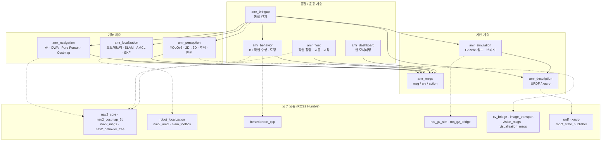
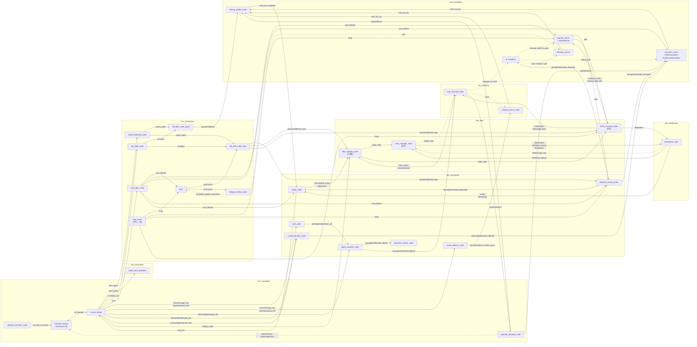
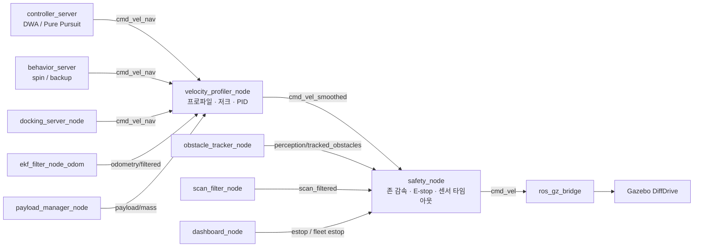

# 컴포넌트 다이어그램 및 ROS2 노드 그래프

> 명세 4장 10절 "문서화" 산출물. **설계 문서 — 구현 시 갱신.**
> 기준: `src/*/package.xml` (3c1813a), `src/amr_msgs` 정의, `config/*.yaml`, 명세 4장 1~10절.
> 시퀀스 다이어그램은 [sequences.md](sequences.md), TF 트리는 [README.md](README.md),
> 다중 로봇 네임스페이스 설계는 [multi_robot.md](multi_robot.md) 참고.

이 문서는 명세가 요구하는 "API 문서 (각 노드의 토픽/서비스/액션 인터페이스)" 의 골격을 겸한다.
표의 모든 인터페이스 타입은 `docker/Dockerfile` 로 빌드한 이미지 안에서 `ros2 interface show` 로 존재를 확인한 것이다
(`amr_msgs` 는 스크래치 워크스페이스에 빌드하여 확인). 라이브러리 버전은 Dockerfile 의 고정(pin) 값을 인용한다.

---

## 1. 설계 원칙

| 원칙 | 내용 |
| --- | --- |
| 패키지 단일 책임 | 명세 7장 제약. 기능별 패키지 10개, 의존은 아래 다이어그램대로만 허용 |
| 상대 토픽 이름 | 로봇별 토픽은 전부 **상대 이름**. 런치가 `/<robot_id>/` 네임스페이스와 TF prefix 를 주입한다 (`config/ekf.yaml` 의 상대 이름 규칙과 동일) |
| 전역 토픽은 최소화 | `/map`(+ `/map_server/*` 서비스), `/tf`, `/tf_static`, `/clock`, `/fleet/*` 만 전역. 그 외는 모두 로봇 네임스페이스 아래 |
| 이중 EKF | `ekf_filter_node_odom` → `odom→base_footprint`, `odometry/filtered` / `ekf_filter_node_map` → `map→odom`, `odometry/filtered_map`. AMCL 은 `tf_broadcast: false` |
| Nav2 기반 + 직접 구현 | A*/DWA/Pure Pursuit 는 `nav2_core` pluginlib 플러그인으로 구현해 Nav2 서버에 로드 (명세 7장). 속도 프로파일/PID 와 안전 게이트는 자체 노드로 Nav2 `velocity_smoother`/`collision_monitor` 를 대체 |
| 설정 외부화 | 튜닝값은 전부 `config/*.yaml` 과 패키지별 `config/` 에 두고 재빌드 없이 변경 (명세 9장 평가 항목) |
| 언어 선택 | Nav2 플러그인·BT·고주기 제어/안전 경로는 C++, 딥러닝·플릿·대시보드·저주기 로직은 Python (근거는 3절) |

---

## 2. 패키지 컴포넌트 다이어그램

`package.xml` 의 `<depend>` 를 그대로 옮긴 것이다. 실선은 `amr_*` 내부 의존, 점선은 외부(ROS2 Humble apt) 의존 중 설계상 핵심만 표시했다.



| 패키지 | 내부 의존 | 주요 외부 의존 (`package.xml`) | 빌드 타입 |
| --- | --- | --- | --- |
| `amr_msgs` | — | std_msgs, geometry_msgs, builtin_interfaces, rosidl_default_generators | ament_cmake (rosidl) |
| `amr_description` | — | urdf, xacro, robot_state_publisher, joint_state_publisher | ament_cmake |
| `amr_simulation` | amr_description | ros_gz_sim, ros_gz_bridge | ament_cmake |
| `amr_localization` | amr_msgs | nav2_amcl, slam_toolbox, robot_localization, sensor_msgs, nav_msgs, tf2_ros | ament_cmake + python |
| `amr_navigation` | amr_msgs | nav2_core, nav2_costmap_2d, nav2_msgs, nav_msgs, geometry_msgs, tf2_ros | ament_cmake + python |
| `amr_perception` | amr_msgs | sensor_msgs, vision_msgs, visualization_msgs, cv_bridge, image_transport, tf2_ros | ament_cmake + python |
| `amr_behavior` | amr_msgs | behaviortree_cpp, nav2_behavior_tree, nav2_msgs | ament_cmake + python |
| `amr_fleet` | amr_msgs | nav2_msgs, geometry_msgs | ament_cmake + python |
| `amr_dashboard` | amr_msgs | nav_msgs, geometry_msgs | ament_cmake + python |
| `amr_bringup` | description, simulation, localization, navigation, perception, behavior | — | ament_cmake |

설계상 필요하지만 현재 `package.xml` 에 없는 의존 (구현 시 추가):

- `amr_simulation`: `rclpy`, `ros_gz_interfaces`, `std_msgs`, `geometry_msgs` (`payload_manager_node`, `obstacle_animator_node`)
- `amr_fleet`: `amr_bringup` (exec, `multi_robot.launch.py` 가 `system.launch.py` 를 로봇별로 include), `nav_msgs`, `diagnostic_msgs`, `std_msgs`, `python3-scipy`, `python3-networkx`
- `amr_perception`: `nav_msgs`, `std_msgs`, `std_srvs`, `python3-numpy` (+ `ultralytics`, `torch` 는 pip)
- `amr_behavior`: `geometry_msgs`, `std_msgs`, `tf2_ros`. `behaviortree_cpp`(v4) 대신 `behaviortree_cpp_v3` 권장 — Humble 의 `nav2_behavior_tree` 가 v3 에 링크되므로 한 프로세스에 두 버전을 섞지 않는다
- `amr_dashboard`: `diagnostic_msgs`, `std_msgs`, `python3-flask`
- `amr_localization`: `std_msgs`, `std_srvs`, `nav2_map_server`, `nav2_lifecycle_manager`
- `amr_navigation`: `nav2_planner`, `nav2_controller`, `nav2_behaviors`, `nav2_bt_navigator`, `nav2_lifecycle_manager`, `pluginlib`, `std_msgs`

---

## 3. 노드 설계 (패키지별)

실행 형태: **LC** = Nav2 lifecycle 노드, **plugin** = 다른 프로세스에 로드되는 pluginlib 플러그인, **ext** = 외부 패키지 실행 파일(설정만 작성), **own** = 직접 구현 노드.

### 3.1 amr_description / amr_simulation

| 노드 | 언어 | 형태 | 역할 | 언어 근거 |
| --- | --- | --- | --- | --- |
| `robot_state_publisher` | C++ | ext | xacro → `robot_description`, 고정 조인트 TF (`base_link→센서`), 바퀴 조인트 TF | — |
| `joint_state_publisher` | Python | ext | RViz 단독 확인용. 시뮬레이션에서는 Gazebo `joint_states` 를 쓰므로 미기동 | — |
| Gazebo Fortress (`ign gazebo`) | — | ext | 60×40 m 월드, 센서 노이즈(SDF `<noise>`), DiffDrive/JointStatePublisher/OdometryPublisher/LinearBattery/DetachableJoint 시스템 플러그인 (이미지에 존재 확인) | — |
| `ros_gz_bridge` (`parameter_bridge`) | C++ | ext | gz ↔ ROS2 토픽 브리지 (센서, `cmd_vel`, `joint_states`, `battery_state`, `ground_truth/odom`, `/clock`) | — |
| `obstacle_animator_node` | Python | own | 작업자/지게차 5개 이상을 직선·곡선·무작위 패턴, 0.3~1.5 m/s 로 구동 (gz `cmd_vel`) | 저주기(10 Hz) 스크립트 로직 |
| `payload_manager_node` | Python | own | 적재/하역 이벤트: 박스 모델 spawn + DetachableJoint 부착으로 질량 변화 반영, 충전 이벤트 | gz 서비스 호출 위주, 성능 무관 |

### 3.2 amr_localization

| 노드 | 언어 | 형태 | 역할 | 언어 근거 |
| --- | --- | --- | --- | --- |
| `wheel_odometry_node` | C++ | own | `joint_states` → 4096 tick 양자화 + 슬립 노이즈(`sensors.yaml wheel_encoder`) → **순기구학 직접 구현** → `wheel_odom` 50 Hz | 50 Hz × 5대, EKF 입력 지연 최소화 |
| `imu_filter_node` | C++ | own | `imu/data_raw` → 저역 통과 + 바이어스 보정 → `imu/data` 100 Hz | 100 Hz |
| `scan_filter_node` | C++ | own | `scan` → 거리/각도 필터 + 아웃라이어 제거 → `scan_filtered` 10 Hz | 720 pt × 10 Hz × 5대 |
| `slam_toolbox` (`async_slam_toolbox_node`) | C++ | ext | 매핑 모드 전용. `scan_filtered` → `/map`, `map→odom` TF. 저장은 `map_saver_cli` | — |
| `map_server` | C++ | LC/ext | **루트(`/`)에 1개만** 기동, `maps/*.yaml` → `/map` (transient_local). 로봇별 AMCL·전역 costmap·추적기가 절대 이름 `/map` 을 구독 ([multi_robot.md](multi_robot.md) §4) | — |
| `amcl` | C++ | LC/ext | `scan_filtered` + `/map` → `amcl_pose`. `tf_broadcast: false` (map→odom 은 EKF 가 발행) | — |
| `ekf_filter_node_odom` | C++ | ext | `wheel_odom` + `imu/data` → `odometry/filtered`, TF `odom→base_footprint` | — |
| `ekf_filter_node_map` | C++ | ext | `wheel_odom` + `imu/data` + `amcl_pose` → `odometry/filtered_map`, TF `map→odom` | — |
| `kidnap_monitor_node` | Python | own | `amcl_pose` 공분산 급증/점프 감지 → `reinitialize_global_localization` + `spin` 요청, `localization/lost` 발행 | 저주기 감시 로직 |
| `lifecycle_manager_localization` | C++ | ext | 로봇별 `amcl` configure/activate. 루트 `map_server` 는 `multi_robot.launch.py`(단일 로봇은 `system.launch.py`)가 별도 `lifecycle_manager_map` 으로 활성화 | — |

매핑 모드(`mode:=slam`)에서는 `slam_toolbox` 만, 주행 모드(`mode:=localization`)에서는 로봇별 `amcl`+`ekf_filter_node_map` 을 기동하고, 루트 `map_server` 는 로봇 수와 무관하게 1개만 띄운다(이미 떠 있으면 재사용). 두 모드는 `map→odom` 발행자가 겹치므로 동시에 켜지 않는다.

### 3.3 amr_navigation

| 노드 / 플러그인 | 언어 | 형태 | 역할 | 언어 근거 |
| --- | --- | --- | --- | --- |
| `planner_server` | C++ | LC/ext | 전역 costmap (static + obstacle + inflation + **keepout_filter**) 호스트. 액션 `compute_path_to_pose` | — |
| ↳ `amr_navigation::AStarPlanner` | C++ | plugin | **A* 직접 구현** + 경로 평활화. `nav2_core::GlobalPlanner`. 비교군 `nav2_navfn_planner/NavfnPlanner`, `nav2_smac_planner/SmacPlanner2D` 를 `planner_id` 로 선택 | nav2_core 는 C++ pluginlib 전용 |
| `controller_server` | C++ | LC/ext | 지역 costmap (obstacle + voxel + inflation) 호스트. 액션 `follow_path` | — |
| ↳ `amr_navigation::DWAController` | C++ | plugin | **DWA 직접 구현**: 속도 샘플링 → 궤적 시뮬레이션 → 비용(heading/clearance/velocity/path) → 최적 속도. `perception/tracked_obstacles` 의 예측 위치를 clearance 비용에, **Velocity Obstacle** 을 샘플 제외 조건에 반영 | 동일 |
| ↳ `amr_navigation::PurePursuitController` | C++ | plugin | **Pure Pursuit 직접 구현**, 속도 적응 look-ahead. `controller_id` 로 DWA 와 선택 (BT 가 구간별로 지정) | 동일 |
| `behavior_server` | C++ | LC/ext | `spin` / `backup` / `wait` / `drive_on_heading` 복구 액션 | — |
| `bt_navigator` | C++ | LC/ext | `navigate_to_pose` 액션. BT XML 은 자체 파일 (`RateController` 1 Hz 재계획 + TTC 조건 재계획) | — |
| ↳ `amr_behavior::IsTTCBelowThreshold` | C++ | plugin | Nav2 BT 조건 노드. `perception/tracked_obstacles` 의 최소 TTC < 임계 시 즉시 재계획 트리거 (3.5절) | BT.CPP v3 |
| `velocity_profiler_node` | C++ | own | `cmd_vel_nav` → 사다리꼴/S-curve 프로파일 + 저크 제한 + **PID 속도 제어**(`odometry/filtered` 피드백, `payload/mass` 피드포워드) → `cmd_vel_smoothed` 50 Hz. Nav2 `velocity_smoother` 대체 | 50 Hz 제어 루프 |
| `lifecycle_manager_navigation` | C++ | ext | 위 LC 노드 일괄 configure/activate | — |

### 3.4 amr_perception

| 노드 | 언어 | 형태 | 역할 | 언어 근거 |
| --- | --- | --- | --- | --- |
| `pointcloud_filter_node` | C++ | own | `camera/depth/image_raw` + `camera/depth/camera_info` → 깊이 d 에 **거리 제곱 노이즈 N(0, k·d²) 가산**(`sensors.yaml depth_camera.noise_quadratic_coeff`, 명세 7장 노이즈 모델) → 역투영 점군 생성(시뮬레이터 점군은 좌표 규약 문제로 쓰지 않음 — `sensors.yaml` 주석) → 거리 컷 + voxel 다운샘플 → `camera/depth/points_filtered` (지역 costmap voxel layer 입력) | 640×480 @15 Hz |
| `yolo_node` | Python | own | `camera/image_raw` → YOLOv8 (ultralytics 8.4.155, torch 2.11 cu128 — Dockerfile 고정) → `perception/detections_2d`. 목표 GPU 30 FPS | ultralytics/torch 가 Python |
| `object_localizer_node` | Python | own | 2D bbox 중심 + depth → **Pinhole 역투영** → TF 로 map frame 변환 → `perception/detected_objects` | numpy 소규모 연산 |
| `detection_marker_node` | Python | own | `perception/detected_objects` → RViz `MarkerArray` (CUBE + TEXT "Class/Conf/Dist") | 시각화 전용 |
| `aruco_detector_node` | Python | own | `camera/image_raw` → `cv2.aruco` (opencv-contrib-python-headless 4.11.0.86 — Dockerfile 고정) → 도킹 마커 자세 `perception/dock_marker_pose` (base_link 기준) | OpenCV Python |
| `obstacle_tracker_node` | C++ | own | `scan_filtered` − `/map` 배경 → 클러스터링 → 데이터 연관 → **칼만 필터** → 속도/방향/신뢰도/동적 여부 → 경로(`plan`)·자기 속도 기반 **TTC** → `perception/tracked_obstacles` 10 Hz | 안전 체인(스캔→TTC→정지) 지연 최소화 |
| `safety_node` | C++ | own | `cmd_vel_smoothed` 게이트 → `cmd_vel`. 거리 존 Warning 1.0 m(≤ 0.5 m/s) / Critical 0.5 m(≤ 0.2 m/s) / 정지 0.3 m, TTC 기반 연속 감속 v ≤ a·(TTC − t_react) ([sequences.md](sequences.md) §2), E-stop 래치, 센서 타임아웃(`robot_params.yaml safety.sensor_timeouts`, 토픽별 ≈3 주기: LiDAR 0.3 / depth 0.2 / RGB 0.1 / IMU 0.05 / 엔코더 0.06 s) — LiDAR·휠 엔코더 고장은 **정지**, IMU·카메라 고장은 `degraded_mode_max_speed` **0.2 m/s 저속** | 안전 필수, 50 Hz |

### 3.5 amr_behavior

| 노드 | 언어 | 형태 | 역할 | 언어 근거 |
| --- | --- | --- | --- | --- |
| `task_executor_node` | C++ | own | BehaviorTree.CPP 작업 BT (`대기-이동-인식-작업-복귀`). `assign_task` 서비스 서버, `navigate_to_pose`/`dock` 액션 클라이언트. Groot ZMQ 퍼블리셔. `nav2_behavior_tree::BtActionNode` 재사용 | BehaviorTree.CPP 는 C++ |
| `docking_server_node` | C++ | own | `dock` 액션 서버. 마커 자세 기반 정밀 접근(20 Hz 시각 서보), 2 cm / 1° 판정, 최대 3회 재시도 | 제어 루프 |

BT 노드 목록 (≥15, 명세 8장): Control `Sequence` `Fallback` `ReactiveSequence` `Parallel` / Decorator `RetryUntilSuccessful` `Timeout` `Inverter` `KeepRunningUntilFailure` / Condition `IsTaskAssigned` `IsBatteryOk` `IsEstopClear` `IsTrafficHold` `IsLocalized` `IsObjectDetected` `IsDockMarkerVisible` / Action `NavigateToPose` `Dock` `SimulateLoad` `SimulateUnload` `ReportTaskStatus` `Spin` `BackUp` `Wait` `ClearCostmap`.
서브트리: `MoveTo`, `DockAt`, `Load`, `Unload`, `RecoverNavigation`, `RecoverPerception`, `RecoverDocking`, `Charge`, `Yield`.

### 3.6 amr_fleet

| 노드 | 언어 | 형태 | 역할 | 언어 근거 |
| --- | --- | --- | --- | --- |
| `fleet_manager_node` (중앙, 1개) | Python | own | JSON Task 수신·검증(스키마 draft-07 + 의미 규칙, 위반은 알림 후 버림) → 우선순위/마감 큐 → **할당(최소 거리 / 부하 균형 / Hungarian, `allocation_strategy` 파라미터)** → 로봇 `assign_task` 호출. 결과가 불확실한 호출은 보류·조정(중복 실행 방지), 작업 소유권 검사, 로봇 생존 감시. 작업 상태 이벤트, KPI(`FleetStatus`), 작업 로그(`logs/`) | scipy `linear_sum_assignment`, 저주기 |
| `traffic_manager_node` (중앙, 1개) | Python | own | 로봇별 `plan`/자세로 경로 충돌 예측, 교차로 우선순위, **교착 탐지(wait-for 그래프 사이클)**, 해소 전략 ① 우선순위 양보(`traffic/hold`, `traffic/yield_pose`) ② 대체 경로(`keepout_mask`) | networkx, 2 Hz |
| `fleet_adapter_node` (로봇별) | Python | own | 로봇 상태 취합 → `robot_state` 2 Hz (E-stop 변화 시 즉시). 통신 지연(0~100 ms) 시뮬레이션 지연 큐. 모의 `assign_task` 서버·모의 완료는 실행기 없는 시험 전용(기본 꺼짐) | 경량 취합 |

### 3.7 amr_dashboard

| 노드 | 언어 | 형태 | 역할 | 언어 근거 |
| --- | --- | --- | --- | --- |
| `dashboard_node` | Python | own | Flask 3.1.3 + SSE 웹 대시보드 `:8080`. 로봇 위치/상태/배터리/작업, KPI, 알림(긴급 정지/작업 실패/교착). 작업 투입, E-stop 버튼 (해제는 `safety/reset_estop` 성공 확인). Host 허용 목록·선택적 조작 토큰 | 웹 스택 |

---

## 4. ROS2 노드 그래프

단일 로봇(`/amr_01`) 기준. 실선 = 토픽, 점선 = 서비스/액션. 로봇별 토픽은 상대 이름(네임스페이스 생략), 전역 토픽은 `/` 로 시작.
매핑 모드의 `slam_toolbox` 와 평가 전용 토픽(`ground_truth/odom`)은 생략했다.



### 4.1 속도 명령 체인

한 로봇 안에서 `cmd_vel` 발행자는 **`safety_node` 하나**뿐이다. 그 앞단은 Nav2 관례(`cmd_vel_nav` → `cmd_vel_smoothed` → `cmd_vel`)를 따르고, `velocity_smoother` 와 `collision_monitor` 자리를 직접 구현 노드로 채운다.
`cmd_vel_nav` 에는 `controller_server`, `behavior_server`, `docking_server_node` 세 발행자가 있으나 BT 가 상호 배타로 실행하므로 동시에 발행하지 않는다 (Nav2 docking 서버와 같은 방식).



### 4.2 TF 발행자

| 변환 | 발행자 | 비고 |
| --- | --- | --- |
| `map → <r>/odom` | `ekf_filter_node_map` (주행 모드) / `slam_toolbox` (매핑 모드) | AMCL 은 발행하지 않음 |
| `<r>/odom → <r>/base_footprint` | `ekf_filter_node_odom` | |
| `<r>/base_footprint → <r>/base_link` | `robot_state_publisher` (고정) | |
| `<r>/base_link → <r>/{lidar,camera,imu}_link`, `*_optical_frame` | `robot_state_publisher` (고정, `sensors.yaml` extrinsic) | |
| `<r>/base_link → <r>/{left,right}_wheel_link` | `robot_state_publisher` (`joint_states`) | |

`<r>` = 로봇 prefix (`amr_01` …). 프레임 prefix 주입 방식은 [multi_robot.md](multi_robot.md) 참고.

---

## 5. 인터페이스 명세 (API 문서 골격 — 설계, 구현 시 갱신)

표기: **Sub** 구독 / **Pub** 발행 / **SrvS** 서비스 서버 / **SrvC** 서비스 클라이언트 / **ActS** 액션 서버 / **ActC** 액션 클라이언트.
QoS 약어: `sensor` = best-effort depth 5, `reliable` = reliable volatile depth 10, `latched` = reliable transient_local depth 1.
이름은 로봇 네임스페이스 기준 상대 이름. `/` 로 시작하면 전역.

### 5.1 센서 · 시뮬레이션 (`ros_gz_bridge`)

| 방향 | 이름 | 타입 | 주기 / QoS | 비고 |
| --- | --- | --- | --- | --- |
| Pub | `scan` | `sensor_msgs/msg/LaserScan` | 10 Hz, sensor | 720 샘플, σ=0.03 m (SDF noise). `sensors.yaml lidar.topic` |
| Pub | `imu/data_raw` | `sensor_msgs/msg/Imu` | 100 Hz, sensor | 바이어스+가우시안 노이즈 (SDF). 필터 후 `imu/data` |
| Pub | `camera/image_raw` | `sensor_msgs/msg/Image` | 30 Hz, sensor | 640×480 RGB |
| Pub | `camera/camera_info` | `sensor_msgs/msg/CameraInfo` | 30 Hz, sensor | Pinhole 내부 파라미터 |
| Pub | `camera/depth/image_raw` | `sensor_msgs/msg/Image` | 15 Hz, sensor | 32FC1. 시뮬레이터는 `noise_base` σ 0.005 m 만 적용(SDF 네이티브). 거리 제곱 항 k·d² (k = 0.002 m⁻¹) 은 `pointcloud_filter_node` 가 가산 → 합성 σ(d) = sqrt(0.005² + (0.002·d²)²) (`sensors.yaml depth_camera`) |
| Pub | `camera/depth/camera_info` | `sensor_msgs/msg/CameraInfo` | 15 Hz, sensor | `sensors.yaml depth_camera.info_topic`. 점군 역투영 + `safety_node` 생존 감시 |
| Pub | `camera/depth/points` | `sensor_msgs/msg/PointCloud2` | 15 Hz, sensor | **기본 브리지 안 함**(디버그 시만). 좌표가 optical 이 아닌 본체 규약으로 나와 그대로 쓸 수 없다 (`sensors.yaml` 주석) |
| Pub | `joint_states` | `sensor_msgs/msg/JointState` | 50 Hz, reliable | 바퀴 조인트 위치/속도 (인코더 원천) |
| Pub | `battery_state` | `sensor_msgs/msg/BatteryState` | 1 Hz, reliable | LinearBatteryPlugin |
| Pub | `ground_truth/odom` | `nav_msgs/msg/Odometry` | 50 Hz, reliable | OdometryPublisher, 노이즈 없음. **평가 전용** (RMSE/CTE/도킹 오차) |
| Pub | `/clock` | `rosgraph_msgs/msg/Clock` | 전역 | `use_sim_time: true` |
| Sub | `cmd_vel` | `geometry_msgs/msg/Twist` | reliable | Gazebo DiffDrive 입력 |

`obstacle_animator_node`: Pub gz `/model/<actor>/cmd_vel` (`geometry_msgs/msg/Twist`, 브리지 경유), 파라미터 `patterns`, `speed_range: [0.3, 1.5]`, `seed`.

`payload_manager_node`:

| 방향 | 이름 | 타입 | 비고 |
| --- | --- | --- | --- |
| Sub | `payload/attach` | `std_msgs/msg/String` | `"small" / "medium" / "large"` 부착, `""` 분리 |
| Sub | `charging/enable` | `std_msgs/msg/Bool` | 충전 스테이션 도킹 시 true |
| Pub | `payload/mass` | `std_msgs/msg/Float32` | latched. `robot_params.yaml payload.*.mass` |
| SrvC | `/world/<world>/create`, `/world/<world>/remove` | `ros_gz_interfaces/srv/SpawnEntity`, `ros_gz_interfaces/srv/DeleteEntity` | 브리지 경유 |

### 5.2 amr_localization

`wheel_odometry_node`

| 방향 | 이름 | 타입 | 주기 / QoS | 비고 |
| --- | --- | --- | --- | --- |
| Sub | `joint_states` | `sensor_msgs/msg/JointState` | 50 Hz | |
| Pub | `wheel_odom` | `nav_msgs/msg/Odometry` | 50 Hz, reliable | frame `<r>/odom`, child `<r>/base_footprint`. 공분산은 슬립 모델에서 산출. TF 는 발행하지 않음(EKF 가 담당) |

`imu_filter_node`: Sub `imu/data_raw` → Pub `imu/data` (`sensor_msgs/msg/Imu`, 100 Hz). 파라미터 `lpf_cutoff_hz`, `bias_estimation_time`(기동 시 정지 평균, 기본 60 s), `accel_bias`/`gyro_bias`(double[3], 실기에서는 파일 값으로 덮어쓰기) — 절차는 [sensor_calibration.md](sensor_calibration.md) §2.4.

`scan_filter_node`: Sub `scan` → Pub `scan_filtered` (`sensor_msgs/msg/LaserScan`, 10 Hz). 파라미터 `range_min/max`, `angle_mask`, `outlier_window`, `outlier_thresh`.

`map_server` (ext, **루트에 1개**): Pub `/map` (`nav_msgs/msg/OccupancyGrid`, latched), SrvS `/map_server/map` (`nav_msgs/srv/GetMap`), `/map_server/load_map` (`nav2_msgs/srv/LoadMap`) — 모두 절대 이름. 로봇별 `amcl`·`planner_server`(static layer)·`obstacle_tracker_node` 와 중앙 `traffic_manager_node`·`dashboard_node` 가 `/map` 을 구독한다.

`slam_toolbox` (매핑 모드, ext): Sub `scan_filtered`; Pub `/map`, `pose` (`geometry_msgs/msg/PoseWithCovarianceStamped`); SrvS `slam_toolbox/save_map` (`slam_toolbox/srv/SaveMap`), `slam_toolbox/serialize_map` (`slam_toolbox/srv/SerializePoseGraph`); TF `map→<r>/odom`.

`amcl` (ext)

| 방향 | 이름 | 타입 | 비고 |
| --- | --- | --- | --- |
| Sub | `scan_filtered` | `sensor_msgs/msg/LaserScan` | `scan_topic` 파라미터 |
| Sub | `/map` | `nav_msgs/msg/OccupancyGrid` | |
| Sub | `initialpose` | `geometry_msgs/msg/PoseWithCovarianceStamped` | RViz/런치 초기 자세 |
| Pub | `amcl_pose` | `geometry_msgs/msg/PoseWithCovarianceStamped` | `ekf_filter_node_map` 의 `pose0` |
| Pub | `particle_cloud` | `nav2_msgs/msg/ParticleCloud` | 튜닝 확인용 |
| SrvS | `reinitialize_global_localization` | `std_srvs/srv/Empty` | 납치 복구 |

`ekf_filter_node_odom` / `ekf_filter_node_map` (robot_localization `ekf_node`, ext)

| 노드 | Sub | Pub | TF | SrvS |
| --- | --- | --- | --- | --- |
| `ekf_filter_node_odom` | `wheel_odom`, `imu/data` | `odometry/filtered` (`nav_msgs/msg/Odometry`, 50 Hz) | `<r>/odom → <r>/base_footprint` | `set_pose` (`robot_localization/srv/SetPose`) |
| `ekf_filter_node_map` | `wheel_odom`, `imu/data`, `amcl_pose` | `odometry/filtered_map` (`nav_msgs/msg/Odometry`, 50 Hz) | `map → <r>/odom` | `set_pose` |

`kidnap_monitor_node`

| 방향 | 이름 | 타입 | 비고 |
| --- | --- | --- | --- |
| Sub | `amcl_pose` | `geometry_msgs/msg/PoseWithCovarianceStamped` | 공분산 trace > `cov_thresh` 또는 `odometry/filtered` 대비 점프 > `jump_thresh` |
| Sub | `odometry/filtered` | `nav_msgs/msg/Odometry` | |
| Pub | `localization/lost` | `std_msgs/msg/Bool` | latched. BT `IsLocalized` 가 구독 |
| SrvC | `reinitialize_global_localization` | `std_srvs/srv/Empty` | |
| ActC | `spin` | `nav2_msgs/action/Spin` | 제자리 회전으로 파티클 수렴 유도 |

### 5.3 amr_navigation

Nav2 서버 (ext, 액션·토픽 이름은 Nav2 Humble 기본값)

| 노드 | 방향 | 이름 | 타입 | 비고 |
| --- | --- | --- | --- | --- |
| `bt_navigator` | ActS | `navigate_to_pose` | `nav2_msgs/action/NavigateToPose` | `behavior_tree` 필드로 BT XML 선택 |
| `bt_navigator` | ActS | `navigate_through_poses` | `nav2_msgs/action/NavigateThroughPoses` | 경유점 작업용 |
| `bt_navigator` | Pub | `behavior_tree_log` | `nav2_msgs/msg/BehaviorTreeLog` | Groot/로그 |
| `planner_server` | ActS | `compute_path_to_pose` | `nav2_msgs/action/ComputePathToPose` | `planner_id`: `AStar` / `NavFn` / `Smac` |
| `planner_server` | Pub | `plan` | `nav_msgs/msg/Path` | 추적기 TTC · 교통 관리자 입력 |
| `planner_server` | Sub | `scan_filtered`, `/map` | | 전역 costmap obstacle/static layer |
| `planner_server` | Sub | `keepout_mask`, `costmap_filter_info` | `nav_msgs/msg/OccupancyGrid`, `nav2_msgs/msg/CostmapFilterInfo` | `nav2_costmap_2d::KeepoutFilter` (교통 관리자 발행, latched) |
| `planner_server` | Pub | `global_costmap/costmap` | `nav_msgs/msg/OccupancyGrid` | |
| `planner_server` | SrvS | `global_costmap/clear_entirely_global_costmap` | `nav2_msgs/srv/ClearEntireCostmap` | 복구 |
| `controller_server` | ActS | `follow_path` | `nav2_msgs/action/FollowPath` | `controller_id`: `DWA` / `PurePursuit` |
| `controller_server` | Sub | `scan_filtered`, `camera/depth/points_filtered` | | 지역 costmap obstacle/voxel layer |
| `controller_server` | Sub | `perception/tracked_obstacles` | `amr_msgs/msg/TrackedObstacleArray` | DWA 플러그인 내부 구독 (예측 위치 비용, VO) |
| `controller_server` | Sub | `payload/mass` | `std_msgs/msg/Float32` | 가속 한계 보정 |
| `controller_server` | Pub | `cmd_vel_nav` | `geometry_msgs/msg/Twist` | 20 Hz (`controller_frequency`). 기본 `cmd_vel` 을 리맵 |
| `controller_server` | Pub | `local_plan`, `local_costmap/costmap` | `nav_msgs/msg/Path`, `nav_msgs/msg/OccupancyGrid` | |
| `controller_server` | SrvS | `local_costmap/clear_entirely_local_costmap` | `nav2_msgs/srv/ClearEntireCostmap` | |
| `behavior_server` | ActS | `spin`, `backup`, `wait`, `drive_on_heading` | `nav2_msgs/action/Spin`, `BackUp`, `Wait`, `DriveOnHeading` | `cmd_vel` → `cmd_vel_nav` 리맵 |
| `lifecycle_manager_navigation` | SrvS | `lifecycle_manager_navigation/manage_nodes` | `nav2_msgs/srv/ManageLifecycleNodes` | |

`velocity_profiler_node`

| 방향 | 이름 | 타입 | 주기 / QoS | 비고 |
| --- | --- | --- | --- | --- |
| Sub | `cmd_vel_nav` | `geometry_msgs/msg/Twist` | reliable depth 1 | |
| Sub | `odometry/filtered` | `nav_msgs/msg/Odometry` | 50 Hz | PID 피드백 (측정 v, ω) |
| Sub | `payload/mass` | `std_msgs/msg/Float32` | latched | 피드포워드 게인 |
| Pub | `cmd_vel_smoothed` | `geometry_msgs/msg/Twist` | 50 Hz | `robot_params.yaml limits.*` (v 2.0, a 1.0, ω 1.5, jerk 2.0) |

### 5.4 amr_perception

| 노드 | 방향 | 이름 | 타입 | 주기 / QoS | 비고 |
| --- | --- | --- | --- | --- | --- |
| `pointcloud_filter_node` | Sub | `camera/depth/image_raw`, `camera/depth/camera_info` | `sensor_msgs/msg/Image`, `sensor_msgs/msg/CameraInfo` | 15 Hz | message_filters 시간 동기 |
| | Pub | `camera/depth/points_filtered` | `sensor_msgs/msg/PointCloud2` | 15 Hz, sensor | frame `<r>/camera_depth_optical_frame`. 깊이에 N(0, k·d²) 가산(`sensors.yaml depth_camera.noise_quadratic_coeff`) → 역투영 → `max_range` 5 m 컷 → voxel `leaf_size` 0.05 m (`0` 이면 다운샘플 없음 — 노이즈 검증용) |
| `yolo_node` | Sub | `camera/image_raw` | `sensor_msgs/msg/Image` | 30 Hz | |
| | Pub | `perception/detections_2d` | `vision_msgs/msg/Detection2DArray` | ≤30 Hz | class ≥3 (box/person/sign), `conf_thresh` |
| `object_localizer_node` | Sub | `perception/detections_2d`, `camera/depth/image_raw`, `camera/camera_info` | | | message_filters 시간 동기 |
| | Pub | `perception/detected_objects` | `amr_msgs/msg/DetectedObjectArray` | ≤30 Hz | `pose_3d.header.frame_id = map`, `distance` = base_link 기준 |
| `detection_marker_node` | Sub | `perception/detected_objects` | `amr_msgs/msg/DetectedObjectArray` | | |
| | Pub | `perception/markers` | `visualization_msgs/msg/MarkerArray` | | CUBE + TEXT_VIEW_FACING |
| `aruco_detector_node` | Sub | `camera/image_raw`, `camera/camera_info` | | 30 Hz | 파라미터 `dictionary`, `marker_size`, `enabled` (도킹 중만 켜기) |
| | Pub | `perception/dock_marker_pose` | `geometry_msgs/msg/PoseStamped` | ≤30 Hz | frame `<r>/base_link`. 미검출 시 미발행 |
| `obstacle_tracker_node` | Sub | `scan_filtered` | `sensor_msgs/msg/LaserScan` | 10 Hz | |
| | Sub | `/map` | `nav_msgs/msg/OccupancyGrid` | latched | 정적 배경 제거 |
| | Sub | `odometry/filtered_map`, `plan` | `nav_msgs/msg/Odometry`, `nav_msgs/msg/Path` | | TTC 계산용 자기 상태·경로 |
| | Pub | `perception/tracked_obstacles` | `amr_msgs/msg/TrackedObstacleArray` | 10 Hz, reliable | frame `map`. `time_to_collision` = inf 이면 비충돌 |
| | Pub | `perception/tracked_markers` | `visualization_msgs/msg/MarkerArray` | 10 Hz | 속도 화살표 + track_id |
| `safety_node` | Sub | `cmd_vel_smoothed` | `geometry_msgs/msg/Twist` | | |
| | Sub | `scan_filtered` | `sensor_msgs/msg/LaserScan` | 10 Hz | 존 판정(footprint 기준 최근접 거리). 타임아웃 `sensor_timeouts.lidar` 0.3 s → **정지** |
| | Sub | `perception/tracked_obstacles` | `amr_msgs/msg/TrackedObstacleArray` | | TTC ≤ τ_crit 이면 v ≤ a·(TTC − t_react) 연속 제한 ([sequences.md](sequences.md) §2) |
| | Sub | `imu/data`, `wheel_odom` | | 100 / 50 Hz | 타임아웃 `sensor_timeouts.imu` 0.05 s → `degraded_mode_max_speed` 0.2 m/s 저속, `sensor_timeouts.wheel_encoder` 0.06 s → **정지** |
| | Sub | `camera/camera_info`, `camera/depth/camera_info` | `sensor_msgs/msg/CameraInfo` | 30 / 15 Hz | 카메라 생존 감시(이미지와 같은 주기의 경량 메시지). 타임아웃 `sensor_timeouts.rgb_camera` 0.1 s / `sensor_timeouts.depth_camera` 0.2 s → 0.2 m/s 저속 |
| | Sub | `estop`, `/fleet/estop` | `std_msgs/msg/Bool` | latched | 대시보드 E-stop 버튼 (로봇별 / 전체) |
| | Pub | `cmd_vel` | `geometry_msgs/msg/Twist` | 50 Hz | 유일한 `cmd_vel` 발행자 |
| | Pub | `safety/estop_active` | `std_msgs/msg/Bool` | latched | 0.3 m 침범 / E-stop / 센서 고장 |
| | Pub | `safety/zone` | `std_msgs/msg/UInt8` | 변화 시 | 0 CLEAR · 1 WARNING(1.0 m) · 2 CRITICAL(0.5 m) · 3 STOP(0.3 m) |
| | SrvS | `safety/reset_estop` | `std_srvs/srv/Trigger` | | 래치 해제 (원인 해소 후) |

### 5.5 amr_behavior

`task_executor_node`

| 방향 | 이름 | 타입 | 비고 |
| --- | --- | --- | --- |
| SrvS | `assign_task` | `amr_msgs/srv/AssignTask` | 플릿이 호출. IDLE 이 아니면 `success=false`, `message="busy"` |
| Pub | `task_status` | `amr_msgs/msg/Task` | 상태 전이마다 (PENDING→IN_PROGRESS→COMPLETED/FAILED) |
| Pub | `executor/phase` | `std_msgs/msg/String` | `idle / moving / docking / loading / charging / error` — `RobotState.status` 매핑 원천 |
| Sub | `perception/detected_objects` | `amr_msgs/msg/DetectedObjectArray` | `IsObjectDetected` 조건 |
| Sub | `localization/lost`, `safety/estop_active` | `std_msgs/msg/Bool` | `IsLocalized`, `IsEstopClear` 조건 |
| Sub | `traffic/hold` | `std_msgs/msg/Bool` | `IsTrafficHold` 조건 (ReactiveSequence 가 주행 중단) |
| Sub | `traffic/yield_pose` | `geometry_msgs/msg/PoseStamped` | 양보 위치 |
| Sub | `battery_state` | `sensor_msgs/msg/BatteryState` | `IsBatteryOk` |
| Pub | `payload/attach`, `charging/enable` | `std_msgs/msg/String`, `std_msgs/msg/Bool` | 적재/하역/충전 이벤트 |
| ActC | `navigate_to_pose` | `nav2_msgs/action/NavigateToPose` | `nav2_behavior_tree::BtActionNode` 재사용 |
| ActC | `dock` | `amr_msgs/action/Dock` | |
| ActC | `spin`, `backup`, `wait` | `nav2_msgs/action/Spin`, `BackUp`, `Wait` | 복구 서브트리 |
| SrvC | `global_costmap/clear_entirely_global_costmap` | `nav2_msgs/srv/ClearEntireCostmap` | 복구 |
| 기타 | Groot ZMQ `:1666/1667` | — | BT 시각화 (명세 8장) |

`docking_server_node`

| 방향 | 이름 | 타입 | 비고 |
| --- | --- | --- | --- |
| ActS | `dock` | `amr_msgs/action/Dock` | goal `dock_id`, `approach_pose`, `max_retries`(=3) / feedback `current_phase`(`search / align / approach / final`), `distance_remaining`, `attempt` / result `success`, `final_position_error`, `final_angle_error`, `attempts_used` |
| Sub | `perception/dock_marker_pose` | `geometry_msgs/msg/PoseStamped` | 마커 타임아웃 `marker_timeout` 2 s |
| Pub | `cmd_vel_nav` | `geometry_msgs/msg/Twist` | 20 Hz, 도킹 중에만 |
| 판정 | — | — | 위치 ≤ 0.02 m, 각도 ≤ 1° (0.01745 rad), 안정 0.5 s 유지 |

### 5.6 amr_fleet

`fleet_manager_node` (전역 네임스페이스 `/fleet`)

| 방향 | 이름 | 타입 | 비고 |
| --- | --- | --- | --- |
| Sub | `/fleet/task_request` | `std_msgs/msg/String` | JSON Task Description (명세 8장, `config/task_schema.json`, draft-07 — apt `python3-jsonschema` 3.2.0 과 pip 4.x 공통). NaN/Infinity·비유한 수·깊은 중첩·16 KiB 초과·범위 밖 좌표(±10 km)·마감 지평선(±30일) 밖·등록되지 않은 `robot_id`·중복 `task_id` 는 `fleet/INVALID_TASK`(WARN) 알림 후 버린다 (노드는 계속 돈다). `Task` 로 파싱, 도착 후 `allocation_batch_window_s`(10 ms) 동안 모아 한 라운드로 할당 |
| SrvS | `/fleet/assign_task` | `amr_msgs/srv/AssignTask` | 프로그램 클라이언트용. `robot_id` 비우면 자동 할당. JSON 경로와 같은 검증(스키마 + 의미 규칙 + 등록 로봇), 위반은 `success=false` + `fleet/INVALID_TASK`. 배치 창 없이 바로 할당해 응답에 `robot_id` 를 준다 |
| Sub | `/amr_XX/robot_state` | `amr_msgs/msg/RobotState` | 로봇 5대, 2 Hz. `robot_state_timeout_s`(5 s) 동안 없으면 오프라인: `fleet/ROBOT_LOST`(ERROR), 호출 중 작업 재할당, 진행 중 작업 FAILED(`robot_lost`) → `max_task_retries` 안에서 재시도. 재수신 시 `fleet/ROBOT_RECOVERED`(OK). `current_task_id` 는 응답이 늦은 호출의 수락 확인에도 쓴다 |
| Sub | `/amr_XX/task_status` | `amr_msgs/msg/Task` | 완료/실패 집계. 소유 로봇(진행 중), 지금 호출 대상·보낸 적 있는 로봇·고정 로봇(대기 중)의 보고만 반영, 그 밖은 `fleet/TASK_CONFLICT` 알림 후 무시 |
| SrvC | `/amr_XX/assign_task` | `amr_msgs/srv/AssignTask` | 할당 결과 전달 (통신 지연 0~100 ms 주입). 요청 `task.header.stamp` = 명령 시각(할당을 송신 큐에 넣은 시각). 유실·서비스 없음은 곧바로 다음 후보로. 보냈는데 `assign_timeout_s`(3 s) 안에 응답이 없으면 `fleet/ASSIGN_TIMEOUT`(WARN) 후 그 로봇에 예약한 채 기다리고, 늦은 수락·`task_status`·`robot_state` 로 확인하거나 `assign_reconcile_s`(2 s) 뒤 `robot_state` 에도 작업이 없을 때만 재할당 (취소 서비스가 없으므로 중복 실행을 만들지 않는 쪽으로). 예약을 푼 뒤 다른 로봇이 가진 작업의 늦은 수락은 `fleet/TASK_CONFLICT`(ERROR) |
| Pub | `/fleet/task_events` | `amr_msgs/msg/Task` | 상태 전이 이벤트. 스탬프(모두 노드 시계): `header.stamp` = 전이 시각, `pickup_pose.header.stamp` = 명령 시각(수락된 `assign_task` 요청 stamp, 명령 전이면 0), `dropoff_pose.header.stamp` = 접수 시각. 명령 → 첫 움직임(명세 4.10 응답 시간)은 IN_PROGRESS 이벤트의 `pickup_pose.header.stamp` 를 명령 시각으로 잰다 (0 이면 `header.stamp` 로 대체 — 기존 소비자 호환) |
| Pub | `/fleet/status` | `amr_msgs/msg/FleetStatus` | 1 Hz. `robots[]`(오프라인 로봇은 마지막 자세, `status=ERROR`), 작업 카운트, throughput, avg_task_duration, robot_utilization, deadlock_count |
| Pub | `/fleet/alerts` | `diagnostic_msgs/msg/DiagnosticArray` | `name` = `fleet/<TYPE>`, `hardware_id`=robot_id, `values` 에 `task_id`·`robots`. ERROR: `ESTOP`(진입), `TASK_FAILED`, `ROBOT_LOST`, `TASK_CONFLICT`(중복 실행), `INTERNAL_ERROR`(콜백 예외, 노드는 계속) / WARN: `ROBOT_ERROR`, `TASK_REQUEUED`, `DEADLINE_MISSED`, `INVALID_TASK`, `ASSIGN_TIMEOUT`, `TASK_CONFLICT`(오래된 보고) / OK: `ESTOP`(해제), `ROBOT_RECOVERED`. 외부 입력이 섞인 문자열의 `<`, `>`, `&`, 백틱, 제어 문자는 `?` 로 바꾼다 (대시보드도 따로 이스케이프한다) |
| Sub | `/fleet/traffic_events` | `diagnostic_msgs/msg/DiagnosticArray` | 교통 관리자의 `traffic/DEADLOCK`(탐지)만 `deadlock_count` 에 센다 (`traffic/RESOLVED` 는 세지 않는다). 교착 알림 자체는 `traffic_manager_node` 가 낸다 |
| 로그 | `logs/tasks_YYYYmmdd.csv`, `logs/allocation_YYYYmmdd.csv` | — | 작업: 시작/종료/이동 거리/소요 시간/결과. 할당: 전략·총 이동 거리·makespan·계산 시간. 파일 날짜는 벽시계, 시각 칸은 노드 시계(`log_time_format`) |
| 시계 | — | — | 마감·접수·이벤트 stamp 는 모두 노드 시계(`use_sim_time` 이면 `/clock`, 런치 기본 true). ISO-8601 마감은 벽시계 절대 시각으로 받아 접수 때 `now_node + (iso − wall_now)` 로 옮긴다. 파라미터 중 `[시작 전용]`(fleet.yaml 표시)은 실행 중 변경을 거절한다 |

`traffic_manager_node`

| 방향 | 이름 | 타입 | 비고 |
| --- | --- | --- | --- |
| Sub | `/map` | `nav_msgs/msg/OccupancyGrid` | 통로/교차로 토폴로지 추출 |
| Sub | `/amr_XX/plan`, `/amr_XX/odometry/filtered_map`, `/amr_XX/robot_state` | `nav_msgs/msg/Path`, `nav_msgs/msg/Odometry`, `amr_msgs/msg/RobotState` | 2 Hz 평가 |
| Pub | `/amr_XX/traffic/hold` | `std_msgs/msg/Bool` | latched. 우선순위 양보 · 교차로 대기 |
| Pub | `/amr_XX/traffic/yield_pose` | `geometry_msgs/msg/PoseStamped` | 가장 가까운 대기 포켓 |
| Pub | `/amr_XX/keepout_mask` | `nav_msgs/msg/OccupancyGrid` | latched. 대체 경로 유도 (분쟁 구간 lethal) |
| Pub | `/amr_XX/costmap_filter_info` | `nav2_msgs/msg/CostmapFilterInfo` | latched. `type=0`, `filter_mask_topic=keepout_mask` |
| Pub | `/fleet/alerts`, `/fleet/traffic_events` | `diagnostic_msgs/msg/DiagnosticArray` | 교착 탐지/해소 이벤트 |

`fleet_adapter_node` (로봇별)

| 방향 | 이름 | 타입 | 비고 |
| --- | --- | --- | --- |
| Sub | `odometry/filtered_map`, `battery_state`, `task_status`, `executor/phase` | `nav_msgs/msg/Odometry`, `sensor_msgs/msg/BatteryState`, `amr_msgs/msg/Task`, `std_msgs/msg/String` | reliable |
| Sub | `safety/estop_active` | `std_msgs/msg/Bool` | latched (transient_local 구독 — 어댑터가 나중에 떠도 래치된 E-stop 을 받는다. 발행자도 latched 여야 짝이 맺어진다) |
| Sub | `safety/zone` | `std_msgs/msg/UInt8` | 변화 시 (로그용) |
| Pub | `robot_state` | `amr_msgs/msg/RobotState` | 2 Hz + E-stop 변화 시 즉시. `status` 매핑: estop→ESTOP, phase→MOVING/DOCKING/LOADING/CHARGING, lost/error→ERROR, 그 외 IDLE. 송신 지연 큐: `comm_latency_ms: [0, 100]` 균등 분포에서 메시지마다 추출 ([multi_robot.md](multi_robot.md) §6) |
| SrvS | `assign_task` | `amr_msgs/srv/AssignTask` | **모의 전용, 기본 꺼짐**(`serve_assign_task: false`). 실제 서버는 `task_executor_node`(§5.5). 실행기 없는 시험에서 `auto_complete_after_s > 0` 과 함께 켠다 (런치가 자동으로 켠다). IDLE 이고 작업이 없을 때만 수락 |
| Pub | `task_status` | `amr_msgs/msg/Task` | 모의 완료(`auto_complete_after_s > 0`) 때만: 수락 시 IN_PROGRESS, N s 뒤 COMPLETED |
| 로그 | `logs/comm_latency_<robot>_YYYYmmdd.csv` | — | `[cmd_time, response_time, latency_ms]` — 요청 stamp → 어댑터 수신 (모의 서버일 때) |

### 5.7 amr_dashboard

`dashboard_node`

| 방향 | 이름 | 타입 | 비고 |
| --- | --- | --- | --- |
| Sub | `/fleet/status` | `amr_msgs/msg/FleetStatus` | 로봇 위치/상태/배터리/작업 + KPI 는 이 한 토픽으로 충분 (`robots[]` 포함). `robots[].robot_id` 중 토픽 이름으로 쓸 수 없는 id 는 E-stop 대상에서 뺀다 |
| Sub | `/fleet/alerts` | `diagnostic_msgs/msg/DiagnosticArray` | 알림 배너 |
| Sub | `/fleet/task_events` | `amr_msgs/msg/Task` | 작업 타임라인 |
| Sub | `/map` | `nav_msgs/msg/OccupancyGrid` | 배경 지도 (latched) |
| Pub | `/fleet/task_request` | `std_msgs/msg/String` | 작업 투입 폼 (JSON). 구독자(`fleet_manager_node`)가 없으면 발행하지 않고 HTTP 503 |
| Pub | `/amr_XX/estop`, `/fleet/estop` | `std_msgs/msg/Bool` | latched. E-stop 버튼. 전체 해제는 로봇별 토픽에도 false |
| SrvC | `/amr_XX/safety/reset_estop` | `std_srvs/srv/Trigger` | E-stop 해제 때: false 발행 → ack 대기(`reset_ack_timeout` 0.2 s) → 호출 → 응답을 `reset_timeout`(2 s) 까지 기다린다. 성공한 로봇만 해제로 표시하고 거부·서버 없음·무응답은 정지로 남겨 HTTP 502 로 알린다 (`require_reset_ack`) |
| HTTP | `:8080` | 아래 표 | Flask 3.1.3 (Dockerfile 고정). Flask-SocketIO 5.6.1 도 이미지에 있으나 **SSE 를 택했다**: SocketIO 의 eventlet 워커는 monkey-patch 로 `rclpy` 스핀 스레드를 막고, SSE 는 브라우저 `EventSource` 만으로 되어 클라이언트 라이브러리가 필요 없다 (단방향 푸시 + REST 로 충분) |

HTTP 경로 (`web_app.py` 모듈 설명이 원본):

| 메서드 · 경로 | 응답 | 비고 |
| --- | --- | --- |
| `GET /` · `/static/<file>` | 단일 페이지 앱 (`web/`) | |
| `GET /events` | SSE: `snapshot`(id = seq) → `status` / `alerts` / `task_event` / `map_updated` / `estop` / `task_request`, 없으면 `heartbeat` | 구독과 스냅샷을 한 잠금에서 잡아 중복이 없다. 이벤트 id 가 건너뛰면(느린 연결에서 버려짐) 클라이언트가 `/api/state` 로 다시 맞춘다 |
| `GET /api/state` | 전체 상태 JSON (`seq`, 이력 한도 `limits` 포함) | |
| `GET /api/map?format=png\|json` | 지도 PNG / 런렝스 JSON | 없으면 404 |
| `GET /api/health` | `{ok, sse_clients, uptime_sec, has_status, has_map, auth_required}` | |
| `POST /api/tasks` | 202 발행 · 400 검증 실패 · 503 구독자 없음 | 마감(`deadline_sec`)은 선택, 주면 0 초과 |
| `POST /api/estop` `{robot_id, active}` | 200 · 400 입력 오류 · 409 전체 E-stop 중 로봇별 해제 또는 뒤이은 조작에 밀림 · 502 발행·리셋 실패 | 조작 하나(발행 + 표시 + SSE)를 잠금 하나로 직렬화 — 발행 순서 = 표시 순서 |

요청 검사: 모든 요청의 `Host` 가 허용 목록(루프백 + `host` 파라미터 + `allowed_hosts`)에 없으면 400 (DNS rebinding 방어).
POST 는 `Origin` 이 있으면 `Host` 와 같아야 하고(403), `api_token` 파라미터나 `AMR_DASHBOARD_TOKEN` 이 설정되면
조작 API 에 `X-Dashboard-Token` 헤더가 필요하다(401, 페이지가 처음 조작할 때 입력받아 세션에 둔다).
**`safety_node` 계약**: 로봇별 `estop` 과 `/fleet/estop` 중 하나라도 true 면 정지를 유지하고, `reset_estop` 은 두 값이
모두 false 일 때만 래치를 푼다 (대시보드는 전체 E-stop 중 로봇별 해제를 409 로 막지만 다른 발행자는 막지 못한다).

---

## 6. 설정 파일 ↔ 노드 매핑

| 파일 | 소비 노드 |
| --- | --- |
| `config/robot_params.yaml` | xacro (footprint/wheel), `wheel_odometry_node`, `velocity_profiler_node`, DWA/PurePursuit 플러그인, `safety_node`(safety.*), `payload_manager_node`(payload.*) |
| `config/sensors.yaml` | xacro (extrinsic, 노이즈 SDF), `scan_filter_node`, `imu_filter_node`, `wheel_odometry_node`(ticks, slip), `pointcloud_filter_node`(depth 노이즈 k·d²), `object_localizer_node` |
| `config/ekf.yaml` | `ekf_filter_node_odom`, `ekf_filter_node_map` |
| `src/amr_navigation/config/nav2_params.yaml` | Nav2 서버 전부, A*/DWA/PurePursuit 플러그인 파라미터 |
| `src/amr_localization/config/{amcl,slam_toolbox}.yaml` | `amcl`, `slam_toolbox` |
| `src/amr_perception/config/perception.yaml` | `yolo_node`, `object_localizer_node`, `obstacle_tracker_node`(KF 공분산, TTC 임계), `safety_node` |
| `src/amr_behavior/behavior_trees/*.xml`, `config/behavior.yaml` | `task_executor_node`, `docking_server_node` |
| `src/amr_fleet/config/fleet.yaml` | `fleet_manager_node`(할당 전략), `traffic_manager_node`(교착 임계), `fleet_adapter_node`(지연) |

---

## 7. 검증 방법

```bash
ros2 node list                       # 3절 노드가 /amr_01 아래에 모두 있는지
ros2 topic list -t | grep amr_01     # 5절 토픽/타입 일치
ros2 action list -t                  # navigate_to_pose, compute_path_to_pose, follow_path, dock ...
ros2 run rqt_graph rqt_graph         # 4절 그래프와 비교. headless 서버: foxglove_bridge(이미지 포함, ws://:8765)로 Foxglove Studio 실시간 연결, 또는 rosbag2 기록 후 재생
ros2 run tf2_tools view_frames       # 4.2절 TF 발행자 확인
ros2 topic hz /amr_01/cmd_vel        # 50 Hz, 발행자 1개 (ros2 topic info -v)
```

---

## 8. 미결 사항

- TEB 비교(명세 4장 4절): 이미지에 `teb_local_planner` 없음. 별도 설치하거나 `nav2_mppi_controller`/`nav2_dwb_controller` 로 비교 대상을 바꿀지 결정 필요
- `imu/data_raw`(브리지) → `imu/data`(필터) 규칙은 REP-145 를 따른 것. `sensors.yaml imu.topic: imu/data` 는 필터 출력을 가리키는 것으로 해석했다
- 휠 인코더 노이즈(양자화·슬립)는 Gazebo 에 플러그인이 없어 `wheel_odometry_node` 입력단에서 모델링한다. 시뮬레이션 패키지로 옮길지 검토
