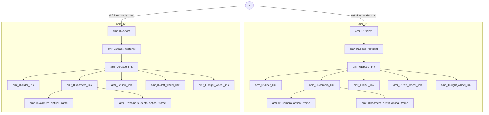

# 다중 로봇 네임스페이스 / TF 설계

> 명세 4장 9절: 최소 5대 AMR 동시 운용, 로봇별 독립 네임스페이스, TF 프레임 충돌 없음, 로봇 간 통신 지연(최대 100 ms) 반영, 중앙 집중식 할당.
> 명세 4장 10절: 5대 운용 시 CPU 80 % 이하.
> 이 문서는 런치 파일(`src/amr_fleet/launch/multi_robot.launch.py`, 각 패키지 `launch/*.launch.py`)을 쓰기 전에 합의하는 이름 규칙이다.
> "확인" 표시는 이미지(Gazebo 6.18, ros_gz 0.244.26, Nav2 1.1.20, robot_state_publisher 3.0.3)에서 실제로 실행해 본 항목이다.

## 1. 네임스페이스 체계

| 네임스페이스 | 역할 | 비고 |
| --- | --- | --- |
| `/amr_01` … `/amr_05` | 로봇 1대의 전체 온보드 스택 (bridge, 오도메트리, EKF, AMCL, Nav2, 인지, BT) | 두 자리 0 패딩, 정렬 가능, `amr_99` 까지 확장 |
| `/fleet` | 중앙 `fleet_manager_node`(할당·KPI) · `traffic_manager_node`(교통·교착) | 각 1개 ([components.md](components.md) §3.6) |
| `/` (루트) | Gazebo 서버, `/clock` 브리지, `map_server`(1개), `dashboard_node` | 로봇 수와 무관한 공용 인프라 |

- 로봇 식별자 문자열은 네임스페이스와 같다: `amr_msgs/RobotState.robot_id`, `amr_msgs/Task.robot_id`, `amr_msgs/srv/AssignTask` 응답 `robot_id` 모두 `"amr_01"`.
- `src/amr_bringup/launch/system.launch.py` 의 `robot_name` 인자가 곧 네임스페이스다. `multi_robot.launch.py` 는 N 대에 대해 `robot_name`, 스폰 좌표를 바꿔가며 같은 하위 런치를 포함한다.
- 로봇 노드는 전부 네임스페이스 아래에서 뜨고(`PushRosNamespace` / `Node(namespace=...)`), **토픽은 상대 이름**으로만 쓴다. 코드에 `/scan` 처럼 절대 이름을 적지 않는다.
- Gazebo 모델 이름도 네임스페이스와 같다 (`amr_01`).

## 2. TF 설계

규칙
1. `/tf`, `/tf_static` 는 **하나**를 공유한다. `map` 프레임은 접두어 없이 하나뿐이다.
2. 그 외 모든 프레임은 `amr_01/` 접두어를 붙인다: `amr_01/odom`, `amr_01/base_footprint`, `amr_01/base_link`, `amr_01/lidar_link`, `amr_01/camera_link`, `amr_01/camera_optical_frame`, `amr_01/camera_depth_optical_frame`, `amr_01/imu_link`, `amr_01/left_wheel_link`, `amr_01/right_wheel_link`.
3. 변환별 발행자는 로봇당 하나씩만 둔다.

| 변환 | 발행자 | 비고 |
| --- | --- | --- |
| `map → amr_01/odom` | `ekf_filter_node_map` (robot_localization, `world_frame: map`, 입력 `amcl_pose`) | AMCL 은 `tf_broadcast: false` |
| `amr_01/odom → amr_01/base_footprint` | `ekf_filter_node_odom` (`world_frame: odom`, 입력 `wheel_odom`, `imu/data`) | Gazebo DiffDrive 의 `<tf_topic>` 은 브리지하지 않는다 |
| `amr_01/base_footprint → …` (정적) | `robot_state_publisher` (xacro `prefix:=amr_01/` 로 이름이 이미 접두어를 가짐, `frame_prefix` 미사용) | 바퀴 조인트는 `joint_states` 로 동적 |

접두어가 만들어지는 경로
- **URDF / robot_state_publisher (구현)**: xacro 인자 `prefix:=amr_01/` 하나로 모든 링크·조인트 이름, Gazebo 센서 `<ignition_frame_id>`, DiffDrive·OdometryPublisher 프레임에 접두어가 함께 들어간다 (`src/amr_description/urdf/amr.urdf.xacro`). 그래서 `robot_state_publisher` 의 `frame_prefix` 는 **쓰지 않는다** — 같이 쓰면 `amr_01/amr_01/base_link` 로 이중 접두어가 된다. `joint_states` 의 관절 이름도 `amr_01/left_wheel_joint` 로 와서 URDF 와 그대로 맞는다 (확인: 5대 45개 정적 프레임 모두 접두어, 리뷰 실측). 대가로 `robot_description` 이 로봇마다 다르다 (로봇마다 xacro 를 따로 전개).
- **Gazebo 센서**: SDF 센서 요소의 `<ignition_frame_id>amr_01/lidar_link</ignition_frame_id>` 가 메시지 `header.frame_id` 가 된다 (확인: imu, gpu_lidar, camera / camera_info, depth camera_info).
- **ros_gz_bridge**: frame_id 를 바꾸지 않고 그대로 넘긴다 (확인). 따라서 프레임 접두어는 xacro `prefix` 한 곳에서 결정된다.
- **자기 차체 가시성 비트**: 차체 안 LiDAR 가 자기 차체를 보지 않도록 로봇마다 다른 가시성 비트를 쓴다 (xacro `self_visibility_bit`, 기본 = 이름 끝 숫자 n → 4 + (n − 1) mod 20). 동시에 뜨는 로봇의 비트가 같으면 **서로의 LiDAR 에 보이지 않는다** — 이름 끝 숫자가 20 차이 나는 로봇(amr_01 과 amr_21)을 함께 띄우지 말 것 ([sensor_calibration.md](sensor_calibration.md) §1.1).
- **EKF (`config/ekf.yaml`)**: 파일에는 접두어 없는 `map`, `odom`, `base_footprint` 와 상대 토픽(`wheel_odom`, `imu/data`, `amcl_pose`)만 적고, 노드 이름 키는 네임스페이스에 무관하게 매칭되도록 작성한다. 런치가 `parameters=[ekf_yaml, {"odom_frame": "amr_01/odom", "base_link_frame": "amr_01/base_footprint"}]` 처럼 **파일 뒤에 오버라이드**를 붙여 접두어를 주입한다(뒤 항목이 앞을 덮어쓴다). 이유: 파일 하나로 N 대를 돌리고, 단일 로봇(`system.launch.py`)에서는 오버라이드 없이 그대로 쓰며, 접두어는 필터 튜닝이 아니라 배치(런치)의 관심사이기 때문이다.
- **Nav2 파라미터**: 프레임 이름을 파라미터로 받으므로 템플릿에 자리표시자를 두고 `nav2_common.launch.ReplaceString` 으로 치환한다 (Nav2 자체는 `<robot_namespace>` → `/amr_01` 치환을 쓴다; 프레임에는 `amr_01/` 이 필요하므로 별도 자리표시자를 쓴다). 4장 참조.

공유 `/tf` 의 비용: 로봇당 EKF 2개 × 50 Hz + `robot_state_publisher` 바퀴 TF ≤ 20 Hz(`publish_frequency` 기본값이 상한 — 실측: 6대에서 /tf 합계 sim 기준 ≈ 20 Hz × 6) ≈ 120 msg/s, 5대 ≈ 600 msg/s, 메시지 100 B 남짓이라 100 kB/s 미만. 모든 TF 리스너가 다른 로봇 프레임까지 버퍼링하지만 5대에서는 문제되지 않는다. 10대를 넘기면 Nav2 기본 방식(네임스페이스별 `tf`)을 재검토한다.
단, `joint_states` 자체는 Fortress JointStatePublisher 가 **물리 스텝마다(1 kHz)** 낸다 (주기 옵션 없음, 실측 sim 1 kHz). 로봇마다 브리지 → `robot_state_publisher`·`wheel_odometry_node` 로 1 kHz 가 흐르며, 실측 CPU 는 로봇당 `parameter_bridge` ≈ 7 %, `robot_state_publisher` ≈ 5 % (한 코어 기준, RTF ≈ 0.9). `wheel_odometry_node` 는 50 Hz 로 서브샘플한다.

## 3. 토픽 배치

로봇 1대 (`/amr_01` 안, 상대 이름)

| 상대 이름 | 타입 | 발행 → 구독 | 비고 |
| --- | --- | --- | --- |
| `scan` | `sensor_msgs/LaserScan` | bridge → 필터, AMCL, costmap, 동적 장애물 추적 | gz `<topic>/amr_01/scan</topic>` |
| `camera/image_raw`, `camera/camera_info` | `sensor_msgs/Image`, `CameraInfo` | bridge → YOLO | `camera_info` 는 gz 가 `<topic>` 의 디렉터리 + `/camera_info` 로 자동 생성 (확인) |
| `camera/depth/image_raw`, `camera/depth/camera_info` | `Image`, `CameraInfo` | bridge → `object_localizer_node`(2D→3D), `pointcloud_filter_node`(점군 생성) | 시뮬레이터 점군 `camera/depth/points` 는 디버그 시만 브리지 |
| `imu/data_raw` | `sensor_msgs/Imu` | bridge → IMU 필터 | 바이어스 보정 전 |
| `imu/data` | `sensor_msgs/Imu` | IMU 필터 → `ekf_filter_node_odom` | `ekf.yaml` `imu0` |
| `joint_states` | `sensor_msgs/JointState` | bridge(gz JointStatePublisher) → 오도메트리, robot_state_publisher | |
| `wheel_odom` | `nav_msgs/Odometry` | 오도메트리 노드 → `ekf_filter_node_odom` | `ekf.yaml` `odom0` |
| `odometry/filtered` | `nav_msgs/Odometry` | `ekf_filter_node_odom` → Nav2 (`odom_topic`), 상태 보고 | robot_localization 기본 출력 이름 |
| `odometry/filtered_map` | `nav_msgs/Odometry` | `ekf_filter_node_map` → 평가, 대시보드 | 런치에서 리맵 (두 EKF 출력 충돌 방지) |
| `amcl_pose` | `PoseWithCovarianceStamped` | AMCL → `ekf_filter_node_map` | `ekf.yaml` `pose0` |
| `cmd_vel` | `geometry_msgs/Twist` | `safety_node`(**유일한 발행자**) → bridge. 앞단은 `cmd_vel_nav` → `velocity_profiler_node` → `cmd_vel_smoothed` ([components.md](components.md) §4.1) | gz DiffDrive `<topic>/amr_01/cmd_vel</topic>` |
| `ground_truth/odom` | `nav_msgs/Odometry` | bridge(gz OdometryPublisher, `frame_id: world`) → 평가 전용 | 시뮬레이션에만 존재 (확인: 월드 원점 기준) |
| `robot_state` | `amr_msgs/RobotState` | `fleet_adapter_node` → `fleet_manager_node`, `traffic_manager_node` | 2 Hz, 송신 측 지연 큐 (6장) |
| `assign_task` (서비스) | `amr_msgs/srv/AssignTask` | `fleet_manager_node` → `task_executor_node` | 호출 전 지연 큐 (6장). IDLE 이 아니면 거절 |
| `task_status` | `amr_msgs/Task` | `task_executor_node` → `fleet_adapter_node`, `fleet_manager_node` | 상태 전이마다 |
| `traffic/hold`, `traffic/yield_pose`, `keepout_mask` | `Bool`, `PoseStamped`, `OccupancyGrid` | `traffic_manager_node` → BT, `planner_server`(KeepoutFilter) | 교통·교착 해소 ([sequences.md](sequences.md) §3) |
| `perception/detected_objects`, `perception/tracked_obstacles` | `amr_msgs/DetectedObjectArray`, `TrackedObstacleArray` | 인지/추적 → BT, DWA·`safety_node`, RViz 마커 | 이름은 [components.md](components.md) §5.4 기준 |
| `navigate_to_pose` (액션) | `nav2_msgs/action/NavigateToPose` | BT → bt_navigator | 로봇 내부에서만 |
| `dock` (액션) | `amr_msgs/action/Dock` | BT → 도킹 서버 | |

전역 (루트 / `/fleet`)

| 이름 | 타입 | 발행 → 구독 |
| --- | --- | --- |
| `/map` | `nav_msgs/OccupancyGrid` (transient_local) | `map_server` 1개 → 모든 AMCL, global costmap |
| `/tf`, `/tf_static` | `tf2_msgs/TFMessage` | 2장 |
| `/clock` | `rosgraph_msgs/Clock` | bridge 1개 → 전 노드 (`use_sim_time: true`) |
| `/fleet/status` | `amr_msgs/FleetStatus` | `fleet_manager_node` → 대시보드 (1 Hz) |
| `/fleet/task_events` | `amr_msgs/Task` | `fleet_manager_node` → 대시보드 (상태 전이 이벤트) |
| `/fleet/task_request` | `std_msgs/String` (JSON) | 대시보드 → `fleet_manager_node` |
| `/fleet/assign_task` | `amr_msgs/srv/AssignTask` | 프로그램 클라이언트 → `fleet_manager_node` |
| `/fleet/alerts`, `/fleet/traffic_events` | `diagnostic_msgs/DiagnosticArray` | fleet/traffic → 대시보드 / fleet |
| `/fleet/estop` | `std_msgs/Bool` (latched) | 대시보드 → 모든 `safety_node` |

전체 목록과 타입은 [components.md](components.md) §5 가 기준이다.

## 4. Nav2 네임스페이스별 기동

- 로봇마다 Nav2 스택 한 벌: `planner_server`(전역 costmap 포함), `controller_server`(지역 costmap 포함), `behavior_server`, `bt_navigator`, `lifecycle_manager_navigation` + `amcl`, `lifecycle_manager_localization`. Nav2 의 속도 평활(`velocity_smoother`)·충돌 감시·경로 평활·경유점 서버는 쓰지 않는다 — 속도 프로파일은 자체 `velocity_profiler_node`, `cmd_vel` 의 유일한 발행자는 `safety_node` 다 ([components.md](components.md) §3.3~3.4, §4.1). 직접 구현한 A\*/DWA 는 `nav2_core` 플러그인으로 `planner_server`/`controller_server` 안에서 돈다.
- `use_composition: true` 로 로봇당 1 프로세스(컴포넌트 컨테이너)에 모은다. 5대면 프로세스 수와 컨텍스트 스위칭이 크게 준다.
- `map_server` 는 루트에 **하나**만 띄우고 `/map` 을 발행한다 (서비스도 절대 이름 `/map_server/map`, `/map_server/load_map`; [components.md](components.md) §3.2/§5.2 와 동일). 로봇 쪽은 AMCL `map_topic: /map`, static layer `map_topic: /map`, `map_subscribe_transient_local: true` 로 절대 이름을 구독한다.
- 파라미터 템플릿 `src/amr_navigation/config/nav2_params.yaml` 에서 바꿔야 하는 기본값: `robot_base_frame: <prefix>base_footprint`, local costmap `global_frame: <prefix>odom`, global costmap `global_frame: map`, AMCL `odom_frame_id: <prefix>odom`, `base_frame_id: <prefix>base_footprint`, `global_frame_id: map`, `tf_broadcast: false`, 스캔 토픽은 상대 `scan`(기본값 `/scan` 은 절대 이름이라 5대가 한 토픽을 보게 된다), `odom_topic: odometry/filtered`. `<prefix>` 는 런치가 `ReplaceString` 으로 `amr_01/` 로 치환하고, `RewrittenYaml(root_key=namespace)` 로 네임스페이스 키를 씌운다.
- AMCL 초기 자세는 스폰 좌표(5장 표)를 런치가 `initial_pose.{x,y,yaw}` 로 넣는다.
- **주의**: `nav2_bringup` 의 런치(`bringup_launch.py`, `navigation_launch.py`, `localization_launch.py`)는 `('/tf','tf')`, `('/tf_static','tf_static')` 리맵을 걸어 네임스페이스별 TF 트리를 만든다 (확인). 우리는 공유 `/tf` 설계이므로 그 런치를 포함하지 않고 `src/amr_navigation/launch/navigation.launch.py` 가 Nav2 노드를 리맵 없이 직접 띄운다.

## 5. Gazebo 다중 스폰

- 월드는 하나(`amr_simulation` `warehouse.launch.py`). 물리·센서·IMU·SceneBroadcaster 시스템 플러그인은 월드에 한 번만 둔다.
- 로봇 xacro 는 `robot_name:=amr_01`(gz 토픽 접두어, 모델 이름), `prefix:=amr_01/`(프레임), `payload`/`payload_mass`(적재), `self_visibility_bit`(선택) 인자를 받아 SDF 플러그인·센서에 다음을 넣는다 (`description.launch.py` 가 전달).
  - 센서 `<topic>`: `/amr_01/scan`, `/amr_01/camera/image_raw`(→ `camera_info` 자동), `/amr_01/camera/depth/image_raw`, `/amr_01/imu/data_raw`
  - DiffDrive `<topic>/amr_01/cmd_vel</topic>`, `<frame_id>amr_01/odom</frame_id>`, `<child_frame_id>amr_01/base_footprint</child_frame_id>` (확인; 오도메트리/TF 출력은 디버그용, 브리지하지 않음)
  - JointStatePublisher `<topic>/amr_01/joint_states</topic>`, OdometryPublisher `<odom_frame>world</odom_frame>`, `<robot_base_frame>amr_01/base_footprint</robot_base_frame>`, `<odom_topic>/amr_01/ground_truth/odom</odom_topic>` (확인)
  - `<topic>` 을 생략하면 gz 기본 이름은 `/world/warehouse/model/amr_01/link/base_link/sensor/imu/imu` 처럼 모델 이름이 들어가 충돌은 없지만(확인) 길다. **gz 토픽 이름을 ROS 절대 이름과 같게** 지으면 브리지에 리맵이 필요 없다.
- 스폰 (구현): `spawn.launch.py` → `ros2 run amr_description gz_world.py spawn --world warehouse --name amr_01 --x X --y Y --yaw YAW`. create 서비스가 뜰 때까지 기다리고(최대 900 s), 같은 이름이 이미 있으면 실패하고, 생성 후 `/world/warehouse/scene/info` 에서 모델을 확인한다. 어느 단계든 실패하면 ERROR 와 함께 런치를 내린다. (`ros_gz_sim create` 0.244.26 은 응답 5 s 시간 초과에도 종료 코드 0 이라 쓰지 않는다 — 확인.)
- **기동 순서 (일시정지 스폰, 결정)**: Fortress 센서는 sim 0 부터 한 주기씩 갱신 시각을 늘리므로 sim T 에 스폰된 로봇은 T × 주기 만큼 몰아서 갱신한다(폭주, 실측 T ≈ 92 s → ~1 kHz). 다중 로봇 런치(`multi_robot.launch.py`)는
  1. `amr_simulation warehouse.launch.py spawn_robot:=false paused:=true monitor_robots:=amr_01,amr_02,...` — 월드가 sim 0 에 멈춘 채 뜬다 (지면 진실·충돌 판정 노드 포함)
  2. 로봇마다 `amr_description description.launch.py robot_name:=amr_0N prefix:=amr_0N/` + `spawn.launch.py robot_name:=amr_0N x:=… y:=… yaw:=…` (자세는 아래 표 = `amr_bringup/config/fleet_spawn.yaml`)
  3. `amr_simulation unpause.launch.py robots:=amr_01,amr_02,...` — 모든 모델이 월드에 보이면 일시정지를 푼다 (하나라도 300 s 안에 안 보이면 ERROR, 월드는 멈춘 채)

  순서로 띄운다. 실측: 2대·6대 모두 첫 scan 이 sim 0.0 s, 간격 0.100 s (폭주 없음), 해제까지 월드 기동 후 7~10 s. 운용 중(sim T > 0) 재스폰은 여전히 폭주를 일으키므로 피한다 (적재 변경도 재스폰 대신 향후 DetachableJoint).
- 브리지: 로봇당 `parameter_bridge` 1개. 인자 나열(`/amr_01/scan@sensor_msgs/msg/LaserScan[ignition.msgs.LaserScan …`) 또는 `config_file` YAML(0.244.26 에서 지원 확인)을 쓰고, 이름을 바꿔야 할 때만 `--ros-args -r __ns:=/amr_01 -r <gz>:=<ros>` 를 쓴다 (확인). `/clock` 브리지는 루트에 1개.
- `IGN_PARTITION`: gz-transport 디스커버리 범위. 서버·모든 브리지·`ign topic` CLI 가 같은 값을 가져야 하며, 다른 파티션에서는 토픽이 전혀 보이지 않는다 (확인: 0개). `docker-compose.yml` 은 `.env` 의 `IGN_PARTITION`(`.env.example`: `IGN_PARTITION=amr_<이름>`, 사람마다 다르게)을 모든 서비스에 주입하므로 한 사람의 서버·브리지·CLI 컨테이너는 같은 파티션을 쓰고, 같은 호스트의 다른 사용자와는 격리된다. 호스트에서 직접 `ign topic` 을 쓸 때는 같은 값을 export 한다.
- 스폰 좌표 (대기 구역 패드, `src/amr_bringup/config/fleet_spawn.yaml` — `amr_bringup/test/test_spawn_poses.py` 가 월드 SDF 의 충돌체·actor 궤적·지게차 경로와 대조):

| 로봇 | x | y | yaw |
| --- | --- | --- | --- |
| amr_01 … amr_05 | 18.0 + 2.0·(i−1) | −16.0 | π/2 (북쪽) |

  이전 표(4.0 + 1.5·(i−1), 3.0)는 랙 B5(x 5..7, y 2.5..3.5)와 겹쳤다 (리뷰).

## 6. 통신 지연 시뮬레이션 (≤ 100 ms)

| 방식 | 장점 | 단점 |
| --- | --- | --- |
| A. fleet ↔ 로봇 경계 노드의 **송신 지연 큐** (`fleet_adapter_node`, `fleet_manager_node` — `amr_fleet`) | 지연 분포·드롭을 파라미터로 제어, 단위 테스트 가능, 루트 권한 불필요, 실기 배포 시 `simulate_latency: false` | 큐를 거치는 메시지만 지연됨 (의도한 범위) |
| B. `tc netem` | 커널 수준, 모든 트래픽 | 이미지에 `tc`/`iptables` 없음(확인); `network_mode: host` 라 호스트 전체 네트워크에 영향; 같은 호스트의 Fast DDS 는 기본 공유메모리 전송이라 지연이 걸리지 않음(Fast DDS 문서 기준); 테스트 자동화 어려움 |

**A 를 채택한다.** 로봇 온보드 스택(센서→EKF→Nav2)은 실제로도 한 컴퓨터 안에서 돌므로 지연 대상이 아니고, 네트워크를 타는 것은 fleet ↔ 로봇 메시지뿐이다. 별도 릴레이 노드를 두지 않고 경계 노드 안에 큐를 넣는 이유: 토픽 이름이 늘지 않고([components.md](components.md) §5.6 이 그대로 API), 서비스 호출(`assign_task`)도 같은 방식으로 지연시킬 수 있다.

- 지연 대상 (fleet ↔ 로봇 경계를 넘는 메시지):
  - 로봇 → fleet: `fleet_adapter_node` 가 `robot_state` 를 발행하기 전에 큐에 넣는다.
  - fleet → 로봇: `fleet_manager_node` 가 `/amr_XX/assign_task` 를 호출하기 전에 큐에 넣는다 (응답은 지연하지 않음 — 왕복을 편도 1회로 근사).
  - `traffic_manager_node` 의 `traffic/*`·`keepout_mask` 는 지연하지 않는다. 교착 판정 `t_stall` 5 s 가 지연보다 훨씬 커서 KPI 에 영향이 없다 ([sequences.md](sequences.md) §3).
- 파라미터 (`src/amr_fleet/config/fleet.yaml`): `simulate_latency: true`, `comm_latency_ms: [0, 100]` (메시지마다 균등 분포에서 추출, 평균 50 ms), `drop_rate: 0.0`, `seed`. 명세 최대 100 ms 를 넘지 않는다.
- 구현: (해제 시각, 메시지) 큐 + 5 ms 타이머로 꺼내 발행/호출. 시각은 `/clock`(sim time) 기준.
- 측정: fleet 이 `header.stamp` 를 찍고 로봇이 수신 시각과의 차를 명세 포맷 `[cmd_time, response_time, latency_ms]` 로 `logs/` 에 남긴다. 평균 ≈ 50 ms, 최대 ≤ 100 ms. 명세의 응답 시간 200 ms KPI 는 이 지연을 포함한 값이며, 예산 배분은 [sequences.md](sequences.md) §1 참조.

## 7. 연산 예산 (CPU ≤ 80 %)

호스트 32 스레드 기준 80 % = 25.6 코어. 아래는 **측정 전 배분 목표**이며 실측은 `docs/reports/` 에 남긴다.

| 항목 | 예산 (코어) | 근거 / 조정 수단 |
| --- | --- | --- |
| Gazebo 서버 (물리 1 kHz + 렌더링 센서 15개) | 6 | GPU 렌더링이지만 센서 업데이트는 서버 스레드. 센서 주기는 명세 최소값(10/15/30/100 Hz)으로 고정. 실측: 전체 월드(사람 6 + 차량 2 + 표지판) + 2대 ≈ 1.8~2.1 코어, RTF 0.85~1.0 (호스트 부하 14~23/32) |
| 시뮬레이션 평가 노드 (`obstacle_truth_node`, `collision_monitor_node`) | 0.5 | 실측 각 ≈ 22 % (50 Hz, 2대). 평가·시험에서만 켠다 (`warehouse.launch.py obstacle_truth:=false collision_monitor:=false`) |
| 로봇 1대: Nav2(컴포지션) 1.2, AMCL 0.3, EKF×2 0.3, 브리지 0.4, 오도메트리·IMU 필터·추적·프로파일러·안전 0.5, YOLO 전/후처리 0.6 | 3.3 × 5 = 16.5 | YOLO 추론은 GPU, 로봇당 ≤ 10 FPS 로 프레임 드롭; `points` 토픽은 브리지 안 함 |
| `fleet_manager_node` + `traffic_manager_node` + `fleet_adapter_node` ×5 + `dashboard_node` | 1.0 | |
| 합계 | ≈ 23.5 (73 %) | 초과 시: costmap `update_frequency` 5 Hz/`publish_frequency` 2 Hz, `taskset` 으로 Gazebo 코어 고정(이미지에 있음) |

- 측정법: 5대가 작업 중인 정상 상태에서 60 s 이상 `/proc/stat` 을 샘플링하는 스크립트(`scripts/`, `mpstat` 은 이미지에 없음)로 전체 `%usr + %sys` 평균을 구하고, `docker stats --no-stream` 으로 컨테이너별 값을 함께 적는다. 로그 `[timestamp, cpu_total_pct, cpu_gazebo_pct, cpu_nav_pct]`.
- Gazebo RTF 가 1.0 아래로 떨어지면 `use_sim_time` 덕에 로직은 일관되지만 응답 시간 KPI 는 실시간 기준이므로 RTF 를 CPU 와 함께 보고한다.

## 8. 미확정 / 검증 필요

- 접두어 프레임 + 공유 `/tf` 로 Nav2 5대를 실제로 띄워 본 적은 아직 없다. 프레임 이름은 Nav2 에 불투명한 문자열이므로 동작에는 문제가 없을 것으로 보나, 첫 통합 시 `view_frames` 로 트리를 확인한다.
- 로봇 이름 끝 숫자로 정하는 가시성 비트는 20대까지 고유하다 (2장). 그 이상은 `self_visibility_bit` 를 명시한다.
