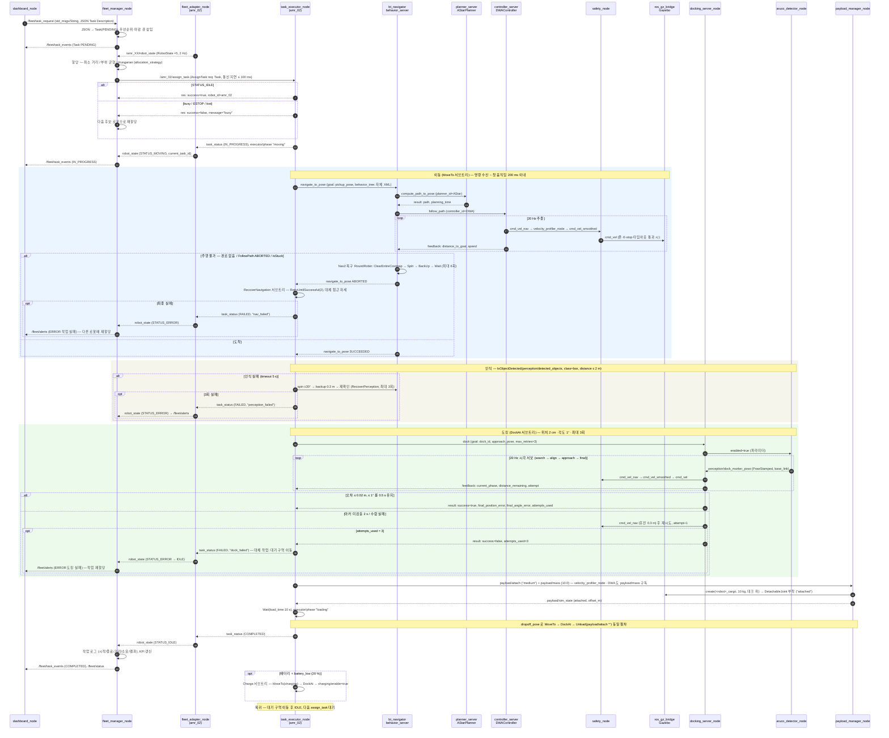
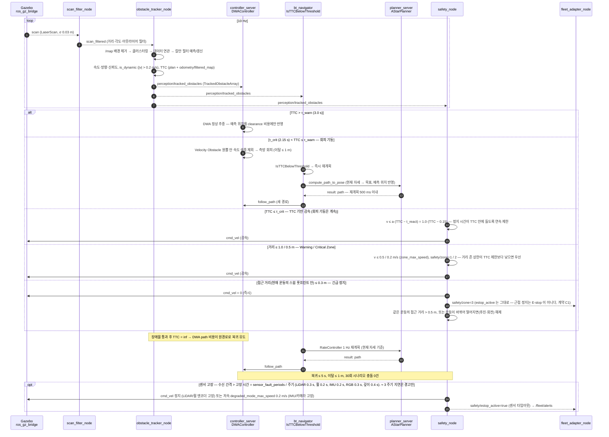
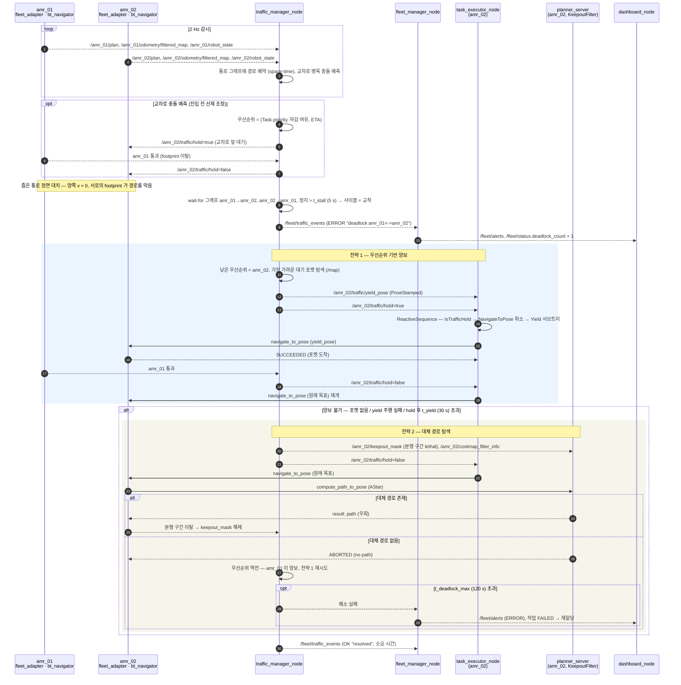

# 시퀀스 다이어그램

> 명세 4장 10절 "문서화" 산출물. **설계 문서 — 구현 시 갱신.**
> 참여자는 [components.md](components.md) 3절의 노드, 메시지는 5절의 실제 토픽/서비스/액션이다.
> 다중 로봇 네임스페이스는 [multi_robot.md](multi_robot.md) 참고.

시나리오 3개:

1. 작업 요청 → 할당 → 주행 → 도킹 → 완료 (명세 8·9장, 복구 3종 포함)
2. 동적 장애물 감지 → 추적 → TTC → 회피 → 복귀 (명세 7장)
3. 교착 탐지 → 해소 (명세 9장, 전략 2종)

시간 요구는 명세에서 그대로 가져왔고, 임계값(τ, t) 은 설계 초기값이며 YAML 파라미터로 둔다.

---

## 1. 작업 요청 → 할당 → 주행 → 도킹 → 완료

### 설명

- **요청·할당**: 작업은 JSON 으로 `/fleet/task_request` 에 들어오고(명세 8장) `fleet_manager_node` 가 `amr_msgs/msg/Task` 로 바꿔 우선순위·마감 큐에 넣는다. 할당은 `robot_state` 의 자세와 상태로 계산하며, 로봇 측 `assign_task` 는 IDLE 일 때만 수락한다. 거절되면 즉시 다음 후보로 넘어가므로 중앙 큐와 로봇 상태가 어긋나도 작업이 유실되지 않는다.
- **주행**: `task_executor_node` 의 BT 는 Nav2 를 `navigate_to_pose` 로 호출할 뿐 경로·속도 계산에 관여하지 않는다. 자체 구현 A*/DWA 는 Nav2 서버 안의 플러그인이고, 속도는 `velocity_profiler_node`(프로파일·저크·PID) 와 `safety_node`(존·E-stop) 를 거쳐서만 로봇에 닿는다.
- **복구 3종 (명세 8장)**: ① 주행 불가 — Nav2 내부 복구(RoundRobin) 뒤에도 실패하면 작업 BT 가 2회 재시도하고 대체 접근 자세를 시도한 뒤 FAILED 보고. ② 인식 실패 — 제자리 회전과 후진으로 시야를 바꿔 3회까지 재확인. ③ 도킹 3회 실패 — `Dock` 결과 `attempts_used=3` 이면 에러 보고 후 대기 구역으로 이동(대체 작업), 플릿이 재할당. 그 밖에 배터리 부족(Charge), 위치 상실(`IsLocalized`), E-stop(`IsEstopClear`) 은 ReactiveSequence 가 매 tick 검사한다.
- **적재/하역**: 물리 조작 대신 가상 이벤트(명세 7장 제약). `payload_manager_node` 가 화물 모델을 DetachableJoint 로 붙여 질량·관성이 동역학에 합산되고 (25 kg: 가속 1.000 → 0.842, E-stop 제동 1.653 → 1.135 m/s², 하역하면 복원), `payload/mass` 를 받은 `velocity_profiler_node` 와 DWA 가 가감속 한계를 낮춘다.

### 시간 요구

| 구간 | 요구 | 측정 방법 (명세 10장 표) |
| --- | --- | --- |
| `assign_task` 요청 시각 → 첫 `cmd_vel` ≠ 0 | **평균 200 ms 이내** | `[cmd_time, response_time, latency_ms]`, 50회 이상 |
| 예산 배분 (설계) | 플릿 할당 ≤ 20 ms + 통신 지연 시뮬 ≤ 100 ms + BT tick 10 ms + A* ≤ 50 ms + 컨트롤러 첫 주기 ≤ 50 ms → 여유 −30 ms | 지연 시뮬 100 ms 최악값 포함 시 초과하므로 지연 분포(0~100 ms 균등) 평균 50 ms 로 평균 요구를 만족시키는 것이 목표 |
| 도킹 정밀도 | 위치 2 cm, 각도 1° | `ground_truth/odom` 대비 `final_*_error` |
| 도킹 재시도 | 최대 3회, 실패 시 에러 보고 + 대체 작업 | `Dock.result.attempts_used` |
| 적재 시간 | 소 5 s / 중 10 s / 대 15 s | `robot_params.yaml payload.*.load_time` |
| 단일 작업 성공률 | 97 % 이상 | `/fleet/status.tasks_completed / (completed + failed)` |

---

## 2. 동적 장애물 감지 → 추적 → TTC → 회피 → 복귀

### 설명

- **감지·추적**: `obstacle_tracker_node` 는 필터된 스캔에서 정적 지도(`/map`)에 해당하는 점을 빼고 남은 클러스터를 칼만 필터로 추적한다. `TrackedObstacle` 의 `velocity`, `heading`, `confidence`, `is_dynamic` 이 여기서 채워지고, `time_to_collision` 은 로봇의 현재 경로(`plan`)와 속도(`odometry/filtered_map`)에 대해 예측 궤적이 만나는 최초 시각으로 계산한다(교차 없으면 `inf`).
- **회피는 세 겹**: ① DWA 플러그인 — 예측 위치를 clearance 비용에 넣고, Velocity Obstacle 원뿔에 드는 속도 샘플을 제외한다(명세 "VO/ORCA 개념 적용"). ② Nav2 BT — `IsTTCBelowThreshold` 조건이 재계획을 즉시 트리거해 1 Hz 주기를 기다리지 않는다. ③ `safety_node` — 알고리즘과 무관하게 TTC 기반 연속 감속(v ≤ a·(TTC − t_react))과 거리 기반 존(Warning 1.0 m → 0.5 m/s / Critical 0.5 m → 0.2 m/s / 정지 0.3 m, `robot_params.yaml safety.*`)으로 최종 게이트한다. 두 상한 중 낮은 쪽이 이긴다. 1.0 m/s 장애물(명세) 은 ①②로 회피하고, ③은 실패 시 안전망이다.
- **복귀**: 별도 "복귀 모드" 없이, 장애물이 지나가 TTC 가 `inf` 로 돌아오면 DWA 의 path-distance 비용과 1 Hz 재계획이 로봇을 원경로로 끌어온다. 이탈 1 m·복귀 5 s 는 이 비용 가중치와 look-ahead 로 튜닝한다(`docs/algorithms/dwa.md`).
- **E-stop 과 센서 고장**: `safety/estop_active` = E-stop 래치(대시보드 `estop`·`/fleet/estop`; transient_local 과 volatile 발행자 모두 수신) ∨ 정지형 센서 고장. 버튼 래치는 모든 입력이 false 인 상태의 `safety/reset_estop` 으로만 풀리며 거절된 reset 은 상태를 남기지 않는다. 근접 정지는 `safety/zone` = 3 이고 E-stop 이 아니다 (BT `IsEstopClear`, 플릿 어댑터는 estop_active 만 E-stop 으로 본다 — 계약 C1). 센서 고장은 주기에서 유도한 디바운스: 지연(≈ 3 주기)은 경고, 고장(LiDAR 0.3 / 휠 0.2 s)은 정지, IMU·카메라 고장은 0.2 m/s 저속; 전방 깊이 점군이 0.4 s 넘게 늦으면 전진 0.2 m/s.

### 시간 요구

| 항목 | 값 | 근거 |
| --- | --- | --- |
| 추적 주기 | 10 Hz | LiDAR 10 Hz 이상 (명세 1장) |
| τ_warn (회피·재계획 시작) | 3.0 s (설계 초기값) | τ_crit 2.15 s + 재계획 0.5 s = 2.65 s 에 0.35 s(추적 3 주기) 여유. 부족하면 τ_warn 을 올리거나 순항 속도를 낮춘다 |
| τ_crit (TTC 기반 감속 시작) | 2.15 s (설계 초기값) | `robot_params.yaml safety` 제동 모델 t_stop(v) = reaction_latency + v/a: 2.0 m/s 에서 0.15 + 2.0/1.0 = **2.15 s** (제동 거리 d = 2.30 m). TTC ≤ τ_crit 이면 v ≤ a·(TTC − t_react) 로 연속 제한 (TTC 1.0 s → 0.85 m/s, 0.5 s → 0.35 m/s, 0.35 s → 0.2 m/s). 거리 존 상한(`warning_zone_max_speed` 0.5 / `critical_zone_max_speed` 0.2 m/s)이 더 낮으면 그쪽이 우선 |
| 재계획 완료 | **500 ms 이내** | 명세 4장 4절. `ComputePathToPose.result.planning_time` 으로 측정 |
| 긴급 정지 거리 | **0.3 m** 이내 접근 시 즉시 정지 | 명세 4장 7절. 접근 = 현재 운동의 스윕 풋프린트 안 거리 (0.60 m 통로 옆 벽 제외). `safety_node` 50 Hz + 스캔 이벤트 → 지연 ≤ 20 ms |
| 회피 후 복귀 | **5 s 이내**, 경로 이탈 **1 m 이내** | 명세 4장 7절. CTE 로그 `[timestamp, planned_x/y, actual_x/y, cte]` |
| 회피 테스트 | 30회 충돌 0건 | Gazebo 접촉 이벤트 카운트 |
| 센서 타임아웃 | 지연 경고 ≈ 3 주기, 고장 = sensor_fault_periods / 주기 (LiDAR 0.3, 휠 0.2, IMU 0.2, RGB 0.3, 깊이 0.4 s) | `robot_params.yaml safety.*`, `perception.yaml` |

---

## 3. 교착 탐지 → 해소

### 설명

- **교통 관리 vs 교착**: `traffic_manager_node` 는 평소 2 Hz 로 모든 로봇의 `plan` 을 통로 그래프에 시공간 예약하고, 교차로에 두 로봇이 같은 시간창에 들어오면 우선순위 낮은 쪽에 `traffic/hold` 를 미리 걸어 대부분의 충돌을 **예방**한다. 그래도 발생하는 정면 대치·순환 대기가 교착이다.
- **탐지**: 로봇 i 의 경로가 로봇 j 의 footprint(+inflation)로 막히고 i 의 속도가 `t_stall` 동안 0 에 가까우면 wait-for 간선 i→j 를 만든다. 그래프에 사이클이 생기면 교착으로 판정한다(networkx `simple_cycles`). 반복 재계획으로 진동하는 livelock 도 `plan` 변경 횟수로 같은 경로에서 잡는다. 탐지 시 `/fleet/traffic_events` 로 알리고 `FleetStatus.deadlock_count` 를 올린다.
- **전략 1 — 우선순위 기반 양보**: 우선순위는 `Task.priority` → 마감 여유 → ETA 순으로 비교한다. 낮은 쪽은 `traffic/yield_pose` 로 가장 가까운 대기 포켓으로 물러나고, 높은 쪽이 지나가면 `hold` 가 풀려 원래 목표를 다시 요청한다. 로봇 쪽에서는 BT 의 `ReactiveSequence` 가 `IsTrafficHold` 를 매 tick 검사하므로 별도 취소 API 가 필요 없다.
- **전략 2 — 대체 경로 탐색**: 물러날 곳이 없으면 분쟁 구간을 `keepout_mask` 로 lethal 처리해 A* 가 다른 통로를 찾게 한다. Nav2 `KeepoutFilter` 는 마스크와 `CostmapFilterInfo` 만 받으면 되므로 플래너 코드는 손대지 않는다. 우회로가 없으면 우선순위를 뒤집어 전략 1 을 다시 시도하고, 상한 시간을 넘기면 작업을 FAILED 처리해 플릿이 재할당한다.
- **통신 지연**: 명세의 최대 100 ms 지연은 `fleet_adapter_node` 와 `fleet_manager_node` 의 송수신 지연 큐로 넣는다. 교착 판정 임계 `t_stall` 은 이 지연보다 충분히 커서(5 s) 지연이 오탐을 만들지 않는다.

### 시간 요구

| 항목 | 값 | 근거 |
| --- | --- | --- |
| 감시 주기 | 2 Hz | `robot_state` 주기와 동일 |
| t_stall (교착 판정) | 5 s (설계 초기값) | 통신 지연 100 ms, 재계획 500 ms 보다 충분히 큼 |
| t_yield (양보 대기 상한) | 30 s (설계 초기값) | 초과 시 전략 2 로 전환 |
| t_deadlock_max | 120 s (설계 초기값) | 초과 시 작업 FAILED, 재할당 |
| 통신 지연 시뮬레이션 | 최대 100 ms | 명세 4장 9절 |
| 5대 동시 운용 | 교착 없이 작업 수행, CPU ≤ 80 % | 통합 테스트 #12 |

---

## 공통: 상태 전이 요약

| 이벤트 | `Task.status` | `RobotState.status` | 발행 |
| --- | --- | --- | --- |
| 작업 수신 | PENDING | — | `/fleet/task_events` |
| `assign_task` 수락 | IN_PROGRESS | MOVING | `task_status`, `robot_state` |
| 도킹 중 | IN_PROGRESS | DOCKING | `executor/phase` |
| 적재/하역 | IN_PROGRESS | LOADING | `executor/phase` |
| 완료 | COMPLETED | IDLE | `task_status`, `/fleet/task_events` |
| 주행/인식/도킹 실패 | FAILED | ERROR → IDLE | `task_status`, `/fleet/alerts` |
| 긴급 정지 | (유지) | ESTOP | `safety/estop_active`, `/fleet/alerts` |
| 충전 | — | CHARGING | `charging/enable` |
