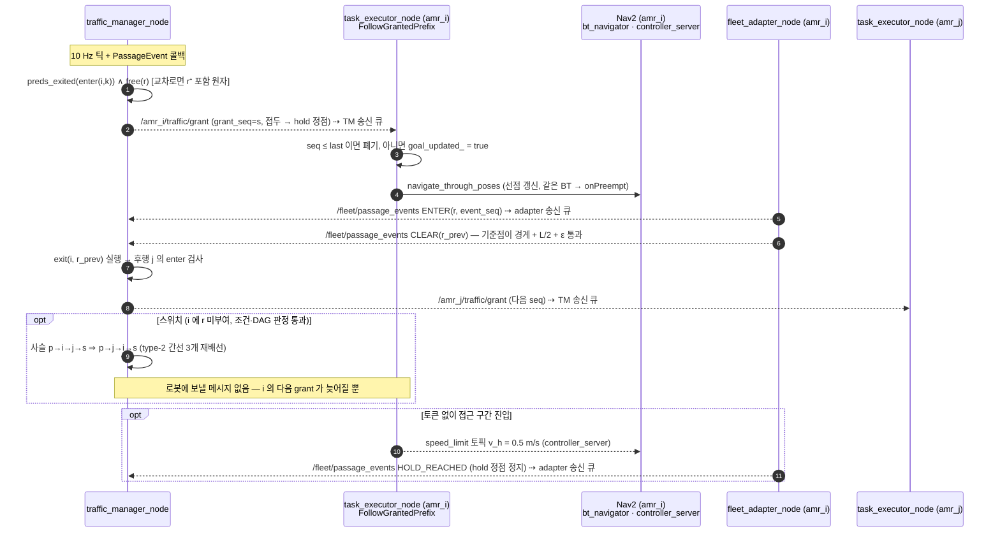

# fleet-traffic-deadlock — 다중 AMR 작업 할당 · 트래픽 관리 · 교착 탐지/해소 · KPI 설계 브리프 (개정 3판)

작성일 2026-09-21, 개정 2026-09-22(2판 리뷰 반영 → 3판 감사·수치 재검증·아키텍처 정합 → 감사 재개 보완, §10.3) · 대상: 명세 4.8(작업 관리) · 4.9(Fleet Management) · 4.10(성능) · 3장 학습목표("교착 유형과 해결 전략") · 동료평가 "5대 동시 운용 시 교착 없이 작업 수행", "교착 탐지·해소 알고리즘이 실제 동작". 리뷰 반영 내역은 §10.

## 0. 요약 (TL;DR)

- **기준 알고리즘(필수)**: 할당 = 최소거리 / 부하균형 / 직사각형 Hungarian / 경매; 트래픽 = 코리도 그래프 위 **연속시간 예약표 + SIPP**; 교착 = Coffman 4조건 → wait-for 그래프 사이클 탐지(O(n+e)) + 해소 전략 3종. §3 에서 수식·차원·복잡도로 유도.
- **독자 알고리즘(제안)**: **CTR (Corridor-Token Reservation)** — 로봇 몸길이·간선별 속도를 반영한 예약 기하 → 예약에서 유도한 **(로봇,자원) 이벤트 DAG** 를 토큰으로 집행 → 마감·aging 우선순위 기반 **순서 스위치**(미부여 자원에만, 비순환 검사) → 실행 수준 wait-for 안전망 + 다중 로봇 양보. Nav2 와는 "허가된 접두까지 목표 확장" 으로만 결합. **정직한 위치: `engineering_adaptation`** — 구조는 tuw_multi_robot MRRP[C1]·그 ROS2/Nav2 이식[V27]·VDA 5050 base/horizon[C3]·openTCS 스케줄러[C4]·Open-RMF 어댑터[C5]·ADG[R12]/SADG[V25a] 와 같다. 우리가 더하는 것은 (i) 몸길이·간선속도·교차로 길이를 포함한 예약 기하와 그 무교착 증명, (ii) [V27] 이 "future work" 로 남긴 교착 탐지·해소 루프와 지연-안전 토큰 프로토콜, (iii) Nav2 Humble 검증 결합 경로다. 할당은 **HRA (Hungarian + Regret-swap under deadlines)** = D-TP/D-TPTS[V1]·Liu & Shell 스왑[C7]·마감 MAPD[C6] 의 `variant_of_prior`.
- **검증 상태**: WebSearch/WebFetch 사용 가능. arXiv API(`export.arxiv.org`, https) 정상 동작 확인(§9). 2023-09~2026-09 논문 **30편 VERIFIED**(V1–V29, V25a), 산업 표준·소스·고전 메타데이터 8건 VERIFIED(C1, C3–C7, R9, Nav2 Humble 소스), 고전 22편 RECALLED. Nav2·환경 사실은 과제 지정 이미지 `docker run --rm amr-fleet-system:wf-final` 로 확인(§7.4).
- **환경**: `wf-final` 은 `numpy 1.26.4` + `scipy 1.15.3` 으로 `scipy.optimize.linear_sum_assignment` 가 정상 동작한다(2판이 인용한 `:latest` 의 numpy 2.2.6 ↔ scipy 충돌은 `wf-final` 에서 해소됨을 확인). Hungarian 은 명세("Hungarian Algorithm 을 구현") 취지대로 직접 구현하고 `linear_sum_assignment` 는 테스트 오라클로만 쓴다.
- **아키텍처 정합(3판)**: 노드·토픽 이름은 `docs/architecture/components.md` §3.6/§5.6, `multi_robot.md` §6, `sequences.md` §3 을 따른다. CTR 이 새로 필요로 하는 인터페이스는 §7.2 에 "추가 제안" 으로 구분하고, 기존 설계를 바꾸는 3곳(트래픽 루프 10 Hz, `traffic/*` 지연 대상 포함, 교착 판정 $T_b$)은 근거와 함께 명시한다.

## 1. 범위와 명세 매핑

| 명세 항목 | 요구 | 본 브리프 |
|---|---|---|
| 4.4 경로 계획 성능 | 예측 시간 오차 ≤15 % | §3.2 경로 단위 ETA, §6.1 ETA 오차 KPI, S1/S2 판정 |
| 4.7 안전 | 0.3 m 안전거리 즉시 정지, E-Stop | §3.3 토큰·CLEAR·hold 배치로 정지 로봇 간 ≥ 0.3 m 보장(예약 여유는 계획용), `safety_node` 존과의 정합은 §8-3, §5.5 알림 |
| 4.8 작업 관리 | JSON Task, 상태 4종 이벤트 발행, 우선순위·마감, **단일 작업 성공률 ≥97 %**, 작업 로그 | §3.1, §5.2, §5.5 상태기계(재큐잉), §6 성공률 KPI |
| 4.9 다중 로봇 | 5대, 독립 네임스페이스(`amr_01…amr_05`), 통신 지연 ≤100 ms 반영 | §5.1.6 지연-안전 프로토콜, §7.2 경계 노드의 FIFO 지연 큐(`multi_robot.md` §6 방식 A 를 CTR 메시지까지 확장) |
| 4.9 작업 할당 | 중앙집중, 최소거리/부하균형/Hungarian, 최적성 지표 | §3.1(4종), §6 S1 |
| 4.9 Traffic | 충돌 예측·해소, 교차로/병목 우선순위, 교착 탐지 + 해소 ≥2 | §3.3–3.5, §5.1, §5.4 |
| 4.9 모니터링 | 위치·상태·**배터리**·현재 작업, KPI 3종, **알림(긴급정지·작업실패·교착)** | §5.5 배터리/충전, §6.1 KPI, §7.2 `/fleet/alerts`(`diagnostic_msgs/DiagnosticArray`, components.md §5.6) 알림 스키마, `/fleet/kpi`(추가 제안) |
| 4.10 성능·품질 | 응답 ≤200 ms(단계별 측정), CPU ≤80 %, 4 h 연속, 커버리지 ≥70 %, 통합 ≥10, API 문서·시퀀스 다이어그램 | §6.2 S5/S6, §7.2 인터페이스 표·시퀀스, §7.3 |

## 2. 시스템 모델과 기호

- 로봇 $i\in R$, $n=5$. 상태 $x_i=(p_i,\theta_i,v_i,\omega_i,s_i,b_i,h_i,\rho_i)$: 위치 [m], 방향 [rad], 속도 [m/s, rad/s], 상태 enum(`RobotState.status`), **배터리 $b_i\in[0,100]$ %**(`RobotState.battery_level`), 보유 토큰 집합 $h_i$, 잔여 자원 열 $\rho_i$. 몸체 $L\times W=0.60\times0.40$ m, 대각선 0.72 m, $p_i$ 는 base_link 중심.
- 작업 $j$: 픽업 $p_j$, 하역 $d_j$, 우선순위 $\pi_j\in[0,255]$, 마감 $D_j$ [s], 적재 $\tau_{\text{load}}\in\{5,10,15\}$ s, 질량 $m_j\in\{2,10,25\}$ kg (`Task.msg`).
- **코리도 그래프** $G_c=(V_c,E_c)$: 정점 = 교차로·스테이션·hold 지점·블록 경계, 간선 = 통로 구간(길이 $\ell_e$, 방향, 속도 제한 $v_e$). 60×40 m 를 3열 랙·메인 코리도·입출고·충전 구역으로 잡으면 $|V_c|\approx 150\text{–}250$, $|E_c|\approx 200\text{–}350$ (0.05 m 격자 96만 셀과 무관하게 작다).
- **자원** $\mathcal R$, 모든 자원 $\mathrm{cap}(r)=1$ (단일 술어로 통일, §3.3):
  - *좁은 통로*(폭 $W+0.2=0.6$ m, 명세 4.4): 통로 전체가 하나의 자원. 제자리 회전(대각 0.72 m) 불가·스테이션 배치 불가 → **횡단 연결 통로로만 사용, 스테이션 없음**(레이아웃 제약, §5.5). 측방 여유는 0.1 m 로 `robot_params.yaml safety.emergency_stop_distance` 0.30 m(풋프린트 모서리 기준 "최단 거리") 보다 작다 → `safety_node` 존 판정이 진행 방향 섹터로 제한되지 않으면 좁은 통로 진입 즉시 E-stop 래치(§8 리스크 3, 안전 담당과 결정). 계획 속도 $v_e=0.5$ m/s 는 그 결정 전 가정.
  - *넓은 코리도*(폭 ≥ 3 m): 방향별 차선을 길이 $\ell_b$ 의 **블록**으로 분할, 블록마다 자원(openTCS 의 경로 자원·VDA 5050 의 edge 와 같은 단위; openTCS 는 대안으로 `SAME_DIRECTION_ONLY` 블록도 둔다[C4]). 후행 차두는 블록 길이로 보장(§3.3). 차선 중심 간 1.5 m → 나란한 두 로봇의 측방 몸체 간격 1.1 m(> Warning 1.0 m), 벽까지 0.55 m.
  - *교차로* $J$: 기준점 통과 길이 $\ell_J$ (교차하는 코리도 폭) 를 가진 정점 자원, 출구 자원과 원자 부여(§3.3).
  - *스테이션·충전·대기 포켓*: 코리도 밖 베이(bay) 로, 사용 로봇이 점유하는 자원(well-formed infrastructure[R11]). 랙 픽업면은 넓은 코리도 쪽 베이에 둔다.
- 상수와 출처: 동역학 $v_{\max}=2.0$ m/s, $a=1.0$ m/s², 저크 $\dot a_{\max}=2.0$ m/s³, $\omega_{\max}=1.5$ rad/s, $\alpha_{\max}=2.0$ rad/s² (`robot_params.yaml limits`); $d_{\text{safe}}=0.30$ m, 반응 지연 $t_{\text{react}}=0.15$ s (`safety.emergency_stop_distance`, `safety.reaction_latency`); 통신 지연 $\tau_c\sim U(0,100)$ ms, $\tau_c\le0.1$ s (`fleet.yaml comm_latency_ms: [0, 100]`, `multi_robot.md` §6); $\tau_{\text{ctrl}}=0.05$ s (`controller_frequency` 20 Hz); 트래픽 틱 $1/f_t=0.1$ s (components.md §3.6 의 2 Hz 에서 상향 제안, 근거 §5.1.7); $\varepsilon_{\text{loc}}=0.08$ m (명세 4.3 회전 주행 위치 오차 상한); 목표 허용 $\text{tol}_{xy}=0.10$ m (**`nav2_params.yaml` 에서 명시 설정 필요** — Nav2 Humble `SimpleGoalChecker` 기본값은 0.25 m, 소스 확인).

## 3. 기준 알고리즘의 수학적 유도

### 3.1 작업 할당

**비용(초)**: 로봇 $i$ 가 자유로워지는 시각 $t^{\text{free}}_i$, 위치 $p^{\text{free}}_i$ 일 때
$$c_{ij}= t^{\text{free}}_i + T(p^{\text{free}}_i\!\to p_j) + \tau_{\text{load}}(j) + T(p_j\!\to d_j) + \tau_{\text{unload}} + \beta\,W_{ij} + \gamma\,\max\!\big(0,\ \hat t^{\text{done}}_{ij}-D_j\big)\quad[\mathrm s]$$
$T(\cdot)$ 는 §3.2 [s], $W_{ij}$ 는 예약표 re-timing(§5.1.4)에서 읽은 예상 대기 [s], $\beta,\gamma$ 무차원. 배터리 $b_i<b_{\min}$ 이거나, 작업 $j$ 를 마치고 가장 가까운 충전 포켓 $C$ 에 닿을 때의 예측 잔량 $\hat b_{ij}=b_i-r_b\,[\hat t^{\text{done}}_{ij}-t+T(d_j\to C)]<b_{\min}$ 이면 $c_{ij}=\infty$ ($r_b$ = 방전율 [%/s]; `LinearBattery` 는 일정 부하라 에너지 = 시간 × $r_b$, §5.5).

1. **최소거리**: $i^\*=\arg\min_i c_{ij}$, $O(n)$/작업. 근시안적(두 로봇·두 작업 교차 반례).
2. **부하균형**: $i^\*=\arg\min_i(\lambda_q Q_i + c_{ij})$, $Q_i=\sum_{k\in\text{queue}_i}c_{ik}$ [s].
3. **Hungarian(배치)**: LAP $\min\sum c_{ij}x_{ij}$, $\sum_j x_{ij}\le1$, $\sum_i x_{ij}\le1$, $\sum x_{ij}=\min(n,m)$. 제약행렬이 완전 단모듈 → LP 해 = 정수해; 쌍대 $u_i+v_j\le c_{ij}$ 를 유지하며 축소비용 0 간선으로 증가경로(Kuhn–Munkres[R1]). **직사각형 $n\times m$ 판**(Bourgeois–Lassalle[R23], 행 단위 증가경로) 복잡도 $O(n^2 m)$; $n=5,\ m\le50$ → $\approx1.25\times10^3$ 기본 연산. **측정**(`checks/hungarian_bench.py`, 최단 증가경로형 순수 Python): 5×50 한 번 풀이 — 균일 난수 비용: 호스트 0.04–0.06 ms, `wf-final` 컨테이너 0.07–0.68 ms; **상관 비용**(모든 로봇이 같은 작업을 선호 → 다단계 증가경로, 사실상 최악형): 호스트 0.26 ms, 컨테이너 0.37–1.52 ms; 정방화 50×50 은 1.7–2.2 / 5.5–28 ms. 측정 시 호스트는 타 사용자 작업으로 load average 40–130(32 코어)이라 컨테이너 값의 변동은 CPU 경합 탓이다. 예산 "≤ 2 ms" 는 모든 반복에서 충족했으나 여유는 경합 없는 코어에서 약 7배, 4배 과부하에서 1.3배까지 줄어든다(3판의 "30배" 는 균일 비용·저부하 값이라 일반 여유로 읽으면 안 됨 — 감사 정정). S1·S6 에서 실제 부하로 재측정. 테스트 오라클: 브루트포스($n!\binom{m}{n}$, $n\le5,m\le7$, 200회 일치 확인) + `scipy.optimize.linear_sum_assignment`(`wf-final`, 5×50 300회 일치 확인).
4. **경매(Bertsekas[R2])**: 가격 $q_j$, 입찰 = 최선·차선 차 $+\varepsilon$; $\varepsilon$-CS 로 최적 대비 $\le n\varepsilon$; $\varepsilon$-scaling 시 다항. 분산형(보너스)으로 확장 가능.

### 3.2 이동시간 추정(ETA) — 경로 단위 속도 프로파일 (명세 4.4 ≤15 %)

경로 $\rho=(e_1,\dots,e_m)$ 에 내부 정지 집합 $S$(hold 정점·스테이션·제자리 회전 $|\Delta\theta|>\theta_{\text{rot}}$ 가 필요한 정점) 와 교차로 집합 $J$(교차로 $q\in J$ 의 통과 속도 $v_q$) 를 둔다. `velocity_profiler_node` 는 저크 제한 S-curve 를 쓰므로(components.md §3.3, 저크 $\dot a_{\max}=2.0$ m/s³) 속도 변화 $\Delta v$ 한 번에 걸리는 시간은
$$T_{\Delta v}=\begin{cases}\Delta v/a+a/\dot a_{\max}, & \Delta v\ge a^2/\dot a_{\max}\ (=0.5\ \mathrm{m/s})\\ 2\sqrt{\Delta v/\dot a_{\max}}, & \text{otherwise}\end{cases}$$
이고, 대칭 S-curve 의 평균 속도는 양 끝 속도의 평균이다. 이로부터
$$T_{\text{route}}=\sum_{e}\frac{\ell_e}{v_e}+\sum_{q\in J}\frac{\ell_q}{v_q}+\underbrace{\tfrac12T_{v_c}\,[\text{출발}]+\tfrac12T_{v_c}\,[\text{종점}]}_{\text{정지 상태에서 시작·끝}}+\sum_{s\in S}\Big[T_{v_{c,s}}+T_{\text{rot}}(\Delta\theta_s)\Big]+\sum_{q\in J\setminus S}T_{\Delta v_q}\,\frac{\Delta v_q}{v_{c,q}},\quad \Delta v_q=v_{c,q}-v_q$$
$$T_{\text{rot}}(\Delta\theta)=\begin{cases}|\Delta\theta|/\omega_{\max}+\omega_{\max}/\alpha_{\max}, & |\Delta\theta|\ge\omega_{\max}^2/\alpha_{\max}\ (=1.125\ \mathrm{rad})\\ 2\sqrt{|\Delta\theta|/\alpha_{\max}}, & \text{otherwise}\end{cases}$$
- 내부 정지 항 $T_{v_c}=v_c/a+a/\dot a_{\max}$: 감속+가속에 $2T_{v_c}$ 동안 $v_cT_{v_c}$ 를 이동, 순항이면 $T_{v_c}$ → 초과 $T_{v_c}$ (저크 무한대 극한에서 2판의 $v_c/a$). 출발·종점은 각각 절반. 정지 간 거리 $\ell<v_c\,T_{v_c}$ (=3.0 m @1.5 m/s) 면 최고속 $v_p<v_c$ 를 $\ell=v_p T_{v_p}$ 에서 풀어 $2T_{v_p}$ 로 대체(`eta.py` 수치해).
- 교차로 항: $v_c\to v_q\to v_c$ 에 $2T_{\Delta v}$ 동안 $(v_c+v_q)T_{\Delta v}$ 이동 → 초과 $T_{\Delta v}\Delta v/v_c$. 차원 [s]·[m/s]/[m/s] = [s] ✓.
- 속도 제한 변경 정점(교차로·정지가 아닌 한쪽 전이, 예: 메인 차선 1.5 → 좁은 통로 0.5 m/s): 전이는 빠른 쪽 간선 안에서 일어나므로 초과 $\tfrac12T_{\Delta v}\Delta v/v_{\text{fast}}$ — 1.5→0.5: 0.50 s, 2.0→1.5: 0.125 s. 위 $T_{\text{route}}$ 에 이 항의 합을 더한다(감사 보완, `eta_check.py` 수치적분 일치).
- **검산**(`checks/eta_check.py`, S-curve 수치적분과 폐형식 차 < 10⁻³ s): 정지 초과 1.5 m/s → 2.00 s(저크 무시 시 1.50); 교차로 1.5→0.5→1.5 → 1.00 s(저크 무시 0.67); 90° 회전 1.80 s(각가속 무시 1.05 s, −42 %).
- 예: 10 m, $v_c=1.5$, 정지 없음 → 6.67 s (구판 세그먼트별 정지 모델 8.17 s, +22 % — 폐기). 20 m, **출발 전** 제자리 90° 회전 + 출발·종점 정지 → $13.33+2.00+1.80=17.13$ s(같은 회전이 중간 정점이면 정지 항 2.00 s 가 더해져 19.13 s) (2판의 15.9 s 는 저크·각가속을 빼 −7.3 % 편향: 15 % 예산의 절반을 모델 구조가 소비하던 것 — 3판 수정).
- 간선 보정 $\kappa_e\leftarrow(1-\eta)\kappa_e+\eta\,T^{\text{obs}}_e/T^{\text{model}}_e$ (EMA, $\eta=0.2$) 는 잔차 보정에만 쓴다. **ETA 오차 KPI** $\epsilon_{\text{ETA}}=|T^{\text{obs}}-T^{\text{pred}}|/T^{\text{obs}}$ 는 명세 문구("계획된 경로의 실제 주행 시간 대비 예측 시간")대로 **경로 단위**(작업의 픽업행·하역행 각각)로 판정하고 간선 단위는 진단용으로만 기록한다. $T^{\text{pred}}$ = 출발 시점 SIPP 계획의 도착−출발(계획 대기 포함), $T^{\text{obs}}$ = 실제 도착−출발. 판정: **평균 ≤ 15 %**, 15 % 이내 비율과 90 분위를 함께 보고(중앙값 판정은 절반이 15 % 를 넘어도 통과하므로 쓰지 않는다 — 감사 수정). 교통 영향과 모델 오차를 가르기 위해 방해 없는 단독 주행 런의 오차도 따로 보고(S1/S2). 회전·가감속을 분리하는 것은 MAWPF[V23]·WinkTPG[V16] 와 같은 취지.

### 3.3 충돌 예측: 예약 기하 + 연속시간 예약표 + SIPP

**역할 구분(3판에서 명시)**. 실행 안전(한 자원에 두 몸체 금지, 정지 로봇 간 간격 ≥ $d_{\text{safe}}$)은 **토큰 프로토콜 + CLEAR 정의 + hold 정점 배치**가 보장한다(§5.1.6: 후행 grant 는 선행의 CLEAR 보고 뒤에만 발행). 아래 시간 여유는 (i) 계획이 물리적으로 실행 가능해 hold 대기가 드물도록, (ii) 정리 1 의 엄격 분리를 위해 쓴다. 따라서 여유를 줄이면 대기가 늘 뿐 충돌은 생기지 않는다(S4 로 검증).

**핸드오프 분리(몸길이 포함)**. 기준점 시각 $t^{\text{in}},t^{\text{out}}$ = base_link 중심이 자원 입구·출구 경계를 지나는 시각. 로봇 $i$ 가 자원 $r$ 을 쓴 뒤 $j$ 가 쓰려면, $i$ 의 꼬리가 나가고($t^{\text{out}}_i+\frac{L}{2v}$) CLEAR 가 보고·처리·부여되고($2\tau_c+1/f_t+\tau_{\text{ctrl}}$) $j$ 의 코가 들어오기($t^{\text{in}}_j-\frac{L}{2v}$)까지 $d_{\text{safe}}+\varepsilon_{\text{loc}}$ 의 여유를 둔다:
$$t^{\text{in}}_j-t^{\text{out}}_i\ \ge\ \Delta_r=\frac{s_{\text{pad}}}{v_r}+\tau_{\text{proto}},\quad s_{\text{pad}}=L+d_{\text{safe}}+\varepsilon_{\text{loc}}=0.98\ \mathrm m,\quad \tau_{\text{proto}}=2\tau_c+\tfrac1{f_t}+\tau_{\text{ctrl}}=0.35\ \mathrm s$$
공간으로 환산한 기준점 간 분리 $\delta_s(v_r)=s_{\text{pad}}+v_r\tau_{\text{proto}}$ = 1.68 m @2.0 m/s(리뷰 요구 1.28 m 이상; 리뷰 식의 $\tau_c+\tau_{\text{ctrl}}$ 대신 실제 프로토콜 왕복을 넣었다).
**창별 여유**는 이 분리를 두 창에 반씩 싣는다: $\delta_{t,r}=\Delta_r/2$ (같은 자원의 두 창은 모두 $v_r$ 를 쓰므로 합이 정확히 $\Delta_r$). 수치(`checks/pad_check.py`): 좁은 통로 $v_r=0.5$ → $\Delta_r=2.31$ s, $\delta_t=1.16$ s; 교차로 직진 1.0 → 1.33 / 0.67 s; 메인 차선 1.5 → 1.00 / 0.50 s. (2판은 $\delta_s=1.28$ m 를 "두 기준점 사이 분리" 로 유도해 놓고 창 **양 끝마다** $\delta_s/v_e$ 를 붙여 실제 분리가 $2\delta_s=2.56$ m 였다 — 좁은 통로에서 5.12 s, 필요량의 2.2배. 고정 $v_{\text{nom}}$ 문제는 $v_r$ 사용으로 해결 유지.)

**예약 구간**(기준점 시각 + 창별 여유):
- 코리도/블록 $r$: $[\,t^{\text{in}}_r-\delta_{t,r},\ t^{\text{out}}_r+\delta_{t,r}\,]$, $t^{\text{out}}_r=t^{\text{in}}_r+\kappa_r\ell_r/v_r$ (+ §3.2 전이 항).
- 교차로 $J$(기준점 통과 길이 $\ell_J$ = 교차하는 코리도 폭): $[\,t^{\text{in}}_J-\delta_{t,J},\ t^{\text{in}}_J+T_{\text{rot}}+\ell_J/v_J+\delta_{t,J}\,]$. 몸길이는 여유 $\Delta_J$ 안에 한 번만 들어간다: 창 길이 $=T_{\text{rot}}+(\ell_J+L+d_{\text{safe}}+\varepsilon_{\text{loc}})/v_J+\tau_{\text{proto}}$ ⊇ 물리 점유 $T_{\text{rot}}+(\ell_J+L)/v_J$. 예: $\ell_J=3$ m 직진 $v_J=1.0$ → 4.33 s(물리 점유 3.60 s); 90° 제자리 회전 $v_J=0.5$ → 10.1 s(점유 9.0 s). (2판 식 $(\ell_J+L)/v_J+2\delta_s/v_J$ 는 $L$ 을 점유와 여유에 이중 계상해 6.2 s / 14.1 s.)
- **교차로 원자 부여**: 교차로 $J$ 의 토큰은 출구 자원 $r^+$ 토큰과 **함께만** 부여하고, SIPP 는 $r^+$ 예약 시작을 $t^{\text{in}}_J-\delta_{t,J}$ 로 당겨 잡는다(교차로 안 hold 정점 없음 — "don't block the box"; 정리 1 의 시각 순서가 그대로 유지된다).
- 스테이션 베이: $[\,t^{\text{in}}-\delta_t,\ t^{\text{in}}+\tau_{\text{dock}}+\tau_{\text{load}}+\delta_t\,]$, $\tau_{\text{dock}}$ 은 도킹 평균(재시도 포함, 초기 15 s, EMA 갱신), $\tau_{\text{load}}$ 는 `robot_params.yaml payload.*.load_time`(5/10/15 s). 베이는 코리도 밖이다. 단 도킹 접근 자세(`Dock` goal `approach_pose`)나 재시도 후진이 코리도 블록에 걸리면 그 블록도 $[\,t^{\text{in}}-\delta_t,\ t^{\text{in}}+\tau_{\text{dock}}+\delta_t\,]$ 로 함께 예약한다(적재 $\tau_{\text{load}}$ 동안은 베이만) — 그래프 검증 도구가 `approach_pose` 위치로 판정(감사 보완).
- **블록 길이·차두**: cap = 1 블록에서는 후행의 코가 블록 $k$ 에 들어갈 때 선행의 꼬리는 이미 블록 $k$ 를 벗어났으므로 몸체 간격 ≥ $\ell_b$. 필요 차두는 `safety_node` 의 여유 거리 속도 제한과 같은 식 $d_{\text{hw}}(v)=d_{\text{safe}}+v\,t_{\text{react}}+\frac{v^2}{2a}$ (`robot_params.yaml safety` 주석: $D=2.6$ m → 2.0 m/s) — $d_{\text{hw}}(1.5)=1.65$ m, $d_{\text{hw}}(2.0)=2.60$ m. **채택 $\ell_b=3$ m ≥ $d_{\text{hw}}(v_{\max})$** 이므로 추종 중 `safety_node` 속도 제한이 걸리지 않는다. (2판 조건 $\ell_b\ge L+d_{\text{hw}}$ 는 $L$ 만큼 과잉이고 $\tau_c+\tau_{\text{ctrl}}$ 로 적었으나 추종 반응은 온보드 $t_{\text{react}}$ 이다; 채택값 3 m 는 불변.) 이로써 "cap = 1 vs 군집 주행" 모순이 사라지고 술어는 하나다(후행 충돌 금지, MAWPF (iv)[V23]).
- **hold 정점 배치**: 다음 자원 경계 앞 $d_{\text{hold}}\ge s_{\text{brake}}(v_h)+\frac L2+\text{tol}_{xy}$, 접근 속도 $v_h=0.5$ m/s 에서 저크 제한 제동거리 $s_{\text{brake}}=\tfrac{v_h}{2}T_{v_h}=0.25$ m → $0.65$ m, **채택 0.7 m** (2판은 $v_h^2/2a=0.125$ m 로 계산해 0.6 m 채택 — 저크 제한에서 부족). 이전 경계 뒤 $d_{\text{after}}\ge\frac L2+\varepsilon_{\text{loc}}+\text{tol}_{xy}=0.48$ m, 그리고 한 경계 양쪽에 두 로봇이 정지해도 몸체 간격 ≥ $d_{\text{safe}}$ 이도록 $d_{\text{after}}+d_{\text{hold}}\ge L+d_{\text{safe}}+2(\text{tol}_{xy}+\varepsilon_{\text{loc}})=1.26$ m → **채택 $d_{\text{after}}=0.6$ m**. 3 m 블록 연속 hold 에서 최소 몸체 간격 2.04 m. 그래프 검증 도구가 모든 자원에 대해 두 조건을 검사(hold 정점이 둘 다 못 들어가는 짧은 자원은 hold 없는 자원으로 표시 → 원자 부여 대상).
- **접근 구간과 grant 선행 거리**(감사 보완 — 리뷰가 지적한 순항 속도의 제동거리): 토큰 없이 hold 정점으로 갈 때 $v_h$ 에 도달해야 하는 곳이 hold 정점이므로, 속도 제한은 그 앞 $s(v_r\!\to\!v_h)$ 에서 걸어야 한다 — 저크 제한 감속거리 $s(1.0\!\to\!0.5)=0.75$ m, $s(1.5\!\to\!0.5)=1.50$ m, $s(2.0\!\to\!0.5)=2.50$ m. 따라서 감속 없이 통과하려면 grant 가 경계 앞 $d_{\text{hold}}+s(v_r\!\to\!v_h)$ (1.5 m/s 에서 2.20 m = 1.47 s) 보다 먼저 와야 한다. $\Delta_r$ 에 딱 맞춘 핸드오프에서는 grant 가 후행 기준점이 경계 앞 $L/2+d_{\text{safe}}=0.60$ m 일 때 도착하므로 후행은 $v_h$ 로 감속한다 — 안전 문제는 아니고 성능 비용(1.5 m/s 에서 선행 1.07 s 부족, 2.0 m/s 에서 1.30 s). re-timing(§5.1.4)이 이 감속을 예측에 반영하고, S4 에서 선행 포함 여유 $\Delta_r^{+}=\Delta_r+\max\!\big(0,\ d_{\text{hold}}+s(v_r\!\to\!v_h)-L/2-d_{\text{safe}}\big)/v_r$ 와 비교한다(`checks/pad_check.py`).

**충돌 술어**: 같은 자원의 두 여유-포함 구간이 겹치면 충돌, $\mathrm{conflict}\iff a_1<b_2\wedge a_2<b_1$. 모든 자원이 cap = 1 이므로 이 하나로 충분.

**SIPP[R5] on $G_c$** (대기는 *현재 보유 자원*에서): 탐색 정점 $u$ 는 **hold 정점**(자원마다 하나, 블록 경계 정점은 탐색 상태가 아님)이라 $u$ 를 포함하는 자원 $r_u$ 가 유일하다. 상태 $(u,\ [\underline t_u,\overline t_u])$ = $r_u$ 의 안전구간(타 로봇 여유-포함 예약의 여집합). 간선 $e=(u,w)$, 자원 $r_e$, 통과시간 $T_e$, $r_e$ 의 안전구간 $[\underline t_e,\overline t_e]$ 에 대해
$$t^{\text{dep}}=\max(t,\ \underline t_e+\delta_{t,e}),\quad t'=t^{\text{dep}}+T_e,\quad\text{조건: } t^{\text{dep}}+\delta_{t,u}\le\overline t_u\ \ (\text{대기·꼬리 정리를 } r_u \text{ 에 청구}),\ \ t'+\delta_{t,e}\le\overline t_e .$$
성공 시 $r_u$ 예약을 $t^{\text{dep}}+\delta_{t,u}$ 까지 연장하고 $r_e$ 에 $[t^{\text{dep}}-\delta_{t,e},\ t'+\delta_{t,e}]$ 를 예약. (구판은 대기를 간선에 청구하고 출발 정점 안전구간을 검사하지 않았다 — 리뷰 지적.) 교차로는 위 원자 부여 규칙대로 $(J,r^+)$ 를 한 전이로 다룬다. 휴리스틱 = 자유흐름 최단시간(admissible). 복잡도 $O(|V_c|I\log(|V_c|I))$, $I$ = 자원당 안전구간 수(5대에서 한 자릿수) → 수 ms **가설**(미측정, S6 단계 분해에서 측정). 재계획이 실패하면 기존 예약 $\mathcal B_i$ 를 그대로 유지한다(교체는 새 경로가 나온 뒤 원자적으로) — 멈춘 로봇이 예약 없이 자원을 점유하는 상태를 만들지 않기 위함.

**우선순위 계획**: 로봇을 $\Pi$(§3.5) 순으로 SIPP, 상위 예약은 장애물. 일반 불완전[R19]이나 종점이 포켓이면 "자기 포켓에서 무한 대기" 가 가능해 완전[R11](Token Passing[R10] 이 의존하는 성질; 최대 용량 저장 시스템에서도 같은 구조로 완전성을 얻는 [V29] 참조).

### 3.4 교착: 조건 · 유형 · 탐지 · 이론

- **Coffman 4조건**[R7]: 상호배제·점유대기·비선점·순환대기. 회피 = 순환대기를 구조적으로 배제(§5.1 정리 1–2), 탐지 = 순환대기의 관측.
- **유형**: T1 좁은 통로 대향 · T2 교차로 순환대기(≥3) · T3 종점 봉쇄(포켓 규칙으로 예방) · T4 병목 체인(convoy, 양측에 후속 로봇) · T5 지역계획기 대칭 정지(자원 모델 밖).
- **wait-for 그래프** $W(t)$: $i\to j$ ⇔ $i$ 가 $T_b$ 이상 정지($\|v_i\|<v_\epsilon$) 이고 [토큰 조건: $i$ 의 다음 자원 토큰을 $j$ 가 보유] 또는 [기하 조건: $j$ 도 정지, $|\mathrm{atan2}(\langle p_j-p_i,\mathbf n_i\rangle,\langle p_j-p_i,\mathbf u_i\rangle)|<\theta_{dl}$, 횡편차 $|\langle p_j-p_i,\mathbf n_i\rangle|<W/2+r_c+m_{\text{lat}}$, 종거리 $<d_{dl}$, **그리고** $i$ 의 계획 경로(`/amr_XX/plan`) $d_{dl}$ 이내가 $p_j$ 로부터 $W/2+r_c+m_{\text{lat}}$ 안에 지나감(리뷰가 말한 "지역 costmap 확인" 을 $j$ 의 자세·외접원으로 중앙에서 계산 — 로봇의 지역 costmap 을 중앙으로 보내지 않는다)]. $\mathbf u_i=(\cos\theta_i,\sin\theta_i)$, $\mathbf n_i=\mathbf u_i^\perp$, $r_c=\tfrac12\sqrt{L^2+W^2}=0.36$ m($j$ 는 임의 자세이므로 외접원 반지름), $\theta_{dl}=30°$, $m_{\text{lat}}=0.2$ m → 횡 한계 0.76 m, $d_{dl}=2.5$ m. 나란한 차선 로봇(횡 1.5 m)은 제외된다. (반평면 조건은 3 m 코리도에서 옆 로봇을 오탐 — 리뷰 지적; 2판의 횡 한계 $W/2+m$ =0.4 m 는 $j$ 의 몸체 폭을 빠뜨려 부분 차단을 놓쳤다 — 3판 수정.) 사이클 = 교착, Tarjan SCC[R22] $O(n+|E_W|)$. 정지 판정 입력은 `/amr_XX/odometry/filtered_map`(50 Hz)을 10 Hz 로 솎아 통신 지연 큐를 거친 값(§5.1.6). **탐지 지연** $\le T_b+1/f_{\text{in}}+\tau_c+1/f_t=2.0+0.1+0.1+0.1=2.3$ s ($T_b=2$ s). `sequences.md` §3 의 $t_{\text{stall}}=5$ s(2 Hz 감시, 상한 6.1 s)를 CTR 에서는 $T_b=2$ s 로 낮출 것을 제안한다: CTR 의 토큰 대기는 매니저가 아는 정상 대기라 토큰-only 사이클은 정리 2 로 생기지 않고, 기하 간선은 콘+경로 점유 확인을 거치며, "지연 100 ms·재계획 500 ms 보다 충분히 커야 한다" 는 원래 근거는 2 s 에서도 성립한다.
- **RAS 이론(참고, 설계에는 미사용)**: 순차 단일단위 RAS 의 정확한 안전 판정은 일반 NP-완전[R9]; Banker 형 순열 검사는 **충분조건(⇒)**이다. 본 설계의 모든 경로는 예약표를 거치므로 정리 1–2 가 무교착을 보장하고 Banker 승인은 불필요하다(구판의 Banker 승인·"낮은 우선순위로 재시도" 루프는 우선순위와 무관해 종료하지 않았다 — 리뷰 지적, 삭제).

### 3.5 교차로/병목 우선순위 규칙

$$\Pi_i(t)=w_1\,\mathrm{clip}\!\Big(\frac{\tau_{\text{ref}}-\text{slack}_i(t)}{\tau_{\text{ref}}},0,2\Big)+w_2\frac{\pi_{j(i)}}{255}+w_3\mathbb 1[\text{loaded}_i]+w_4\frac{t-t^{\text{req}}_i}{\tau_{\text{ref}}}$$
$\text{slack}_i=D_{j(i)}-\hat t^{\text{done}}_i$ [s], $\tau_{\text{ref}}=60$ s. 긴급 항은 slack = 60 s → 0, 0 s → 1, −60 s → 2 로 **이미 지연된 작업을 더 높게** 둔다(구판은 slack ≤ 60 s 에서 포화 — 리뷰 지적). 마지막 항 aging.
**$\Pi$ 가 쓰이는 곳(정확히)**: (a) OnNewRoute 의 SIPP 계획 순서(한 틱에 여러 경로를 계획할 때 높은 $\Pi$ 가 먼저 예약), (b) 순서 스위치 조건 §5.1.1-5, (c) R1/R2 희생자 선택(최소 $\Pi$), (d) 동점 robot_id. **토큰 부여 자체는 $P$ 로 결정되며 $\Pi$ 와 무관.** 기아 없음은 aging 이 아니라 정리 2 의 DAG 깊이로 보장(§5.1.3); aging 은 계획 순서와 스위치에만 영향을 주고, 한 로봇이 같은 자원에서 뒤로 밀리는 스위치는 최대 1회로 제한한다.

## 4. 문헌 조사 (2023-09 → 2026-09, 초록 확인 = VERIFIED)

| # | 논문 | 핵심 | 관계 |
|---|---|---|---|
| V1 | Makino & Ito, Online MAPD with Task Deadlines (IROS 2024) 2403.12377 | 마감 인지 토큰 패싱 D-TP/D-TPTS | HRA 최근접 선행 |
| V2 | Zhang et al., Guidance Graph Optimization (IJCAI 2024) 2402.01446 | 엣지 가중치 최적화 | 혼잡 유도(대규모, 향후) |
| V3 | Chen et al., Traffic Flow Optimisation for LMAPF (AAAI 2024) 2308.11234 | 혼잡 회피 유도 | 동상 |
| V4 | Jiang et al., Scaling LMAPF to Realistic Settings (SoCS 2024) 2404.16162 | 운동학·실행 불확실성 격차 | 우리 설계가 답할 목록 |
| V5 | Okumura, Engineering LaCAM* (AAMAS 2024) 2308.04292 | 실시간 대규모 MAPF | 5대엔 과잉 |
| V6 | Veerapaneni et al., Windowed MAPF with Completeness (AAAI 2025) 2410.01798 | 윈도우 계획의 교착/라이브락 | 순서 DAG 로 예방하는 근거 |
| V7 | Dunkel, Streamlining ADG (2024) 2412.01277 | ADG 희소 구축·wait 제거 | §5.1.1 구축 방식 |
| V8 | Liang et al., Real-Time LaCAM (SoCS 2025) 2504.06091 | ms 컷오프 완전성 | 기준선 |
| V9 | Gandotra et al., Anytime PIBT (2025) 2504.07841 | anytime 단일 스텝 | 참고 |
| V10 | Zhang et al., CBF-inspired Deadlock Risk (ICRA 2025) 2503.09621 | 제어 수준 교착 지표 | T5 대응 개념 |
| V11 | Lee et al., Merry-Go-Round (IROS 2025) 2503.05848 | 원형 경로로 교착 예방 | R1 대안 |
| V12 | Yan et al., SMART (RA-L 2026) 2503.04798 | 물리엔진 + ADG 모니터 | 평가 방법론 |
| V13 | Wang et al., Where Paths Collide (2025) 2505.19219 | MAPF 서베이 | 문헌 지도 |
| V14 | Meseguer Valenzuela & Blanes, TA in Fleets review (2025) 2501.08726 | TA 리뷰 | 기준선 선택 |
| V15 | Wang et al., GCBHA auction (2025) 2508.02015 | 시간창 합의 경매 | 경매 변형(주변) |
| V16 | Yan, Smith, Li, WinkTPG (2025) 2508.01495 | 운동학 TPG, 실로봇 | ETA·회전 모델 근거 |
| V17 | Zahrádka et al., Holistic Robust MAPF Execution (2025) 2509.10284 | ADG 로 실행 시간 추정·재계획 | §5.1.4 |
| V18 | Gupta et al., RobotFleet (2025) 2510.10379 | 중앙 태스크 플래닝(LLM) | 주변 |
| V19 | Müller, MARL Deadlock Handling (2025) 2511.07071 | 단순 환경은 규칙 기반 경쟁력 | 규칙 기반 선택 근거 |
| V20 | Yan et al., LSMART (2026) 2602.15721 | 지연·불확실성 하 FMS 설계 선택 | 직접 참고 |
| V21 | Shen et al., Lightweight Traffic Map (2026) 2603.07891 | 동적 트래픽 맵 | 향후 |
| V22 | Zahrádka et al., Should I Replan? (2026) 2604.25567 | 재계획 시점 학습 | 우리는 규칙 |
| V23 | Nagai & Okumura, MAWPF (IJCAI 2026) 2605.15799 | 차동구동 제약 MAPF | 제약 집합 일치 |
| V24 | Arita & Okumura, Lifelong LaCAM (SoCS 2026) 2605.16855 | receding-horizon LaCAM | 기준선 |
| **V25** | Yan, Li, Kang, Smith, Li, *Planner Design Trade-offs under ADG-based Realistic Execution* (2025-12, v2 2026-03) 2512.09736 | 계획 품질 vs 실제 실행, 운동학 모델 오차 강건성 | 우리 ETA 모델 오차 → 실행 영향 해석 |
| **V25a** | Berndt, van Duijkeren, Palmieri, Kleiner, Keviczky, *Receding Horizon Re-ordering of Multi-Agent Execution Schedules* (IEEE T-RO 40:1356–1372, 2024; doi 10.1109/TRO.2023.3344051; arXiv 2312.04190) | SADG + MILP, 순환 실현가능성으로 무교착 재순서 | **CTR 스위치의 직접 선행** — 우리는 MILP 대신 쌍별 탐욕 + 마감/aging 기준 |
| **V26** | Zhang, Chen, Harabor, Le Bodic, Stuckey, *Flow-Based Task Assignment for Large-Scale Online MAPD* (2025-08) 2508.05890 | 최소비용 흐름 TA + 혼잡 인지 엣지 비용, 2만 대 | 혼잡 인지 할당 비용의 선행 (우리 $W_{ij}$ 항) |
| **V27** | Reicher & Bader, *Multi Robot Route Planning for ROS2* (Austrian Robotics Workshop 2025, doi 10.34749/3061-0710.2025.19, PDF 전문 확인) | 우선순위 시공간 A* → 세그먼트별 **routing precondition** → Route Distributor/Supervisor/Nav2 **Route Follower 플러그인**, Stage 8–32대. 실패 원인: (1) Nav2 지역계획기가 사전 경로에서 이탈, (2) 멈춘 로봇의 precondition 을 무한 대기 → 연쇄 실패. "교착 탐지 시 온라인 재계획" 을 future work 로 명시 | **CTR 의 가장 가까운 선행.** 우리는 (1) 을 예약 기하·속도 제한으로, (2) 를 wait-for 탐지 + R1/R2 로 다룬다 |
| **V28** | Francos, Garces, Akgün, Gil, *Operational Reliability of Deadline-Constrained Task Assignment* (2025-11) 2511.05715 | 백로그 안정성이 마감 실패를 가릴 수 있음 → 누적 마감 실패 기준 | HRA KPI 에 누적 마감 실패 추가 |
| **V29** | Zhang, Geft, Yu, Bekris, *Complete, Scalable, Robust Prioritized Planning for Ordered Storage/Retrieval at Max Capacity* (WAFR 2026) 2608.07734 | 우선순위 계획의 완전·무교착 병렬 실행, 출발 순서 불확실성 | 우선순위 계획 완전성 논거 보강 |

**산업 선행(VERIFIED, 문서 확인)** — C1 Binder, Beck, König, Bader, *MRRP: Extended Spatial-Temporal Prioritized Planning*, IROS 2019 pp. 4133–4139 (tuw_multi_robot; README: "Route containing preconditions, when a robot is allowed to enter a segment", 로컬 컨트롤러는 "preconditions are met 인 마지막 세그먼트까지의 Path 발행"). C3 VDA 5050 v2.0 §6.6: "The set of released nodes and edges are called the base … The AGV shall stop at the decision point if no further nodes and edges are added to the base. … master control should extend the base before the AGV reaches the decision point" (PDF 원문). C4 openTCS `Scheduler.java`(GitHub 소스 직접 확인): claim() = "resources that a vehicle will eventually require … Resources can be claimed by multiple vehicles at the same time", allocate() = claim 순서대로만 할당, "Only a single vehicle can allocate a resource at the same time"; `Block.Type` = `SINGLE_VEHICLE_ONLY` / `SAME_DIRECTION_ONLY`. C5 Ekumen, "Nav2 + Open-RMF: How We Built a Scalable Fleet Coordination System with Andino"(2026-04-23): "`RobotCommandHandle` … 'trickle-feeds' waypoints to the Fleet Manager"(저장소 `humble_nav2` 브랜치).

**시사점** — (1) "세그먼트 단위 사전조건 + 허가된 접두까지만 Nav2 에 전달" 은 2019 년부터 공개 구현이 있고 산업 표준(VDA 5050)의 base/horizon 과 동형이다 → 이 구조로 신규성을 주장하지 않는다. (2) [V27] 이 보고한 두 실패 원인이 정확히 우리 설계의 부가 가치(예약 기하, 교착 해소 루프)다. (3) 재순서는 SADG[V25a] 가 T-RO 급으로 정립 → 우리는 그 경량 변형. (4) 마감 인지 할당은 [C6, V1] 이, 스왑 개선은 [C7] 이, 혼잡 인지 비용은 [V26] 이 선행 → HRA 는 변형.

## 5. 독자 알고리즘 제안

### 5.1 CTR — Corridor-Token Reservation 트래픽 매니저 (`engineering_adaptation`)

**아이디어**: "시간으로 계획하고, 순서로 집행한다." 예약표로 충돌 없는 시간 계획을 만들되 로봇에게는 **자원 진입 순서**(토큰)만 강제한다 — MRRP 의 precondition, VDA 5050 의 base, ADG 의 type-2 의존과 같은 원리.

**5.1.1 구성요소**
1. 코리도 그래프 $G_c$ (geojson, nav2_route 포맷 호환).
2. 예약표 $\mathcal B$ + 우선순위 SIPP (§3.3).
3. **이벤트 그래프** $P$: 노드 = $\text{enter}(i,k)$(로봇 $i$ 의 기준점이 $k$ 번째 자원 $\rho_i[k]$ 에 진입 = `PassageEvent.ENTER`), $\text{exit}(i,k)$(꼬리가 $\rho_i[k]$ 를 벗어남 = `PassageEvent.CLEAR`, 기준점이 출구 경계 + $L/2+\varepsilon_{\text{loc}}$ 통과; 마지막 $k=K_i$ 는 포켓 진입). **type-1** $\text{enter}(i,k)\to\text{enter}(i,k{+}1)\to\text{exit}(i,k)$ (자원이 연속이므로 기준점이 다음 자원에 들어간 뒤 꼬리가 빠진다), **type-2** 자원 $r$ 의 연속 예약 $(i,j)$ 마다 $\text{exit}(i,r)\to\text{enter}(j,r)$ (V7 식 희소 구축, $O(\sum_r k_r)$). 계획 시각: $\tau(\text{enter}(i,k))=t^{\text{in}}_{i,k}$, $\tau(\text{exit}(i,k))=t^{\text{clr}}_{i,k}=t^{\text{out}}_{i,k}+(L/2+\varepsilon_{\text{loc}})/v_{\rho_i[k]}$. **원자 부여 간선**(감사 보완): $\rho_i[k]$ 가 교차로(또는 hold 없는 짧은 자원)이면 출구 자원 $r^+=\rho_i[k{+}1]$ 의 직전 사용자 $p$ 에 대해 $\text{exit}(p,r^+)\to\text{enter}(i,k)$ 를 추가한다 — 원자 부여가 실제로 기다리는 조건을 $P$ 에 적어야 정리 2 의 귀납이 닫힌다. §3.3 이 $r^+$ 예약을 $t^{\text{in}}_J-\delta_{t,J}$ 로 당겨 잡으므로 이 간선의 $\tau$ 차는 $\ge\delta_{t,J}+\delta_{t,r^+}-(L/2+\varepsilon)/v_{r^+}>0$ (μ > 0.39 에서 성립, `pad_check.py`) 이고 정리 1 이 그대로 적용된다.
4. **토큰 집행**: $\text{enter}(i,k)$ 의 모든 type-2 선행 exit 가 보고되고 $r$ 이 비면 토큰 부여(교차로는 출구 자원과 원자 부여, §3.3), 부여된 최대 접두의 hold 정점을 Nav2 목표로(§5.1.5). look-ahead $K=2$.
5. **우선순위 스위치**: $(i\to j)_r$ 에서 $i$ 의 지연 $\ge\Delta_{\min}$, $\Pi_j-\Pi_i>\sigma_\Pi$, **$r$ 이 아직 $i$ 에 부여되지 않음**, $i$ 가 $r$ 에서 이미 밀린 적 없음, 그리고 교체 후 $P'$ 가 DAG 일 때만 $(j\to i)_r$ 로 교체(정리 3). 교체는 $r$ 의 사용자 사슬 $p\to i\to j\to s$ 를 $p\to j\to i\to s$ 로 바꾸는 **type-2 간선 3개 재배선**이다(간선 하나만 뒤집으면 안 됨 — 정리 3). 미부여 자원만 다루므로 revoke 가 없다.
6. 실행 수준 wait-for 안전망 + 해소(§5.4), 배터리/충전(§5.5).

**5.1.2 의사코드**
```
TrafficTick (10 Hz):
  ingest RobotState / PassageEvent / delayed odom (drop seq ≤ last_seq[robot]); retime(P)   # §5.1.4, §5.1.6
  for i in robots:                                   # 순서 무관 — 토큰은 P 로 결정
     k = next_ungranted(i); r = ρ_i[k]
     while k ≤ K_i and preds_exited(P, enter(i,k)) and free(r) and (k − first_held(i)) ≤ K:
        grant(i, r, seq++); k += 1
     publish /amr_i/traffic/grant(prefix → hold_vertex(last granted))          # task_executor 가 목표 확장, §5.1.5
  for (exit(i,r) → enter(j,r)) in P.type2:
     if delay(i) ≥ Δmin and Π_j − Π_i > σ_Π and not granted(i,r) and not bumped(i,r):
        if not path(P − e, enter(i,r) ⇝ exit(j,r)):         # 정리 3 판정, O(|E_P|)
           P ← swap_adjacent(P, r, i, j)   # p→i→j→s ⇒ p→j→i→s: type-2 간선 3개 교체
           bumped(i,r) = True
  W = wait_for_graph(); for C in tarjan_scc(W), |C| ≥ 2: resolve(C)            # §5.4
OnNewRoute(i, goal, Π_i):                             # 할당·재경로·충전 시
  ρ_i = SIPP(G_c, B \ B_i, start=(res(i), now), goal)  # 현재 보유 자원에서 대기 가능
  if ρ_i is None: keep B_i unchanged (i stays in pocket/held resource); retry next tick (포켓 완전성, §3.3)
  else: B ← (B \ B_i) ∪ windows(ρ_i); P ← rebuild_sparse(B)   # 원자 교체, 정리 1 로 DAG 보장
```

**5.1.3 보장(liveness 논증)**
- **정리 1(계획 무교착)**: 각 자원의 여유-포함 예약 구간이 **엄격히 분리**($b_i\le a_j$)되고, 창별 여유가 꼬리 정리 시간보다 크며($2\delta_{t,r}>(L/2+\varepsilon_{\text{loc}})/v_r$ — §3.3 의 $\delta_{t,r}=\Delta_r/2$ 는 이를 만족, S4 배율 $\mu\Delta_r$ 은 $\mu>0.39$ 이면 만족), 통과시간이 양수이면 $P$ 는 DAG. *증명*: 5.1.1-3 의 계획 시각 $\tau$ 를 쓴다. type-1: $t^{\text{in}}_{i,k}<t^{\text{in}}_{i,k+1}=t^{\text{out}}_{i,k}<t^{\text{clr}}_{i,k}$ (통과시간 > 0, 꼬리 정리 시간 $(L/2+\varepsilon)/v>0$ — 2판처럼 $\tau(\text{exit})=t^{\text{out}}$ 로 두면 $\text{enter}(i,k{+}1)\to\text{exit}(i,k)$ 가 등호가 되어 엄격 증가가 깨진다). type-2: $t^{\text{in}}_{j}-\delta_{t,r}\ \ge\ t^{\text{out}}_{i}+\delta_{t,r}$ ⇒ $\tau(\text{enter}(j,r))-\tau(\text{exit}(i,r))\ge2\delta_{t,r}-(L/2+\varepsilon)/v_r>0$. 모든 간선이 $\tau$ 를 엄격히 증가시키므로 사이클 불가. ∎ (여유 0 이면 성립하지 않는다 — 아래 예 (a).)
  *검증 예*(`checks/event_graph_check.py`): (a) $i:r_1\!\to\!r_2$, $j:r_2\!\to\!r_1$, $i$ 가 $r_1$ 선행·$j$ 가 $r_2$ 선행(기준점 시각 $[0,1],[1,2]$ 교차) — 여유 0 이면 개구간 술어가 **통과시키고** 이벤트 그래프는 $\text{enter}(i,r_2)\to\text{exit}(i,r_1)\to\text{enter}(j,r_1)\to\text{exit}(j,r_2)\to\text{enter}(i,r_2)$ 사이클(물리적으로 정면 교환); $\delta_{t,r}=\Delta_r/2$ 이면 술어가 충돌로 거부. (b) 비연속 경로 $i:r_1\!\to\!r_3\!\to\!r_2$, $j:r_2\!\to\!r_4\!\to\!r_1$ — 로봇 단위 그래프는 2-사이클($i\to j$ on $r_1$, $j\to i$ on $r_2$)이지만 시간상 실현 가능하고 이벤트 그래프는 DAG → 로봇 단위 그래프로는 정리 1·3 을 쓸 수 없다는 리뷰 지적의 실증. (c) 무작위 우선순위 계획 944건(엄격 분리) 전부 DAG·$\tau$ 엄격 증가. (a)(b) 는 단위테스트로 옮긴다(§7.3).
- **정리 2(실행 무교착)**: 가정 (a) 토큰 없이 자원 경계를 넘지 않음, (b) **선행 이벤트가 모두 실행되고 목표 자원 토큰을 받은 이동은 유한 시간에 완료**(Nav2 성공, 영구 장애물 없음), (c) hold 정점 배치(§3.3)로 hold 에서 대기 중인 로봇은 이전 자원을 이미 비움 — 즉 $\text{exit}(i,k)$ 는 $\text{enter}(i,k{+}1)$ 후 유한 시간에 무조건 발생, (d) 포켓은 소유 로봇 전용 자원(다른 로봇의 경로가 포켓을 쓰지 않음). 그러면 $P$ 의 모든 이벤트가 유한 시간에 실행된다. *증명*: $P$ 는 유한 DAG. 위상 순서에서 아직 실행되지 않은 첫 이벤트 $e$ 를 잡으면 선행자는 모두 실행됨. $e=\text{enter}(i,k)$: type-2 선행 exit(원자 부여면 $r^+$ 직전 사용자의 exit 포함)가 모두 보고됐으므로 $r$ (과 $r^+$) 이 비어 다음 틱($\le1/f_t+\tau_c$)에 토큰 부여, (b) 로 유한 시간에 진입. $e=\text{exit}(i,k)$: 선행 $\text{enter}(i,k{+}1)$ 이 실행됐으므로 (c) 로 유한 시간에 발생. 귀납으로 전부 실행; 마지막 이벤트들은 포켓 진입. ∎ (Hönig et al.[R12] Thm 1 의 우리 설정판; 구판 가정 (b) "토큰 받은 자원을 유한 시간에 통과·exit" 는 exit 가 다음 토큰에 의존하므로 순환이었다 — 리뷰 지적.) **대기 상한**: 이벤트 $e$ 의 대기 $\le \text{depth}_P(e)\cdot(T_{\max}+1/f_t+2\tau_c)$, $T_{\max}$ = 한 자원의 최대 점유 시간(스테이션 체류 $\tau_{\text{dock}}+\tau_{\text{load}}$ 포함), $\text{depth}_P\le\sum_i K_i$ — 기아 없음은 구조적(가정 (b) 가 성립하는 한; 깨지면 §5.4).
- **정리 3(스위치 안전)**: 스위치는 미실행·미부여 이벤트 사이의 type-2 간선만 바꾸고 $P'$ 가 DAG 이면 정리 2 의 귀납이 현재 상태(실행된 이벤트 집합은 선행 폐포)에서 그대로 성립. $P'$ 는 사슬 재배선: 제거 $\text{exit}(p)\to\text{enter}(i)$, $\text{exit}(i)\to\text{enter}(j)$, $\text{exit}(j)\to\text{enter}(s)$; 추가 $\text{exit}(p)\to\text{enter}(j)$, $\text{exit}(j)\to\text{enter}(i)$, $\text{exit}(i)\to\text{enter}(s)$ ($i$ 미부여이므로 $j,s$ 도 미진입, $\text{exit}(p)$ 는 실행됐어도 무방). 검사: $P-e$ 에서 $\text{enter}(i,r)\rightsquigarrow\text{exit}(j,r)$ 경로 존재 여부 DFS, $O(|E_P|)$ — 이 한 경로 검사로 충분한 이유: 어떤 DAG 의 위상 순서에서도 사슬이 $\text{exit}(p)<\text{enter}(i)<\text{exit}(i)<\text{enter}(j)<\text{exit}(j)<\text{enter}(s)$ 를 주므로 추가 간선 중 $\text{exit}(p)\to\text{enter}(j)$, $\text{exit}(i)\to\text{enter}(s)$ 는 순방향이라 사이클을 닫지 못하고 $\text{exit}(j)\to\text{enter}(i)$ 만 위험하다. `checks/switch_check.py`(감사 추가): 인접 교환 후보 27,861건에서 단일 경로 판정과 전체 재배선 판정의 불일치 0; 반면 **갱신**을 간선 하나 뒤집기로 하면 선행자 $p$ 가 있는 10,455건에서 $j$ 가 $r$ 의 선행자 없이 남고 $i,s$ 가 같은 선행 $\text{exit}(j)$ 를 가져 자원별 전순서(정리 2 의 전제)가 깨진다. SADG[V25a] 의 "recursive feasibility" 와 같은 논리.
- **가정 위반**(영구 봉쇄, E-Stop, Nav2 실패)은 (b) 를 깨므로 §5.4: 자원 폐쇄(SIPP 간선 제거) → 재계획 → 정리 1–2 재적용.

**5.1.4 re-timing**: 매 틱 $P$ 의 위상 순서로 $\hat t^{\text{in}},\hat t^{\text{out}}$ 를 현재 위치·ETA 로 재계산($O(|E_P|)$) — V17 과 같은 절차; $c_{ij}$ 의 $W_{ij}$, KPI 예측, 스위치 조건의 delay 에 재사용.

**5.1.5 Nav2 결합 — 허가 접두 목표 확장**(아키텍처 정합: 주행 액션 클라이언트는 `task_executor_node` 의 BT 다, components.md §3.5/§5.5): `MoveTo` 서브트리의 주행 노드를 자체 `FollowGrantedPrefix`(= `nav2_behavior_tree::BtActionNode<nav2_msgs::action::NavigateThroughPoses>` 파생)로 둔다. 이 노드는 `traffic/grant`(§7.2) 의 최신 접두를 블랙보드에서 읽어 `navigate_through_poses` 로 보내고, 더 긴 접두가 오면 `on_wait_for_result()` 에서 `goal_updated_=true` 로 두어 `send_new_goal()` 로 **선점 갱신**한다(Humble `bt_action_node.hpp` L234–245 에 이 경로가 있음을 소스로 확인). 서버 측 Humble `navigate_through_poses.cpp` / `navigate_to_pose.cpp` 의 `onPreempt` 는 같은 BT 파일이면 `initializeGoalPoses(acceptPendingGoal())` 로 BT 재시작 없이 목표만 교체한다(소스 확인) — 우리는 항상 같은 BT 를 쓴다. `navigate_through_poses` 는 components.md §5.3 에 bt_navigator 의 ActS 로 이미 있고, `task_executor_node` 에 ActC 한 줄이 추가된다. 토큰이 없으면 접두 끝 hold 정점에서 감속·정지: 다음 토큰 없이 접근 구간에 들어갈 때만 `speed_limit`(controller_server 기본 토픽, `nav2_msgs/SpeedLimit`, Humble 소스 확인) 으로 $v_h=0.5$ m/s — 자체 DWA/Pure Pursuit 플러그인이 `setSpeedLimit()` 를 구현해야 한다. `speed_limit=0.0` 은 "제한 없음" 이므로 정지 용도 금지. 트래픽 매니저는 `cmd_vel` 을 쓰지 않는다(유일한 발행자는 `safety_node`, components.md §4.1). 양보는 기존 `IsTrafficHold`/`Yield` 서브트리(`traffic/hold`, `traffic/yield_pose`)와 `backup` 액션(후진 ≤ 0.5 m/s, `limits.min_linear_velocity`). 열린 질문 1(선점 시 DWA 감속)은 W2 첫 실험.

**5.1.6 통신 지연 허용(≤100 ms) — 지연-안전 프로토콜**(구현 위치는 `multi_robot.md` §6 방식 A: 별도 릴레이 노드 없이 **경계 노드 안의 송신 지연 큐**): (1) 모든 grant/명령/보고에 **단조 seq**; 수신자는 seq ≤ last 를 폐기. (2) 지연 큐는 채널(송신 노드 × 목적지)별 **FIFO**: 해제 시각 $d_k=\max(d_{k-1},\,t_k+\tau_k)$, $\tau_k\sim U(0,100)$ ms(`fleet.yaml comm_latency_ms: [0, 100]`) → 재정렬 없음, 편도 ≤ 100 ms 는 $d_{k-1}\le t_{k-1}+0.1<t_k+0.1$ 이므로 유지. `multi_robot.md` §6 의 "(해제 시각, 메시지) 큐 + 5 ms 타이머" 는 메시지마다 독립 추출이라 재정렬될 수 있으므로 이 max 규칙을 추가해야 한다. (3) 자원 $r$ 의 토큰은 매니저가 직렬화: 보유자의 CLEAR 보고(`PassageEvent` 토픽, 로봇 측 `fleet_adapter_node` 큐 경유) 이후에만 다음 grant → 순서 위반은 지연과 무관하게 불가. (4) 스위치는 미부여 자원만 → 비행 중 grant 와 충돌 없음. **지연 대상 확장(아키텍처 변경 제안)**: `multi_robot.md` §6 은 "`traffic/*` 는 지연하지 않는다" 로 정했으나, CTR 의 안전 논증이 바로 grant·CLEAR 경로에 기대므로 `traffic/grant`·`traffic/hold`·`traffic/yield_pose`(traffic_manager_node 송신 큐), `PassageEvent`(fleet_adapter_node 송신 큐), `assign_task`·`cancel_task`(fleet_manager_node 호출 전 큐, 기존 방식), 그리고 트래픽 매니저가 쓰는 `odometry/filtered_map`·`plan`(매니저 쪽 수신 큐 — 토픽 이름 불변; `plan` 은 wait-for 경로 점유 판정 입력)을 모두 지연 대상으로 한다. 비용: 핸드오프당 $\tau_{\text{proto}}$(§3.3) 대기, $K=2$ 로 대부분 흡수. **하트비트**: `robot_state` 는 2 Hz(components.md §5.6)이므로 제한 시간 $3/f_{rs}+\tau_{c,\max}=1.6$ s 초과 시 정지 로봇으로 간주 + `/fleet/alerts`(COMM_LOSS) (2판의 "$3\tau_c$ = 0.3 s" 는 2 Hz 주기 0.5 s 보다 짧아 모든 로봇을 상시 통신 두절로 판정했을 값 — 3판 수정). (구판의 "지연은 안전에 영향 없음" 은 FIFO 가정을 숨기고 있었고 exit 보고가 서비스라 지연을 우회했다 — 리뷰 지적.)

**5.1.7 복잡도/예산**: 틱당 상태 갱신 $O(n)$, wait-for $O(n^2)$, 토큰 $O(nK)$, DAG 검사 $O(|E_P|)$; 재경로 SIPP 수 ms(가설, S6 측정). 중앙 노드 CPU < 0.1 core(가설). 틱 10 Hz 는 components.md §3.6 의 2 Hz 에서 올린 값이다: 2 Hz 면 CLEAR→grant 에 최대 0.5 s 가 붙어 $\tau_{\text{proto}}$ 가 0.75 s 로 커지고 탐지 상한도 3.1 s 가 된다(`checks/stats_budget_check.py`). grant 는 `PassageEvent` 수신 콜백에서도 즉시 평가한다.

**5.1.8 위치(정직한 평가)** — `engineering_adaptation`. 동일한 구조의 선행: MRRP[C1]/[V27](세그먼트 precondition + Nav2 Route Follower), VDA 5050 base/horizon[C3], openTCS claim/allocate[C4], Open-RMF trickle-feed[C5], ADG[R12]·SADG[V25a]. **차이(검증 가능한 것만)**: (i) 몸길이·간선속도·교차로 길이·스테이션 체류를 포함한 연속시간 예약 기하와 정리 1–3; (ii) [V27] 이 미해결로 남긴 "멈춘 로봇의 precondition 무한 대기" 를 wait-for 탐지 + R1/R2/R3 로 닫음; (iii) MILP 없는 마감/aging 스위치(SADG 변형); (iv) seq/FIFO 기반 지연-안전 토큰과 Humble `onPreempt` 경로. "코리도 토큰" 은 철도 단선 폐색·RAS[R9] 와 같은 개념.

### 5.2 HRA — Hungarian + Regret-swap Auction under deadlines (`variant_of_prior`)

1. **이벤트 트리거 배치**: 작업 도착·로봇 idle·slack 임계 위반·배터리 임계 시. 후보 = 마감 오름차순 상위 $K_t=\max(2n,|\text{idle}|)$ 개 → $n\times K_t$ 직사각형 Hungarian(§3.1).
2. **Regret 스왑(2-opt)**: $(i,j),(k,l)$ 에 대해 $\Delta=c_{ij}+c_{kl}-c_{il}-c_{kj}>\theta$ 이면 교환, $O(n^2)$/회 — Liu & Shell[C7] 의 스왑 기반 anytime 개선의 단순형.
3. **재할당**: 픽업 전까지만; $c_{kj}+\theta_{\text{sw}}<c_{ij}$ 이면 이전(히스테리시스 $\theta_{\text{sw}}$ [s]).
4. **위치**: D-TP/D-TPTS[V1]·마감 MAPD[C6] 의 마감 인지 + [C7] 스왑 + [V26] 혼잡 인지 비용($W_{ij}$)의 결합. $n=5$, $K_t\ge10$ 이면 배치 Hungarian 은 스케줄이 아닌 1:1 매칭이므로 정상 상태 이득은 수 % 수준일 것. **가설**(S1 에서 측정, 목표치가 아님): 1차 지표 = 가중 지연 $\sum_j\pi_j\text{Tard}_j$ 와 누적 마감 실패 수[V28] 감소; 2차 = 총 이동거리 비율(측정치 보고, 비용 목적함수가 시간+지연이므로 거리 감소는 부수 효과).

### 5.3 (삭제) 혼잡 인지 엣지 가중치
[V2, V3, V21, V26] 이 이미 다루며 5대에서 효과 ≤ 5 % 예상 → 계획에서 제외, 향후 과제 한 줄로만 남긴다.

### 5.4 실행 수준 교착 탐지·해소 (명세 필수, 전략 3종 + 다중 양보)
```
resolve(C):  publish /fleet/traffic_events (DEADLOCK, C, type); FleetStatus.deadlock_count += 1
  n_try[sig(C)] += 1; for i in C: m[i] += 1        # m[i] = i 의 무진전 해소 횟수, i 의 enter/exit 이벤트마다 0 으로
  if n_try ≥ 3 or max_{i∈C} m[i] ≥ 3 or now − t_first(sig(C)) > t_deadlock_max (120 s):  goto R3
  if n_try == 1:  R1 우선순위 양보 (sequences.md §3 전략 1)
      if C is T1/T4 with convoys:  side = argmin_{side} Σ_{i∈side} Π_i (동점: 로봇 수 적은 쪽)
          for y in side, 마지막 로봇부터: traffic/yield_pose ← nearest free pocket or previous block; traffic/hold ← true
      else: y = argmin_{i∈C} Π_i; same for y
      lock contested resource for y for T_lock; others proceed by token order
      y 가 t_yield (30 s) 안에 양보 위치에 못 가면 → R2
  elif n_try == 2:  R2 대체 경로 (전략 2): y = argmin Π_i; close contested resource for y in SIPP
      + /amr_XX/keepout_mask (분쟁 구간 lethal, components.md §5.6) so y's own A* agrees; OnNewRoute(y)
      if None → wait ≤ T_w then reopen
  R3 에스컬레이션: y 의 작업을 **Pending 으로 재큐잉**(다른 로봇 재할당 대상), y 를 포켓으로 복귀,
      /fleet/alerts (ERROR, DEADLOCK); 작업은 재할당 3회 초과 시에만 Failed
```
**라이브락 논증**(3판에서 로봇 단위 카운터로 재작성): (1) 희생자 선택은 결정론(최소 $\Pi$, 동점 id). (2) 사이클 서명 $\text{sig}(C)$ 별 시도 횟수는 단조 증가 → 같은 사이클은 최대 3회. (3) 서로 다른 로봇 집합의 사이클이 번갈아 나타나는 경우: 해소 한 번마다 $\sum_i m_i$ 가 $|C|\ge2$ 이상 늘고, 이벤트가 하나라도 실행되면 그 로봇의 $m_i$ 만 0 이 된다. 이벤트 없이 해소가 이어지면 모든 $m_i\le2$ 인 상태는 $\sum m_i\le2n$ 이므로 $n+1$ 회 안에 어떤 로봇의 $m_i$ 가 3 에 이르러 R3 로 포켓에 들어가고, 포켓은 소유 로봇 전용(정리 2 가정 (d))이라 그 로봇은 이후 사이클에 들어오지 않는다. 각 작업의 이벤트 수는 유한하고 재큐잉은 작업당 3회로 제한되므로 전체 해소 횟수가 유한하다 → 무한 진동 없음. 남는 예외는 R3 의 포켓 복귀 자체가 막히는 경우로, 이때는 운영자 알림으로 넘긴다(자동 해소를 주장하지 않음). (2판의 "매 해소마다 비희생 로봇이 한 이벤트를 전진" 은 증명 없이 가정했었다 — 3판 수정. 구판 R3 "Failed" 는 3 % 실패 예산을 직접 소모 — 리뷰 지적, 재큐잉으로 변경.)

### 5.5 배터리·충전·작업 상태기계 (명세 4.8, 4.9, 4.10 4 h)
- **배터리 시뮬레이션(아키텍처 정합)**: 드레인·충전은 Gazebo `LinearBattery` 시스템 플러그인이 하고 `ros_gz_bridge` 가 `battery_state`(`sensor_msgs/BatteryState`, 1 Hz)로 내보낸다(components.md §3.1/§5.1); `fleet_adapter_node` 가 `RobotState.battery_level` 로 옮긴다. 플러그인 파라미터(`power_load`, `capacity`, `enable_recharge`, `charging_time`, `recharge_by_topic`)는 만충 ≈ 2 h, 충전 0→100 % ≈ 30 min 이 되도록 잡는다. Fortress 6.18 의 `LinearBattery` 에는 `power_load` 일정 부하만 있고 `power_draining_topic`·`start_on_motion` 이 없으므로(`wf-final` 의 플러그인 바이너리에서 SDF 키 확인 — 감사 보완) **주행 여부와 무관하게** 방전된다 → 모든 로봇이 100→25 % 에 1.5 h, 25→100 % 에 22.5 min, 4 h 런에서 로봇당 충전 2회, 평균 동시 충전 1.0대 < 충전기 3기(`checks/stats_budget_check.py`). 이동·적재 의존 드레인은 없다 — 필요하면 설계 결정 사항(§8-8). `amr_fleet/battery.py` 는 드레인을 흉내 내지 않고 **에너지 예측**(작업 + 충전소 복귀에 필요한 %)과 충전 작업 삽입만 담당. 임계 $b_{\text{low}}=25$ %(충전 작업 생성), $b_{\min}=15$ %(할당 제외, $c_{ij}=\infty$).
- **충전 작업**: 충전 스테이션 C1–C3 는 포켓 자원; $b_i<b_{\text{low}}$ 이고 현재 작업 완료 시 HRA 후보에 "충전 작업"(목적지 = 가장 가까운 빈 충전 포켓, 비용 = 이동시간) 을 강제 삽입. 로봇 측은 기존 `Charge` 서브트리·`charging/enable`(components.md §3.5/§5.5), 상태 CHARGING 동안 할당 제외.
- **작업 상태기계**(`Task.msg` 상수 PENDING/IN_PROGRESS/COMPLETED/FAILED 만 사용): Pending →(할당) InProgress →(픽업·하역 완료) Completed. InProgress →(픽업 전 HRA 재할당 / R2 재경로) InProgress(robot_id 갱신, `task_events` 발행; 재할당은 `cancel_task` 응답을 받은 뒤에만 새 로봇에 `assign_task` — 이중 실행 방지). InProgress →(R3, 도킹 3회 실패[명세 4.8 "에러 보고 및 대체 작업"], 로봇 ERROR/ESTOP, COMM_LOSS) **Pending(재큐잉, reassign_count+1)**. Pending →(reassign_count > 3 또는 취소) Failed. `reassign_count` 는 `Task.msg` 에 필드가 없으므로 `fleet_manager_node` 내부 상태 + 작업 로그 열로 둔다. **로봇 수준 FAILED 의 매핑**(감사 보완): `task_executor_node` 는 도킹 3회 실패 등에서 `task_status`=FAILED 를 보낸다(components.md §5.5, `sequences.md` 공통 표) — fleet 은 이를 *시도 실패*로 받아 Pending 재큐잉으로 바꾸고, `/fleet/task_events` 의 FAILED 와 `FleetStatus.tasks_failed` 에는 최종 Failed 만 싣는다. 그래야 `sequences.md` §1 의 성공률 식 `tasks_completed/(completed+failed)` 가 최종 결과 기준이 된다. 운영자 취소는 Failed 로 표시하되 로그 `result=cancelled` 로 구분하고 `tasks_failed`·성공률 분모에서 뺀다. 모든 전이는 `/fleet/task_events` 로 발행. 성공률 KPI = Completed/(Completed+Failed, 취소 제외) ≥ 97 % (`sequences.md` §1 과 같은 정의); 재큐잉이 실패를 가리지 않도록 **1차 시도 성공률**(재큐잉 없이 완료된 비율)과 재큐잉 수를 함께 보고.
- **알림**: `/fleet/alerts`(`diagnostic_msgs/DiagnosticArray`, components.md §5.6) 한 토픽. `DiagnosticStatus.level` = WARN/ERROR, `name` = `fleet/<TYPE>` (TYPE ∈ ESTOP, TASK_FAILED, DEADLOCK, BATTERY_LOW, COMM_LOSS, TASK_REQUEUED), `hardware_id` = robot_id, `values` = [`task_id`, `robots`, `resources`] → 대시보드 알림 배너(components.md §5.7).

## 6. 평가 계획

### 6.1 KPI 정의 (로그에서 재계산 가능)
- 처리량 $\hat\lambda=N_{\text{done}}/T_{\text{win}}$ [tasks/h]: 누적 + **30 분** 슬라이딩(10 분 창은 $\lambda=30$/h 에서 ~5건 → 변동계수 0.45; 30 분 창도 15건 → 0.26 이므로 판정은 누적값으로 하고 슬라이딩 값은 추세 표시용). 신뢰구간: seed 간 t-구간.
- 평균 작업 시간 $\bar W$ [s](assign 기준), 리드타임(created 기준). Little[R18] $L=\lambda W$ 일관성 검사.
- 가동률 3분할: $U^{\text{assigned}}_i$(작업 배정 중), $U^{\text{moving}}_i$(MOVING/DOCKING/LOADING), 차단 비율 $B_i=T^{\text{blocked}}_i/T^{\text{assigned}}_i$(토큰 대기·교착 정지). `FleetStatus.robot_utilization` 에는 $U^{\text{assigned}}$ 를 싣고 세부는 `/fleet/kpi` JSON.
- 지연 $\text{Tard}_j$, 가중 지연 $\sum\pi_j\text{Tard}_j$, 누적 마감 실패 수[V28], 정시율; 총 이동거리 $\sum_i\int\|v_i\|dt$; **작업 성공률**; **ETA 오차** $\epsilon_{\text{ETA}}$(경로 단위) 평균·15 % 이내 비율·90 분위; 교차로 대기; 교착 횟수·해소 시간; **근접사고율**(로봇 간 몸체 최소거리 < 0.3 m 인 사건 수/h, 독립 안전 KPI); 충돌 예측 정밀도/재현율은 **B0 런에서 CTR 예측기를 섀도 모드로**(예약표로 예측하되 개입하지 않음) 돌린 로그에서만 정의하고, 정답은 근접사고(몸체 < 0.3 m) 또는 상호 정지 ≥ $T_b$ 사건이다(2판은 "B1 로그" 라 했으나 B1 은 교차로 상호배제로 개입하므로 교차로 충돌이 억제되어 재현율이 정의되지 않는다 — 3판 수정); CTR 런에서는 "예측 충돌 → 개입 횟수" 만 보고. 응답시간(명세 포맷 `[cmd_time, response_time, latency_ms]` + 단계별 타임스탬프); CPU %; 배터리 최소치·충전 횟수.
- 로그(`logs/`, components.md §5.6 의 `logs/tasks_YYYYmmdd.csv` 를 확장): `tasks_YYYYmmdd.csv [t, event, task_id, robot_id, x, y, dist_m, dur_s, result, reassign_count, eta_pred_s, eta_obs_s]`, `traffic_YYYYmmdd.csv [t, robot, resource, event(grant/enter/clear/hold/switch), seq]`, `deadlock_YYYYmmdd.csv [t, cycle, type, strategy, resolve_s]`, `alerts_YYYYmmdd.csv`, 응답시간 `[cmd_time, response_time, latency_ms]`(명세 4.10 포맷).

### 6.2 시나리오 ↔ 지표 ↔ 판정 (수치는 가설, 측정치를 보고)

| ID | 시나리오 | 비교 | 지표 | 판정 |
|---|---|---|---|---|
| S1 | 할당: 50 정적 + Poisson $\lambda\in\{30,60,120\}$/h, 5 seeds, 30 min | nearest / load-bal / Hungarian / auction / **HRA** | 가중 지연(1차), 누적 마감 실패, 거리 비율, $\bar W$, 계산시간, ETA 오차, 성공률 | 계산 ≤ 10 ms; ETA 평균 ≤ 15 %(경로 단위, 90 분위 보고); 성공률 ≥ 97 %; HRA 가중 지연 < nearest (Welch, α=0.05) |
| S2 | 트래픽: 대향 좁은 통로(2), 4지 교차로(4), 병목(5), 무작위 1 h; **충돌 유도 밀도** 2단계 | B0 Nav2-only(서로 costmap 장애물) / B1 교차로 상호배제(look-ahead 없음) / **CTR** | 충돌·근접사고, 교착 수, 차단 비율, $\hat\lambda$, ETA 오차 | CTR 교착·충돌 0; B0 가 교착하지 않는 런 대비 처리량 손실 ≤ 10 %; B1 대비 ≥ +10 %(가설) |
| S3 | 교착 주입 20회(매니저 off 로 대향 유도 후 on), T1/T2/T4 각 포함 | R1 / R2 / R1→R2→R3 | 탐지 지연, 해소 성공률(Wilson 95 % CI), 해소 시간 | 탐지 ≤ 2.5 s(설계 상한 2.3 s, §3.4); 성공 ≥ 19/20(Wilson 하한 0.764, 재계산 확인); 평균 ≤ 20 s |
| S4 | 지연 스윕 $\tau_c$ 상한 $\in\{0,50,100\}$ ms(균등), 지연 큐 FIFO on/off | 여유 배율 $\mu\in\{0.5,1.0,1.5\}$, 창별 $\mu\Delta_r/2$, 그리고 선행 포함 $\Delta_r^{+}$(§3.3) (**모두 정리 1 조건 $\mu>0.39$ 만족**) | 충돌·근접사고, hold 대기 횟수, 처리량 손실 | 100 ms·FIFO on 에서 충돌 0(프로토콜로 보장, §3.3); FIFO off 는 seq 폐기로 순서 위반 0 인지 확인; 손실 ≤ 10 % (가설) |
| S5 | 4 h 연속(sim time), `LinearBattery` 드레인 on, $\lambda=30$/h | — | 교착 0, 성공률·1차 시도 성공률·재큐잉 수, 충전 발생(로봇당 ≥ 1), 최소 배터리 > 0, 알림 발행, CPU·메모리 추세 | CPU ≤ 80 %; 성공률 ≥ 97 %; 배터리 고갈 0 |
| S6 | 응답시간 50회 + **단계별**(JSON 파싱→할당→SIPP→`assign_task`·`traffic/grant` 수신(둘 중 늦은 쪽)→NTP 수락→A* 완료→첫 `cmd_vel` ≠ 0) | — | 명세 표 + 단계 분해 | 평균 ≤ 200 ms; 팀 A* 단계 별도 보고 |
| A1 | ablation: aging off / 스위치 off / $K=1$ vs 2 | CTR | 교착, 지연률, 처리량 | 기여 보고(스트레치) |

B0 는 무작위 시나리오에서 교착이 드물 수 있으므로(5대·2400 m²) "교착하지 않은 B0 런" 과 "교착한 B0 런" 을 분리 보고한다 — 후자에서 +X % 는 자명하므로 주장하지 않는다. 통계: 5 seeds 평균 ± 표준편차, Welch t. `tests/integration` launch_testing 자동화(통합 시나리오 ≥ 10 중 7).

## 7. 구현 계획

### 7.1 패키지·파일 (Python 3.10; `amr_fleet` 은 `ament_cmake` + `ament_cmake_python`, `rclpy/rclcpp/nav2_msgs/amr_msgs` 의존 — 저장소 `package.xml` 확인)
```
src/amr_fleet/amr_fleet/
  graph/corridor_graph.py     # geojson(nav2_route 포맷을 빌려 씀) 로드, 블록 분할(ℓ_b), 자원/포켓/hold 정점 생성·검증
                              #   (d_hold, d_after, 합 조건, hold 없는 짧은 자원 → 교차로식 원자 부여 표시)
  eta.py                      # 경로 단위 S-curve 프로파일(§3.2: a(m), j, α), κ_e EMA, ETA 오차 로그
  assignment/{hungarian_rect.py, auction.py, baselines.py, hra.py}
  traffic/{reservation_table.py, sipp.py, event_graph.py, tokens.py, switch.py}
  deadlock/{wait_for_graph.py, detector.py, resolver.py}
  comm/latency_queue.py       # §5.1.6 FIFO 지연 큐: d_k = max(d_{k-1}, t_k+τ_k), τ_k~U(0,100) ms, seq 부여/폐기
  battery.py                  # 에너지 예측·충전 작업 삽입 (드레인은 Gazebo LinearBattery)
  task_fsm.py                 # §5.5 상태기계, task_events, reassign_count
  kpi.py                      # §6.1 산식, Little 검사, 윈도우
  nodes/{fleet_manager_node.py, traffic_manager_node.py, fleet_adapter_node.py}   # components.md §3.6 의 3노드 그대로
src/amr_fleet/config/{fleet.yaml, corridor_graph.geojson}   src/amr_fleet/launch/fleet.launch.py
src/amr_fleet/test/test_{hungarian_rect,auction,eta,reservation,sipp,event_graph,switch,wait_for,resolver,latency_queue,battery,task_fsm,kpi}.py
src/amr_behavior/…/follow_granted_prefix.{hpp,cpp}   # BtActionNode<NavigateThroughPoses> 파생 BT 노드(C++, §5.1.5), MoveTo 서브트리
src/amr_msgs/msg/{PassageGrant,PassageEvent,TrafficState,Reservation,PrecedenceEdge,WaitForEdge}.msg, srv/CancelTask.srv   # 추가 제안
docs/algorithms/{assignment.md, traffic.md, deadlock.md}; 인터페이스 추가분은 docs/architecture/components.md §5.6·sequences.md §3·multi_robot.md §6 에 반영
```
알고리즘 모듈은 ROS 의존 없는 순수 Python(+NumPy) → 단위테스트·커버리지(≥70 %) 용이. `fleet.yaml` 에 추가할 키: `traffic.tick_hz: 10`, `traffic.lookahead_K: 2`, `traffic.T_b: 2.0`, `traffic.pad_mu: 1.0`, `latency.fifo: true`(기존 `simulate_latency`, `comm_latency_ms: [0, 100]`, `drop_rate`, `seed` 유지). 2판의 `robot_agent_node`·`latency_bridge_node`·`kpi_node` 는 만들지 않는다 — 각각 `fleet_adapter_node`+`task_executor_node`, 경계 노드 지연 큐, `fleet_manager_node` 로 흡수(아키텍처는 노드 3개와 "별도 릴레이 노드 없음" 을 정해 두었다, `multi_robot.md` §6).

### 7.2 노드·인터페이스 (API 초안; 이름은 components.md §5.6 기준, 시각은 sim clock [s], 거리 [m])
| 인터페이스 | 방향 (지연 큐) | 필드 | QoS·주기 | 상태 |
|---|---|---|---|---|
| `/amr_XX/traffic/grant` `amr_msgs/PassageGrant` | traffic_manager → task_executor (TM 송신 큐) | header; `robot_id`; `uint32 grant_seq`; `string[] resource_ids`(부여 접두, 순서); `geometry_msgs/PoseStamped[] prefix_poses`(hold 정점까지 경유 자세); `string hold_vertex_id`; `float32 approach_speed_mps` | reliable, depth 10, 이벤트 | **추가** |
| `/fleet/passage_events` `amr_msgs/PassageEvent` | fleet_adapter(각 로봇) → traffic_manager (adapter 송신 큐) | header(로봇 sim 시각); `robot_id`; `uint32 event_seq`; `resource_id`; `uint8 event{ENTER,CLEAR,HOLD_REACHED}`; `geometry_msgs/Pose pose` | reliable, depth 50 | **추가**(2판 `ReportPassage.srv` 대체) |
| `/amr_XX/traffic/hold`, `/amr_XX/traffic/yield_pose` | traffic_manager → task_executor (`IsTrafficHold`/`Yield`) (TM 송신 큐) | 기존 `Bool`, `PoseStamped` | latched / reliable | 기존, **지연 대상 추가** |
| `/amr_XX/keepout_mask`, `/amr_XX/costmap_filter_info` | traffic_manager → planner_server (R2) | 기존 | latched | 기존 |
| `/amr_XX/assign_task` `AssignTask.srv` | fleet_manager → task_executor (호출 전 큐, 기존 방식) | 기존 | — | 기존 |
| `/amr_XX/cancel_task` `amr_msgs/CancelTask.srv` | fleet_manager → task_executor (호출 전 큐) | `string task_id` --- `bool success`, `string message` | — | **추가**(HRA 재할당·R3; 2판 `TaskCommand.msg` 대체) |
| `/amr_XX/robot_state` `RobotState` | fleet_adapter → fleet_manager, traffic_manager (adapter 송신 큐) | 기존(battery_level 포함); `header.stamp` = 하트비트 | 2 Hz | 기존 |
| `/amr_XX/odometry/filtered_map` | ekf_filter_node_map → traffic_manager (TM 수신 큐, 10 Hz 로 솎음) | 기존 | 50 Hz(`ekf.yaml frequency`) | 기존, **지연 대상 추가** |
| `/fleet/traffic_state` `amr_msgs/TrafficState` | traffic_manager → 대시보드·디버그 | header; `Reservation[]{robot_id, resource_id, float64 t_start, float64 t_end}`; `PrecedenceEdge[]{from_robot, from_event, to_robot, resource_id}`; `WaitForEdge[]{from, to}` | latched, 2 Hz | **추가** |
| `/fleet/traffic_events` `diagnostic_msgs/DiagnosticArray` | traffic_manager → fleet_manager | `name` = `traffic/DEADLOCK` \| `traffic/RESOLVED`; `values` = {robots, resources, type T1–T5, strategy R1–R3, resolve_time_s} | reliable | 기존(값 스키마 정의) |
| `/fleet/alerts` `diagnostic_msgs/DiagnosticArray` | fleet_manager, traffic_manager → 대시보드 | §5.5 스키마 | reliable | 기존(값 스키마 정의) |
| `/fleet/status` `FleetStatus` + `/fleet/kpi` `std_msgs/String`(JSON: $U^{\text{assigned}}, U^{\text{moving}}, B_i$, ETA 오차, 성공률 2종) | fleet_manager → 대시보드 | 기존 필드 + JSON | 1 Hz | 기존 + **추가** |
| `/fleet/task_events`, `/fleet/task_request`, `/fleet/assign_task` | 기존 | 기존 | 기존 | 기존 |

- `fleet_manager_node`: JSON/`/fleet/assign_task` 수신 → HRA → `assign_task`/`cancel_task`(호출 전 FIFO 큐) → `task_events`/`FleetStatus`/`/fleet/kpi`/로그/알림. `traffic_manager_node`: §5.1.2(10 Hz 틱 + `PassageEvent` 콜백), wait-for·해소기, `traffic/*` 송신 큐, odometry 수신 큐. `fleet_adapter_node`(각 `/amr_XX`): `robot_state` 2 Hz + `PassageEvent` 생성(`odometry/filtered_map` 50 Hz 를 코리도 그래프 경계와 비교: ENTER = 기준점 경계 통과, CLEAR = 경계 + $L/2+\varepsilon_{\text{loc}}$ 통과, HOLD_REACHED) — 둘 다 같은 송신 FIFO 큐. `task_executor_node`(amr_behavior): `FollowGrantedPrefix` 로 `navigate_through_poses` 목표 확장, 접근 구간 `speed_limit`, `Yield`/`backup`, `cancel_task` 서버.
- **시퀀스(grant/enter/clear/switch)** — `sequences.md` §3 앞부분(교차로 선제 조정)을 대체할 초안(감사에서 텍스트 화살표를 아키텍처 문서와 같은 mermaid 로 바꿈). `⇢` 구간은 지연 큐(FIFO, ≤ 100 ms)를 지난다.


교착 해소는 `sequences.md` §3 의 전략 1/2 흐름(`traffic/hold`·`yield_pose`, `keepout_mask`)을 그대로 쓴다.

### 7.3 단위테스트 (커버리지 ≥70 %)
직사각형 Hungarian vs 브루트포스($n\le5,m\le7$ 무작위 200회) 및 `linear_sum_assignment`(5×50) · 경매 $n\varepsilon$ 경계 · ETA 폐형식 vs S-curve 수치적분(< 10⁻³ s, `checks/eta_check.py` 이식) · 여유 계산(§3.3 수치) · 구간 겹침 경계($a_1=b_2$) · SIPP 장난감 그래프(출발 정점 안전구간 검사, 대기의 보유 자원 청구, 교차로+출구 원자 전이, 실패 시 기존 예약 유지) · 정리 1(무작위 엄격 분리 예약 → DAG·$\tau$ 엄격 증가; 여유 0 반례 재현) · **교환 예 (a) 사이클 검출·스위치 거부, 비연속 예 (b) 로봇 단위 2-사이클이지만 이벤트 DAG 수용** · 스위치 조건(미부여만, bumped 1회)·**3간선 재배선**(사용자 ≥ 3 사슬에서 $j$ 가 $p$ 뒤, $s$ 가 $i$ 뒤에 남는지)·교차로 원자 부여 간선 · Tarjan 사이클 · wait-for 콘 조건(옆 차선 로봇 오탐 없음, 부분 차단 탐지) · 해소기 결정론·convoy 양보 순서·$m_i$ 카운터 R3 전이 · 그래프 검증(hold 배치 규칙, 접근 구간 길이 $s(v_r\!\to\!v_h)$, 도킹 `approach_pose` 블록 예약) · 배터리 예측·충전 삽입·예측 잔량 부족 시 $c_{ij}=\infty$ · 상태기계 전이(재큐잉, cancel→assign 순서, 로봇 FAILED → Pending 매핑, 취소는 성공률 분모 제외) · KPI Little·윈도우 · 지연 큐 FIFO(재정렬 0, 편도 ≤ 100 ms)·seq 폐기·하트비트 1.6 s.

### 7.4 컨테이너에서 확인한 사실 (과제 지정 `amr-fleet-system:wf-final`, Nav2 1.1.20, 2026-09-22 재확인)
dpkg: `ros-humble-navigation2 1.1.20`, `ros-humble-nav2-bt-navigator 1.1.20`, `ros-humble-nav2-msgs 1.1.20`, **`ros-humble-nav2-route 1.1.20-1jammy.20260908.005219`**(공식 apt, 백포트 아님 → 재현 가능), `ros-humble-rclpy 3.3.21`. 인터페이스: `NavigateThroughPoses/BackUp/ComputeRoute/ComputeAndTrackRoute` 액션, `SpeedLimit.msg`("When no-limit it is set to 0.0"), `IsPathValid.srv`, `DynamicEdges.srv`, `SetRouteGraph.srv`. 헤더 `nav2_bt_navigator/navigators/navigate_through_poses.hpp` 에 `onPreempt` 선언. Python: `numpy 1.26.4`, `scipy 1.15.3`(`linear_sum_assignment` 동작), `networkx 3.4.2`, `pytest 8.3.5` + `pytest-cov 7.1.0`, `nav2_simple_commander` import 가능, Python 3.10.12. (2판의 "`scipy.optimize` import 실패, numpy 2.2.6, pytest 9.1.1" 은 구 `:latest` 이미지 값이며 `wf-final` 에는 해당하지 않음을 두 이미지 모두 실행해 확인.) 저장소 `amr_msgs`: `RobotState.msg`(battery_level, STATUS_* 7종), `Task.msg`(STATUS 4종, `builtin_interfaces/Time deadline`, item_mass), `FleetStatus.msg`(throughput, avg_task_duration, robot_utilization, deadlock_count), `AssignTask.srv`(`Task task` --- success, robot_id, message), `Dock.action`(max_retries) 확인.

### 7.5 컴퓨트 예산 · 응답시간 200 ms 분해 (단계별 측정 전까지 가설; `sequences.md` §1 예산표와 같은 구간 정의: `assign_task` 요청 → 첫 `cmd_vel` ≠ 0)
| 단계 | 예산 | 측정 |
|---|---|---|
| JSON 파싱 + HRA(직사각형 Hungarian 5×≤50 + 스왑) | ≤ 3 ms (Hungarian 실측: 균일 0.04–0.68 ms, 상관 비용 0.26–1.52 ms, CPU 경합에 따라) | S6 |
| SIPP + 토큰 접두 부여 | ≤ 5 ms | S6 |
| DDS | ≈ 5 ms | S6 |
| 모의 지연: `assign_task` 와 `traffic/grant` 두 경로(각 $U(0,100)$ ms, 병렬 송신) 중 늦은 쪽 | 평균 $E[\max]=66.7$ ms, 최대 100 ms | S6 |
| BT 틱 + NTP 수락(`onPreempt`) | ≤ 15 ms | S6 |
| 팀 A* 첫 접두(짧은 목표) | **미측정**(명세 재계획 상한 500 ms; 50 ms 가설) | S6 단계 분해 |
| 첫 컨트롤러 주기(20 Hz) + profiler·safety(50 Hz) | 평균 35 ms, 최대 70 ms | S6 |
| 합계 | **평균 ≈ 180 ms, 최악 ≈ 250 ms**(명세는 평균 ≤ 200 ms) | S6 |
`sequences.md` §1 은 지연 항을 평균 50 ms(경로 1개)로 잡았다; CTR 은 grant 경로가 하나 더 있어 $E[\max(U_1,U_2)]=2/3\times100$ ms 가 된다(`checks/stats_budget_check.py` — 해석값·몬테카를로 66.7 ms, 평균 합 179.7 ms; 감사에서 스크립트에 이 계산을 추가). grant 를 `assign_task` 와 같은 틱에 보내 두 경로를 병렬로 두는 것이 전제다. 최악을 줄이려면 할당 직후 A* 선계산(토큰 대기 중). 중앙 노드 3개 CPU < 0.3 core(가설); 5대 Nav2·Gazebo 가 80 % 제약의 주 소비자.

### 7.6 일정(4주, 리뷰 반영 축소)
W1 코리도 그래프 저작(블록·hold·베이 검증 도구)·ETA·할당 4종 + HRA·S1 → W2 예약표·SIPP·이벤트 그래프·토큰·`FollowGrantedPrefix` 목표 확장 + **Nav2 선점/DWA 감속 실험(열린 질문 1)**·S2 → W3 wait-for·R1/R2/R3(convoy 양보)·지연 큐(FIFO/seq)·배터리 예측·상태기계·KPI·S3/S4 → W4 S5(4 h sim time)·S6 단계 측정·아키텍처 문서 갱신(components.md §3.6/§5.6, sequences.md §3, multi_robot.md §6)·`docs/`·대시보드. 스트레치: 스위치(§5.1.1-5)·A1. 제외: §5.3, Banker.

## 8. 리스크 · 열린 질문
1. NTP 선점 시 팀 A*/DWA 가 정지 없이 이어지는지 — W2 첫 실험; 실패 시 `follow_path` 로 경로 이어붙이기.
2. 코리도 그래프 저작 비용(정점 150–250) — 검증 도구로 hold/블록/원자 부여 규칙 자동 확인; 스켈레톤 추출은 선택.
3. **안전 존과 통로 폭(설정 정합)**: `robot_params.yaml safety` 는 모든 존 거리를 풋프린트 모서리에서의 "최단 거리" 로 정의한다. 그대로면 좁은 통로(측방 0.1 m)는 E-stop(0.30 m) 래치, 3 m 코리도 차선(벽까지 0.55 m)도 Warning 존(≤ 0.5 m/s)이 되어 계획 속도 1.5 m/s 가 불가능하다. `safety_node` 가 진행 방향 섹터만 보거나 정적 지도 벽을 존 판정에서 빼는지 안전 담당과 결정해야 하며, 결정 전까지 §2·§3.3 의 $v_e$(0.5 / 1.5 m/s)는 가정이다. 결정이 "전방위" 라면 좁은 통로는 사용 불가, 코리도 $v_e$ 는 0.5 m/s 로 내려 ETA·여유를 다시 계산한다.
4. T5 는 자원 모델 밖 → 콘 조건 wait-for 가 유일한 탐지; 넓은 코리도에서 $d_{dl},\theta_{dl}$ 튜닝.
5. 여유 배율 $\mu=1$(좁은 통로 2.31 s, 메인 차선 1.00 s 핸드오프)·블록 3 m 는 보수적일 수 있음 → S4 로 트레이드오프 정량화. 5대에서는 CTR 이 무교착 B0 보다 느릴 수 있음 — 그 경우 "손실 ≤ 10 %" 로 보고.
6. 적재 질량(25 kg)의 가감속 영향: `velocity_profiler_node`·DWA 가 `payload/mass` 로 가감속 한계를 낮추므로(components.md §3.3, `sequences.md` §1), `eta.py` 는 같은 $a(m)$ 식을 공유하고 $\kappa_e$ 는 잔차만 흡수한다(식은 속도 프로파일 담당과 합의 필요).
7. 도킹 시간 $\tau_{\text{dock}}$ 초기값(15 s) 은 추정 — 도킹 팀 측정치로 교체.
8. `LinearBattery`(Fortress 6.18)는 일정 부하 모델이고 전력 부하 토픽(`power_draining_topic`)도 없음을 확인 → 이동·적재 의존 드레인이 필요하면 플러그인 밖 방법(예: `fleet_adapter_node` 가 주행 에너지를 적분해 보정한 잔량을 `battery_level` 로 보고)을 설계해야 한다; 그렇지 않으면 일정 드레인으로 4 h 충전 발생만 검증한다.
9. 아키텍처 변경 제안 3건(트래픽 틱 2→10 Hz, `traffic/*`·odometry 를 지연 대상에 포함, $t_{\text{stall}}$ 5 s → $T_b$ 2 s)과 인터페이스 추가(§7.2 "추가")는 components.md·sequences.md·multi_robot.md 소유자의 승인이 필요하다.

## 9. 참고문헌

**VERIFIED — 2023-09 → 2026-09 (초록 fetch)**. 3판 감사에서 V15·V18(리뷰 미점검분)과 V25–V29 의 제목·저자·연도를 arXiv API 로 재확인(V15 제목 = "A Group Consensus-Driven Auction Algorithm for Cooperative Task Allocation Among Heterogeneous Multi-Agents", 초록에 "task allocation algorithm with a time window, called … GCBHA" — 3판의 "… with a time window" 는 초록 문구를 제목처럼 적은 오기, 감사에서 정정; V18 = "RobotFleet: An Open-Source Framework for Centralized Multi-Robot Task Planning", LLM 활용 — 표 설명과 일치). arXiv API 는 https 로 정상 동작(쿼리: `"action dependency graph" AND execution`, `"task assignment" AND "pickup and delivery" AND deadline`, `"multi-robot" AND deadlock AND warehouse`, `"multi robot route planning" AND preconditions`; 2026-09-22).
- [V1] Makino, Ito, IROS 2024. https://arxiv.org/abs/2403.12377 · [V2] Zhang et al., IJCAI 2024. https://arxiv.org/abs/2402.01446 · [V3] Chen et al., AAAI 2024. https://arxiv.org/abs/2308.11234 · [V4] Jiang et al., SoCS 2024. https://arxiv.org/abs/2404.16162 · [V5] Okumura, AAMAS 2024. https://arxiv.org/abs/2308.04292 · [V6] Veerapaneni et al., AAAI 2025. https://arxiv.org/abs/2410.01798 · [V7] Dunkel, 2024. https://arxiv.org/abs/2412.01277 · [V8] Liang et al., SoCS 2025. https://arxiv.org/abs/2504.06091 · [V9] Gandotra et al., 2025. https://arxiv.org/abs/2504.07841 · [V10] Zhang et al., ICRA 2025. https://arxiv.org/abs/2503.09621 · [V11] Lee et al., IROS 2025. https://arxiv.org/abs/2503.05848 · [V12] Yan et al., RA-L 2026. https://arxiv.org/abs/2503.04798 · [V13] Wang et al., 2025. https://arxiv.org/abs/2505.19219 · [V14] Meseguer Valenzuela, Blanes, 2025. https://arxiv.org/abs/2501.08726 · [V15] Wang et al., 2025. https://arxiv.org/abs/2508.02015 · [V16] Yan, Smith, Li, 2025. https://arxiv.org/abs/2508.01495 · [V17] Zahrádka et al., 2025. https://arxiv.org/abs/2509.10284 · [V18] Gupta et al., 2025. https://arxiv.org/abs/2510.10379 · [V19] Müller, 2025. https://arxiv.org/abs/2511.07071 · [V20] Yan et al., 2026. https://arxiv.org/abs/2602.15721 · [V21] Shen et al., 2026. https://arxiv.org/abs/2603.07891 · [V22] Zahrádka et al., 2026. https://arxiv.org/abs/2604.25567 · [V23] Nagai, Okumura, IJCAI 2026. https://arxiv.org/abs/2605.15799 · [V24] Arita, Okumura, SoCS 2026. https://arxiv.org/abs/2605.16855
- [V25] J. Yan, Z. Li, W. Kang, S. F. Smith, J. Li, "Analyzing Planner Design Trade-offs for MAPF under ADG-based Realistic Execution," arXiv 2025-12 (v2 2026-03). https://arxiv.org/abs/2512.09736
- [V25a] A. Berndt, N. van Duijkeren, L. Palmieri, A. Kleiner, T. Keviczky, "Receding Horizon Re-Ordering of Multi-Agent Execution Schedules," IEEE Trans. Robotics, vol. 40, pp. 1356–1372, 2024 (Crossref 확인; 온라인 2023-12). https://doi.org/10.1109/TRO.2023.3344051 · arXiv https://arxiv.org/abs/2312.04190 — 워크숍판 arXiv:2010.05254 (ICAPS 2020 DMAP) 는 보조 인용.
- [V26] Y. Zhang, Z. Chen, D. Harabor, P. Le Bodic, P. J. Stuckey, "Flow-Based Task Assignment for Large-Scale Online MAPD," arXiv 2025-08. https://arxiv.org/abs/2508.05890
- [V27] M. Reicher, M. Bader, "Multi Robot Route Planning for ROS2," Proc. Austrian Robotics Workshop 2025, pp. 115–116. https://doi.org/10.34749/3061-0710.2025.19 (PDF 전문 확인)
- [V28] R. M. Francos, D. Garces, O. E. Akgün, S. Gil, "Operational Reliability of Deadline-Constrained Task Assignment," arXiv 2025-11. https://arxiv.org/abs/2511.05715
- [V29] W. Zhang, T. Geft, J. Yu, K. Bekris, "Complete, Scalable, and Robust Prioritized Planning for Multi-Robot Ordered Storage and Retrieval at Maximum Capacity," WAFR 2026. https://arxiv.org/abs/2608.07734

**VERIFIED — 산업/고전(메타데이터 또는 문서 확인)**
- [C1] B. Binder, F. Beck, F. König, M. Bader, "Multi Robot Route Planning (MRRP): Extended Spatial-Temporal Prioritized Planning," IROS 2019, pp. 4133–4139, doi 10.1109/IROS40897.2019.8968465 (Crossref 확인; tuw_multi_robot README 의 "Route containing preconditions, when a robot is allowed to enter a segment" 원문 확인). https://github.com/tuw-robotics/tuw_multi_robot
- [C3] VDA 5050 v2.0.0 (2022-01), §6.6 Order message — base/horizon/decision point (PDF 원문 확인). https://www.vda.de/dam/jcr:f0c9c019-1506-4dee-998a-e92723fbf025/EN-VDA5050-V2_0_0.pdf
- [C4] openTCS `Scheduler` 인터페이스(claim/allocate/allocateNow/free Javadoc)와 `Block.Type`(SINGLE_VEHICLE_ONLY / SAME_DIRECTION_ONLY) — GitHub 소스 직접 확인(문서 사이트는 TLS 인증서 오류). https://github.com/openTCS/opentcs/blob/master/opentcs-api-base/src/main/java/org/opentcs/components/kernel/Scheduler.java
- [C5] Ekumen, "Nav2 + Open-RMF: How We Built a Scalable Fleet Coordination System with Andino," 2026-04-23 (`RobotCommandHandle` 이 웨이포인트를 Fleet Manager 로 trickle-feed; 저장소 `humble_nav2` 브랜치). https://ekumenlabs.com/blog/posts/nav2-open-rmf-fleet-coordination/
- [C6] X. Wu, Y. Liu, X. Tang, W. Cai, F. Bai, G. Khonstantine, G. Zhao, "Multi-Agent Pickup and Delivery with Task Deadlines," Proc. SoCS 12(1):206–208, 2021 (확장 초록, 페이지 확인). https://ojs.aaai.org/index.php/SOCS/article/view/18585
- [C7] L. Liu, D. A. Shell, "An anytime assignment algorithm: From local task swapping to global optimality," Autonomous Robots 35(4):271–286, 2013 (Crossref 확인). https://doi.org/10.1007/s10514-013-9351-2
- [R9] M. Lawley, S. Reveliotis, "Deadlock Avoidance for Sequential Resource Allocation Systems: Hard and Easy Cases," Int. J. Flexible Manufacturing Systems 13(4):385–404, 2001 (Crossref 확인; 구판 DOI 오기 정정). https://doi.org/10.1023/A:1012203214611
- Nav2 Humble 소스(raw GitHub, humble 브랜치, 2026-09-22 확인): `nav2_bt_navigator/src/navigators/{navigate_through_poses,navigate_to_pose}.cpp` `onPreempt`; `nav2_behavior_tree/include/nav2_behavior_tree/bt_action_node.hpp` `goal_updated_`→`send_new_goal()`(L234–245); `nav2_controller/plugins/simple_goal_checker.cpp` `xy_goal_tolerance` 기본 0.25; `nav2_controller/src/controller_server.cpp` `speed_limit_topic` 기본 `speed_limit`. nav2_route 는 apt `ros-humble-nav2-route 1.1.20`(§7.4). https://github.com/ros-navigation/navigation2/tree/humble

**RECALLED (고전, 미-fetch)**
- [R1] Kuhn 1955, Hungarian Method · [R2] Bertsekas 1988, Auction · [R3] Gerkey & Matarić IJRR 2004 · [R4] Silver 2005 WHCA* · [R5] Phillips & Likhachev ICRA 2011 SIPP · [R6] Kim & Tanchoco 1991 time-window AGV routing · [R7] Coffman, Elphick, Shoshani 1971 · [R8] Dijkstra, Banker (EWD-108) · [R9'] Reveliotis, *Real-Time Management of RAS*, Springer 2005 · [R10] Ma, Li, Kumar, Koenig AAMAS 2017 Token Passing · [R11] Čáp, Vokřínek, Kleiner ICAPS 2015 well-formed · [R12] Hönig, Kiesel, Tinka, Durham, Ayanian RA-L 2019 ADG · [R14] Okumura et al. PIBT · [R15] Okumura LaCAM AAAI 2023 · [R16] Li et al. RHCR AAAI 2021 · [R17] Sharon et al. CBS AIJ 2015 · [R18] Little 1961 · [R19] Erdmann & Lozano-Pérez 1987 · [R20] Macenski et al. Nav2 IROS 2020 · [R21] Lagoudakis et al. RSS 2005 · [R22] Tarjan 1972 · [R23] F. Bourgeois, J.-C. Lassalle, "An extension of the Munkres algorithm for the assignment problem to rectangular matrices," Comm. ACM 14(12), 1971.

## 10. 리뷰 반영 이력 (2026-09-22, 적대적 리뷰 점수 5 → 개정)

### 10.1 2판 개정(리뷰 반영) — 원기록. "→ 3판" 표시는 10.2 감사에서 고친 항목

**수학 오류(15건; 원기록은 #14·#15 를 한 줄로 묶어 "14건" 으로 적었다 — §10.3 에서 분리) — 모두 수정**
1. ETA: 세그먼트별 정지-출발 모델 → 경로 단위 프로파일(정지 집합·교차로 속도 전이 항, 초과분 공식 유도) §3.2; ETA 오차 KPI(≤15 %) S1/S2 추가. → 3판(A1)
2. $\delta_s$ 에 몸길이 $L$ 포함 → 1.28 m; hold 정점 배치 규칙($v_h^2/2a+L/2+\text{tol}$) 추가 §3.3. → 3판(A2, A3)
3. 고정 $\delta_t$ → 간선별 $\delta_{t,e}=\delta_s/v_e$. → 3판(A2)
4. 교차로를 점으로 취급 → 길이 $\ell_j$·통과 속도 $v_j$ 포함 구간. → 3판(A4)
5. cap = 1 vs 군집 주행 모순 → 차선을 길이 $\ell_b\ge L+d_{\text{hw}}$ 블록으로 분할(차두를 제동 모델에서 유도), 술어 하나로 통일.
6. SIPP 대기를 간선에 청구 → 보유 자원에 청구 + 출발 정점 안전구간 검사.
7. $P$ 정의: 로봇 노드 inter-robot 간선만 → (로봇,자원) enter/exit 이벤트 그래프(type-1/2); 정리 1 을 엄격 분리($\delta_t>0$)로 재서술, 교환 반례를 단위테스트화; 정리 3 검사를 전체 이벤트 그래프로. → 3판(A5)
8. 정리 2 가정 (b) 의 순환 제거: "선행 충족 + 토큰 부여된 이동은 유한 시간 완료" + hold 배치로 exit 무조건 발생; 위상 순서 귀납.
9. Banker 승인·"낮은 우선순위 재시도" 삭제(정리 1–2 로 충분, 루프 비종료); §3.4 에 이론으로만 남기고 '⇒' 로 표기; A1 의 Banker ablation 삭제.
10. 긴급 항 포화 → clip((τ_ref − slack)/τ_ref, 0, 2); $\Pi$ 소비 지점 명시; 기아 없음을 DAG 깊이로 재유도; 같은 자원에서 밀림 1회 제한.
11. 지연 안전: seq + FIFO 브리지 + 미부여 자원만 스위치 + `ReportPassage.srv` → `PassageEvent` 토픽(브리지 통과). → 3판(A7, B1)
12. wait-for 반평면 → 콘 + 횡편차 + 상대 정지 + 경로 점유 확인. → 3판(A6)
13. Hungarian 정방화 $O(N^3)$ → 직사각형 $O(n^2m)$; "< 5 ms" 를 "≤ 2 ms 가설, S1 측정" 으로.
14. 충돌 예측 P/R 을 B1 로그에서만 정의, 근접사고율 독립 KPI. → 3판(A8)
15. 가동률 3분할(assigned / moving / blocked), 30 분 창 + 누적 처리량·seed 간 신뢰구간.

**제안 재위치** — CTR: `new_combination` → **`engineering_adaptation`**; MRRP[C1]/[V27]/VDA 5050[C3]/openTCS[C4]/Open-RMF[C5]/SADG[V25a] 를 인용·대조하고 차이를 검증 가능한 4가지로 한정. "+15 % vs B0" → "무교착 B0 대비 손실 ≤ 10 %, B1 대비 +10 % 가설" 로 교체, 교착 B0 런 분리 보고. HRA: [C6][C7][V26][V28] 인용, 목표를 가설로, 1차 지표를 목적함수와 일치(가중 지연), 거리는 측정 비율 보고. §5.3 삭제.

**명세 갭(9건)** — 4.8 성공률 97 %(R3 재큐잉, KPI, S1/S5 판정) · 배터리/충전(§5.5 모델·충전 작업·S5; → 3판 B3) · 알림(`FleetAlert.msg`, `/fleet/kpi`; → 3판 B2) · ETA 15 % KPI · 지연 end-to-end(모든 fleet↔robot 토픽 브리지, 서비스 제거; → 3판 B1) · 좁은 통로/스테이션 배치 제약 + 체류 예약 · 작업 상태기계 전이 · API 필드·단위·QoS 표 + 시퀀스(→ 3판 B1) · 응답시간 단계별 측정(A* 미측정 명시; → 3판 A9).

**인용** — R9 DOI 정정(10.1023/A:1012203214611, Crossref); R13 → T-RO 판 [V25a] 를 1차 인용; 2512.09736, 2508.05890, 2511.05715, 2608.07734, Reicher & Bader 2025(PDF 전문), Binder 2019, Wu 2021, Liu & Shell 2013, VDA 5050 원문, Ekumen 추가; openTCS 는 직접 fetch 실패(TLS)로 "검색 발췌" 표기(→ 3판 C2: 소스로 확인); nav2_route 출처를 apt 패키지로 명시(백포트 아님); arXiv API https 정상 동작 확인 및 쿼리 목록 기재.

**리뷰와 다른 입장(근거 포함)**
- 리뷰는 R13 저널판을 "IEEE T-RO 40:1356–1372, 2023" 으로 적었으나 arXiv 페이지는 "T-RO preprint" 만 표시하고 권/호는 확인하지 못했다 → 권/호 없이 인용하고 미확인을 명시. (→ 3판 C1: Crossref 로 vol. 40, pp. 1356–1372 확인, 권 연도는 2024 — 리뷰의 "2023" 은 온라인·DOI 연도.)
- 리뷰가 제안한 스위치의 "revoke-ack 2단계" 대신 **미부여 자원만 스위치** 를 택했다: 프로토콜이 단순하고 비행 중 grant 문제가 원천 소멸하며, look-ahead $K=2$ 에서 스위치 가능 창은 여전히 대부분의 대기 구간을 덮는다(부여된 접두는 최대 2자원).
- 차선 용량은 (b) 차두 술어 대신 (a) 블록 분할을 택했다: 술어가 하나라 정리 1 의 증명이 단순해지고 openTCS/VDA 5050 의 자원 단위와 일치한다. 대가(블록당 여유로 인한 처리량 손실)는 S4·리스크 5 에 명시.
- Banker 는 완전히 삭제하지 않고 §3.4 에 "이론·미사용" 으로 남겼다 — 명세 3장 학습목표(교착 회피 이론 설명)와 동료평가 대비.

### 10.2 3판 감사 (2026-09-22) — critique.json 항목 재검증 결과와 수정 (원기록은 "47개" — 실제 48개, §10.3)

감사 방법: 수학 항목은 `checks/` 의 스크립트로 수치 재유도(`eta_check.py`, `pad_check.py`, `event_graph_check.py`, `hungarian_bench.py`, `stats_budget_check.py` — 호스트와 `amr-fleet-system:wf-final` 컨테이너에서 실행), 인용 항목은 arXiv API·Crossref·doi.org·원문 PDF·GitHub 소스를 다시 받아 확인, 설정·아키텍처 정합은 `config/{robot_params,sensors,ekf}.yaml` 과 `docs/architecture/{components,multi_robot,sequences}.md` 와 대조.

**판정 요약**: 수학 15건 중 2판에서 온전히 해결 8건(#5 차선 용량, #6 SIPP, #8 정리 2, #9 Banker, #10 긴급 항, #13 Hungarian, #15 가동률·창, 그리고 #3 은 #2 수정과 함께 재정의), 부분·오해결 7건(#1, #2, #4, #7, #11, #12, #14) → 3판에서 수정(단 #2·#7 은 §10.3 에서 추가 보완). 제안 판정 3건은 2판에서 해결(재위치·인용·§5.3 삭제 확인). 명세 갭 9건 중 4건(#2 배터리, #3 알림, #5 지연, #8 API 이름)이 아키텍처와 어긋난 방식으로 해결돼 있어 3판에서 정합화. 인용 6건: 2판에서 미해결이던 T-RO 권/쪽(#2), 미점검 V15/V18(#4) 을 3판에서 확인; 나머지 재확인. 필수 수정 15건은 위 수정으로 모두 충족. **결과(3판 기록): 47/47 해결**(측정이 필요한 가설은 가설로 표시) — 감사 재개(§10.3)에서 총수를 48 로 바로잡고, 3판이 해결로 표시했으나 불완전하던 항목을 보완했다.

**A. 수학 — 3판 수정**
- A1 (§3.2, 리뷰 math #1) ETA 에 저크 한계 $\dot a_{\max}=2.0$ m/s³ 와 각가속 $\alpha=2.0$ rad/s² (`robot_params.yaml limits`) 반영: 정지 초과 $v_c/a+a/\dot a_{\max}$(1.5 → 2.0 s), 교차로 초과 $T_{\Delta v}\Delta v/v_c$(0.67 → 1.00 s), 회전 $|\Delta\theta|/\omega+\omega/\alpha$(90°: 1.05 → 1.80 s). 2판 예시 15.9 s 는 실제 17.13 s 대비 −7.3 % 로, 15 % 예산의 절반을 모델 구조가 쓰고 있었다. 출발·종점 반항 명시. S-curve 수치적분과 10⁻³ s 이내 일치.
- A2 (§3.3, math #2·#3) 2판은 $\delta_s=1.28$ m 를 "두 기준점 사이 분리" 로 유도하고 창 **양 끝마다** 붙여 실제 분리가 $2\delta_s=2.56$ m(좁은 통로 5.12 s)였다. 핸드오프 분리 $\Delta_r=(L+d_{\text{safe}}+\varepsilon)/v_r+(2\tau_c+1/f_t+\tau_{\text{ctrl}})$ 로 다시 유도하고 창별 $\Delta_r/2$ 로 나눴다(1.68 m @ $v_{\max}$ ≥ 리뷰의 1.28 m; 좁은 통로 2.31 s, 메인 1.00 s). 실행 안전은 토큰·CLEAR·hold 배치가 보장하고 여유는 계획용이라는 역할 구분을 명시.
- A3 (§3.3, math #2) hold 정점: 저크 제한 제동거리 0.25 m(2판 0.125 m) → $d_{\text{hold}}$ 0.6 → **0.7 m**; 경계 양쪽 정지 시 간격 조건 $d_{\text{after}}+d_{\text{hold}}\ge1.26$ m 추가 → $d_{\text{after}}$ 0.48 → **0.6 m**.
- A4 (§3.3, math #4) 교차로 창이 $L$ 을 점유 $(\ell_J+L)/v_J$ 와 여유에 이중 계상(6.2 s) → 기준점 통과 $\ell_J/v_J$ + 여유 $\Delta_J$(4.33 s ⊇ 물리 점유 3.60 s). 교차로·출구 자원 **원자 부여**(교차로 안 hold 없음) 추가.
- A5 (§5.1.1/§5.1.3, math #7) $\tau(\text{exit})=t^{\text{out}}$ 이면 type-1 간선 $\text{enter}(i,k{+}1)\to\text{exit}(i,k)$ 가 등호라 "모든 간선에서 $\tau$ 엄격 증가" 가 깨진다 → $\tau(\text{exit})$ = CLEAR 시각 $t^{\text{out}}+(L/2+\varepsilon)/v$ 로 정의, 정리 1 조건을 $2\delta_t>(L/2+\varepsilon)/v$(배율 $\mu>0.39$)로 정정. 여유 0 반례(술어 통과·사이클)와 비연속 예(로봇 그래프 2-사이클·이벤트 DAG)를 스크립트로 확인, 무작위 944건 DAG.
- A6 (§3.4, math #12) wait-for 횡 한계에 $j$ 의 몸체(외접 반지름 0.36 m)를 넣어 0.4 → 0.76 m. 탐지 상한 2.1 s 는 입력 주기·통신 지연을 빠뜨린 값 → 2.3 s. `sequences.md` $t_{\text{stall}}=5$ s 대비 변경 근거 명시.
- A7 (§5.1.6, math #11) 하트비트 "$3\tau_c$=0.3 s" 는 `robot_state` 2 Hz(주기 0.5 s)보다 짧아 상시 통신 두절 오판 → 1.6 s. 지연 분포 $U(20,100)$ → `fleet.yaml` 의 $U(0,100)$. FIFO 해제 규칙이 편도 100 ms 상한을 유지함을 명시하고, `multi_robot.md` §6 의 독립 추출 큐가 재정렬될 수 있음을 지적.
- A8 (§6.1, math #14) 충돌 예측 P/R 을 "B1 로그" 에서 정의했으나 B1 은 교차로에서 개입한다 → B0 런 + 섀도 예측기로 변경.
- A9 (§7.5, spec #9) 응답시간 평균 180 ms 의 근거가 "$\bar\tau_c=60$ ms" 였으나 이는 $U(20,100)$ 평균이다; 실제로는 `assign_task` 와 `traffic/grant` 두 지연 경로 중 늦은 쪽 $E[\max]=66.7$ ms → 평균 ≈ 180 ms, 최악 ≈ 250 ms 로 재유도.
- A10 (§3.1, math #13) "≤ 2 ms 가설" 을 측정: 5×50 한 번 풀이 0.045–0.070 ms, 브루트포스·`linear_sum_assignment` 와 일치.
- A11 (§5.4, required #8) 라이브락 논증의 "매 해소마다 비희생 로봇이 전진" 은 가정이었다 → 로봇별 무진전 해소 카운터 $m_i$(3회 → R3)로 $n+1$ 회 안의 에스컬레이션을 보이는 논증으로 교체.
- A12 (§3.3 블록) 차두 식의 반응 항을 통신 지연이 아닌 `safety.reaction_latency` 로 바꾸고, $d_{\text{hw}}$ 가 `safety_node` 여유거리 속도 제한 식과 같음을 확인($D=2.6$ m ↔ 2.0 m/s). 필요 조건은 $\ell_b\ge d_{\text{hw}}(v_{\max})=2.6$ m, 채택 3 m 유지.

**B. 설정·아키텍처 정합 — 3판 수정**
- B1 (spec #5, #8; math #11) 2판의 `robot_agent_node`·`latency_bridge_node`·`kpi_node`·`TaskCommand.msg`·`/amr_0k/*` 는 components.md §3.6(노드 3개)·`multi_robot.md` §6("별도 릴레이 노드 없음", 경계 노드 송신 큐, `assign_task` 는 이미 호출 전 지연)과 어긋났다 → 경계 노드 FIFO 큐, 기존 `assign_task` 유지 + `cancel_task` 추가, `/amr_XX/traffic/grant`, `fleet_adapter_node` 가 `PassageEvent` 생성, `task_executor_node` 의 `FollowGrantedPrefix`(Humble `BtActionNode` 의 `goal_updated_` 경로를 소스로 확인). R1/R2 는 기존 `traffic/hold`·`yield_pose`·`keepout_mask` 사용. 아키텍처 변경 제안 3건을 명시(§8-9).
- B2 (spec #3) `FleetAlert.msg`·`DeadlockEvent.msg` → components.md 의 `/fleet/alerts`·`/fleet/traffic_events`(`DiagnosticArray`) 에 값 스키마를 정의.
- B3 (spec #2) 배터리 드레인은 Gazebo `LinearBattery` → `battery_state`(components.md §5.1)가 맡으므로 `battery.py` 의 드레인 모델을 예측·충전 삽입 전용으로 바꿈; 4 h 충전 발생·충전기 수 검산.
- B4 환경 사실을 과제 지정 이미지 `wf-final` 로 재확인: `scipy.optimize` 정상(numpy 1.26.4 / scipy 1.15.3), pytest 8.3.5 — 2판의 "scipy 파손·pytest 9.1.1" 은 구 `:latest` 값. §0·§7.4·§8 수정.
- B5 `tol_xy=0.10` m 는 Nav2 기본(0.25 m)과 달라 `nav2_params.yaml` 명시 설정 필요; `speed_limit` 는 controller_server 기본 토픽이며 자체 컨트롤러 플러그인이 `setSpeedLimit()` 를 구현해야 함.
- B6 (spec #6 보강) `safety_node` 존이 풋프린트 기준 "최단 거리" 이면 좁은 통로(측방 0.1 m)는 E-stop, 코리도 차선(벽 0.55 m)은 Warning 존 → 계획 속도 가정이 깨진다. 리스크 §8-3 으로 명시.
- B7 성공률의 재큐잉 가림을 막는 1차 시도 성공률, `reassign_count` 의 저장 위치(Task.msg 에 필드 없음), 재할당 시 cancel→assign 순서 추가.

**C. 인용 — 3판 확인**
- C1 [V25a] Crossref: IEEE T-RO vol. 40, pp. 1356–1372, 2024, doi 10.1109/TRO.2023.3344051.
- C2 [C4] openTCS 를 GitHub `Scheduler.java`·`Block.java` 원문으로 확인(claim 은 다중 차량, allocate 는 단일 차량; `SAME_DIRECTION_ONLY` 블록 존재).
- C3 [C5] 제목·날짜 정정, trickle-feed 대상은 "Fleet Manager".
- C4 [C6] SoCS 12(1):206–208 (확장 초록); [C1] DOI 10.1109/IROS40897.2019.8968465; [V27] PDF 에서 precondition 정의·Route Distributor/Supervisor/Follower·8–32대 Stage·두 실패 원인·"on-line re-planning in case of a detected deadlock … future work" 문장 확인; [C3] VDA 5050 v2.0 §6.6 인용문 PDF 원문 일치; [R9] doi.org 302 → Springer(구 DOI 404) 재확인; V15·V18·V25–V29 arXiv 메타데이터 재확인.

### 10.3 감사 재개 (2026-09-22, 사용량 한도로 중단된 3판 감사를 이어서 완료)

**방법**: critique.json 48개 항목(수학 15 · 제안 판정 3 · 명세 갭 9 · 인용 6 · 필수 수정 15)을 하나씩 본문과 대조. 수학 항목은 `checks/` 스크립트를 다시 돌려 본문 수치를 재현하고(`eta_check.py`, `pad_check.py`, `event_graph_check.py`, `hungarian_bench.py`, `stats_budget_check.py` 모두 본문 값 재현), 새 검사 `switch_check.py` 와 각 스크립트의 `audit_2026_09_22()` 절을 추가했다. 인용은 Crossref API(V25a, R9, C1, C7 — 권·쪽·연도 일치; 구 R9 DOI `10.1023/A:1011294320501` 은 doi.org 404 재확인), doi.org(V27 → ARW 논문 페이지), arXiv API(V1, V15, V18, V25, V25a, V26, V28, V29 — 제목·저자 일치), AAAI OJS(C6: SoCS 12(1):206–208), Ekumen 블로그(C5: 2026-04-23, trickle-feed 문장), 저장된 원문(V27 PDF 115–116쪽·"future work" 문장, VDA 5050 §6.6, tuw README, openTCS `Scheduler.java`/`Block.java`)으로 다시 확인. 설정·환경은 `config/{robot_params,ekf,sensors}.yaml`, components.md §3/§5, multi_robot.md §6, sequences.md §1/§3, `amr_msgs` 정의, 그리고 일회용 `docker run --rm amr-fleet-system:wf-final` 로 대조(nav2 1.1.20·nav2_route apt·numpy 1.26.4/scipy 1.15.3·pytest 8.3.5/pytest-cov 7.1.0, `bt_action_node.hpp` L244–245 `goal_updated_`→`send_new_goal()`, `SpeedLimit.msg` "no-limit 0.0", `NavigateThroughPosesNavigator::onPreempt`).

**3판이 "해결" 로 표시했으나 불완전하던 항목 → 이번 수정**
- D1 (수학 #7, 필수 #1 — 정리 3 을 전체 이벤트 그래프에서) 스위치 **갱신**이 `P − e + (exit(j)→enter(i))` 간선 하나 뒤집기로 적혀 있었다. $r$ 의 사용자가 3명 이상이면 $j$ 가 직전 사용자 $p$ 와 순서 없이 남고 $i,s$ 가 같은 선행을 가져 자원별 전순서가 깨진다(`switch_check.py`: 인접 교환 후보 27,861건 중 10,455건). 3간선 재배선(`swap_adjacent`)으로 고치고, 판정은 한 경로 DFS 로 충분함을 위상 순서 논증으로 증명(두 판정의 불일치 0건). §5.1.1-5, §5.1.2, 정리 3, §7.3, §7.2 시퀀스 수정.
- D2 (수학 #7·#8 연관) 3판이 도입한 교차로 **원자 부여**가 $P$ 에 없는 조건($r^+$ 의 직전 사용자 exit)을 기다려 정리 2 의 귀납이 닫히지 않았다 → 원자 부여 간선 $\text{exit}(p,r^+)\to\text{enter}(i,J)$ 추가, $\tau$ 단조성 $\delta_{t,J}+\delta_{t,r^+}>(L/2+\varepsilon)/v_{r^+}$ 수치 확인(`pad_check.py`, μ > 0.39).
- D3 (수학 #2 — "순항 속도의 제동거리가 hold 배치에 없음") 3판은 접근 속도 $v_h$=0.5 m/s 의 제동거리만 넣고 순항 $v_r$ 에서 $v_h$ 로 내리는 구간을 정의하지 않았다 → 접근 구간 $s(v_r\to v_h)$ = 0.75 / 1.50 / 2.50 m (1.0 / 1.5 / 2.0 m/s, 저크 제한), 감속 없는 통과에 필요한 grant 선행 거리(1.5 m/s 에서 2.20 m), $\Delta_r$ 에 딱 맞춘 핸드오프는 후행이 감속한다는 사실(1.07 s 부족)과 S4 비교안 $\Delta_r^{+}$ 를 §3.3·§6.2 에 추가.
- D4 (명세 갭 #4, 필수 #4 — ETA 15 % 판정) "중앙값 ≤ 15 %" 는 절반이 15 % 를 넘어도 통과해 명세보다 약하다 → 명세 문구대로 **경로 단위 평균 ≤ 15 %**, 15 % 이내 비율·90 분위 병기, $T^{\text{pred}}$ 정의(출발 시점 SIPP 계획, 계획 대기 포함), 단독 주행 런으로 모델 오차 분리. §3.2·§6.1·S1.
- D5 (명세 갭 #6, 필수 #2 — 스테이션 체류 예약) 도킹 접근 자세·재시도 후진이 코리도 블록에 걸리는 경우를 빠뜨렸다 → 그 블록을 $\tau_{\text{dock}}$ 동안 함께 예약, 검증 도구가 `approach_pose` 로 판정.
- D6 (명세 갭 #2 — 배터리/충전) 할당 비용에 에너지 실현성이 없었다(현재 잔량만 검사) → 예측 잔량 $\hat b_{ij}$(작업 + 최근접 충전 포켓까지) $<b_{\min}$ 이면 $c_{ij}=\infty$. `LinearBattery` 가 Fortress 6.18 에서 일정 부하뿐(`power_draining_topic`·`start_on_motion` 없음)임을 바이너리로 확인해 "주행 무관 방전 → 모든 로봇 4 h 에 충전 2회" 로 문구 정정(§5.5, §8-8).
- D7 (명세 갭 #7 — Failed vs Pending) 로봇 측 `task_status`=FAILED(아키텍처가 이미 발행)와 fleet 재큐잉의 관계가 없어 `FleetStatus.tasks_failed` 가 시도 실패를 셀 수 있었다 → 시도 실패 → Pending 매핑, `tasks_failed` 는 최종 Failed 만, 취소는 분모 제외.
- D8 (명세 갭 #8 — 시퀀스 다이어그램) 텍스트 화살표 → 아키텍처 문서와 같은 mermaid `sequenceDiagram`(grant·seq 폐기·선점 갱신·ENTER/CLEAR·스위치·접근 속도 제한).
- D9 (인용 #4 — V15/V18 점검) V15 제목을 초록 문구("… with a time window")로 잘못 적었다 → arXiv API 제목으로 정정.
- D10 (수학 #13, 필수 #13 — Hungarian 재측정) "30배 여유" 는 쉬운 균일 난수 비용·저부하 기준이었다 → 상관 비용(최악형)을 추가 측정: 호스트 0.26 ms, 컨테이너 0.37–1.52 ms(호스트 load 40–130 / 32 코어의 경합 하). 예산 2 ms 는 전 반복 충족, 여유는 약 7배(무경합)–1.3배(4배 과부하)로 정정(`hungarian_bench.py`).
- D11 (명세 갭 #9 근거) §7.5 가 `stats_budget_check.py` 를 $E[\max(U_1,U_2)]$ = 66.7 ms 의 근거로 들었으나 스크립트는 평균 50 ms 로만 계산하고 있었다 → 해석값·몬테카를로 계산 추가(66.7 ms, 평균 합 179.7 ms).
- D12 (항목 수) 10.1 이 수학 #14·#15 를 합쳐 "14건", 10.2 가 "47개" 로 적었다 → 15건·48개로 정정.
- 소폭 보완: §3.2 속도 제한 변경 정점의 한쪽 전이 항 $\tfrac12T_{\Delta v}\Delta v/v_{\text{fast}}$(수치적분 일치)과 17.13 s 예시의 회전 위치 명시(중간 정점이면 19.13 s); §5.1.6 지연 대상에 `plan` 추가(wait-for 입력); §3.4 "지역 costmap 확인" 을 중앙 기하 계산으로 명확화.

**항목별 최종 판정(48개)** — 수학 15/15: #1 ETA(§3.2, D4 보완) · #2 몸길이·제동거리(§3.3, D3) · #3 간선별 여유 · #4 교차로 길이 · #5 차선 용량(블록) · #6 SIPP 대기 청구 · #7 이벤트 그래프·정리 1/3(D1, D2) · #8 정리 2 가정 (b) · #9 Banker 삭제 · #10 긴급 항·Π 소비·기아 · #11 지연-안전 프로토콜 · #12 wait-for 콘 · #13 직사각형 Hungarian(D10) · #14 P/R 섀도 모드 · #15 가동률 3분할·30 분 창. 제안 판정 3/3: CTR `engineering_adaptation` 재위치·선행 인용·정량 주장 교체 · HRA 인용·가설화·지표-목적 일치 · 혼잡 가중치 삭제. 명세 갭 9/9: 성공률 97 %(D7) · 배터리/충전(D6) · 알림·KPI 토픽 · ETA KPI(D4) · 지연 end-to-end(`PassageEvent` 토픽, 서비스 호출 전 큐, `plan` 포함) · 좁은 통로·체류(D5) · 상태기계(D7) · API 표·시퀀스(D8) · 응답시간 단계 측정(D11). 인용 6/6: 스팟체크 확인분 유지 · T-RO 판 1차 인용(Crossref) · R9 DOI 정정(Crossref·doi.org) · V15/V18 점검(D9) · 누락 선행 8건 추가(모두 fetch 확인) · nav2_route 출처(apt 1.1.20, 컨테이너 확인). 필수 수정 15/15(#1 은 D1·D2 로 완결, #2 는 D3·D5, #4 는 D4, #13 은 D10). **결과: 48/48 해결.** 측정 전 가설(A* 지연, SIPP 수 ms, 처리량 손실 ≤ 10 %, $\tau_{\text{dock}}$)과 소유자 결정 사항(§8-3 안전 존 방향성, §8-9 아키텍처 변경 승인)은 결함이 아니라 열린 항목으로 남긴다.
